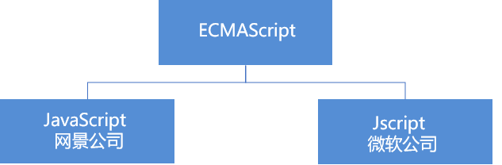

# JavaScript 第一天

## 1 - 编程语言

> 02 - 编程语言导读

问题:

1. 什么是编程语言
2. 能够区分编程语言和标记语言的不同
3. 说出常见的数据存储单位和换算关系
4. 能够说出内存的主要作用以及特点

### 1.1 编程

- 编程：就是让计算机为解决某个问题而使用某种程序设计语言编写程序代码，并最终得到结果的过程。
- 计算机程序：就是计算机所执行的一系列的**指令集合**，而程序全部都是用我们所掌握的语言来编写的，所以人们要控制计算机一定要通过计算机语言向计算机发出命令。
- 从事编程的人员，就是程序员。  但是一般程序员都比较幽默，为了形容自己的辛苦工作，也成为“码农”， 或者  “程序猿”/ “程序媛”
- 注意：上面所定义的计算机指的是任何能够执行代码的设备，可能是智能手机、ATM机、黑莓PI、服务器等等。


### 1.2 计算机语言

- **计算机语言**指用于*人与计算机之间通讯的语言*，它是人与计算机之间传递信息的媒介。
- 计算机语言的种类非常的多，总的来说可以分成**机器语言，汇编语言和高级语言**三大类。
- 实际上计算机最终所执行的都是机器语言，它是由“0”和“1”组成的二进制数，二进制是计算机语言的基础。

**什么是二进制：**


```js
// 十进制转二进制
let num = 10
num.toString(2)

// 二进制转十进制
parseInt("10",2)
```

### 1.3 编程语言

***简单来说：编程语言就是 输入 → 输出***

**编程语言：**可以通过类似于人类语言的 ”语言”来控制计算机，让计算机为我们做事情，这样的语言就叫做编程语言（Programming Language）。

编程语言是用来控制计算机的一系列指令，它有固定的格式和词汇（不同编程语言的格式和词汇不一样），必须遵守。

编程语言有两种形式：**汇编语言和高级语言**。

| 语言类型     | 说明                                                         |
| :----------- | :----------------------------------------------------------- |
| **汇编语言** | 汇编语言和机器语言实质是相同的，都是直接对硬件操作，只不过指令采用了英文缩写的标识符，容易识别和记忆。 |
| **高级语言** | 高级语言主要是相对于低级语言而言，它并不是特指某一种具体的语言，而是包括了很多编程语言，常用的有C语言、C++、Java、C#、Python、PHP、JavaScript、Go语言、Objective-C、Swift等。 |

**CODE01-输出一下看看效果：**


### 1.4 翻译器

高级语言所编制的程序不能直接被计算机识别，必须经过转换才能被执行，为此，我们需要一个翻译器。

**翻译器可以将我们所编写的源代码转换为机器语言**，这也被称为二进制化。 记住1和 0。

 

```
c = a + b;//高级语言
add $s1 $t1 $t2 ; //汇编语言
再由汇编程序转换成二进制代码，如：
000000 10001 10010 01000 00000 100000
```


### 1.5 编程语言和标记语言区别

| 语言     | 说明                                                         |
| -------- | ------------------------------------------------------------ |
| 编程语言 | 编程语言有很强的逻辑和行为能力。在编程语言里, 你会看到很多<br> if else 、for 、while等具有逻辑性和行为能力的指令，这是主动的。 |
| 标记语言 | 标记语言（html）不用于向计算机发出指令，常用于格式化和链接。<br/>标记语言的存在是用来被读取的, 他是被动的。 |

### 总结

1. 计算机可以帮助人类解决某些问题
2. 程序员利用编程语言编写程序发出指令控制计算机来实现这些任务
3. 编程语言有机器语言、汇编语言、高级语言(**计算机只认识机器语言，但为了方便编写，我们通常编写的是高级语言**)
4. 高级语言需要一个翻译器转换为计算机识别的机器语言
5. 编程语言是主动的有很强的逻辑性


## 2 - 计算机基础

> 03 - 计算机基础


### 2.2 数据存储

1. 计算机内部使用二进制 0 和 1来表示数据。
2. 所有数据，包括文件、图片等最终都是以二进制数据（0 和 1）的形式存放在硬盘中的。
3. 所有程序，包括操作系统，本质都是各种数据，也以二进制数据的形式存放在硬盘中。平时我们所说的安装软件，其实就是把程序文件复制到硬盘中。
4. 硬盘、内存都是保存的二进制数据。

### 2.3 数据存储单位

```
大小关系：bit < byte < kb < GB < TB<.....
```

- 位(bit)：   1bit 可以保存一个 0 或者 1 （最小的存储单位）
- 字节(Byte)：1B = 8b
- 千字节(KB)：1KB = 1024B
- 兆字节(MB)：1MB = 1024KB
- 吉字节(GB):  1GB = 1024MB
- 太字节(TB):  1TB = 1024GB
- 拍字节(PB)：1PB＝1024TB
- 艾字节(EB)：1EB＝1024PB
- 泽字节(ZB)：1ZB＝1024EB
- 尧字节(YB)：1YB＝1024ZB

### 2.4 程序运行

计算机运行软件的过程：


1. 打开某个程序时，先从硬盘中把程序的代码加载到内存中

2. CPU执行内存中的代码

   *注意：之所以要内存的一个重要原因，是因为 cpu运行太快了，如果只从硬盘中读数据，会浪费cpu性能，所以，才使用存取速度更快的内存来保存运行时的数据。（内存是电，硬盘是机械）*

   

## 3 - 初始JavaScript

1. JavaScript是什么？
2. 浏览执行JavaScript的原理？
3. JavaScript由哪3部分构成？
4. JavaScript三个输入输出语句是？

### 3.1 JavaScript 是什么

> 布兰登·艾奇（Brendan Eich，1961年～）。神奇的大哥用10天完成 JavaScript 设计。最初命名为 LiveScript，后来在与 Sun 合作之后将其改名为 JavaScript。
>
> https://exp.newsmth.net/topic/article/d0bb0150075d7ffa0f8864b6450d41c0

- JavaScript 是世界上最流行的语言之一，是一种运行在客户端的脚本语言 （Script 是脚本的意思）

- 脚本语言：不需要编译，运行过程中由 js 解释器( js 引擎）**逐行**来进行解释并执行

  > **JavaScript代码的执行特点：逐行执行**

- 现在也可以基于 Node.js 技术进行服务器端编程


### 3.2 JavaScript的作用

- **表单动态校验（密码强度检测）  （ JS 产生最初的目的 ）**
- **网页特效**
- 脚本
- 服务端开发(Node.js)
- 桌面程序(Electron)
- App(Cordova) 
- 控制硬件-物联网(Ruff)
- 游戏开发(cocos2d-js)

**脚本爬虫示例：**


### 3.3 HTML/CSS/JS 的关系


### 3.4 浏览器执行 JS 简介 (★)

问题：

​	什么是渲染引擎， 什么是JS引擎

**浏览器分成两部分：渲染引擎和 JS 引擎**

| 渲染引擎 | 用来解析HTML与CSS，俗称内核，比如 chrome 浏览器的 blink ，老版本的 webkit |
| -------- | ------------------------------------------------------------ |
| JS 引擎  | 也称为 JS 解释器。 用来读取网页中的JavaScript代码，对其处理后运行，比如 chrome浏览器的 V8 |

浏览器本身并不会执行JS代码，而是通过内置 JavaScript 引擎(解释器) 来执行 JS 代码 。JS 引擎执行代码时**逐行解释每一句源码（转换为机器语言）**，然后由计算机去执行，所以 JavaScript 语言归为**脚本语言**，会逐行解释执行。


### 3.5 JS 的组成 (★ - 理解记忆)


#### **1.ECMAScript**

ECMAScript 是由ECMA 国际（ 原欧洲计算机制造商协会）进行标准化的一门编程语言，这种语言在万维网上应用广泛，它往往被称为 JavaScript或 JScript，但实际上后两者是 ECMAScript 语言的实现和扩展。



ECMAScript：**规定了JS的编程语法和基础核心知识**，是所有浏览器厂商共同遵守的一套JS语法工业标准。

更多参看MDN: [MDN手册](https://developer.mozilla.org/zh-CN/docs/Web/JavaScript/JavaScript_technologies_overview)

**聊聊历史：**

1995年前后：互联网爆发，Web应用层出不穷，那时候只要有注册一个.com的域名，基本就能暴富，就如同现在的区块链和人工智能。就在那时候JavaScript有三个主流版本：

（1）Netscape Navigator 3.0 中的 JavaScript。（网景）

（2）IE 中的 JScript。

（3）CEnvi 中的ScriptEase。

与和其它编程语言不同的是，JavaScript 并没有一个标准来统一其语法或特性，而这 3 种不同的版本恰恰突出了这个问题。随着业界担心的增加，这个语言的标准化显然已经势在必行。

1997年：**JavaScript 1.1** 作为一个草案提交给**欧洲计算机制造商协会（ECMA）**。第 39 技术委员会（TC39）被委派来“标准化一个通用、跨平台、中立于厂商的脚本语言的语法和语义”。 锤炼出了 ECMA-262第一版，该标准定义了名为 ECMAScript 的全新脚本语言。

1998年：国际标准化组织及国际电工委员会（ISO/IEC）也采纳 ECMAScript 作为标准（ISO/IEC-16262）。同年发布了ECMA-262**第二个版(ES2).**第二个版本基本没有加新功能。

2002年：**ECMA-262第三版(ES3)**，新增引入了强大的正则表达式，更好的字符串处理，新的控制语句，try / catch异常处理，更严格的错误定义，数字输出的格式化以及预期未来语言增长的微小变化。第三版在当时应用非常广泛，几乎所有的浏览器都支持ES3的标准。

ECMA-262第4版本(ES4)夭折，部分功能被迁移到ES6中。

2009年：**ECMA-262第五版(ES5)发布**。在ES3的基础上增加了很多功能：包括访问器属性，对象的反射创建和检查，属性的程序控制，附加的数组操作函数，对JSON对象编码格式的支持以及提供增强的错误检查和程序安全性的严格模式。

2011年：被批准为**国际标准**ISO/IEC 16262：2011。同年发布ES5.1版本（对ES5做一些升级优化）同时被MCMA-262和ISO/IEC批准。

2015年：**ECMA-262第六版**（ES6或者叫ES 2015语言规范），ES6可以说从2000年，ES3发布之后就开始沉淀，由于ES4的夭折，ES4中的一些功能特性一直等到ES6才发布，所以第六版的完全是十五年的努力的结果。

ES6为大型应用程序提供更好的支持，创建Lib库，以及使用ECMAScript作为其它语言的编译目标。ES6主要新增了如下功能：主要增强包括模块，类声明，词法块范围，迭代器和生成器，异步编程的承诺，解构模式和适当的尾部调用。内置的ECMAScript库被扩展为支持额外的数据抽象，包括映射，集合和二进制数值数组，以及对字符串和正则表达式的使用。

*ES7/SE8? https://www.jianshu.com/p/a138a525c287*

#### **2.DOM——文档对象模型**

**文档对象模型**（DocumentObject Model，简称DOM），是W3C组织推荐的处理可扩展标记语言的标准编程接口。**通过 DOM 提供的接口可以对页面上的各种元素进行操作（大小、位置、颜色等）**

#### **3.BOM——浏览器对象模型**

**浏览器对象模型**(Browser Object Model，简称BOM) 是指**浏览器对象模型**，它提供了独立于内容的、可以与浏览器窗口进行互动的对象结构。通过BOM可以操作浏览器窗口，比如弹出框、控制浏览器跳转、获取分辨率等。

### 3.6 JS 三种书写位置(★★)

> JS 有3种书写位置，分别为行内、内嵌和外部。

1. **行内式(以后开发尽量不要在行内写JS逻辑！！！以后开发尽量不要在行内写JS逻辑！！！以后开发尽量不要在行内写JS逻辑！！！)**

   ```html
   <input type="button" value="点我试试" onclick="alert('Hello World')" />
   ```

   - 可以将单行或少量 JS 代码写在HTML标签的事件属性中（以 on 开头的属性），如：onclick
   - **注意单双引号的使用：在HTML中我们推荐使用双引号, JS 中我们推荐使用单引号**
   - 可读性差， 在html中编写JS大量代码时，不方便阅读；
   - 引号易错，引号多层嵌套匹配时，非常容易弄混；
   - 特殊情况下使用

2. **内嵌式(以后主要使用模式)**

   ```html
   <script>
       alert('Hello  World~!');
   </script>
   ```

   - 可以将多行JS代码写到` <script> `标签中
   - 内嵌 JS 是学习时常用的方式

3. 外部JS文件

   ```html
   <script src="my.js"></script>
   ```

   - 利于HTML页面代码结构化，把大段 JS代码独立到 HTML 页面之外，既美观，也方便文件级别的复用
   - 引用外部 JS文件的 script 标签中间不可以写代码
   - 适合于JS 代码量比较大的情况

**JS书写规范：**

1. **在HTML中我们推荐使用双引号, JS 中我们推荐使用单引号**
2. JS换行可以添加`;`也可以不添加，但要保证统一
3. 引用外部 JS文件的 script 标签中间不可以写代码


## 4 - JavaScript注释(★★)

### 4.1  单行注释

```
为了提高代码的可读性，JS与CSS一样，也提供了注释功能。

JS中的注释主要有两种，分别是**单行注释**和**多行注释**。
```

单行注释的注释方式如下：

```js
// 我是一行文字，不想被 JS引擎 执行，所以 注释起来	

**//**  用来注释单行文字（  快捷键   ctrl  +  /   ）
```

### 4.2 多行注释

多行注释的注释方式如下：


```js
/*
  获取用户年龄和姓名
  并通过提示框显示出来
*/

/**
* 说明
* @params 输入
* @return 输出
*/
```

/* */  用来注释多行文字（ 默认快捷键  alt +  shift  + a ）
**快捷键修改为：   ctrl + shift  +  /**

vscode → 首选项按钮 → 键盘快捷方式 → 查找 原来的快捷键 → 修改为新的快捷键 → 回车确认

## 5 - JavaScript输入输出语句(★★★)

为了方便信息的输入输出，JS中提供了一些输入输出语句，其常用的语句如下：

| 方法                 | 说明                           | 归属   |
| -------------------- | ------------------------------ | ------ |
| alert(msg)           | 浏览器弹出警示框               | 浏览器 |
| **console.log(msg)** | 浏览器控制台打印输出信息       | 浏览器 |
| prompt(info)         | 浏览器弹出输入框，用户可以输入 | 浏览器 |

- 注意：alert() 主要用来显示消息给用户，console.log() 用来给程序员自己看运行时的消息。

**CODE04 - 输入输出语句**

```js
        // 这是一个输入框
        prompt('请输入您的年龄');
        // alert 弹出警示框 输出的 展示给用户的
        alert('计算的结果是');
        // console 控制台输出 给程序员测试用的  
        console.log('我是程序员能看到的');
```


## 6 - 变量的概念

1. 变量的主要作用
2. 变量的初始化方式
3. 变量的命名规范

### 6.1 什么是变量(★)

> 想想之前用prompt输入的内容如何使用？

白话：变量就是一个装东西的盒子。

通俗：变量是用于存放数据的**<font color='red'>容器</font>**。 我们通过 **<font color='red'>变量名</font>** 获取数据，甚至数据可以修改。


### 6.2 变量在内存中的存储(★)

本质：**变量是程序在内存中申请的一块用来存放数据的空间**。类似我们酒店的房间，一个房间就可以看做是一个变量。  

**<font color='red'>！！！变量是内存的空间</font>**


## 7 - 变量的使用(★★★★★ - 重中之重！)

- 变量的声明   
- 变量的赋值 


### 7.1 声明变量

```javascript
//  声明变量  
var age; //  声明一个 名称为age 的变量     
```

- **`var` 是一个 JS关键字**，用来声明变量( variable 变量的意思 )。使用该关键字声明变量后，计算机会自动为

  变量分配内存空间，不需要程序员管

- age 是程序员定义的变量名，我们要通过变量名来访问内存中分配的空间

**CODE05 - 变量：**

我门可以通过三步完成变量的使用

> 1. 先声明一个变量
>
> 2. 再给变量赋值
>
> 3. 最后输出变量

```js
        // 1. 声明了一个age 的变量 
        var age;
        // 2. 赋值  把值存入这个变量中
        age = 18;
        // 3. 输出结果 
        console.log(age);
        // 4. 变量的初始化 声明变量的同时，直接赋值
        var myHobby = '打电动';
        console.log(myHobby);
```

#### 声明变量关键词注意（了解高级详细讲解）

我们可以用关键字var、let、const声明变量，目前我们暂时使用ES5的var关键字声明变量；

> var定义的变量，没有块的概念，可以跨块访问, 不能跨函数访问。
>
> let定义的变量，只能在块作用域里访问，不能跨块访问，也不能跨函数访问，不能重复声明。
>
> const用来定义常量，使用时必须初始化(即必须赋值)，只能在块作用域里访问，而且不能修改；

**CODE06 - 变量案例1（使用以上2种形式声明并打印变量）**

```js
        // 姓名：张三； 地址：成都； 年龄：24 职业：学生
		var name = '张三';
        var address = '成都';
        var age = 24;
        var occupation = '学生';
        console.log(name);
        console.log(address);
        console.log(age);
        console.log(occupation);
```

**CODE06 - 变量案例2（弹出用户名）**

```js
        // 1. 用户输入姓名  存储到一个 myname的变量里面
        var name = prompt('请输入您的名字');
        // 2. 输出这个用户名
        alert(name);
```

### 7.2 变量语法扩展

- 更新变量

  一个变量被重新复赋值后，它原有的值就会被覆盖，变量值将以<font color='red'>最后一次赋的值</font>为准。

  ```js
  var age = 18;
  
  age = 81;   // 最后的结果就是81因为18 被覆盖掉了          
  ```

- **同时声明多个变量（极不建议这样书写！！！）**

  同时声明多个变量时，只需要写一个 var， 多个变量名之间使用英文逗号隔开。

  ```js
  var age = 10,  name = 'zs', sex = 'man';    
  ```

- 声明变量特殊情况

  | 情况                           | 说明                    | 结果      |
  | ------------------------------ | ----------------------- | --------- |
  | var  age ; console.log (age);  | 只声明 不赋值           | undefined |
  | console.log(age)               | 不声明 不赋值  直接使用 | 报错      |
  | age   = 10; console.log (age); | 不声明   只赋值         | 10        |

**CODE08 - 变量语法拓展**

```js
      	// 1. 更新变量
        var myname = '张三';
        console.log(myname);
        myname = '罗翔';
        console.log(myname);
        // 2. 声明多个变量
        // var age = 24;
        // var address = '成都';
        // var occupation = '学生';
        var age = 24,
            address = '成都',
            occupation = '学生';
        // 3. 声明变量的特殊情况
        // 3.1 只声明不赋值 结果是？  程序也不知道里面存的是啥 所以结果是 undefined  未定义的
        var sex;
        console.log(sex); // undefined
        // 3.2  不声明 不赋值 直接使用某个变量会报错滴
        // console.log(tel);
        // 3.3 不声明直接赋值使用（极不推荐！！！严禁使用！！！）
        qq = 110;
        console.log(qq);
```

### 7.5 变量命名规范（★★★★★ - 别人的视角里你就是大佬）

| 规则                                                         |
| ------------------------------------------------------------ |
| 由字母(A-Za-z)、数字(0-9)、下划线(_)、美元符号( $ )组成，如：usrAge, num01, _name |
| 严格区分大小写。var app; 和 var App; 是两个变量              |
| 不能 以数字开头。  18age   是错误的                          |
| 不能 是关键字、保留字。例如：var、for、while                 |
| 变量名必须有意义。 MMD   BBD        nl   →     age           |
| 遵守驼峰命名法。首字母小写，后面单词的首字母需要大写。 myFirstName |


**扩展规则：**

1. 相似变量尽量语义化表示，用多单词遵守驼峰命名法，不要用简单语义+数字的形式表示

2. (仅做了解)若组合单词字母超过25个字母时，可以考虑去掉某个单词的元音`(a, e, u, i, o)`字母

   如 ：manpowerResourceSystem → mnpwerRsourceSystm

3. **常量声明**用全大写字母，多单词使用`_`拼接，如`var MY_EMAIL = '123qq.com'`

4. 单个单词的命名不需要驼峰命名


**CODE09 - 变量命名**

```js
        var app = 10;
        var App = 100;
        console.log(app);
        console.log(App);
        // var 18age;
        // var var; 因为var 有特殊意义了，这个叫做关键字 不能作为变量名的   for  while if
        // name 我们尽量不要直接使用name 作为变量名
        // console.log(tel);
        console.log(name);
```

### 7.6 练习： 如何交换两个变量的值 - 杯子倒水

**CODE10 - 交换两个变量值**

```js
        // js 是编程语言有很强的逻辑性在里面： 实现这个要求的思路 先怎么做后怎么做 
        // 1. 我们需要一个临时变量帮我们
        // 2. 把apple1 给我们的临时变量 temp 
        // 3. 把apple2 里面的苹果给 apple1 
        // 4. 把临时变量里面的值 给 apple2 
        var temp; // 声明了一个临时变量为空
        var apple1 = '青苹果';
        var apple2 = '红苹果';
        temp = apple1; // 把右边给左边
        apple1 = apple2;
        apple2 = temp;
        console.log(apple1);
        console.log(apple2);
```

## 小结：

1. 为什么需要变量？

   有的数据需要保存，所以需要变量

2. 变量是什么？

   变量就是一个容器，用来储存数据

3. 变量的本质是什么？

   变量是内存里的一块空间，用来存储数据

4. 变量该怎么用？

   先声明，再赋值 （申明用`var`）

   声明变量的本质是去内存中申请空间

5. 什么是变量初始化？

   声明变量并赋值

6. 变量命名的规范？

   见7.5

7. 交换两个变量的思路是？

   声明一个临时变量借用空间，见7.6

## 8 - 数据类型

1.  5种简单的数据类型
2. 使用typeof来判断变量的数据类型
3. 转化为数值型的方法
4. 转化为字符型的方法
5. 隐式转换

### 8.1 数据类型简介

1. 为什么需要数据类型

  在计算机中，不同的数据所需占用的**存储空间是不同**的，为了便于把数据分成所需内存大小不同的数据，充分利用存储空间，于是定义了不同的数据类型。
   	简单来说，数据类型就是数据的类别型号。比如姓名“张三”，年龄18，这些数据的类型是不一样的。

2. 变量数据类型的不确定性

  在javascript中如果我们只声明了变量没有赋值，那么这是我们就不能确定这个变量属于哪一种数据类型；只有**在程序运行过程中赋值以后，我们根据等号右边的值来确定属于哪种数据类型**；       

  **特点**

  1.  `js`的变量数据类型是只有程序在运行过程中，根据等号右边的值来确定的
  2. `js`声明的变量，数据类型是可以变化的

  **CODE11 - 变量的数据类型**

  ```js
   		var num; //此时我们不确定num属于什么数据类型
          num = 10; //此时我们会根据等号右侧的值判断num为数字类型
        var color = 'red'; //此时我们会根据等号右侧的值判断color为字符串类型
          // js程序运行以后将color的值更改了
          color = 21; //此时color是数字类型
  ```

  

3. 数据类型的分类

  JS 把数据类型分为两类：

  - 基本数据类型 （**Number,String,Boolean,Undefined,Null**，symbol，bigInt）
  - 引用数据类型 （**object**，Array)

  

### 8.2 基本数据类型（★★★★★ - 死也要记住）

- 基本数据类型（简单数据类型）

JavaScript 中的简单数据类型及其说明如下：

| 简单数据类型  | 说明                                                  |
| ------------- | ----------------------------------------------------- |
| **Number**    | 数字型， 包含整型值和浮点型值，如：21、0.21           |
| **Boolean**   | 布尔值，如true、false，等价于1和0                     |
| **String**    | 字符串类型，如“张三”，注意js中，字符串都带`‘’ ""`     |
| **Undefined** | `var a;`声明了变量a但没有给值，此时`a = undefined`    |
| **Null**      | `var a = null; `声明了变量a为空值                     |
| *Symbol       | `Symbol('key')`用解决属性名冲突的问题                 |
| *BigInt       | `BigInt("9007199254740995");`可以安全存储和操作大整数 |

#### 8.2.1数字型 Number

JavaScript 数字类型既可以用来保存整数值，也可以保存小数(浮点数）。  

```js
var age = 21;       // 整数
var Age = 21.3747;  // 小数     
```

##### 1.数字型进制

最常见的进制有二进制、八进制、十进制、十六进制。

```js
 // 1.八进制数字序列范围：0~7
 var num1 = 07;   // 对应十进制的7
 var num2 = 019;  // 对应十进制的19
 var num3 = 010;   // 对应十进制的8
 var num3 = 08;   // 对应十进制的8
  // 2.十六进制数字序列范围：0~9以及A~F
 var num = 0xA;
```

现阶段我们只需要记住，**在JS中八进制前面加0，十六进制前面加 0x**  

##### 2.数字型范围

JavaScript中数值的最大和最小值

```js
alert(Number.MAX_VALUE); // 1.7976931348623157e+308
alert(Number.MIN_VALUE); // 5e-324
```

- 最大值：Number.MAX_VALUE，这个值为： 1.7976931348623157e+308
- 最小值：Number.MIN_VALUE，这个值为：5e-324

##### 3.数字型三个特殊值

```js
alert(Infinity);  // Infinity
alert(-Infinity); // -Infinity
alert(NaN);       // NaN
```

- Infinity ，代表无穷大，大于任何数值
- -Infinity ，代表无穷小，小于任何数值
- **NaN ，Not a number，代表一个非数值**

**CODE12 - 数字型Number**

```js
		var num = 10; // num 数字型 
        var PI = 3.14 // PI 数字型
            // 1. 八进制  0 ~ 7  我们程序里面数字前面加0 表示八进制
        var num1 = 010;
        console.log(num1); //  010  八进制 转换为 10进制 就是  8 
        var num2 = 012;
        console.log(num2);
        // 2. 十六进制  0 ~ 9  a ~ f    #ffffff  数字的前面加 0x 表示十六进制
        var num3 = 0x9;
        console.log(num3);
        var num4 = 0xa;
        console.log(num4);
        // 3. 数字型的最大值
        console.log(Number.MAX_VALUE);
        // 4. 数字型的最小值
        console.log(Number.MIN_VALUE);
        // 5. 无穷大
        console.log(Number.MAX_VALUE * 2); // Infinity 无穷大  
        // 6. 无穷小
        console.log(-Number.MAX_VALUE * 2); // -Infinity 无穷大
        // 7. 非数字
        console.log('非数字' - 100); // NaN
```

##### 4.isNaN(★★★)

用来判断一个变量是否为非数字的类型，返回 true 或者 false


**CODE13 - isNaN**

```js
var usrAge = 21;
var isNum = isNaN(userAge);
console.log(isNum);	           // false ，21 不是一个非数字
var usrName = "andy";
console.log(isNaN(userName));  // true ，"andy"是一个非数字
```

#### 8.2.2 字符串型 String

> 基础知识
>
> 01、引号引起来的都是字符串，建议使用单引号；
>
> 02、使用引号的时候必须成对出现，不能都单引号和双引号 混搭穿插使用;
>
> 03、字符串转义符：转义符都是 \ 开头的


字符串型可以是**引号**中的任意文本，其语法为 双引号 "" 和 单引号''

**注意： 一般在`<script>`中用单引号，除非特殊**

```js
var strMsg = "我爱北京天安门~";  // 使用双引号表示字符串
var strMsg2 = '我爱吃猪蹄~';    // 使用单引号表示字符串
// 常见错误
var strMsg3 = 我爱大肘子;       // 报错，没使用引号，会被认为是js代码，但js没有这些语法
```

因为 HTML 标签里面的属性使用的是**双引号**，JS 这里我们更推荐使用**单引号**。


##### 1. 字符串引号嵌套

JS 可以用单引号嵌套双引号 ，或者用双引号嵌套单引号 (**外双内单，外单内双**)

**CODE14 - 字符串String**

```js
var strMsg = '我是"高帅富"程序猿';   // 可以用''包含""
var strMsg2 = "我是'高帅富'程序猿";  // 也可以用"" 包含''
//  常见错误
var badQuotes = 'What on earth?"; // 报错，不能 单双引号搭配
```


##### 2. 字符串转义符

类似HTML里面的特殊字符，字符串中也有特殊字符，我们称之为转义符。

转义符都是 \ 开头的，常用的转义符及其说明如下：

| 转义符 | 解释说明                          |
| ------ | :-------------------------------- |
| \n     | 换行符，n   是   newline   的意思 |
| \ \    | 斜杠   \                          |
| \'     | '   单引号                        |
| \"     | ”双引号                           |
| \t     | tab  缩进                         |
| \b     | 退格(BS) ，将当前位置移到前一列   |


##### 案例： 弹出网页警示框


文本：酷热难耐，火辣的太阳底下，我挺拔的身姿，成为了最为独特的风景。我审视四周，这里，是我的舞台，我就是天地间的王者。这一刻，我豪气冲天，终于大喊一声："收破烂啦～"

*注意换行*

**CODE15 - 网页警示框**

```js
alert('酷热难耐，火辣的太阳底下，我挺拔的身姿，成为了最为独特的风景。\n我审视四周，这里，是我的舞台，我就是天地间的王者。\n这一刻，我豪气冲天，终于大喊一声："收破烂啦～"');
```


##### 3. 字符串长度(★★★)

> **字符串名称.length**

字符串是由若干字符组成的，这些字符的数量就是字符串的长度。通过字符串的 length 属性可以获取整个字符串的长度。

```js
var strMsg = "我是帅气多金的 程序猿！";
alert(strMsg.length); // 显示 11
```

##### 4. 字符串拼接(★★★)

> **用加号+进行拼接**
>
> **字符串和任何数据类型相加都是字符串**

- 多个字符串之间可以使用 + 进行拼接，其拼接方式为 字符串 + 任何类型 = 拼接之后的新字符串

- 拼接前会把与字符串相加的任何类型转成字符串，再拼接成一个新的字符串

  **CODE16**

  ```js
  //1.1 字符串 "相加"
  alert('hello' + ' ' + 'world'); // hello world
  //1.2 数值字符串 "相加"
  alert('100' + '100'); // 100100
  //1.3 数值字符串 + 数值 字符串和任何数据类型相加都是字符串
  alert('11' + 12);     // 1112 
  ```

  - **+ 号总结口诀：数值相加 ，字符相连**

##### 5. 字符串拼接加强(★★★)

- 经常会将字符串和变量来拼接，变量可以很方便地修改里面的值
- 变量是不能添加引号的，因为加引号的变量会变成字符串
- 如果变量两侧都有字符串拼接，口诀“**引引加加** ”，删掉数字，变量写加中间

**CODE17**

```js
console.log('张三' + 18);           // 只要有字符就会相连 
var age = 18;
// console.log('张三age岁啦');       // 这样不行哦
console.log('张三' + age);          // 张三18
console.log('张三' + age + '岁啦');  // 张三18岁啦
```


##### 案例：显示年龄

通过案例，简单了解一下js编程语言的整个过程（**输入 → 输出**）


**CODE18**

```JS
        // 弹出一个输入框（prompt)，让用户输入年龄（用户输入）
        // 把用户输入的值用变量保存起来,把刚才输入的年龄与所要输出的字符串拼接 （程序内部处理）
        // 使用alert语句弹出警示框（输出结果）
        var age = prompt('请输入您的年龄');
        var str = '您今年已经' + age + '岁了';
        alert(str);
```


#### 8.2.3 布尔型Boolean

布尔类型有两个值：true 和 false ，其中 true 表示真（对），而 false 表示假（错）。

布尔型和数字型相加的时候， true 的值为 1 ，false 的值为 0。

**CODE19**

```js
console.log(true + 1);  // 2
console.log(false + 1); // 1
```

#### 8.2.4 Undefined和 Null

一个声明后没有被赋值的变量会有一个默认值undefined ( 如果进行相连或者相加时，注意结果）

```js
var variable;
console.log(variable);           // undefined
console.log('你好' + variable);  // 你好undefined
console.log(11 + variable);     // NaN undefined和数字相加
console.log(true + variable);   //  NaN
```

一个声明变量给 null 值，里面存的值为空

```js
var vari = null;
console.log('你好' + vari);  // 你好null
console.log(11 + vari);     // 11 数字和null相加，返回的是原先的数字
console.log(true + vari);   //  1
```

### 8.3 获取变量数据类型(★★★)

- 获取检测变量的数据类型

  typeof 可用来获取检测变量的数据类型

  ```js
  var num = 18;
  console.log(typeof num) // 结果 number      
  ```

  不同类型的返回值

  | 真实数据类型  | typeof返回类型 |
  | ------------- | -------------- |
  | **Number**    | number         |
  | **String**    | string         |
  | **Boolean**   | boolean        |
  | **Undefined** | undefined      |
  | **null**      | object         |
  | *Symbol       | symbol         |
  | *BigInt       | bigint         |
  | *Object       | object         |
  | *Array        | object         |
  
  **为什么`null`的数据类型是`object`呢?**
  
  >  因为`null`是一个空对象指针,也是咱们用`typeof`操作符检测`null`的时候会返回`object`的原因
  
  01、如果后期我们在定义变量的时候准备用来保存对象，我们最好将该变量值初始化为null，这样一来我们就可以通过null直接检测变量是否保存了一个对象引用；
  
  02、其实undefined值是派生自null值的，因此ECMA-262规定他们的相等性测试是返回值为true；但是实际应用的是没必要将一个变量的值设置为undefined，只要我们确定要在变量中保存对象，但是还没有真正的对象，那么我们就明确的给该变量保存null值。

```js
        console.log(typeof 123) // number
        console.log(typeof '123') // string
        console.log(typeof true) // boolean
        console.log(typeof undefined) // undefined
        console.log(typeof null) // object
        console.log(typeof BigInt(123123)) // bigint
        console.log(typeof Symbol('id')) // symbol
        console.log(typeof {id: 123}) // object
        console.log(typeof [1, 2, 3]) // object
```

**扩展：**如何精准的找到变量的数据类型

对`typeof`出现的问题说不！（★★★）

```js
// data 就是我们需要检查数据类型的数据
Object.prototype.toString.call(data)
```

**CODE20 - 数据类型转换**

```JS
        var num = 10;
        console.log(typeof num); // number
        var str = '张三';
        console.log(typeof str); // string
        var flag = true;
        console.log(typeof flag); // boolean
        var vari = undefined;
        console.log(typeof vari); // undefined
        var timer = null;
        console.log(typeof timer); // object

        // prompt 取过来的值是 字符型的
        var age = prompt('请输入您的年龄');
        console.log(age);
        console.log(typeof age);
```


- 字面量（表面现象）

  字面量是在源代码中一个固定值的表示法，通俗来说，就是字面量表示如何表达这个值。
  - 数字字面量：8, 9, 10
  - 字符串字面量：'黑马程序员', "大前端"
  - 布尔字面量：true，false

**CODE21**

```JS
        console.log(18);
        console.log('18');
        console.log(true);
        console.log(undefined);
        console.log(null);
```

### 8.4 数据类型转换(★★★)

- 什么是数据类型转换

  使用表单、prompt 获取过来的数据默认是字符串类型的，此时就不能直接简单的进行加法运算，而需要转换变量的数据类型。通俗来说，就是把一种数据类型的变量转换成另外一种数据类型。

  通常会实现3种方式的转换：

  - 转换为字符串类型
  - 转换为数字型
  - 转换为布尔型

- 转换为字符串

  | 方法             | 说明                                   | 应用方法                           |
  | ---------------- | -------------------------------------- | ---------------------------------- |
  | toString()       | 转成字符串                             | var num = 1；alert(num.toString()) |
  | String()         | 强制转成字符串                         | var num = 1；alert(String(num))    |
  | 隐式转换加号拼接 | 任何数据类型和字符串相加拼接都是字符串 | var num = 1；alert(num + '')       |

  - **toString() **和 String()  使用方式不一样。
  - 三种转换方式，更多第三种加号拼接字符串转换方式， 这一种方式也称之为隐式转换。

  **CODE22**

  ```JS
          // 1. 把数字型转换为字符串型 变量.toString()
          var num = 10;
          var str = num.toString();
          console.log(str);
          console.log(typeof str);
          // 2. 我们利用 String(变量)   
          console.log(String(num));
          // 3. 利用 + 拼接字符串的方法实现转换效果 隐式转换
          console.log(num + '');
  ```

- 转换为数字型（重点）

  | 方法               | 说明                           | 用法                                      |
  | ------------------ | ------------------------------ | ----------------------------------------- |
  | parseInt(string)   | 将string类型转成数字型         | var str='12.87';   alert(parseInt(str))   |
  | parseFloat(string) | 将string类型转成浮点数数值类型 | var str='12.87';   alert(parseFloat(str)) |
  | Number(string)     | 强制将string类型转化为数值型   | var str='12.87';   alert(Number(str))     |
  | js隐式转换(- * /)  | 利用算术运算隐式转换为数值型   | var str='12';   alert(str - 0)            |

  - 注意 **parseInt** 和**parseFloat** 单词的大小写，这2个是重点

  - **parseInt** 在转化过程中遇到非数字就停止转化了

  - **parseFloat**在转换的过程中如果遇到了小数点会接着往后转化，一直到遇到非数字的字符就停止转换

  - **Number**强制转换string的值为纯数字，如果不是纯数字返回值是NaN

  - **隐式转换**是我们在进行算数运算的时候，JS 自动转换了数据类型

    **CODE23**

    ```JS
            // var age = prompt('请输入您的年龄');
            // 1. parseInt(变量)  可以把 字符型的转换为数字型 得到是整数
            // console.log(parseInt(age));
            console.log(parseInt('3.14')); // 3 取整
            console.log(parseInt('3.94')); // 3 取整
            console.log(parseInt('120px')); // 120 会去到这个px单位
            console.log(parseInt('rem120px')); // NaN
            // 2. parseFloat(变量) 可以把 字符型的转换为数字型 得到是小数 浮点数
            console.log(parseFloat('3.14')); // 3.14
            console.log(parseFloat('120px')); // 120 会去掉这个px单位
            console.log(parseFloat('rem120px')); // NaN
            // 3. 利用 Number(变量) 
            var str = '123';
            console.log(Number(str));
            console.log(Number('12'));
            // 4. 利用了算数运算 -  *  /  隐式转换
            console.log('12' - 0); // 12
            console.log('123' - '120');
            console.log('123' * 1);
    ```

    

- 转换为布尔型

  

  - 代表空、否定的值会被转换为 false  ，如 ''、0、NaN、null、undefined  

  - 其余值都会被转换为 true

    **CODE24**

    ```JS
    console.log(Boolean('')); // false
    console.log(Boolean(0)); // false
    console.log(Boolean(NaN)); // false
    console.log(Boolean(null)); // false
    console.log(Boolean(undefined)); // false
    console.log(Boolean('小白')); // true
    console.log(Boolean(12)); // true
    ```

### 案例： 计算年龄


**CODE25**

```js
        // 弹出一个输入框（prompt)，让用户输入出生年份 （用户输入）
        // 把用户输入的值用变量保存起来，然后用今年的年份减去变量值，结果就是现在的年龄  （程序内部处理）
        // 弹出警示框（alert) ， 把计算的结果输出 （输出结果）
        var year = prompt('请您输入您的出生年份');
        var age = 2022 - year; // year 取过来的是字符串型  但是这里用的减法 有隐式转换
        alert('您今年已经' + age + '岁了');
```


### 案例：简单加法器


**CODE26**

```js
        // 先弹出第一个输入框，提示用户输入第一个值  保存起来
        // 再弹出第二个框，提示用户输入第二个值  保存起来
        // 把这两个值相加，并将结果赋给新的变量（注意数据类型转换）  
        // 弹出警示框（alert) ， 把计算的结果输出 （输出结果）
        var num1 = prompt('请您输入第一个值：');
        var num2 = prompt('请您输入第二个值：');
        var result = parseFloat(num1) + parseFloat(num2);
        alert('您的结果是:' + result);
```

## 9 - （扩展补充）关键字和保留字

### 10.1 标识符

```
标识(zhi)符：就是指开发人员为变量、属性、函数、参数取的名字。

标识符不能是关键字或保留字。
```

### 10.2 关键字

```
关键字：是指 JS本身已经使用了的字，不能再用它们充当变量名、方法名。

包括：break、case、catch、continue、default、delete、do、else、finally、for、function、if、in、instanceof、new、return、switch、this、throw、try、typeof、var、void、while、with 等。
```

### 10.3 保留字

```
保留字：实际上就是预留的“关键字”，意思是现在虽然还不是关键字，但是未来可能会成为关键字，同样不能使用它们当变量名或方法名。

包括：boolean、byte、char、class、const、debugger、double、enum、export、extends、fimal、float、goto、implements、import、int、interface、long、mative、package、private、protected、public、short、static、super、synchronized、throws、transient、volatile 等。

注意：如果将保留字用作变量名或函数名，那么除非将来的浏览器实现了该保留字，否则很可能收不到任何错误消息。当浏览器将其实现后，该单词将被看做关键字，如此将出现关键字错误。
```


