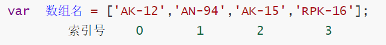

# JavaScript 第四天（★★★★★ - 为啥在这里画星星心里要有数）

# 1 - 数组

目标：

1. 创建数组（又叫作列表）
2. <font color='red'>**获取数组元素**</font>
3. <font color='red'>**遍历数组**</font>
4. 新增数组元素

## 1.1 数组的概念

> 思考：如何将一个班级中所有同学的名字存起来，用变量可以吗？

**概念：** **数组是一组数据的集合**，其中每一个数据都被称作**元素**

**特点：**

1. 在数组中可以**存放任意类型的元素**

   *注意：我们一般会把**一组相关的，并且数据类型相同的数据一起存放***

2. **数组的理解**：数据组合，数据集合

## 1.2 创建数组（★★★）

### 1.2.1 利用  new 创建数组  

> 调用数组构造函数生成的数组
>
> [MDN Array url][https://developer.mozilla.org/zh-CN/docs/Web/JavaScript/Reference/Global_Objects/Array/Array]

**CODE01**

```js
var 数组名 = new Array();
var arr = new Array();   // 创建一个新的空数组
```

   **注意:** Array () ，A 要大写！！！

### 1.2.2 利用数组字面量创建数组

> 字面量定义数组

**CODE01**

```js
// 1. 使用数组字面量方式创建空的数组
var  数组名 = []；
// 2. 使用数组字面量方式创建带初始值的数组
var  arr = ['AK-12','AN-94','AK-15','RPK-16'];
```

- 数组的字面量是方括号 [ ] 
- 声明数组并赋值称为数组的初始化
- 这种**字面量**方式更为常用

### 1.2.3 数组元素的类型

​		数组中可以存放任意类型的元素，例如字符串、数字、布尔值等

​		*<font color='red'>注意：</font>一般原则上一个数组中的各元素类型保持统一*


思考：

1. 数组的作用是什么？
2. 创建数组有那两种方式，哪一种最常用？
3. 数组类型有限制吗？有什么创建原则？

## 1.3 获取数组中的元素(★★★★)

**索引** (下标) ：**用来访问数组元素的序号**（数组下标从 0 开始）



**特点：**

1. 数组可以通过索引来访问、设置、修改对应的数组元素
2. 可以通过“**数组名[索引]**”的形式来获取数组中的元素

**CODE02**

```js
// 定义数组
var arrStus = [1,2,3];
// 获取数组中的第2个元素
alert(arrStus[1]);
```

**注意**：如果访问时数组没有和索引值对应的元素，则得到的值是undefined


**练习：**给一个星期几的数组，使用数组索引找到其中包含的休息日

```js
var week = ["星期日", "星期一","星期二","星期三","星期四","星期五","星期六"];
```


**扩展**： 数组内部存储数据的形式：

```js
var  guns = ['AK-12','AN-94','AK-15','RPK-16'];
var  guns = [0:'AK-12', 1:'AN-94', 2:'AK-15', 3:'RPK-16'];   //（key:value ，键值对，索引键，数据值）
凡是，存储的数据结构为键值对，都是通过键操作值。 ***
通过索引来操作数组的元素。  ***
操作:
1. 获取：var guns_0 = guns[0]; 
2. 新增/修改： guns[索引] = 值
```

## 1.4 遍历数组(★★★★★ - 记不住每天抄50遍~)

### 1.4.1 遍历

> 思考： 如何遍历呢？

**数组遍历：**把数组中的每个元素从头到尾都访问（获取）一次

**CODE03**

```JS
var guns = ['AK-12','AN-94','AK-15','RPK-16'];
for(var i = 0; i < guns.length; i++){
    // 注意：i从0开始(只要是遍历数组，一般都是从0开始)
    console.log(guns[i]);
}
```

*<font color='red'>注意:</font>数组的索引号从0开始！！！*

> 思考：字符串可以用索引获取某个位置的字符吗？


**练习：**把自己的爱好写成一个数组，然后通过控制台将数组中所有的值都打印出来


### 1.4.2 数组的长度

- 数组的长度：默认情况下表示数组中元素的个数
- 使用“**数组名.length**”可以访问数组元素的数量（数组长度）

**CODE04**

```js
var guns = ['AK-12','AN-94','AK-15','RPK-16'];
console.log(guns.length) // ?

// 修改length属性会怎样
// 增加
guns.length = 5
console.log(guns)

// 减少
guns.length = 3
console.log(guns)
```

**注意**：

- **此处数组的长度是数组元素的个数 ，不要和数组的索引号混淆**
- 当我们数组里面的元素个数发生了变化，这个 length 属性跟着一起变化
- 数组的length属性可以被修改： （这个不需要记忆，一般不会修改length属性，只用于获取）
  - 如果设置的length属性值大于数组的元素个数，则会在数组末尾出现空白元素；
  - 如果设置的length属性值小于数组的元素个数，则会把超过该值的数组元素删除

### 1.4.3 遍历数组的固定写法

**CODE05**

```js
for (var i = 0; i < arr.length; i++) {
	console.log(arr[i]);
}

for (var i = 0; i <= arr.length - 1; i++) {
	console.log(arr[i]);
}
```


思考：

 	1. 什么是遍历？遍历的方法是什么？
 	2. for循环中的i代表的是什么？for循环中的元素该如何写？
 	3. 数组索引和数组长度有什么关系？


## 1.5 数组案例

### 1.5.1 计算数组的和以及平均值

>求数组 [2,6,1,7, 4, 12, 3, 9] 里面所有元素的和以及平均值。
>(1)声明一个求和变量 sum。
>(2)遍历这个数组，把里面每个数组元素加到 sum 里面。
>(3)用求和变量 sum 除以数组的长度就可以得到数组的平均值。

**CODE06**

```JS
var arr = [2, 6, 1, 7, 4];
var sum = 0;
var average = 0;
for (var i = 0; i < arr.length; i++) {
    sum += arr[i]; // 我们加的是数组元素 arr[i] 不是计数器 i
}
average = sum / arr.length;
console.log(sum, average); // 想要输出多个变量，用逗号分隔即可
```

### 1.5.2 求数组中的最大值(★★★)

> 求数组[2,6,1,77,52,25,7]中的最大值
>
> 声明一个保存最大元素的变量 max。
> 默认最大值可以取数组中的第一个元素。
> 遍历这个数组，把里面每个数组元素和 max 相比较。
> 如果这个数组元素大于max 就把这个数组元素存到 max 里面，否则继续下一轮比较。
> 最后输出这个 max

**CODE07**

```js
var arr = [2, 6, 1, 77, 52, 25, 7, 99];
var max = arr[0];
for (var i = 1; i < arr.length; i++) {
    if (arr[i] > max) {
        max = arr[i];
    }
}
console.log('该数组里面的最大值是：' + max);

// 高端写法
// Math.max(a, b) 输出的是a和b中更大的那一个
var arr = [2, 6, 1, 77, 52, 25, 7, 9];
var max = arr[0];
for (var i = 1; i < arr.length; i++) {
  	max = Math.max(max, arr[i])
}
```

### 1.5.3 数组转换为字符串

> 将数组 ['red', 'green', 'blue', 'pink'] 转换为字符串，并且用 | 或其他符号分割
>
> 需要一个新变量用于存放转换完的字符串 str。
> 遍历原来的数组，分别把里面数据取出来，加到字符串里面。
> 同时在后面多加一个分隔符

**CODE08**

```JS
var arr = ['red', 'green', 'blue', 'pink'];
var str = '';
var sep = '|';// 可以不用提取这个变量，但是分隔符可能会变化，那么我们习惯用变量来表示经常变化的内容。
for (var i = 0; i < arr.length; i++) {
    str += arr[i] + sep;
}
console.log(str);
```

## 1.6 数组中新增元素

**方法1：**通过修改数组长度来打到末尾新增新的元素

```
  数组[ 数组.length ] = 新数据;
```

**方法2：**通过修改索引号的方法新增数组元素(★)

**CODE09**

```js
var arr = ['red', 'green', 'blue', 'pink'];
arr[4] = 'hotpink';// 新索引，就是新增元素
arr[0] = 'yellow';// 老索引，就是修改元素
console.log(arr);
```

*<font color='red'>注意：</font>不要给数组直接赋值，不然数据类型就会改变，原来声明的数组内容就不在了*

**拓展: push()**

## 1.7 综合案例

### 1.7.1 数组存放1~10个值

> 新建一个数组，里面存放10个整数（ 1~10）
>
> 核心原理：使用循环来追加数组。
> 1、声明一个空数组 arr。
> 2、循环中的计数器 i  可以作为数组元素存入。
> 3、由于数组的索引号是从0开始的， 因此计数器从 0 开始更合适，存入的数组元素要+1。

**CODE10**

```js
var arr = [];
for (var i = 0; i < 10; i++) {
    // arr = i; 不要直接给数组名赋值 否则以前的元素都没了
    arr[i] = i + 1;
}
console.log(arr);
```

### 1.7.2 筛选数组方法1

> 将数组 [2, 0, 6, 1, 77, 0, 52, 0, 25, 7] 中大于等于 10 的元素选出来，放入新数组。
>
> 1、声明一个新的数组用于存放新数据newArr。
> 2、遍历原来的旧数组， 找出大于等于 10 的元素。
> 3、依次追加给新数组 newArr。

**CODE11**

```JS
var arr = [2, 0, 6, 1, 77, 0, 52, 0, 25, 7];
var newArr = [];
var j = 0; // 当前新数组中需要新增的索引号
for (var i = 0; i < arr.length; i++) {
    if (arr[i] >= 10) {
        // 新数组索引号应该从0开始 依次递增
        newArr[j] = arr[i];
        j++;
    }
}
console.log(newArr);
```

### 1.7.3 筛选数组方法2

**CODE12**

```js
var arr = [2, 0, 6, 1, 77, 0, 52, 0, 25, 7];
var newArr = [];
// 刚开始 newArr.length 就是 0
for (var i = 0; i < arr.length; i++) {
    if (arr[i] >= 10) {
        // 新数组索引号应该从0开始 依次递增
        newArr[newArr.length] = arr[i];// 给数组连续追加元素的固定写法 ***
    }
}
console.log(newArr);
```

**总结：**

- 此题重点，大家需要会通过arr[arr.length]=新元素，来动态给数组添加元素。（连续追加元素）
- length总比数组中最大索引大1  ，那么arr.length就可以当做这个数组的新索引

### 1.7.4 删除数组指定元素(数组去重）(★★★★★)

> 将数组[2, 0, 6, 1, 77, 0, 52, 0, 25, 7]中的 0 去掉后，形成一个不包含 0 的新数组。
>
> 1、需要一个新数组用于存放筛选之后的数据。
> 2、遍历原来的数组， 把不是 0 的数据添加到新数组里面(此时要注意采用数组名 + 索引的格式接收数据)。
> 3、新数组里面的个数， 用 length 不断累加。

**CODE13**

```js
var arr = [2, 0, 6, 1, 77, 0, 52, 0, 25, 7, 2, 1, 52];
var newArr = [];
for (var i = 0; i < arr.length; i++) {
    if (arr[i] != 0) {
        newArr[newArr.length] = arr[i];
    }
}
console.log(newArr);
```

思考： 如果我想将数组中所有的重复元素都给去掉该怎么办？

**CODE14**

```js
var arr = [2, 0, 6, 1, 77, 0, 52, 0, 25, 7, 2, 1, 52];
var newArr = [];
for (var i = 0; i < arr.length; i++) {
    var isRepetition = false; // 用布尔值确定arr当前索引下的元素在新的newArr数组中是否有重复的
	for (var j = 0; j < newArr.length; j++) {
        if (newArr[j] === arr[i]) {
            // 如果有重复则标记下来然后退出循环
            isRepetition = true;
            break;
       	}
    }
    
    // 如果标记显示arr当前索引下的元素并不重复，则添加到newArr中去
    if (isRepetition !== true) {
        newArr[newArr.length] = arr[i];
    }
}

console.log(newArr);
```

### 1.7.5 翻转数组(★★★)

> 将数组 ['red', 'green', 'blue', 'pink', 'purple'] 的内容反过来存放
>
> 1、声明一个新数组 newArr
> 2、把旧数组索引号第4个取过来（arr.length - 1)，给新数组索引号第0个元素 (newArr.length)
> 3、我们采取 递减的方式  i--

**CODE15**

```js
var arr = ['red', 'green', 'blue', 'pink', 'purple', 'hotpink'];
var newArr = [];
for (var i = arr.length - 1; i >= 0; i--) {
    newArr[newArr.length] = arr[i]
}
console.log(newArr);
```

**拓展：reverse()**

### 1.7.6 复习交换两个变量值

```JS
// 交换两个变量
var str1 = 'apple';
var str2 = 'Android';
var temp;
temp = str1;
str1 = str2;
str2 = temp;
console.log(str1, str2);
```

### 1.7.7 16-冒泡排序原理(★★★★★ - 面试笔试！)

**冒泡排序：**是一种算法，把一系列的数据按照一定的顺序进行排列显示(**从小到大或从大到小**）。


> 将一个数组[5,3,2,6,4,1]从小到大的排序

**CODE16**

```js
var arr = [4, 1, 2, 3, 5];
for (var i = 0; i <= arr.length - 1; i++) { // 外层循环管趟数 
    for (var j = 0; j <= arr.length - i - 1; j++) { // 里面的循环管 每一趟的交换次数
        // 内部交换2个变量的值 前一个和后面一个数组元素相比较
        if (arr[j] > arr[j + 1]) {
            var temp = arr[j];
            arr[j] = arr[j + 1];
            arr[j + 1] = temp;
        }
    }
}
console.log(arr);
```

分析图：


# 2 - 函数(★★★★★ - 前端核心之一)

目标：

1. 函数存在的意义
2. **<font color='red'>函数的基本写法，根据需求封装函数</font>**
3. **<font color='red'>函数的形参和实参传递过程</font>**
4. **<font color='red'>函数的返回值</font>**
5. 使用arguments获取函数的参数

## 2.1 函数的概念

> 场景： 在 JS 里面，可能会定义非常多的相同代码或者功能相似的代码，这些代码可能需要大量重复使用
>
> 虽然 for循环语句也能实现一些简单的重复操作，但是比较具有局限性，此时我们就可以使用 JS 中的函数（需求改变时需要重新写代码）

**函数：**就是**封装了一段可被重复调用执行的代码块**。通过此代码块可以**实现大量代码的重复使用** 

**方法：**实现某一功能的函数

**<font color='red'>注意：函数就是方法，都可以理解为一个工具。面向对象的三大特征：封装，继承，多态</font>** 

**CODE17**

```JS
        // 1. 求 1~100的累加和
        var sum = 0;
        for (var i = 1; i <= 100; i++) {
            sum += i;
        }
        console.log(sum);

        // 2. 求 10~50的累加和
        var sum = 0;
        for (var i = 10; i <= 50; i++) {
            sum += i;
        }
        console.log(sum);

        // 3. 函数就是封装了一段可以被重复执行调用的代码块 目的： 就是让大量代码重复使用
        function getSum (num1, num2) {
            var sum = 0;
            for (var i = num1; i <= num2; i++) {
                sum += i;
            }
            console.log(sum);
        }
        getSum(1, 100);
        getSum(10, 50);
        getSum(1, 1000);
```
## 2.2 函数的使用

**使用步骤：**声明函数和调用函数

### 2.2.1 声明函数

1. 语法

   ```
   // 声明函数
   function 函数名 () {
       //函数体代码
   }
   ```

2. 注意事项

   1. function 是声明函数的关键字, **必须小写**
   2. function：功能，方法，函数
   3. 由于函数一般是为了实现某个功能才定义的， 所以通常我们将函数名命名为**动词**，比如 getSum（注意命名规范）
   4. 函数不调用自己不执行

3. 例子：

   **CODE18**

   ```js
   function sayHi () {
       console.log('hi~~');
   }
   ```

### 2.2.2 调用函数

1. 语法

   ```js
   // 调用函数
   函数名(); 
   ```

2. 注意事项：

   1. 调用的时候千万不要忘记添加**小括号**
   2. 声明函数本身并不会执行代码，只有调用函数时才会执行函数体代码。
   3. **口诀**：**函数不调用，自己不执行**

3. 例子：

   **CODE18**

   ```js
   function sayHi () {
       console.log('hi~~');
   }
   sayHi();
   ```

## 2.3 函数的封装

概念：**把一个或者多个功能通过函数的方式封装起来，对外只提供一个简单的函数接口**

简单理解：封装类似于将电脑配件整合组装到机箱中 ( **类似快递打包**）


**再理解**：函数将功能封装好，调用者不用关心里边是如何实现的，只管使用。


**案例：**封装计算1-100累加和

**CODE19**

```js
/* 计算1-100之间值的函数 */
// 声明函数
function getSum () {
  var sumNum = 0;// 准备一个变量，保存数字和
  for (var i = 1; i <= 100; i++) {
    sumNum += i;// 把每个数值 都累加 到变量中
  }
  alert(sumNum);
}
// 调用函数
getSum();
```

### 2.4 函数的参数

#### 2.4.1 函数参数语法

```js
// 带参数的函数声明
function 函数名 (形参1, 形参2 , 形参3...) { // 可以定义任意多的参数，用逗号分隔
  // 函数体
}
// 带参数的函数调用
函数名(实参1, 实参2, 实参3...); 
```

1. 在声明函数时，可以在函数名称后面的小括号中添加一些参数，这些参数被称为**形参**(形式参数)

2. 而在调用该函数时，同样也需要传递相应的参数，这些参数被称为**实参**（实际参数）

3. 形参：函数定义时设置的未知参数

4. 实参：函数调用时传入的真实数据

   

5. 参数的作用： 在函数内部某些值不能固定，我们可以通过参数在调用函数时传递不同的值进去

   **参数作用理解**：将函数写死，内容写活，让函数功能更加强大，更加灵活

   1. 函数调用的时候实参值会传递给形参
   2. 形参简单理解为：不用声明的变量

6. 例子：

   **CODE20**

   ```js
   //写死的函数
   function howOld () {
       console.log('18岁');
   }
   
   //通过参数写活的函数
   function howOld2 (age) { // 形参：相当于声明了一个变量：var aru;
       console.log(age + '岁');
   }
   
   howOld()
   howOld2(20) // 实参，相当于给变量赋值：aru='酸辣土豆丝'
   howOld2(40)
   ```

#### 2.4.2 案例

1.给出一个数，计算1到这个数的整数累加和

**CODE21**

```js
function getSum (num) {
  var sumNum = 0;// 准备一个变量，保存数字和
  for (var i = 1; i <= num; i++) {
    sumNum += i;// 把每个数值 都累加 到变量中
  }
  alert(sumNum);
}
// 调用函数
getSum();
```

2.利用函数求任意两个数的和以及累加和

**CODE21**

```JS
// 利用函数求任意两个数的和
function getSum (num1, num2) {
    console.log(num1 + num2);
}
getSum(1, 3);
getSum(3, 8);
```

3.利用函数求任意两个数之间的和

```js
// 利用函数求任意两个数之间的和
function getSums (start, end) {
    var sum = 0;
    for (var i = start; i <= end; i++) {
        sum += i;
    }
    console.log(sum);
}
getSums(1, 100);
getSums(1, 10);
// 3. 注意点
// (1) 多个参数之间用逗号隔开
// (2) 形参可以看做是不用声明的变量
```

**总结：**分析题目中的不确定因素，**每一个不确定因素都是一个形参**

#### 2.4.3 函数形参和实参个数匹配问题 （理解即可）


场景：两数之和

**CODE22**

```js
        // 函数形参实参个数匹配
        function getSum(num1, num2) {
            console.log(num1 + num2);
        }
        // 1. 如果实参的个数和形参的个数一致 则正常输出结果
        getSum(1, 2);
        // 2. 如果实参的个数多于形参的个数  会取到形参的个数 
        getSum(1, 2, 3);
        // 3. 如果实参的个数小于形参的个数  多于的形参定义为undefined  最终的结果就是 NaN
        // 形参可以看做是不用声明的变量  num2 是一个变量但是没有接受值  结果就是undefined 
        getSum(1); // NaN
        // 建议 我们尽量让实参的个数和形参相匹配
```

小结：

-  注意：在JavaScript中，形参的默认值是undefined（形参其实就是变量，所以跟变量默认值一样）
-  函数可以带参数也可以不带参数
-  声明函数的时候，函数名括号里面的是形参，形参的默认值为 undefined
-  调用函数的时候，函数名括号里面的是实参
-  多个参数中间用逗号分隔
-  形参的个数可以和实参个数不匹配，但是结果不可预计，我们尽量要匹配
-  **注意：这个不用记，因为一般函数定义几个形参，调用就会传到几个实参**


> 思考,如果上面这个方法有些时候我们只想传一个数字, 只传一个数字时让它返回传入数字本身怎么做呢?

**扩展:**

```js
        // 给形参一个初始化值
		function getSum(num1, num2 = 0) {
            console.log(num1 + num2);
        }

		getSum(1)
```

## 2.5 函数的返回值

### 2.5.1 return 语句

**概念：**希望函数将值返回给调用者，通过使用 return 语句实现

**语法：**

```js
// 声明函数
function 函数名 () {
    ...
    return  需要返回的值；
}
// 调用函数
函数名();    // 此时调用函数就可以得到函数体内return 后面的值
```

**例子：**

**CODE23**

```JS
// 填入每一门学科的成绩，输出总分
function getSum (chinese, math, english) {
    var sum = chinese + math + english
    console.log(sum)
}

getSum(60, 60, 60)
```

> 思考，如果我们希望通过获得的总分去判断总分是否过及格线（180）怎么办呢

```js
function getSum (chinese, math, english) {
	var sum = chinese + math + english
    if (sum >= 180) {
        console.log('及格')
    } else {
        console.log('不及格')
    }
}
// 这样写真的好吗？别忘了，这个函数我们的初衷是让他来给我求和的

// 那给函数设置返回值
function getSum (chinese, math, english) {
    var sum = chinese + math + english
	return sum
}
var temp = getSum(60, 60, 60)
if (temp >= 180) {
    console.log('及格')
} else {
    console.log('不及格')
}

//函数调用分为两步执行
// (1) 函数体代码执行
// (2) 函数的返回值放到调用的位置
console.log(getSum(1, 2, 3)); // 调用函数相当于调用了函数的返回值
//最后相当于以下代码：
console.log(6);
```

**特点：**

1. 在使用 return 语句时，函数会停止执行，并返回指定的值
2. 如果函数没有 return ，默认返回的值是 undefined

3. **return的作用**：将函数写死内容写活，让函数功能更加强大，更加灵活

### 2.5.2 return的特性

1. return语句之后的代码不被执行 - 终止函数

   **CODE24**

   ```js
   function add (num1，num2){
       //函数体
       return num1 + num2; // 注意：return 后的代码不执行
       alert('我不会被执行，因为前面有 return');
   }
   var resNum = add(21,6); // 调用函数，传入两个实参，并通过 resNum 接收函数返回值, 但是此时，函数内的alert并不会在页面上弹出
   alert(resNum); 
   ```

2. return 只能返回一个值，如果用逗号隔开多个值，则以最后一个为准

   **CODE24**

   ```js
   function add (num1，num2){
       //函数体
       return num1，num2;
   
   }
   var resNum = add(21,6); // 调用函数，传入两个实参，并通过 resNum 接收函数返回值
   alert(resNum);          // 6
   ```

   > 思考，想要返回多个变量时，该怎么办呢

   ```js
   function add (num1, num2){
       //函数体
       return [num1, num2];
   
   }
   var resNum = add(21,6); // 调用函数，传入两个实参，并通过 resNum 接收函数返回值
   alert(resNum);          // [21, 6]
   ```

   **练习：求任意两个数的 加减乘结果**

   **CODE25**

   ```JS
   function getResult (num1, num2) {
       return [num1 + num2, num1 - num2, num1 * num2, num1 / num2];
   }
   var re = getResult(1, 2); // 返回的是一个数组
   console.log(re);
   ```

3.  如果函数没有返回值，那么调用者接收到的是undefined

   ```js
   function add(num1，num2){
       //函数体
       console.log(num1, num2)
   
   }
   var resNum = add(21,6); // 调用函数，传入两个实参，并通过 resNum 接收函数返回值
   alert(resNum);          // undefined
   ```

### 2.5.3 函数中的循环 break ,continue ,return 的区别

- break ：结束当前的循环体（如 for、while）
- continue ：跳出本次循环，继续执行下次循环（如 for、while）
- return ：不仅可以退出循环，还能够返回 return 语句中的值，同时还可以结束当前的函数体内的代码

## 2.7 函数总结

### 2.7.1 没有参数，没有返回值

> 一般用于固定方法，如弹出一个提示框

**CODE26**

```js
function getAlert () {
	alert('这是一个提示框')
}

getAlert()
```

### 2.7.2 有参数

> 一般用于不需要返回，通过方法能直接完成全部功能的，如输入年龄看看是否满18

```js
function isAdult (age) {
    if (age >= 18) {
     	alert('已成年')   
    }
}

isAdult(20)
```

### 2.7.3 有参数，有返回值

> 最为常用，将复杂逻辑拆分成独立小函数，加强可读性

```js
function getSum (chinese, math, english) {
    var sum = chinese + math + english
	return sum
}
var temp = getSum(60, 60, 60)
if (temp >= 180) {
    console.log('及格')
} else {
    console.log('不及格')
}
```

### 2.7.4 如何提炼函数

1. 获取需求，如计算n与m的和
2. 编辑函数
   1. 确定函数名称，getSum
   2. 确定参数：每有一个不确定因素，都可以变成一个参数，n、m
   3. 确定返回值：运算结果

### 2.7.6 什么情况下要添加返回值？

1. 如果这个函数（方法）是我们实现需求的一小部分时，需要添加返回值
2. 没有明确要把结果如何处理时，需要添加返回值
3. 如果这个函数（方法）能直接满足我们的需求时，不需要添加返回值

## 2.8 函数案例

### 2.8.1 利用函数求两个数的最大值

**CODE27**

```JS
// 利用函数 求两个数的最大值
function getMax(num1, num2) {
    if (num1 > num2) {
        return num1;
    } else {
        return num2;
    }
    // return num1 > num2 ? num1 : num2;
}
console.log(getMax(1, 3));
console.log(getMax(11, 3));
```

### 2.8.2 27-利用函数求数组中的最大值

**CODE28**

```js
 // 利用函数求数组 [5,2,99,101,67,77] 中的最大数值。
function getArrMax (arr) { // arr 接受一个数组  arr =  [5,2,99,101,67,77]
    var max = arr[0];
    for (var i = 1; i <= arr.length; i++) {
        if (arr[i] > max) {
            max = arr[i];
        }
    }
    return max;
}
// getArrMax([5, 2, 99, 101, 67, 77]); // 实参是一个数组送过去
// 在我们实际开发里面，我们经常用一个变量来接受 函数的返回结果 使用更简单
// var re = getArrMax([5, 2, 99, 101, 67, 77]);
var re = getArrMax([3, 77, 44, 99, 143]);
console.log(re);
```

## 2.9 arguments的使用

> 当我们不知道方法中会出现多少个参数的时候，可以使用arguments来接受外部传入的实参

### 2.9.1 arguments概念

1. 在 JavaScript 中，arguments 实际上它是当前函数的一个**内置对象**。

2. 当我们不确定有多少个参数传递的时候，可以用 arguments 来获取。所有函数都内置了一个 arguments 对象，arguments 对象中存储了传递的**所有实参**。

   **CODE29**

   ```js
   function getargs () {
       console.log(arguments)
   }
   getargs(1,2,3); // Arguments(2) [1, 100, callee: ƒ, Symbol(Symbol.iterator): ƒ]
   ```

3. arguments展示形式是一个**伪数组**，因此可以进行遍历。(伪数组不是数组！它只是具有数组的部分特点)

4. 伪数组具有以下特点：

   - 具有 length 属性
   - 按索引方式储存数据
     不具有数组的 push , pop 等方法

**arguments的应用场景**：我们的函数允许用户调用时，传递不定长（不确定个数）的参数，函数声明时，不会使用形参，而是使用arguments

**aruguments与形参的关系**：

- 参数个数固定时，依然使用形参，因为方便

- 参数个数不固定时，可以使用arguments


> 思考 console.log 是如何获取参数的

```js
//1.console.log()内部是如何获取参数的？
console.log(1)
console.log(1,2)
function log (a,b,c,....) {   // xxx

}
function log(){
    arguments[0] ---- 1
    arguments[1] ---- 2
}
```

### 2.9.2 案例

1.利用函数求任意个数的数的最大值

**CODE30**

```js
function getMax () { // arguments = [1,2,3]
    var max = arguments[0];
    for (var i = 1; i < arguments.length; i++) {
        if (arguments[i] > max) {
            max = arguments[i];
        }
    }
    return max;
}
console.log(getMax(1, 2, 3));
console.log(getMax(1, 2, 3, 4, 5));
console.log(getMax(11, 2, 34, 444, 5, 100));
```

2.利用函数翻转数组

**CODE31**

```JS
function reverse (arr) {
    var newArr = [];
    for (var i = arr.length - 1; i >= 0; i--) {
        newArr[newArr.length] = arr[i];
    }
    return newArr;
}
var arr1 = reverse([1, 3, 4, 6, 9]);
console.log(arr1);
var arr2 = reverse(['red', 'pink', 'blue']);
console.log(arr2);
```

3.函数封装冒泡排序

**CODE32**

```JS
function sort (arr) {
    for (var i = 0; i < arr.length - 1; i++) {
        for (var j = 0; j < arr.length - i - 1; j++) {
            if (arr[j] > arr[j + 1]) {
                var temp = arr[j];
                arr[j] = arr[j + 1];
                arr[j + 1] = temp;
            }
        }
    }
    return arr;
}
var arr1 = sort([1, 4, 2, 9]);
console.log(arr1);
var arr2 = sort([11, 7, 22, 999]);
console.log(arr2);
```

4.利用函数判断闰年

> 什么是闰年？ 能被4整除的同时不能被100整除，或者 能被400整除

**CODE33**

```js
function isRunYear (year) {
    // 如果是闰年我们返回 true  否则 返回 false 
    var flag = false;
    if (year % 4 == 0 && year % 100 != 0 || year % 400 == 0) {
        flag = true;
    }
    return flag;
}
console.log(isRunYear(2000));
console.log(isRunYear(1999));
```

5.函数调用函数

- 函数可以相互调用
- 因为每个函数都是独立的代码块，用于完成特殊任务，因此经常会用到函数相互调用的情况
- **注意点**：可以相互调用，但是不能 同时 相互调用，会形成死循环。

**案例：**通过获得的总分去判断总分是否过及格线（180）

**CODE34**

```JS
// 获取总分
function getSum (chinese, math, english) {
    var sum = chinese + math + english
	return sum
}

// 判断是否及格
function ispass (sum) {
	if (sum >= 180) {
    	console.log('及格')
    } else {
        console.log('不及格')
    }
}

ispass(getSum(12, 100, 140))
```

6.输出年份的2月份天数

**CODE35**

```JS
// 用户输入年份，输出当前年份2月份的天数
function backDay () {
    var year = prompt('请您输入年份:');
    // 调用函数需要加小括号
    if (isRunYear(year)) { // 注意的写法相当于if(isRunYear(year) == true) 
        alert('当前年份是闰年2月份有29天');
    } else {
        alert('当前年份是平年2月份有28天');
    }
}

// 判断是否为闰年的函数
function isRunYear (year) {
    // 如果是闰年我们返回 true  否则 返回 false 
    var flag = false;
    if (year % 4 == 0 && year % 100 != 0 || year % 400 == 0) {
        flag = true;
    }
    return flag;
}

backDay();
```

## 2.10 函数的两种声明方式

### 2.10.1 自定义函数方式(命名函数)

​		利用函数关键字 function 自定义函数方式

```JS
// 声明定义方式
function fn () {...}
// 调用  
fn(); 
```

- 因为有名字，所以也被称为**命名函数**

- 调用函数的代码既可以放到声明函数的前面，也可以放在声明函数的后面

  - 一般放到后边，先有了函数，再去使用函数，这才正常
  - 为何可以在函数声明前调用呢？(**函数声明提升** up↑up↑)

### 2.10.2 函数表达式方式(匿名函数）

> 就是创建一个变量，将函数赋值给变量

- 利用函数表达式方式的写法如下： 

  ```js
  // 这是函数表达式写法，匿名函数后面跟分号结束
  var fn = function () {...}；
  // 调用的方式，函数调用必须写到函数体下面
  fn();
  ```

- 因为函数没有名字，所以也被称为**匿名函数**

- 这个fn 里面存储的是一个函数  

- 函数表达式方式原理跟声明变量方式是一致的

- 函数调用的代码**必须**写到函数体后面（因为本质上是个变量，所以并不会函数声明提升）

**两者的应用区别**：在对象中声明函数时，使用函数表达式方式