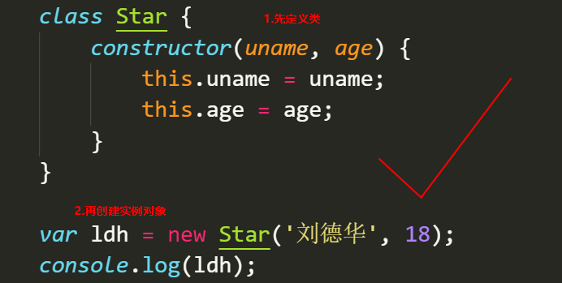

# JavaScript高级第01天

目标： 

1. 面向对象编程
2. ES6中的类和对象
3. 类的继承关系

# 1 - 面向过程与面向对象(★★★ - 理解，理论知识面试要问)

> 02 - 8:50

## 1.1面向过程编程POP（Process Oriented Programming）（常用）

> 分析出解决问题所需要的步骤, 然后依次进行

- **面向过程**就是**<font color='red'>分析出解决问题所需要的步骤，用函数把这些步骤依次执行实现</font>**，使用的时候再逐一调用就可以了。

  如下步骤：

  

## 1.2面向对象OOP（Object Oriented Programming）（高级）

> 面向对象一对象功能来划分问题，而不是步骤了。

- **面向对象**是把事务分解成为一个个对象，然后由对象之间分工与合作。

  如下步骤：

  1. 找出对象，并创建对象自己涉及到的功能
     - 大象
       - 进入
     - 冰箱
       - 打开
       - 关闭
  2. 使用大象和冰箱的功能

  |      | 面向过程                                       | 面向对象                                                     |
  | ---- | ---------------------------------------------- | ------------------------------------------------------------ |
  | 优点 | 性能比面向对象高，适合跟硬件联系很紧密的东西。 | 易维护、易复用、易扩展，由于面向对象有**封装、继承、多态性**的特性，可以设计出低耦合的系统，使系统 更加灵活、更加易于维护 |
  | 缺点 | 不易维护、不易复用、不易扩展                   | 性能比面向过程低                                             |
  
  封装性：继承代码；
  
  继承性：若有多个关联对象，则子对象可以继承父对象的方法；
  
  多态性：同一个对象在不同的应用场景中能能表现出不同的功能（如内置函数math）；

# 2 - 类与对象

## 2.1对象(复习)

> 对象是由属性和方法组成的：是一个无序键值对的集合,指的是一个具体的事物

- 属性：事物的特征，在对象中用属性来表示（常用名词）
- 方法：事物的行为，在对象中用方法来表示（常用动词）

### 2.1.1创建对象(构造函数)

**CODE01**

```JS
//以下代码是对对象的复习
//字面量创建对象
var zhangSan = {
    name: '张三',
    age: 18
}
console.log(zhangSan);

//构造函数创建对象
  function Star (name, age) {
    this.name = name;
    this.age = age;
 }
var zhangSan = new Star('张三', 18)//实例化对象
console.log(zhangSan);	
```

如上两行代码运行的结果：


## 2.2 类 class (★★★★★ - 重点)

> 在 ES6 中新增加了类的概念，可以使用 `class` 关键字声明一个类，之后以这个类来实例化对象。
>
> **类** 抽象了对象的公共部分，它**泛指**某一大类（class）
>
> **对象特指**某一个, 是通过**类**实例化一个具体的对象
>
> <font color='red'>类 是构造函数的语法糖</font>

面向对象的思路特点：

	1. 抽取（抽象）对象公用属性和行为，组织(封装)成一个类(模板)
 	2. 对类进行实例化，获取类的对象

### 2.2.1创建类和属性

**语法：**

```js
//步骤1 使用class关键字
class name {
  // class body
}     
//步骤2使用定义的类创建实例  注意new关键字
var xx = new name();    
```

**示例：**

**CODE02**

```js
 // 1. 创建类 class  创建一个 明星类
 class Star {
   // 类的共有属性放到 constructor 里面
   // constructor => 构造函数
   constructor(name, age) {
       this.name = name;
       this.age = age;
   }
 }
   // 2. 利用类创建对象 new
   var raye = new Star('raye', 13);
   console.log(raye);
```


注: 

1. `constructor()`方法是类的构造函数（默认方式），**用于传递参数，返回实例对象**， 通过new 生成对象实例时，自动调用该方法，如没有显式定义，类的内部会自动给我们创建一个`constructor()`
2. **通过结果我们可以看出,运行结果和使用构造函数方式一样**


**总结注意点：**

1. 通过 `class`关键字创建类，类名还是习惯性的首字母大写 （对标构造函数的命名）
2. 类里有一个`constructor`构造函数，可以接收传递过来的参数，**同时返回实例对象**
3. `constructor`构造函数只`new`**生成实例时**，就会**自动调用**这个函数，如果我们不写这个函数，类也会自动生成这个函数
4. 生成实例`new`不能省略！！！
5. 语句规范！！
   1. 创建类 类名后面不要加小括号
   2. 生成实例 类名后面需要加小括号
   3. <font color='red'>构造函数`constructor`不需要加`function`</font>
   4. <font color='red'>在`class`中多个方法之间不需要加逗号分隔</font>

### 2.2.2 创建类添加方法

> 注意对比 类中的方法， 函数方法， 对象中的方法的区别

**CODE03**

```js
 // 1. 创建类 class  创建一个类
class Star {
    // 类的共有属性放到 constructor 里面 constructor是 构造器或者构造函数
    constructor (name, age) {
      this.uname = name;
      this.age = age;
    }
    // -------------------------------------------> 注意,方法与方法之间不需要添加逗号
    sing (song) {
      console.log(this.uname + '唱' + song);
    }
}
// 2. 利用类创建对象 new
var ldh = new Star('刘德华', 18);
console.log(ldh); // Star {name: "刘德华", age: 18}
ldh.sing('冰雨'); // 刘德华唱冰雨
```

> 思考：创建`class`的多个要点（属性， 方法）， 尝试构建一个类，并用它创建对象，以及调用方法。

### 2.2.3 类的继承-extends

> 思考: 子类如何去继承父类的属性和方法

**语法:**

```js
// 父类
class Father{   
} 

// 子类继承父类
class  Son  extends Father {  
}    
```

**示例：**

**CODE04**

```js
class Father {
      constructor() {}
      say () {
        console.log('我是你爹');
       }
}

class Son extends Father{  // 这样子类就继承了父类的属性和方法
}
var myName= new Son();
myName.say();      //结果为 我是你爹
```

> 思考：如果子类也有独立的方法是，还能调用父类的方法吗？

#### 2.2.3.1 super关键字

> 用于访问和调用对象父类上的函数（可以是构造函数，也可以是普通函数）

**CODE05**

```js
//定义了父类
class Father {
   constructor(x, y) {
   this.x = x;
   this.y = y;
   }
   sum () {
   console.log(this.x + this.y);
	}
 }

//子元素继承父类
class Son extends Father {
    constructor(x, y) {
		super(x, y);
        // 必须使用super调用了父类中的构造函数constructor
        // 错误代码：Must call super constructor in derived class before accessing 'this' or returning from derived constructor
    }
}
var son = new Son(1, 2);
son.sum(); //结果为3
```

#### 2.2.3.2 继承特点

1. 就近原则

   > 继承中,如果实例化子类输出一个方法,先看子类有没有这个方法,如果有就先执行子类的
   >
   > 继承中,如果子类里面没有,就去查找父类有没有这个方法,如果有,就执行父类的这个方法

   **CODE06**

   ```JS
   class Father {
       say () {
           console.log('我是父亲');
       }
   }
   
   
   class Son extends Father {
       say () {
           console.log('我是儿子');
       }
   }
   
   var son = new Son();
   son.say(); // 输出: 我是儿子
   ```

2. 在子类中利用super调用父类的方法

   > 通过点语法实现，如super.fun()

   **CODE07**

   ```js
   class Father {
       say () {
           return '我是父亲'
       }
   }
   
   class Son extends Father {
       say () {
           console.log(super.say() + '的儿子');
       }
   }
   
   var son = new Son();
   son.say(); // 输出: 我是父亲的儿子
   ```

3. super必须放在子类this之前

   > 必须在子类this之前调用,放到this之后会报错

   **CODE08**

   ```js
   // 父类有加法方法
   class Father {
       constructor (x, y) {
           this.x = x;
           this.y = y;
       }
       sum () { // 求和
           console.log(this.x + this.y);
       }
   }
   
   // 子类继承父类加法方法 同时 扩展减法方法
   class Son extends Father {
       constructor (x, y, z) {
           // 利用super 调用父类的构造函数 super
           // 必须在子类this之前调用,放到this之后会报错
           super(x, y);
           this.x = x;
           this.y = y;
           this.z = z;
       }
       subtract () { // 求差值
           console.log(this.x - this.y - this.z);
       }
   }
   var son = new Son(5, 3, 2);
   son.subtract(); // 0
   son.sum();// 8
   ```

   

#### 2.2.3.3 继承的注意点 - this指向问题

1. 在 ES6 中类没有变量提升，所以必须先定义类，才能通过类实例化对象

   

   

2. 时刻注意**this的指向问题**, 类里面的**共有的属性和方法一定要加this使用**

   > 简单记忆， 在class里面，除了形参以外，变量（绝大部分）都加上this就行啦

   - constructor中的this指向的是new出来的实例对象 
   - 自定义的方法,一般也指向的new出来的实例对象
   - 绑定事件之后this指向的就是触发事件的事件源

   **CODE09**

   ```js
   // 1. constructor中的this指向的是new出来的实例对象 
   var that;
   class Star {
       constructor (uName, age) {
           console.log(this);
           that = this;
           this.uName = uName;
           this.age = age;
           // 3. 绑定事件之后this指向的就是触发事件的事件源
           this.btn = document.querySelector('button');
           this.btn.onclick = this.btnShow;
       }
       
       sayName () {
           // 一定要加this
           console.log(this.uName);
       }
       
       showFunctionThis () {
           // 2. 自定义的方法,一般也指向的new出来的实例对象
           console.log(this);
       }
       
       btnShow () {
           // 3. 绑定事件之后this指向的就是触发事件的事件源
           console.log(this);
       }
   }
   
   var ldh = new Star('刘德华', 18);
   // 1. constructor中的this指向的是new出来的实例对象 
   console.log(that === ldh);
   // 2. 自定义的方法,一般也指向的new出来的实例对象
   ldh.showFunctionThis();
   ```

   > 思考： 如果我希望铜鼓哦点击事件去打印constructor中的参数，比如说'刘德华'，该怎么办

   ```js
   // 通过全局变量that来实现
   // that 里储存的是constructor里的this
   btnShow () {
       console.log(that.uName);
   }
   ```

#### 2.2.3.4 总结：

1. 就近原则（继承中的属性或方法查找规则）
   - 继承中,如果实例化子类输出一个方法,先看子类有没有这个方法,如果有就先执行子类的
   - 继承中,如果子类里面没有,就去查找父类有没有这个方法,如果有,就执行父类的这个方法
2. 利用super调用父类的方法（使用`点语法`）
3. 在 ES6 中类没有变量提升，所以必须先定义类，才能通过类实例化对象
4. 时刻注意this的指向问题, 类里面的**共有的属性和方法一定要加this使用**
   - constructor中的this指向的是new出来的实例对象 
   - 自定义的方法,一般也指向的new出来的实例对象
   - 绑定事件之后this指向的就是触发事件的事件源
   - 想要让事件源获取constructor中的值，可以用that全局变量

# 3 - 面向对象版tab 栏切换

## 3.1功能需求

1. 点击 tab栏,可以切换效果.
2. 点击 + 号, 可以添加 tab 项和内容项.
3. 点击 x 号, 可以删除当前的tab项和内容项.
4. 双击tab项文字或者内容项文字可以修改里面的文字内容

## 3.2案例准备

1. 获取到标题元素
2. 获取到内容元素
3. 获取到删除的小按钮 x号
4. 定义类,添加需要的属性方法(切换,删除,增加,修改)
5. 时刻注意this的指向问题

## 3.3 功能实现

### 3.3.1 初始化操作

> 既然面向对象的案例，首先需要抽象Tab对象，并创建目标tab的实例
>
> 同时在做功能之前，先进行初始化操作让相关的元素绑定事件

**CODE10**

```js
class Tab {
	constructor (id) {}
}
new Tab('#tab')
```

1. 创建初始化方法，给每个`tab`附上索引(`index`)属性

```js
class Tab {
	constructor (id) {
        // 1. 获取元素，拿到id=tab的大盒子
        this.main = document.querySelector(id)
        // 2. 获取tab头部的li
        this.lis = this.main.querySelectorAll('.fisrstnav ul li')
        // 3. 获取tab内容的sections
        this.sections = this.main.querySelectorAll('.tabscon section');
        
        console.log( this.lis)
        console.log( this.sections)
        this.init() // 自动调用
    }
    
    // 初始化操作让相关的元素绑定事件
    init() {
        for (var i = 0; i < this.lis.length; i++) {
            this.lis[i].index = i // 给li标签一个index属性，通过索引号来区分
        }
    }

}
new Tab('#tab')

// var tab = new Tab('#tab')
// tab.init()
```


### 3.3.2 tab切换

1. 给tab添加点击事件，输出测试一下是否有索引号

   ```js
   class Tab {
   	constructor (id) {
           // 1. 获取元素，拿到id=tab的大盒子
           this.main = document.querySelector(id)
           // 2. 获取tab头部的li
           this.lis = this.main.querySelectorAll('.fisrstnav ul li')
           // 3. 获取tab内容的sections
           this.sections = this.main.querySelectorAll('.tabscon section');
           
           console.log( this.lis)
           console.log( this.sections)
           this.init() // 自动调用
       }
       
           
       // 初始化操作让相关的元素绑定事件
       init () {
           for (var i = 0; i < this.lis.length; i++) {
               this.lis[i].index = i // 给li标签一个index属性，通过索引号来区分
               this.lis[i].onclick = this.toggleTab // 附上切换tab事件
           }
       }
   	
   	// 切换功能
   	toggleTab () {
           console.log('index:', this.index) // 输出点击选中的目标tab索引号index
       }
   }
   new Tab('#tab')
   ```

2. 实现tab切换功能

   注意：

   - 切换tab时需要修改tab的样式

     通过切换li标签的类名来实现下边线的样式区别

     

     

     

   - 下方sections内容区域也要相应的改变

     

     

   步骤一： 点击目标tab，让内容sections展示

   ```js
   var that
   class Tab {
   	constructor (id) {
           that = this
           // 1. 获取元素，拿到id=tab的大盒子
           this.main = document.querySelector(id)
           // 2. 获取tab头部的li
           this.lis = this.main.querySelectorAll('.fisrstnav ul li')
           // 3. 获取tab内容的sections
           this.sections = this.main.querySelectorAll('.tabscon section')
   
           this.init() // 自动调用
       }
   	
   	// 切换功能
   	toggleTab () {
           this.className = 'liactive' // 当前选中的tab添加liactive类名，下边框变色
           that.sections[this.index].className = 'conactive' // 通过tab索引号选中与之对应索引号的sections内容，将内容展示
       }
   }
   new Tab('#tab')
   ```

   步骤二： 将原来的标签样式清除掉

   ```js
   var that
   class Tab {
   	// 切换功能
   	toggleTab () {
   		that.clearClass() // 清楚所有li和section的点击样式全部清楚
           this.className = 'liactive' // 当前选中的tab添加liactive类名，下边框变色
           that.sections[this.index].className = 'conactive' // 通过tab索引号选中与之对应索引号的sections内容，将内容展示
       }
       
       // 清除所有li 和section 的类名
       // 问: 这里的section和lis为什么可以用this
       clearClass () {
           // 遍历出所有的li和section，将他们的active样式清除
           for (var i = 0; i < this.lis.length; i++) {
               this.lis[i].className = '';
               this.sections[i].className = '';
           }
       }
   }
   new Tab('#tab')
   ```

### 3.3.3 添加新tab模块

1. 获取添加按钮元素

   ```js
   var that
   class Tab {
   	constructor (id) {
           that = this
           // 1. 获取元素，拿到id=tab的大盒子
           this.main = document.querySelector(id)
           // 2. 获取tab头部的li
           this.lis = this.main.querySelectorAll('.fisrstnav ul li')
           // 3. 获取tab内容的sections
           this.sections = this.main.querySelectorAll('.tabscon section')
           // 4. 获取添加tab的button按钮
           this.add = this.main.querySelector('.tab-add')
   
           this.init() // 自动调用
       }
   }
   new Tab('#tab')
   ```

2. 初始化时让添加按钮绑定添加事件

   ```js
   var that
   class Tab {
       // 初始化操作让相关的元素绑定事件
       init () {
           this.add.onclick = this.addTab // 给添加tab按钮绑定添加事件
           for (var i = 0; i < this.lis.length; i++) {
               this.lis[i].index = i // 给li标签一个index属性，通过索引号来区分
               this.lis[i].onclick = this.toggleTab // 附上切换tab事件
           }
       }
       
       addTab () {
   		
       }
   }
   new Tab('#tab')
   ```

3. 创建li元素和section元素

   ```js
   var that
   class Tab { 
       addTab () {
           // 1. 创建li元素和section元素
           var li = '<li class="liactive"><span>新选项卡</span><span class="iconfont icon-guanbi"></span></li>'
           var section = '<section class="conactive">新测试</section>'
       }
   }
   new Tab('#tab')
   ```

   

4. 把创建的两个元素追加到对应的父元素中

   > insertAdjacentHTML方法
   >
   > https://developer.mozilla.org/zh-CN/docs/Web/API/Element/insertAdjacentHTML
   >
   > ​		将指定的文本解析为 [`Element`](https://developer.mozilla.org/zh-CN/docs/Web/API/Element) 元素，并将结果节点插入到DOM树中的指定位置。它不会重新解析它正在使用的元素，因此它不会破坏元素内的现有元素。这避免了额外的序列化步骤，使其比直接使用innerHTML操作更快。
   >
   > **语法：**
   >
   > ```js
   > element.insertAdjacentHTML(position, text);
   > ```
   >
   > `position`：
   >
   > - `beforebegin`：元素自身的前面。
   > - `afterbegin`：插入元素内部的第一个子节点之前。
   > - `beforeend`：插入元素内部的最后一个子节点之后。
   > - `afterend`：元素自身的后面。
   >
   > `text`:
   >
   > 是要被解析为HTML或XML元素，并插入到DOM树中的 [`DOMString`](https://developer.mozilla.org/zh-CN/docs/Web/API/DOMString)。
   >
   > ```html
   > <!-- beforebegin -->
   > <div>
   >   <!-- afterbegin -->
   >   foo
   >   <!-- beforeend -->
   > </div>
   > <!-- afterend -->
   > ```

   ```js
   var that
   class Tab { 
       constructor (id) {
           that = this
           // 1. 获取元素，拿到id=tab的大盒子
           this.main = document.querySelector(id)
           // 2. 获取tab头部的li
           this.lis = this.main.querySelectorAll('.fisrstnav ul li')
           // 3. 获取tab内容的sections
           this.sections = this.main.querySelectorAll('.tabscon section')
           // 4. 获取添加tab的button按钮
           this.add = this.main.querySelector('.tab-add')
           // 5. li的父元素
           this.ul = this.main.querySelector('.fisrstnav ul:first-child')
           // 6. section 父元素
           this.fSection = this.main.querySelector('.tabscon')
   
           this.init() // 自动调用
       }
       
       addTab () {
           // 1. 创建li元素和section元素
           var li = '<li class="liactive"><span>新选项卡</span><span class="iconfont icon-guanbi"></span></li>'
           
           var random = Math.random() // 通过随机数区分内容
           var section = `<section class="conactive">新测试${random}</section>`
           
           // 2. 把创建的两个元素追加到对应的父元素中
           that.ul.insertAdjacentHTML('beforeend', li)
           that.fSection.insertAdjacentHTML('beforeend', section)
       }
   }
   new Tab('#tab')
   ```

5. 去掉原始选中的tab

   ```js
   var that
   class Tab { 
       addTab () {
           that.clearClass()  // 3. 清楚所有li和section的点击样式全部清楚
           // 1. 创建li元素和section元素
           var li = '<li class="liactive"><span>新选项卡</span><span class="iconfont icon-guanbi"></span></li>'
   
           var random = Math.random() // 通过随机数区分内容
           var section = `<section class="conactive">新测试${random}</section>`
           // 2. 把创建的两个元素追加到对应的父元素中
           that.ul.insertAdjacentHTML('beforeend', li)
           that.fSection.insertAdjacentHTML('beforeend', section)
       }
   }
   new Tab('#tab')
   ```

   > 第5步完成后发现，旧标签的样式被清除了，但新添加的tab的样式并没有清除，该怎么办？

6. 重新获取所有的li和section

   ```js
   var that
   class Tab {
       // 初始化操作让相关的元素绑定事件
       init () {
           this.updateNode() // 更新页面元素状态
           this.add.onclick = this.addTab // 给添加tab按钮绑定添加事件
           for (var i = 0; i < this.lis.length; i++) {
               this.lis[i].index = i // 给li标签一个index属性，通过索引号来区分
               this.lis[i].onclick = this.toggleTab // 附上切换tab事件
           }
       }
       
       // 重新获取对应的元素
       updateNode () {
           this.lis = this.main.querySelectorAll('li')
           this.sections = this.main.querySelectorAll('section')
       }
       
       addTab () {
           that.clearClass()  // 清楚所有li和section的点击样式全部清楚
           // 1. 创建li元素和section元素
           var li = '<li class="liactive"><span>新选项卡</span><span class="iconfont icon-guanbi"></span></li>'
   
           var random = Math.random() // 通过随机数区分内容
           var section = `<section class="conactive">新测试${random}</section>`
           // 2. 把创建的两个元素追加到对应的父元素中
           that.ul.insertAdjacentHTML('beforeend', li)
           that.fSection.insertAdjacentHTML('beforeend', section)
           that.init() // 重新获取所有的li数组
       }
   }
   new Tab('#tab')
   ```

### 3.3.4 删除tab模块

> 点击tab右上角的x后，可以删除选项卡（li和对应的section）
>
> 思路：
>
> ​		x没有索引号，但他的父元素li有索引号(index)，通过这个索引号，删除对应的li和section

1. 获取x删除按钮元素

   ```JS
   var that
   class Tab {
       constructor (id) {
           that = this
           // 1. 获取元素，拿到id=tab的大盒子
           this.main = document.querySelector(id)
           // 2. 获取tab头部的li
           this.lis = this.main.querySelectorAll('.fisrstnav ul li')
           // 3. 获取tab内容的sections
           this.sections = this.main.querySelectorAll('.tabscon section')
           // 4. 获取添加tab的button按钮
           this.add = this.main.querySelector('.tab-add')
           // 5. li的父元素
           this.ul = this.main.querySelector('.fisrstnav ul:first-child')
           // 6. section 父元素
           this.fSection = this.main.querySelector('.tabscon')
           // 7. 获取x删除按钮元素
           this.remove = this.main.querySelectorAll('.icon-guanbi')
   
           this.init() // 自动调用
       }
   }
   new Tab('#tab')
   ```

2. 给删除按钮绑定点击事件

   ```js
   var that
   class Tab {
       // 初始化操作让相关的元素绑定事件
       init () {
           this.updateNode() // 更新页面元素状态
           this.add.onclick = this.addTab // 给添加tab按钮绑定添加事件
           for (var i = 0; i < this.lis.length; i++) {
               this.lis[i].index = i // 给li标签一个index属性，通过索引号来区分
               this.lis[i].onclick = this.toggleTab // 附上切换tab事件
               this.remove[i].onclick = this.removeTab // 附上删除tab事件
           }
       }
       
       // 删除功能
       removeTab () {}
   }
   new Tab('#tab')
   ```

3. 获取目标删除按钮父亲的索引号, 并且取消冒泡事件

   ```js
   var that
   class Tab {
       // 删除功能
       removeTab (event) {
           event.stopPropagation(); // 阻止冒泡 防止触发li 的切换点击事件
           var index = this.parentNode.index
       }
   }
   new Tab('#tab')
   ```

4. 将获取remove列表的方法从`constructor`中移动到`updateNode`中，保证新增tab时可以获取到新的删除按钮元素

   ```js
   var that
   class Tab {
       constructor (id) {
           that = this
           // 1. 获取元素，拿到id=tab的大盒子
           this.main = document.querySelector(id)
           // 2. 获取tab头部的li
           this.lis = this.main.querySelectorAll('.fisrstnav ul li')
           // 3. 获取tab内容的sections
           this.sections = this.main.querySelectorAll('.tabscon section')
           // 4. 获取添加tab的button按钮
           this.add = this.main.querySelector('.tab-add')
           // 5. li的父元素
           this.ul = this.main.querySelector('.fisrstnav ul:first-child')
           // 6. section 父元素
           this.fSection = this.main.querySelector('.tabscon')
           // 7. 获取x删除按钮元素
           // this.remove = this.main.querySelectorAll('.icon-guanbi')
   
           this.init() // 自动调用
       }
       
       // 重新获取对应的元素
       updateNode () {
           this.lis = this.main.querySelectorAll('li')
           this.sections = this.main.querySelectorAll('section')
           this.remove = this.main.querySelectorAll('.icon-guanbi')
       }
   }
   new Tab('#tab')
   ```

5. 根据索引号删除对应的li和section

   ```js
   var that
   class Tab {
       // 删除功能
       removeTab (event) {
           event.stopPropagation(); // 阻止冒泡 防止触发li 的切换点击事件
           var index = this.parentNode.index // 获取目标删除按钮父亲的索引号
   
           // 根据索引号删除对应的li 和section   remove()方法可以直接删除指定的元素
           that.lis[index].remove()
           that.sections[index].remove()
       }
   }
   new Tab('#tab')
   ```

6. 删除完成后需要重新获取所有的li数组

   ```js
   var that
   class Tab {
       // 删除功能
       removeTab (event) {
           event.stopPropagation(); // 阻止冒泡 防止触发li 的切换点击事件
           var index = this.parentNode.index // 获取目标删除按钮父亲的索引号
   
           // 根据索引号删除对应的li 和section   remove()方法可以直接删除指定的元素
           that.lis[index].remove()
           that.sections[index].remove()
   
           that.init() // 重新获取所有的li数组
       }
   }
   new Tab('#tab')
   ```

   > 思考: 删除当前选中的tab时，页面会出现无选中tab的状态
   >
   > 
   >
   > 如何自动的去选中前一个tab，当然，如果选中删除的是第一个，则删除后依然选中第一个tab

7. 删除选中状态的tab，自动选中另一个，规则如上

   ```js
   var that
   class Tab {
       // 删除功能
       removeTab (event) {
           event.stopPropagation(); // 阻止冒泡 防止触发li 的切换点击事件
           var index = this.parentNode.index // 获取目标删除按钮父亲的索引号
   
           // 根据索引号删除对应的li 和section   remove()方法可以直接删除指定的元素
           that.lis[index].remove()
           that.sections[index].remove()
   
           that.init() // 重新获取所有的li数组
           // 当我们删除了选中状态的这个li 的时候, 让它的前一个li 处于选定状态
           index--;
           // 手动调用我们的点击事件  不需要鼠标触发
           if (that.lis[index]) { // 如果有前一个元素，则直接执行
               that.lis[index].click();
           } else if (that.lis[0]) { // 如果没有前一个元素，判断新的lis列表中是否有元素，如果有，则选择第一个
               that.lis[0].click();
           } 
       }
   }
   new Tab('#tab')
   ```

   > 思考：现在删除未被选中的tab时，可能会改变当前选中的tab状态，如何修改才能不改变当前选中的tab状态呢？

8. 当删除未被选中的tab时，不去修改当前的tab选中状态

   > 换句话说就是跳过步骤7的执行逻辑

   ```js
   var that
   class Tab {
       // 删除功能
       removeTab (event) {
           event.stopPropagation(); // 阻止冒泡 防止触发li 的切换点击事件
           var index = this.parentNode.index // 获取目标删除按钮父亲的索引号
   
           // 根据索引号删除对应的li 和section   remove()方法可以直接删除指定的元素
           that.lis[index].remove()
           that.sections[index].remove()
   
           that.init() // 重新获取所有的li数组
           
           // 当我们删除的不是选中状态的li 的时候,原来的选中状态li保持不变
           if (document.querySelector('.liactive')) return;
           // 当我们删除了选中状态的这个li 的时候, 让它的前一个li 处于选定状态
           index--;
           // 手动调用我们的点击事件  不需要鼠标触发
           if (that.lis[index]) { // 如果有前一个元素，则直接执行
               that.lis[index].click();
           } else if (that.lis[0]) { // 如果没有前一个元素，判断新的lis列表中是否有元素，如果有，则选择第一个
               that.lis[0].click();
           } 
       }
   }
   new Tab('#tab')
   ```

### 3.3.5 编辑tab模块

> 事前了解：
>
>   1. 双击选项卡li或者section可以实现修改
>
>   2. 双击事件： ondblclick
>
>   3. 双击文字，会默认选中文字，需要禁用双击选中文字的默认功能
>
>      `    window.getSelection ? window.getSelection().removeAllRanges(): document.selection.empty();`
>
> 		4. 双击文字生产文本框，失去焦点或者按下回车，将文本框的值赋值给原来的元素

1. 获取需要编辑的元素，并设置点击事件

   ```js
   var that
   class Tab {
       // 初始化操作让相关的元素绑定事件
       init () {
           this.updateNode() // 更新页面元素状态
           this.add.onclick = this.addTab // 给添加tab按钮绑定添加事件
           for (var i = 0; i < this.lis.length; i++) {
               this.lis[i].index = i // 给li标签一个index属性，通过索引号来区分
               this.lis[i].onclick = this.toggleTab // 附上切换tab事件
               this.remove[i].onclick = this.removeTab // 附上删除tab事件
               this.spans[i].ondblclick = this.editTab // 获取li的文本，附上双击事件
               this.sections[i].ondblclick = this.editTab // 获取section内容文本，附上双击事件
           }
       }
   
       // 重新获取对应的元素
       updateNode () {
           this.lis = this.main.querySelectorAll('li')
           this.sections = this.main.querySelectorAll('section')
           this.remove = this.main.querySelectorAll('.icon-guanbi')
           this.spans = this.main.querySelectorAll('.fisrstnav li span:first-child')
       }
       
       editTab () {
           // 双击禁止选定文字
           window.getSelection
           ? window.getSelection().removeAllRanges()
           : document.selection.empty(); 
       }
   }
   new Tab('#tab')
   ```

2. 生产文本框，并将当前的内容作为文本框的默认值

   ```js
   var that
   class Tab {
       editTab () {
           var str = this.innerHTML // 获取原来的文字内容
   
           // 双击禁止选定文字
           window.getSelection
               ? window.getSelection().removeAllRanges()
           : document.selection.empty()
   
           this.innerHTML = '<input type="text" />' // 生产文本框
           var input = this.children[0] // 获取页面元素<input />
           input.value = str // 将当前的内容作为文本框的默认值
           input.select() // 文本框里面的文字处于选定状态
       }
   }
   new Tab('#tab')
   ```

3. 当离开文本框（失焦）时，将文本框的值给到原来的span

   ```js
   var that
   class Tab {
       editTab () {
           var str = this.innerHTML // 获取原来的文字内容
   
           // 双击禁止选定文字
           window.getSelection
               ? window.getSelection().removeAllRanges()
           : document.selection.empty()
   
           this.innerHTML = '<input type="text" />' // 生产文本框
           var input = this.children[0] // 将当前的内容作为文本框的默认值
           input.value = str
           input.select() // 文本框里面的文字处于选定状态
           
           // 当我们离开文本框就把文本框里面的值给span; this指向的是input，需要给span也就是input的父元素
           input.onblur = function() { // 失焦事件
               this.parentNode.innerHTML = this.value
           }
       }
   }
   new Tab('#tab')
   ```

4. 当使用回车键时也还原步骤3的操作

   ```js
   var that
   class Tab {
       editTab () {
           var str = this.innerHTML // 获取原来的文字内容
   
           // 双击禁止选定文字
           window.getSelection
               ? window.getSelection().removeAllRanges()
           : document.selection.empty()
   
           this.innerHTML = '<input type="text" />' // 生产文本框
           var input = this.children[0] // 将当前的内容作为文本框的默认值
           input.value = str
           input.select() // 文本框里面的文字处于选定状态
           
           // 当我们离开文本框就把文本框里面的值给span; this指向的是input，需要给span也就是input的父元素
           input.onblur = function() { // 失焦事件
               this.parentNode.innerHTML = this.value
           }
           
           // 按下回车也可以把文本框里面的值给span
           input.onkeyup = function(e) {
               if (e.keyCode === 13) { // 获取keycode
                   // 手动调用表单失去焦点事件  不需要鼠标离开操作
                   this.blur()
               }
           }
       }
   }
   new Tab('#tab')
   ```

   > 思考： 为什么在input框中双击控制台会报错
>
   > 

   解决办法：
   
   ```js
   var that
   class Tab {
       editTab () {
           var str = this.innerHTML // 获取原来的文字内容
           if (str === '<input type="text">') {
               return
           }
           // 双击禁止选定文字
           window.getSelection
               ? window.getSelection().removeAllRanges()
           : document.selection.empty()
   
           this.innerHTML = '<input type="text" />' // 生产文本框
           var input = this.children[0] // 将当前的内容作为文本框的默认值
           input.value = str
           input.select() // 文本框里面的文字处于选定状态
           
           // 当我们离开文本框就把文本框里面的值给span; this指向的是input，需要给span也就是input的父元素
           input.onblur = function() { // 失焦事件
               this.parentNode.innerHTML = this.value
           }
           
           // 按下回车也可以把文本框里面的值给span
           input.onkeyup = function(e) {
               if (e.keyCode === 13) { // 获取keycode
                   // 手动调用表单失去焦点事件  不需要鼠标离开操作
                   this.blur()
               }
           }
       }
   }
new Tab('#tab')
   ```
   
   


