# JavaScript高级第02天

# 1 - 构造函数和原型

目标：

1. 了解构造函数与原型
2. **<font color='red'>原型链的概念</font>**
3. 通过原型扩展内置方法

## 1.1 对象的三种创建方式 - 复习

> 概念： **<font color='red'>构造函数</font>**主要用来初始化对象，即为对象成员变量赋初始值，和`new`关键字一起使用。可以目标对象中的一些公共属性和方法抽取出来，然后封装到这个函数中 。

1. 字面量方式

   **CODE01**

   ```js
   var obj = {}
   ```

2. new关键字（极不推荐使用，原因见下）

   ```js
   var obj = new Object()
   ```

3. 构造函数方式

   ```js
   function Person (name,sex) {
     this.name = name
     this.sex = sex
   }
   var obj = new Person('严海伦', '男')
   ```

## 1.2 new在执行时做的四件事 - 复习

1. 在内存中创建一个新的空对象
2. 让this指向这个新的对象
3. 执行构造函数里面的代码，给这个新对象添加属性和方法
4. 返回这个新对象（构造函数里不需要return）

## 1.3 静态成员和实例成员

### 1.2.1实例成员(方法)

> 1. 实例成员就是构造函数内部通过`this`添加的成员。如下列代码中`uname age sing` 就是实例成员；
>
> 2. **实例成员只能通过实例化的对象来访问， 不可以通过构造函数来访问**

**CODE02**

```js
function Star (uname, age) {
    this.uname = uname
    this.age = age
    this.sing = function () {
        console.log('我会唱歌')
    }
}
var ldh = new Star('刘德华', 18)
console.log(ldh.uname) // 实例成员只能通过实例化的对象来访问
console.log(Star.uname) // 错误！因为不可以通过构造函数来访问
```

### 1.2.2静态成员(方法)

> 1. 静态成员在构造函数本身上添加的成员，如下列代码中 sex 就是静态成员
> 2. **静态成员只能通过构造函数来访问，不能通过对象来访问**
>
> 对标js基础： Array.isArray()

**CODE02**

```js
function Star (uname, age) {
    this.uname = uname
    this.age = age
    this.sing = function () {
        console.log('我会唱歌')
    }
}
Star.sex = '男';
var ldh = new Star('刘德华', 18)
console.log(Star)
console.log(Star.sex) // 静态成员只能通过构造函数来访问
console.log(ldh.sex) // 错误！ 不能通过对象来访问
```

> 思考： 那这么说来，静态成员有什么用呢？

## 1.4 构造函数的问题

> 04 8:42

构造函数方法很好用，但是存在浪费内存的问题。


## 1.5 构造函数原型 prototype (★★★★★ - 重中之重)

> 构造函数通过原型分配的函数是所有对象所共享的。

### 1.5.1 概念

​		JavaScript 规定，每一个构造函数都有一个`prototype` 属性，指向另一个对象。注意这个`prototype`就是一个对象，**这个对象的所有属性和方法，都会被<font color='red'>构造函数</font>所拥有。**

​		可以把那些不变的方法，直接定义在 `prototype` 对象上，这样所有对象的实例就可以共享这些方法。

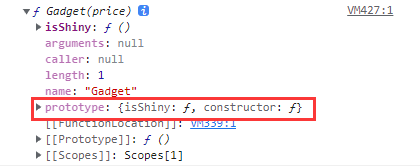

### 1.5.2 prototype 的意义

> 将构造函数中恒定的方法放到它的`prototype`原型对象中， 减少每次实例化对象时的内存消耗

**CODE03**

```JS
function Star(uname, age) {
    this.uname = uname
    this.age = age
}
Star.prototype.sing = function() {
    console.log('我会唱歌')
}
var ldh = new Star('刘德华', 18)
var zxy = new Star('张学友', 19)

// prototype的使用
ldh.sing() // 我会唱歌
zxy.sing() // 我会唱歌
```

构造函数的写法：**

1. 将公共属性定义到构造函数中
2. 将公共方法放到它的原型对象上

## 1.6 对象的原型 `__proto__` (★★★★★ - 重中之重)

> 注意： 仅概念上的理解，开发中不可以使用！！！！！！！！

### 1.6.1  `__proto__`概念

​		**对象都会有一个属性 `__proto__` 指向构造函数的 prototype 原型对象。**之所以我们对象可以使用构造函数 prototype 原型对象的属性和方法，就是因为对象有 `__proto__` 原型的存在。

**CODE04**

```js
function Star(uname, age) {
    this.uname = uname
    this.age = age
}
Star.prototype.sing = function() {
    console.log('我会唱歌')
}
var ldh = new Star('刘德华', 18)
console.log(ldh) // 对象身上系统自动添加一个__proto__属性，指向构造函数的原型对象
```

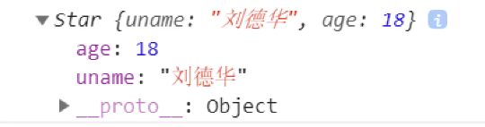

### 1.6.2 特点

1. `__proto__`对象原型和原型对象 prototype 是等价的

   ```js
   console.log(ldh.__proto__ === Star.prototype) // true
   ```

   查找规则：

   1. 先看实例化对象（ldh）上是否有目标方法（sing），如果有，则执行该方法
   2. 如果实例化对象（ldh）上没有该方法，因为有`__proto__`，就可以去构造函数原型对象`prototype`上去查找

2. `__proto__`对象原型的意义就在于为对象的查找机制提供一个方向，或者说**一条路线一个指向**，但是它是一个非标准属性。实际开发中，**不可以使用这个属性**，它只是内部指向原型对象 prototype

   

## 1.7 constructor构造函数

> constructor 主要用于记录该对象引用于哪个构造函数，它可以让原型对象重新指向原来的构造函数。

### 1.7.1 概念

​		对象原型（ `__proto__`）和构造函数原型对象（prototype）里面有一个 constructor 属性 ，constructor 我们称为构造函数，因为**它指回构造函数本身。**

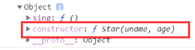

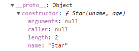

### 1.7.2 注意事项

​		**描述：**一般情况下，对象的方法都在构造函数的原型对象`prototype`中设置。如果有多个对象的方法，我们可以给原型对象`prototype`采取对象形式赋值，但是这样就会覆盖构造函数原型对象原来的内容，这样修改后的原型对象 `constructor`  就不再指向当前构造函数了。此时，我们可以在修改后的原型对象中，添加一个 `constructor` 指向原来的构造函数。

​		**处理方案：**如果我们修改了原来的原型对象,给原型对象赋值的是一个对象,则必须手动的利用`constructor`指回原来的构造函数。**换句话来说，不要这么赋值能解决100%的问题**

**CODE05**

```js
// 1. 点语法添加原型方法
function Star (uname, age) {
    this.uname = uname;
    this.age = age;
}
Star.prototype.sing = function() {
    console.log('我会唱歌');
}
Star.prototype.movie = function() {
    console.log('我会唱歌');
}

// 2. 以对象赋值的方式添加对象方法
function Star (uname, age) {
    this.uname = uname;
    this.age = age;
}
Star.prototype = {
    // 手动设置指回原来的构造函数
    // 如果不加这个constructor则不会指挥Star原型
    constructor: Star, 
    sing: function() {
        console.log('我会唱歌');
    },
    movie: function() {
        console.log('我会演电影');
    }
}
```

## 1.8 构造函数、实例化对象，原型对象的关系(★★★★★ - 面试必背)

1. 构造函数的`prototype`属性指向了构造函数原型对象
2. 实例对象是由构造函数创建的,实例对象的`__proto__`属性指向了构造函数的原型对象
3. 构造函数的原型对象的constructor属性指向了构造函数,实例对象的原型的constructor属性也指向了构造函数

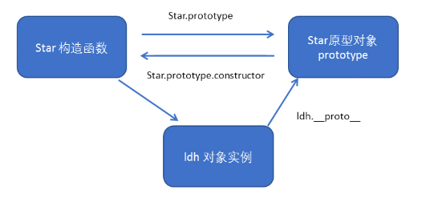

## 1.9 原型链 (★★★★★ - 面试必背)

<font color='red'>每一个实例对象都有一个`__proto__`属性，指向的构造函数的原型对象`prototype`，构造函数的原型对象`prototype`也是一个对象，也有`__proto__`属性，这样一层一层往上找直到找到`Object`的`prototype`，他的值为`null`，这就是原型链。</font>


```js
console.log(Star.prototype.__proto__ === Object.prototype) // ture
console.log(Object.prototype.__proto__) // null
```

## 1.10 原型链和成员的查找机制(就是原型链)

> 任何对象都有原型对象,也就是prototype属性,任何原型对象也是一个对象,该对象就有`__proto__`属性,这样一层一层往上找,就形成了一条链,我们称此为原型链
>
> 看1.6.2 中的查找规则

1. 当访问一个对象的属性（包括方法）时，首先查找这个对象自身有没有该属性。
2. 如果没有就查找它的原型（也就是 `__proto__`指向的 prototype 原型对象）。
3. 如果还没有就查找原型对象的原型（Object的原型对象）。
4. 依此类推一直找到 Object 为止（null）。
5. `__proto__`对象原型的意义就在于为对象成员查找机制提供一个方向，或者说一条路线。

**思考：**

**CODE06**

```js
function Star(uname, age) {
    this.uname = uname;
    this.age = age;
}
Star.prototype.sing = function() {
    console.log('我会唱歌');

}
Star.prototype.sex = '女';
// Object.prototype.sex = '男';
var ldh = new Star('刘德华', 18);
ldh.sex = '男';

console.log(ldh.sex);

// 实例化对象上有Object的默认方法吗？ 如toString
console.log(Object.prototype);
console.log(ldh);
console.log(Star.prototype);

console.log(ldh.toString());
```

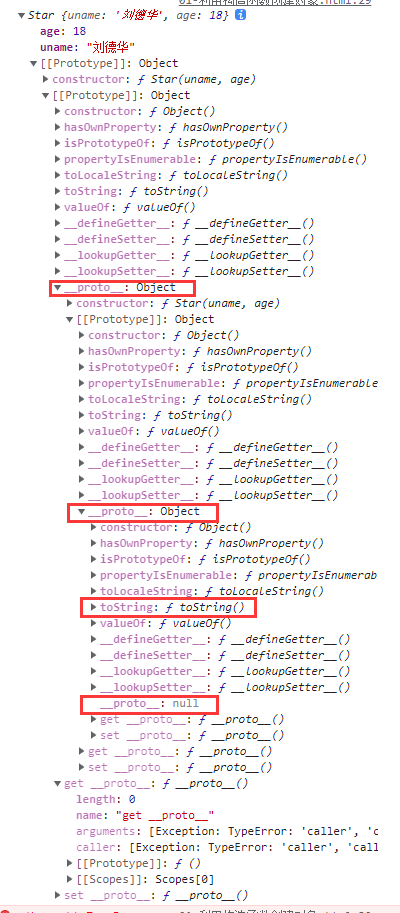

## 1.11 原型对象的this指向(★★★)

> **构造函数**中的this和**原型对象**的this，**都**指向我们new出来的实例对象

**CODE07**

```js
function Star(uname, age) {
    this.uname = uname;
    this.age = age;
}
var that;
Star.prototype.sing = function() {
    console.log('我会唱歌');
    that = this;
}
var ldh = new Star('刘德华', 18);
// 1. 在构造函数中,里面this指向的是对象实例 ldh
console.log(that === ldh);//true
// 2.原型对象函数里面的this 指向的是 实例对象 ldh
```

## 1.12 通过原型为数组扩展内置方法（听听就过去了，禁止使用）

> 可以通过原型对象，对原来的内置对象进行扩展自定义的方法

**CODE08**

```JS
Array.prototype.sum = function() {
    var sum = 0;
    for (var i = 0; i < this.length; i++) {
        sum += this[i];
    }
    return sum;
};
//此时数组对象中已经存在sum()方法了  可以使用 数组.sum()进行数据的求和
[1,2,3,4].sum()
```

# 2 - 继承

> es6之前可没有extends类的继承， 但可以通过构造函数+原型对象实现继承 - 组合继承

目标：

1. call、apply的使用
2. 属性继承写法
3. 方法继承写法

## 2.1 call()和apply() (★★★★)

### 2.1.1 call()

1. **概念：**调用目标函数，并修改函数运行时的this指向

2. **语法：**

   ```js
   function.call(thisArg, arg1, arg2, ...)
   ```

3. **参数：**

   `thisArg`:

   ​		可选的。在 *`function`* 函数运行时使用的 `this` 值（指向对象）。请注意，`this`可能不是该方法看到的实际值：如果这个函数处于[非严格模式](https://developer.mozilla.org/zh-CN/docs/Web/JavaScript/Reference/Strict_mode)下，则指定为 `null` 或 `undefined` 时会自动替换为指向全局对象，原始值会被包装。

   `arg1,arg2,arg3...`:

   ​		指定的参数列表（传递的其他参数）。

4. **返回值：**

   ​		使用调用者提供的 `this` 值和参数调用该函数的返回值。若该方法没有返回值，则返回 `undefined`。

**CODE09**

```JS
function fn(x, y) {
    console.log(this)
    return x + y
}
var o = {
    name: 'andy'
};
fn(1, 2)
fn.call(o, 1, 2) // 调用了函数此时的this指向了对象o
```

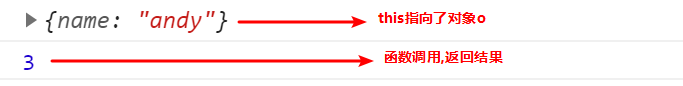

### 2.1.2 apply()

1. **概念：**`apply()` 方法调用一个具有给定`this`值的函数，以及以一个数组（或[类数组对象](https://developer.mozilla.org/zh-CN/docs/Web/JavaScript/Guide/Indexed_collections#working_with_array-like_objects)）的形式提供的参数。

2. **语法：**

   ```js
   func.apply(thisArg, [argsArray])
   ```

3. **参数：**

   `thisArg`:

   ​		可选的。在 *`function`* 函数运行时使用的 `this` 值（指向对象）。请注意，`this`可能不是该方法看到的实际值：如果这个函数处于[非严格模式](https://developer.mozilla.org/zh-CN/docs/Web/JavaScript/Reference/Strict_mode)下，则指定为 `null` 或 `undefined` 时会自动替换为指向全局对象，原始值会被包装。

   `argsArray`:

   ​		可选的。一个数组或者类数组对象，其中的数组元素将作为单独的参数传给 `func` 函数。如果该参数的值为 [`null`](https://developer.mozilla.org/zh-CN/docs/Web/JavaScript/Reference/Global_Objects/null) 或 [`undefined`](https://developer.mozilla.org/zh-CN/docs/Web/JavaScript/Reference/Global_Objects/undefined)，则表示不需要传入任何参数。

4. **返回值：**

   ​		使用调用者提供的 `this` 值和参数调用该函数的返回值。若该方法没有返回值，则返回 `undefined`。

**CODE09**

```js
function fn(x, y) {
    console.log(this)
    return x + y
}
var o = {
    name: 'andy'
};
fn(1, 2)
fn.apply(o, [1, 2]) // 调用了函数此时的this指向了对象o
```

### 2.1.3 call()和apply()的区别

​		call()方法的作用和 apply() 方法类似，区别就是`call()`方法接受的是**参数列表**，而`apply()`方法接受的是**一个参数数组**。

## 2.2 子构造函数继承父构造函数中的属性

>  **核心原理：**通过call()把父类型的this指向子类型的this，这样就可以实现子类型继承父类型的属性。

步骤：

1. 先定义一个父构造函数
2. 再定义一个子构造函数
3. 子构造函数继承父构造函数的属性(使用call方法)

**CODE10**

```JS
 // 1. 父构造函数
 function Father (uName, age) {
   // this 指向父构造函数的对象实例
   this.uName = uName
   this.age = age
 }
  // 2 .子构造函数 
function Son (uName, age, score) {
  // this 指向子构造函数的对象实例
  // 3.使用call方式实现子继承父的属性
  Father.call(this, uName, age)
  this.score = score // 子构造函数的独有属性
}
var son = new Son('刘德华', 18, 100)
console.log(son)
```

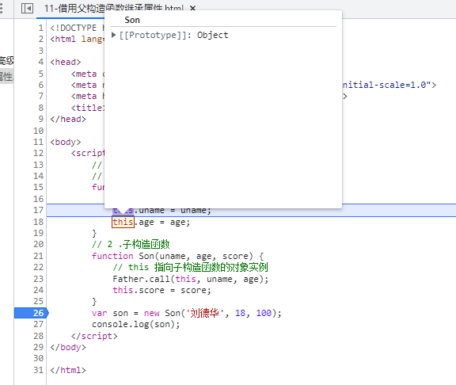

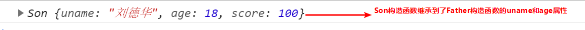

## 2.3 借用原型对象继承方法

步骤：

1. 先定义一个父构造函数
2. 再定义一个子构造函数
3. 子构造函数继承父构造函数的属性(使用call方法)

**CODE11**

```js
// 1. 父构造函数
function Father (uname, age) {
    // this 指向父构造函数的对象实例
    this.uname = uname
    this.age = age
}

// 这是父构造函数原型链上的方法
Father.prototype.money = function () {
    console.log(100000)
}

// 2.子构造函数 
function Son (uname, age, score) {
    // this 指向子构造函数的对象实例
    Father.call(this, uname, age)
    this.score = score
}

// 这是子构造函数原型链上的方法
Son.prototype.exam = function () {
    console.log('孩子要考试')
}
```

**方案一:（不可行）将子构造函数的原型等于父构造函数**

```js
Son.prototype = Father.prototype
```

问题: 这样直接赋值会有问题,如果修改了子原型对象`prototype`,父原型对象`prototype`也会跟着一起变化(父元素上也有子元素的原型方法)


**方案二: (推荐使用) 将子构造函数的原型指向父构造函数**

```js
Son.prototype = new Father()
console.log(Son.prototype.constructor) // 指向的是Father
```

问题: 如果利用对象的形式修改了原型对象,别忘了利用constructor 指回原来的构造函数
修改: 

```js
Son.prototype = new Father()
Son.prototype.constructor = Son
```

**<font color='red'>以上，牢记！</font>**

 **CODE12: 完整代码块**

```js
// 1. 父构造函数
function Father (uname, age) {
    // this 指向父构造函数的对象实例
    this.uname = uname
    this.age = age
}

// 这是父构造函数原型链上的方法
Father.prototype.money = function () {
    console.log(100000)
}

// 2.子构造函数 
function Son (uname, age, score) {
    // this 指向子构造函数的对象实例
    Father.call(this, uname, age)
    this.score = score
}

Son.prototype = new Father()
Son.prototype.constructor = Son

// 这是子构造函数原型链上的方法
Son.prototype.exam = function () {
    console.log('孩子要考试')
}
var son = new Son('刘德华', 18, 100)
console.log(son)
```

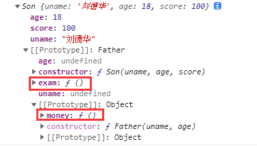

## 2.4 类的本质

> 本质上就是构造函数的另一种写法

**CODE13**

```js
// ES6 之前通过 构造函数 + 原型实现面向对象 编程
// (1) 构造函数有原型对象prototype 
// (2) 构造函数原型对象prototype 里面有constructor 指向构造函数本身
// (3) 构造函数可以通过原型对象添加方法
// (4) 构造函数创建的实例对象有__proto__ 原型指向 构造函数的原型对象

// ES6 通过 类 实现面向对象编程 
class Star {}
console.log(typeof Star)
console.log(Object.prototype.toString.call(Star))
// 1. 类的本质其实还是一个函数 我们也可以简单的认为 类就是 构造函数的另外一种写法
// (1) 类有原型对象prototype 
console.log(Star.prototype)
// (2) 类原型对象prototype 里面有constructor 指向类本身
console.log(Star.prototype.constructor)
// (3)类可以通过原型对象添加方法
Star.prototype.sing = function() {
console.log('冰雨')

}
var ldh = new Star()
console.dir(ldh)
// (4) 类创建的实例对象有__proto__ 原型指向 类的原型对象
console.log(ldh.__proto__ === Star.prototype)
```

> ES6的类其实就是语法糖
>
> 语法糖： 就是一直便捷的写法 （如果有两种方法可以实现相同的功能，那么写法更简单的哪一种就称为语法糖）

# 3 - ES6的新增功能

## 3.1 数组的使用方法

### 3.1.1 forEach - 遍历数组

**语法：**

```js
 arr.forEach(function (value, index, array) {})
```

**参数：**

`value`:  数组元素

`index(可选)`: 数组元素当前的索引

`array(可选)`: 当前的数组(一般不用)

**示例：**

**CODE14**

```js
// forEach 迭代(遍历) 数组
var arr = [1, 2, 3]
var sum = 0
arr.forEach(function (value, index, array) {
    console.log('当前数组元素', value)
    console.log('当前数组元素的索引号', index)
    console.log('数组本身', array)
    sum += value
})
console.log(sum)
```

> 思考：
>
> 1. 与for循环做对比
> 2. forEach有无break和continue？
> 3. return可以终止forEach循环吗？

### 3.1.2 map - 基于原数组构建新数组

> `map()` 方法创建一个新数组，这个新数组由原数组中的每个元素都调用一次提供的函数后的返回值组成。

```js
var new_array = arr.map(function (value,index,array) {
    // Return element for new_array
    // 为新数组添加一个新元素
}
```

**参数：**

`value`:  数组元素

`index(可选)`: 数组元素当前的索引

`array(可选)`: 当前的数组(一般不用)

**返回值：**

​		一个由原数组每个元素执行回调函数的结果组成的新数组。

**示例：**

**CODE16**

```JS
var arr = [
    {name: '张三'},
    {name: '李四'}
];
var newArr = arr.map(function (value, index) {
    value.age = index
    return value
});
console.log(newArr);
```

### 3.1.3 filter - 过滤数组

> `filter()` 方法创建一个新数组, 其包含通过所提供函数实现的测试的所有元素。 

**语法：**

```js
 var filterArr = arr.filter(function (value,index,array) {
     // Return Boolean to filter Array
     // 返回一个布尔值确定是否过滤当前元素
 });
```

**参数：**

`value`:  数组元素

`index(可选)`: 数组元素当前的索引

`array(可选)`: 当前的数组(一般不用)

**返回值：**

​		一个新的、由通过测试的元素组成的数组，如果没有任何数组元素通过测试，则返回空数组。

**示例：**

**CODE15**

```js
// filter 筛选数组
var arr = [12, 66, 4, 88, 3, 7]
var newArr = arr.filter(function (value, index) {
    return value >= 20
});
console.log(newArr)
```

### 3.1.4 some - 确定数组是否满足条件

> `some()` 方法测试数组中是不是至少有1个元素通过了被提供的函数测试。它返回的是一个Boolean类型的值。

```js
var new_array = arr.some(function (value,index,array) {
    // Return true or false
    // 返回真或假
}
```

**参数：**

`value`:  数组元素

`index(可选)`: 数组元素当前的索引

`array(可选)`: 当前的数组(一般不用)

**返回值：**

​		数组中有至少一个元素通过回调函数的测试就会返回**`true`**；

​		所有元素都没有通过回调函数的测试返回值才会为false。

**注意：**

**示例：**

**CODE16**

```js
var arr1 = ['red', 'pink', 'blue']
var flag1 = arr1.some(function (value) {
    return value == 'pink'
});
console.log(flag1)
```

> 思考： some 和filter 都是判断数组元素是否满足条件，那么他们的区别是什么
>
>  
>
> 答：
>
> 1.  filter 也是查找满足条件的元素 返回的是一个数组 而且是把所有满足条件的元素返回回来
>
> 2.  some 也是查找满足条件的元素是否存在  返回的是一个布尔值 如果查找到第一个满足条件的元素就终止循环

### 3.1.5 every - 确定数组是否全部满足条件

> `every()` 方法测试一个数组内的所有元素是否都能通过某个指定函数的测试。它返回一个布尔值。

```js
var new_array = arr.every(function (value,index,array) {
    // Return true or false
    // 返回真或假
}
```

**参数：**

`value`:  数组元素

`index(可选)`: 数组元素当前的索引

`array(可选)`: 当前的数组(一般不用)

**返回值：**

​		如果回调函数的每一次返回都为 [truthy](https://developer.mozilla.org/zh-CN/docs/Glossary/Truthy) 值，返回 `true` ，否则返回 `false`。

**注意：**

​		`every()` 方法只要查找到一个不满足条件的元素就立马终止循环

**示例：**

**CODE17**

```js
var arr1 = [18, 20, 15]
var flag1 = arr1.every(function (value) {
    return value >= 18
});
console.log(flag1)
```

### 3.1.6 案例

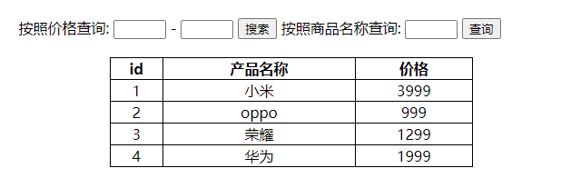

**要求：**

1. id、产品名称、价格不应该写死，应该通过数据渲染出来
2. 通过查询价格区间显示下面列表中符合条件的商品
3. 通过商品名称来显示下面列表中符合条件的商品


#### 3.1.6.1 步骤一：实时渲染数据

1. 定义数组对象数据

   **CODE18**

   ```js
   var data = [{
       id: 1,
       pname: '小米',
       price: 3999
   }, {
       id: 2,
       pname: 'oppo',
       price: 999
   }, {
       id: 3,
       pname: '荣耀',
       price: 1299
   }, {
       id: 4,
       pname: '华为',
       price: 1999
   }, ];
   ```

2. 获取相应的元素

   ```js
   var tbody = document.querySelector('tbody') // 获取tbody
   ```

3. 把数据渲染到页面中

   ```js
   function setData(mydata) {
       // 先清空原来tbody 里面的数据
       tbody.innerHTML = ''
       mydata.forEach(function(value) {
           // console.log(value)
           var tr = document.createElement('tr')
           tr.innerHTML = `<tr><td>${value.id}</td><td>${value.pname}</td><td>${value.price}</td></tr>`
           // 添加到tbody标签中
           tbody.appendChild(tr)
       });
   }
   
   setData(data)
   ```

#### 3.1.6.2 步骤二：根据价格查询商品

1. 获取价格区间查询按钮元素，金额开始和结束区间元素

   ```js
   var search_price = document.querySelector('.search-price') // 获取价格区间查询按钮元素
   var start = document.querySelector('.start') // 金额开始元素
   var end = document.querySelector('.end') // 金额结束元素
   ```

2. 绑定点击事件，根据商品价格去筛选数组里面的对象，把筛选完成之后的对象更新渲染到页面上去

   ```js
   search_price.addEventListener('click', function() {
       // 筛选列表数组中符合start和end区间中的元素
       var newDate = data.filter(function(item) {
           return item.price >= start.value && item.price <= end.value
       })
       // 把筛选完之后的对象渲染到页面中
       setDate(newDate)
   })
   ```

#### 3.1.6.3 根据商品名称查找商品

1. 获取名称查询按钮元素，名称输入框元素

   ```js
   var product = document.querySelector('.product'); // 获取名称查询按钮元素
   var search_pro = document.querySelector('.search-pro'); // 获取名称输入框元素
   ```

2. 绑定点击事件，根据商品查询名称进行筛选，把筛选完成之后的对象更新渲染到页面上去

   ```js
   // 如果查询数组中唯一的元素, 用some方法更合适,因为它找到这个元素,就不在进行循环,效率更高
   search_pro.addEventListener('click', function () {
       var arr = []
       data.some(function(item) {
           if (item.pname === product.value) {
               // console.log(value)
               arr.push(item)
               return true // return 后面必须写 true  
           }
           return false
       })
       // 把拿到的数据渲染到页面中
       setData(arr)
   })
   ```

## 3.2 字符串方法

### 3.2.1 trim() - 去除两侧空格

> `trimStart()` 方法从字符串的开头删除空格。`trimLeft()` 是此方法的别名。

**语法：**

```js
str.trim()
```

**返回值：**

​		一个代表调用字符串两端去掉空白的新字符串。

**注意：**

​		`trim()` 方法返回一个从两头去掉空白字符的字符串，并不影响原字符串本身。

**示例：**

**CODE19**

```js
var str = '   an  dy   ';
console.log(str);
var str1 = str.trim();
console.log(str);
console.log(str1);
```

**实际使用场景：输入框前后有空格**

```html
<body>
    <input type="text"> <button>点击</button>
    <div></div>
    <script>
        // trim 方法去除字符串两侧空格
        var input = document.querySelector('input'); // 获取输入框内容
        var btn = document.querySelector('button'); // 获取点击按钮元素
        var div = document.querySelector('div'); // 获取后续需要展示内容的div
        btn.onclick = function () {
            var str = input.value.trim();
            if (str === '') {
                alert('请输入内容');
            } else {
                console.log(str);
                console.log(str.length);
                div.innerHTML = str;
            }
        }
    </script>
</body>
```

## 3.3 对象方法

### 3.3.1 Object.keys(obj) - 获取对象的所有属性名

> `Object.keys()` 方法会返回一个由一个给定对象的自身可枚举属性组成的数组，数组中属性名的排列顺序和正常循环遍历该对象时返回的顺序一致 。

**语法：**

```js
Object.keys(obj)
```

**参数：**

`obj`:  要返回其枚举自身属性的对象。

**返回值：**

​		一个表示给定对象的所有可枚举属性的字符串数组。

**描述：**

​		`Object.keys` 返回一个所有元素为字符串的数组，其元素来自于从给定的`object`上面可直接枚举的属性。这些属性的顺序与手动遍历该对象属性时的一致。

**示例：**

**CODE20**

```js
var obj = {
    id: 1,
    pname: '小米',
    price: 1999,
    num: 2000
};
var arr = Object.keys(obj);
console.log(arr);
arr.forEach(function (value) {
    console.log(value);
})

// 简写
Object.keys(obj).forEach(function (value) {
    console.log(value);
})
```

> 思考： 和之前js基础时学到的哪个方法很相似

### 3.3.2 Object.defineProperty - 重新定义对象属性(看个过场，了解即可)

> `Object.defineProperty()` 方法会直接在一个对象上定义一个新属性，或者修改一个对象的现有属性，并返回此对象。
>
> <font color='red'>注意： 应当直接在 [`Object`](https://developer.mozilla.org/zh-CN/docs/Web/JavaScript/Reference/Global_Objects/Object) 构造器对象上调用此方法，而不是在任意一个 `Object` 类型的实例上调用。</font>

**语法：**

```js
Object.defineProperty(obj, prop, descriptor)
```

**参数：**

`obj`:  要定义属性的对象。

`prop`:  要定义或修改的属性的名称。

`descriptor`:  要定义或修改的属性描述符，以对象的形式书写。

- `configurable`

  当且仅当该属性的 `configurable` 键值为 `true` 时，该属性的描述符才能够被改变，同时该属性也能从对应的对象上被删除。
  **默认为** **`false`**。

- `enumerable`

  当且仅当该属性的 `enumerable` 键值为 `true` 时，该属性才会出现在对象的枚举属性中。
  **默认为 `false`**。

- `value`

  该属性对应的值。可以是任何有效的 JavaScript 值（数值，对象，函数等）。
  **默认为 [`undefined`](https://developer.mozilla.org/zh-CN/docs/Web/JavaScript/Reference/Global_Objects/undefined)**。

- `writable`

  当且仅当该属性的 `writable` 键值为 `true` 时，属性的值，也就是上面的 `value`，才能被[`赋值运算符` (en-US)](https://developer.mozilla.org/en-US/docs/Web/JavaScript/Reference/Operators#assignment_operators)改变。
  **默认为 `false`。**

**返回值：**

​		被传递给函数的对象。

**示例：**

**CODE21**

```JS
// Object.defineProperty() 定义新属性或修改原有的属性
var obj = {
    id: 1,
    pname: '小米',
    price: 1999
};
// 1. 以前的对象添加和修改属性的方式
// obj.num = 1000;
// obj.price = 99;
// console.log(obj);

// 2. Object.defineProperty() 定义新属性或修改原有的属性
Object.defineProperty(obj, 'num', {
    value: 100
});

// 3. Object.defineProperty() 让新增的或修改的属性可以被枚举（遍历）
Object.defineProperty(obj, 'num', {
    value: 100,
    enumerable: true
});

// 4. Object.defineProperty() 不允许修改目标属性
Object.defineProperty(obj, 'id', {
	writable: false
});

// 5. Object.defineProperty() 不允许删除这个属性 不允许在修改第三个参数里面的特性
Object.defineProperty(obj, 'id', {
	writable: false,
    configurable: false
});
delete obj.id; // 不能删除
// 再次改变 configurable 状态
Object.defineProperty(obj, 'id', {
    configurable: true,
    writable: true
}); // 不允许在修改第三个参数descriptor的特性
```


