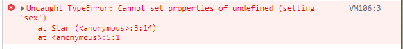

# JavaScript高级第03天（★★★★★ - ( ･´ω`･ )建议全文背诵）

目标： 

1. 函数的多种定义方式
2. **<font color='red'>函数调用方式</font>**
3. **<font color='red'>改变函数的内部this指向</font>**
4. 严格模式
5. **<font color='red'>高阶函数 - 将函数作为参数或返回值传递</font>**
6. **<font color='red'>闭包</font>**
7. **<font color='red'>递归</font>**
8. **<font color='red'>深拷贝和浅拷贝</font>**

# 1 - 函数的定义和调用 (复习)

## 1.1函数的定义方式

1. 方式1 函数声明方式 function 关键字 (命名函数)

   **CODE01**

   ```js
   function fn(){}
   ```

2. 方式2 函数表达式(匿名函数)

   ```js
   var fn = function(){}
   ```

3. 方式3 new Function()  (了解即可，不要使用)

   ```js
   var f = new Function('a', 'b', 'console.log(a + b)');
   f(1, 2);
   
   var fn = new Function('参数1','参数2'..., '函数体')
   
   /*
   注意
   Function 里面参数都必须是字符串格式
   第三种方式执行效率低，也不方便书写，因此较少使用
   所有函数都是 Function 的实例(对象)  
   函数也属于对象
   */
   ```

**注意：**

1. 所有的函数都是Funtion的实例(对象)

2.  函数也属于对象

   ```js
   console.log(f instanceof Object);
   ```

   

## 1.2函数的调用

1. 普通函数

   **CODE02**

   ```js
   function fn () {}
   fn(); 
   ```

2. 对象的方法

   ```js
   var o = {
       sayHi: function () {}
   }
   o.sayHi();
   ```

3. 构造函数

   ```js
   function Star () {};
   new Star();
   ```

4. 绑定事件函数

   ```js
   btn.onclick = function () {};   // 点击了按钮就可以调用这个函数
   ```

5. 定时器函数

   ```js
   setInterval(function () {}, 1000);  // 这个函数是定时器自动1秒钟调用一次
   ```

6. 立即执行函数(自调用函数)

   ```js
   (function () {})();
   ```

# 2 - this

## 2.1 函数内部的this指向（★★★★★复习）

> 这些 this 的指向，是当我们调用函数的时候确定的。调用方式的不同决定了this 的指向不同


1. 普通函数 this 指向window

   **CODE03**

   ```js
   function fn() {
       console.log('普通函数的this' + this);
   }
   window.fn();
   ```

2. 对象的方法  this指向的是对象 o

   ```js
   var o = {
       sayHi: function() {
           console.log('对象方法的this:' + this);
       }
   }
   o.sayHi();
   ```

3. 构造函数 指向 ldh 这个实例对象 原型对象里面的this 指向的也是 ldh这个实例对象

   ```js
   function Star() {};
   Star.prototype.sing = function() {
   
   }
   var ldh = new Star();
   ```

4. 绑定事件函数 this 指向的是函数的调用者 btn这个按钮对象

   ```js
   var btn = document.querySelector('button');
   btn.onclick = function() {
       console.log('绑定时间函数的this:' + this);
   };
   ```

5. 定时器函数  this 指向的也是window

   ```js
   window.setTimeout(function() {
       console.log('定时器的this:' + this);
   
   }, 1000);
   ```

6. 立即执行函数 this还是指向window

   ```js
   (function() {
       console.log('立即执行函数的this' + this);
   })();
   ```

## 2.2改变函数内部 this 指向(★★★★★)

### 2.2.1 call()方法

1. **概念：**调用目标函数，并修改函数运行时的this指向

2. **语法：**

   ```js
   function.call(thisArg, arg1, arg2, ...)
   ```

3. **参数：**

   `thisArg`:

   ​		可选的。在 *`function`* 函数运行时使用的 `this` 值（指向对象）。请注意，`this`可能不是该方法看到的实际值：如果这个函数处于[非严格模式](https://developer.mozilla.org/zh-CN/docs/Web/JavaScript/Reference/Strict_mode)下，则指定为 `null` 或 `undefined` 时会自动替换为指向全局对象，原始值会被包装。

   `arg1,arg2,arg3...`:

   ​		指定的参数列表（传递的其他参数）。

4. **返回值：**

   ​		使用调用者提供的 `this` 值和参数调用该函数的返回值。若该方法没有返回值，则返回 `undefined`。

**CODE04**

```JS
function fn(x, y) {
    console.log(this)
    return x + y
}
var o = {
    name: 'andy'
};
fn(1, 2) // 此时的this指向的是window 运行结果为3
fn.call(o, 1, 2) // 此时的this指向的是对象o,参数使用逗号隔开,运行结果为3

```

**call主要作用是去实现继承属性**

```js
// call主要作用是去实现继承
function Father (name, age) {
    this.name = name
    this.age = age
}

function Son (name, age) {
    Father.call(this, name, age)
}
```


### 2.1.2 apply()方法

1. **概念：**`apply()` 方法调用一个具有给定`this`值的函数，以及以一个数组（或[类数组对象](https://developer.mozilla.org/zh-CN/docs/Web/JavaScript/Guide/Indexed_collections#working_with_array-like_objects)）的形式提供的参数。

2. **语法：**

   ```js
   func.apply(thisArg, [argsArray])
   ```

3. **参数：**

   `thisArg`:

   ​		可选的。在 *`function`* 函数运行时使用的 `this` 值（指向对象）。请注意，`this`可能不是该方法看到的实际值：如果这个函数处于[非严格模式](https://developer.mozilla.org/zh-CN/docs/Web/JavaScript/Reference/Strict_mode)下，则指定为 `null` 或 `undefined` 时会自动替换为指向全局对象，原始值会被包装。

   `argsArray`:

   ​		可选的。一个数组或者类数组对象，其中的数组元素将作为单独的参数传给 `func` 函数。如果该参数的值为 [`null`](https://developer.mozilla.org/zh-CN/docs/Web/JavaScript/Reference/Global_Objects/null) 或 [`undefined`](https://developer.mozilla.org/zh-CN/docs/Web/JavaScript/Reference/Global_Objects/undefined)，则表示不需要传入任何参数。

4. **返回值：**

   ​		使用调用者提供的 `this` 值和参数调用该函数的返回值。若该方法没有返回值，则返回 `undefined`。

**CODE04**

```js
function fn(x, y) {
    console.log(this)
    return x + y
}
var o = {
    name: 'andy'
};
fn(1, 2)
fn.apply(o, [1, 2]) // 调用了函数此时的this指向了对象o
```

apply 和call唯一区别是传参方式的不同，而这种方式有**恰好可以做一些数字运算**

```js
// 如求数组中的最大值 - Math.max()
var arr = [1, 2, 3, 4, 5]
var max = Math.max.apply(null, arr)
var max = Math.max.apply(Math, arr) // 可以但是没必要
console.log(max)
```


### 2.1.3 bind() 方法

1. **概念：**`bind()` 方法创建一个新的函数，在 `bind()` 被调用时，这个新函数的 `this` 被指定为 `bind()` 的第一个参数，而其余参数将作为新函数的参数，供调用时使用。

2. **语法：**

   ```js
   function.bind(thisArg, arg1, arg2, ...)
   ```

3. **参数：**

   `thisArg`:

   ​		调用绑定函数时作为 `this` 参数传递给目标函数的值。 如果使用[`new`](https://developer.mozilla.org/zh-CN/docs/Web/JavaScript/Reference/Operators/new)运算符构造绑定函数，则忽略该值。当使用 `bind` 在 `setTimeout` 中创建一个函数（作为回调提供）时，作为 `thisArg` 传递的任何原始值都将转换为 `object`。

   `arg1,arg2,arg3...`:

   ​		当目标函数被调用时，被预置入绑定函数的参数列表中的参数。

4. **返回值：**

   ​		返回一个原函数的拷贝，并拥有指定的 **`this`** 值和初始参数。

5. **注意：**

   - **不会调用原来的函数** 可以改变原来函数内部的this 指向
   - 返回的是原函数改变this之后产生的新函数

6. **使用场景：**

   ​		如果有的函数我们不需要立即调用, 但是又想改变这个函数内部的this指向此时用bind => (练习1)

**CODE05**

```JS
var o = {
    name: 'andy'
};

function fn (a, b) {
    console.log(this);
    console.log(a + b);
};
// fn.bind(o); // 并不会主动执行

// 用变量接收这个新函数后，进行调用
var f = fn.bind(o);
fn(1, 2);
f(1, 2);
```

> 练习1： 一个按钮,当我们点击了之后,就禁用这个按钮,3秒钟之后开启这个按钮（节流操作）

```html
<body>
    <button>点击</button>
    <script>
        var btn = document.querySelector('button');
        btn.onclick = function() {
            this.disabled = true; // 指向的是按钮
            var that = this;
            setTimeout(function() {
                // this.disabled = false; // 定时器里的this指向的是window
                that.disabled = false;
            }, 2000);
        }
        
        // 高级写法
        btn.onclick = function() {
            this.disabled = true; // 指向的是btn按钮
            setTimeout(function() {
                this.disabled = false; // 定时器里的this指向的是btn
            }.bind(this), 2000);
        }
    </script>
</body>
```

> 思考： 如果有多个按钮，都分别设置3s延迟呢

```html
<body>
    <button>点击</button>
    <button>点击</button>
    <button>点击</button>
    <script>
        var btns = document.querySelectorAll('button');
        btns.forEach(function (btn) {
            btn.onclick = function() {
                this.disabled = true;
                setTimeout(function() {
                    this.disabled = false;
                }.bind(this), 2000);
            }
        })
    </script>
</body>
```

> 练习： 完善应用面向对象tab栏案例的this指向

步骤1： 找到需要用到实例对象tab中属性的方法（也就是之前用到了全局变量that的方法）

```js
// 切换功能
toggleTab () {}
// 添加tab
addTab () {}
// 删除功能
removeTab (event) {}
```

步骤2：找到他们的点击事件，通过bind将指向实例对象tab中的this作为参数赋值上去

**注意：** 因为方法里面有可能也需要通过this指向事件源（绑定事件的元素），所以不要直接将方法内的this指向改变，而是以参数的形式添加上去

```js
this.add.onclick = this.addTab.bind(this.add, this) // 给添加tab按钮绑定添加事件

for (var i = 0; i < this.lis.length; i++) {
    this.lis[i].onclick = this.toggleTab.bind(this.lis[i], this) // 附上切换tab事件
    this.remove[i].onclick = this.removeTab.bind(this.remove[i], this) // 附上删除tab事件
}
```

步骤3：改造方法的形式参数

**注意：**这里removeTab方法中用到了event（事件的状态），需要写在所有形参的最后

```js
// 切换功能
toggleTab (that) {}
// 添加tab
addTab (that) {}
// 删除功能
removeTab (that, event) {}
```


### 2.1.4 总结（★★★★★ - 背！）

- 共同点 : 都可以改变this指向
- 不同点:
  - call 和 apply  会调用函数, 并且改变函数内部this指向
  - call 和 apply传递的参数不一样, call传递参数使用逗号隔开, apply使用数组传递
  - bind  不会调用函数, 可以改变函数内部this指向


- 应用场景
  1. call 经常做继承. 
  2. apply经常跟数组有关系，比如借助于数学对象实现数组最大值最小值
  3. bind  不调用函数,但是还想改变this指向，比如改变定时器内部的this指向

# 3 - 严格模式（了解即可）

## 3.1什么是严格模式

> 简单来说： 严格模式消除了一些js不合理的地方，同时为了以后的发展做了一些铺垫。

​		JavaScript 除了提供正常模式外，还提供了**严格模式（strict mode）**。ES5 的严格模式是采用具有限制性 JavaScript变体的一种方式，即在严格的条件下运行 JS 代码。

​		严格模式在 IE10 以上版本的浏览器中才会被支持，旧版本浏览器中会被忽略。

​		严格模式对正常的 JavaScript 语义做了一些更改： 

1. 消除了 Javascript 语法的一些不合理、不严谨之处，减少了一些怪异行为。例如： 不声明变量直接赋值

2. 消除代码运行的一些不安全之处，保证代码运行的安全。

3. 提高编译器效率，增加运行速度。

4. 禁用了在 ECMAScript 的未来版本中可能会定义的一些语法，为未来新版本的 Javascript 做好铺垫。比如一些保留字如：class,enum,export, extends, import, super 不能做变量名

## 3.2开启严格模式

​		严格模式可以应用到**整个脚本**或**个别函数**中。因此在使用时，我们可以将严格模式分为为脚本开启严格模式和为函数开启严格模式两种情况。

### 3.2.1 为脚本开启严格模式

​		有的 script 脚本是严格模式，有的 script 脚本是正常模式，这样不利于文件合并，所以可以将整个脚本文件放在一个立即执行的匿名函数之中。这样独立创建一个作用域而不影响其他 script 脚本文件。

**CODE06**

```html
<!-- 为整个脚本(script标签)开启严格模式 -->
<script>
    'use strict';
    // 下面的js 代码就会按照严格模式执行代码
</script>
<script>
    (function() {
        'use strict';
        // 在脚本的独立作用域里开启严格模式， 这样可以防止全局污染
    })();
</script>
```

### 3.2.2 为函数开启严格模式

​		要给某个函数开启严格模式，需要把“use strict”;  (或 'use strict'; ) 声明放在函数体所有语句之前。

```html
<!-- 为某个函数开启严格模式 -->
<script>
    // 此时只是给fn函数开启严格模式
    function fn () {
        'use strict';
        // 下面的代码按照严格模式执行
    }

    function fun () {
        // 里面的还是按照普通模式执行
    }
</script>
```

## 3.3 严格模式中的变化

严格模式对 Javascript 的语法和行为，都做了一些改变。

1. 我们的变量名必须先声明再使用

   **CODE07**

   ```js
   'use strict';
   // num = 10;
   // console.log(num);
   
   var num = 10;
   console.log(num);
   ```

   

2. 不能随意删除已经声明好的变量

   ```js
   'use strict';
   var num = 10;
   delete num;
   ```

   

3. 严格模式下全局作用域中函数中的 this 是 undefined。

   ```JS
   'use strict';
   function fn() {
       console.log(this); // undefined。
   }
   fn();
   ```

4. 严格模式下,如果 构造函数不加new调用, this 指向的是undefined 如果给他赋值则 会报错.

   ```JS
   'use strict';
   function Star() {
       this.sex = '男';
   }
   Star();
   // 以下是正确的使用
   var ldh = new Star();
   console.log(ldh.sex);
   ```

   

5. 定时器 this 还是指向 window

   ```js
   'use strict';
   setTimeout(function() {
       console.log(this); // window
   }, 2000);
   ```

6. 严格模式下函数里面的参数不允许有重名

   ```JS
   'use strict';    
   function fn(a, a) {
       console.log(a + a);
   
   };
   fn(1, 2);
   function fn() {}
   ```

   

# 4 - 高阶函数(回调函数)

> 1. 高阶函数是对其他函数进行操作的函数
> 2. 它接收函数**作为参数**或将函数作为**返回值输出**


此时fn 就是一个高阶函数

函数也是一种数据类型，同样可以作为参数，传递给另外一个参数使用。最典型的就是作为回调函数。

同理函数也可以作为返回值传递回来。

**CODE08**

```js
// 高阶函数- 函数可以作为参数传递
function fn(a, b, callback) {
    console.log(a + b);
    callback && callback();
}

fn(1, 2, function() {
    console.log('我是最后调用的');
});
```

**jquery里有很多地方也用到了高阶函数**

```html
<style>
    div {
        position: absolute;
        width: 100px;
        height: 100px;
        background-color: pink;
    }
</style>
<body>
    <div></div>
    <script>
        // 让div先移动，然后在变色
        $("div").animate({
            left: 500
        }, function() {
            $("div").css("backgroundColor", "purple");
        })
    </script>
</body>
```

# 5 - 闭包(★★★★★ - 面试必背)

> 13 7:03

## 5.1 变量的作用域（复习）

变量根据作用域的不同分为两种：全局变量和局部变量。

1. 函数内部可以使用全局变量。
2. 函数外部不可以使用局部变量。
3. 当函数执行完毕，本作用域内的局部变量会销毁。(垃圾回收机制)

## 5.2 闭包的概念

> 简单来说，<font color='red'>函数嵌套函数， 有一个函数可以访问另一个函数的局部变量</font>

**概念：**闭包（closure）指有权访问另一个函数作用域中变量的函数。简单理解就是 ，一个作用域可以访问另外一个函数内部的局部变量。

```js
// 闭包（closure）指有权访问另一个函数作用域中变量的函数。
// 闭包: 我们fun 这个函数作用域 访问了另外一个函数 fn 里面的局部变量 num
function fn () {
    var num = 10;
    function fun () {
        console.log(num);
    }
    fun();
}
fn();
```


## 5.3闭包的作用

> fn 函数外面的作用域可以访问 fn 内部的局部变量 - 通过`return`实现

**作用：**<font color='red'>延伸变量的作用范围。</font>

**特点：**闭包函数执行完成后不会立即销毁，依然会占内存（这也是闭包的一个性能问题）

**CODE09**

```js
 function fn () {
   var num = 10;
   function fun () {
       console.log(num++);
 	}
    return fun;
 }
var f = fn();
f();
// f可以看作
// var f =  function fun() {
// 		console.log(num);
// }

// 或者可以把fn看作是
function fn () {
    var num = 10;
    return function () {
        console.log(num)
    }
}
```

## 延展：垃圾回收机制

### 概念

1. 什么是垃圾？

   （1）没有被引用的对象或变量

   （2）无法访问到的对象（几个对象引用形成一个环，互相引用）

2. 可达性

   **可达性**是指那些以某种方式可以访问到或可以用到的值，它们被保证存储在内存中。

   有一组基本的固有**可达值**，由于显而易见而无法删除：
   （1）本地函数的局部变量和参数
   （2）[嵌套](https://so.csdn.net/so/search?q=嵌套&spm=1001.2101.3001.7020)调用链上的其他函数的变量与参数
   （3）[全局变量](https://so.csdn.net/so/search?q=全局变量&spm=1001.2101.3001.7020)
   （4）还有一些其他的，内部的数据
   这些值成为**根**。

   - 如果引用或引用链可以从根访问任何其他值，则认为该值是可访问的。

3. [垃圾回收](https://so.csdn.net/so/search?q=垃圾回收&spm=1001.2101.3001.7020)机制

   垃圾回收机制（GC：Garbage Collection）：执行环境负责管理代码执行过程中使用的内存。

   JS的垃圾回收机制是为了**以防内存泄漏**，内存泄漏的含义就是当已经不需要某块内存时这块内存还存在着，没有被释放，导致该内存无法被使用，垃圾回收机制就是间歇的不定期的寻找到不再使用的变量，并释放掉它们所指向的内存。

4. 垃圾回收的必要性

   ​		字符串、对象和数组没有固定的大小，所以只有当它们大小已知时才能对它们进行动态的存储分配。	JavaScript程序每次创建字符串、数组或对象时，解释器都要分配内存才存储这个实体。**只要像这样动态地分配了内存，最终都要释放这些内存以便它们能够被再次利用;**否则，JavaScript的解释器将会消耗完系统中所有可用的内存，造成系统崩溃。
   ​		JavaScript有自己的垃圾回收机制（Garbage Collection），JavaScript的解释器可用检测到何时程序不再使用一个对象，当确定了一个对象无用的时候，就说明不再需要这个对象了，就可用把这个对象所占用的内存释放掉。

   ```js
   var a='use'
   var b='over a'
   var a=b   //将a重写
   
   // 代码执行以后，‘use’这个字符串就失去了引用（刚开始是被a引用的），系统检测到之后，就会启动垃圾回收机制，释放use字符串的存储空间，以便这些空间可用再被利用。
   ```

5. 垃圾回收方式

   1. 标记清除：

      （1）当变量进入执行环境时（函数中声明变量），就标记这个变量为“进入环境”，当变量离开环境时（函数执行结束），则将其标记为“离开环境”，离开环境之后还有的变量则是需要被删除的变量。

      （2）垃圾回收器在运行的时候会给存储在内存中的所有变量都加上标记。

      （3）去掉 环境中的变量和被环境中变量引用的变量的标记。

      （4）之后再被加上标记的变量即是需要回收的变量（因为环境中的变量已经无法访问到这些变量）

      （5）最后，垃圾收集器完成内存清除工作，销毁那些带标记的值，并回收他们所占用的内存空间。

   2. 引用计数：

      - 这种方式常常会**引起内存泄漏**，低版本的IE使用这种方式。
      - 机制就是跟踪一个值的引用次数，当声明一个变量并将一个引用类型赋值给该变量时该值引用次数加1，当这个变量指向其他一个时该值的引用次数便减1。
      - 当该值引用次数为0时，则说明没有办法再访问这个值了，被视为准备回收的对象，每当过一段时间开始垃圾回收的时候，就把被引用数为0的变量回收。引用计数方法可能导致循环引用，类似死锁，导致内存泄露。

      ```js
      function problem() {
          var objA = new Object();
          var objB = new Object();
      
          objA.someOtherObject = objB;
          objB.anotherObject = objA;
      }
      
      // objA和objB相互引用，两个对象的引用次数都是2。函数执行完成之后，objA和objB还将会继续存在，因为他们的引用次数永远不会是0。这样的相互引用如果说很大量的存在就会导致大量的内存泄露。
      ```

      常见内存泄漏的原因：

      （1）全局变量引起的内存泄露
      （2）闭包引起的内存泄露：**慎用闭包**
      （3）dom清空或删除时，事件未清除导致的内存泄漏
      （4）循环引用带来的内存泄露

## 5.4闭包的案例

### 5.4.1 利用闭包的方式得到当前li 的索引号

```html
<ul class="nav">
    <li>榴莲</li>
    <li>臭豆腐</li>
    <li>鲱鱼罐头</li>
    <li>大猪蹄子</li>
</ul>
```

方案一： 不用闭包，使用动态添加属性获取

**CODE10**

```JS
// 获取li元素列表
var lis = document.querySelector('.nav').querySelectorAll('li');
// 循环列表为每一个li附上索引属性和点击事件
for (var i = 0; i < lis.length; i++) {
    lis[i].index = i;
    lis[i].onclick = function() {
        // console.log(i);
        console.log(this.index);

    }
}
```

方案二： 利用闭包的方式得到当前小li 的索引号（立即执行函数也是闭包）

```js
// 
for (var i = 0; i < lis.length; i++) {
    // 利用for循环创建了4个立即执行函数
    // 立即执行函数也是闭包，因为立即执行函数里面的任何一个函数都可以使用它的i这变量
    (function(i) {
        // console.log(i);
        lis[i].onclick = function () {
            console.log(i);
        }
    })(i);
}

// 方法二 
lis.forEach(function (value, index) {
    value.onclick = function() {
        console.log(index);
    }
})
```

### 5.4.2 3秒钟之后,打印所有li元素的内容

```html
<ul class="nav">
    <li>榴莲</li>
    <li>臭豆腐</li>
    <li>鲱鱼罐头</li>
    <li>大猪蹄子</li>
</ul>
```

**CODE11**

```JS
// 获取li元素列表
var lis = document.querySelector('.nav').querySelectorAll('li');
// 循环列表为每一个li添加延时打印
for (var i = 0; i < lis.length; i++) {
    // 方案一： 直接写延时方法
    setTimeout(function() {
        console.log(lis[i].innerHTML);
    }, 3000)
	// 会报错，为什么？
    
    // 方案二： 使用闭包
    (function(i) {
        setTimeout(function() {
            console.log(lis[i].innerHTML);
        }, 3000)
    })(i);
}

// 方法3
lis.forEach(function (value, index) {
    setTimeout(function () {
        console.log(value.innerHTML);
    }, 3000)
})
```

### 5.4.3 计算打车价格 

> 需求分析
>
> 打车起步价13元(3公里内)，之后每多一公里增加 5块钱，如果有拥堵情况总价格多收取10块钱拥堵费
>
> 用户输入公里数就可以计算打车价格

**CODE12**

```js
// 等同于
/*
function fn () {}
var car = fn()
*/

// 1. 创建计价方法
var car = (function() {
    var start = 13; // 起步价  局部变量
    var total = 0; // 总价  局部变量
    return {
        // 2. 正常的总价
        price: function (n) {
            if (n <= 3) {
                total = start;
            } else {
                total = start + (n - 3) * 5
            }
            return total;
        },
        // 3. 拥堵之后的费用
        congestion: function (flag) {
            return flag ? total + 10 : total;
        }
    }
})();
console.log(car.price(5)); // 23
console.log(car.congestion(true)); // 33
```

# 6 - 递归（★★★★★ - 笔试必会）

> 就是函数内部调用自己本身的函数，叫递归函数

## 6.1 递归的概念

> 就是高端while循环

**递归：**如果一个函数在**内部可以调用其本身**，那么这个函数就是递归函数。简单理解:函数内部自己调用自己, 这个函数就是递归函数

**<font color='red'>注意：</font>递归函数的作用和循环效果一样**，由于递归很容易发生“栈溢出”错误（stack overflow），所以必须要加退出条件return。

**CODE13**

```JS
// 递归函数 : 函数内部自己调用自己, 这个函数就是递归函数
var num = 1;
function fn() {
    console.log('我要打印6句话', num);
    if (num == 6) {
        return; // 递归里面必须加退出条件
    }
    num++;
    fn();
}
fn();
```

## 6.2 递归的应用

### 6.2.1 利用递归求1~n的阶乘

> 阶乘：n! 也就是`1*2*3*...n`

**CODE14**

```js
function fn(n) {
    if (n === 1) {
        return 1;
    }
    return n * fn(n - 1);
}
console.log(fn(3));
console.log(fn(4));

// 详细思路 假如用户输入的是3
//return  3 * fn(2)
//return  3 * (2 * fn(1))
//return  3 * (2 * 1)
//return  3 * (2)
//return  6
```

### 6.2.2 利用递归求斐波那契数列

> 斐波那契：前两项相加等于后一项的和，` 1、1、2、3、5、8、13、21...`

**CODE15**

```JS
// 用户输入一个数字 n 就可以求出 这个数字对应的兔子序列值
// 需要知道 n 的前面两项(n-1 n-2)就可以计算出 n 对应的序列值
function fb(n) {
    if (n === 1 || n === 2) {
        return 1;
    }
    return fb(n - 1) + fb(n - 2);
}
console.log(fb(3)); // fb(1) + fb(2)
console.log(fb(6));
// fb(4) + fb(5)
// => fb(2) + fb(3) + fb(3) + fb(4)
// => fb(2) + fb(1) + fb(2) + fb(1) + fb(2) + fb (2) + fb(3)
// => fb(2) + fb(1) + fb(2) + fb(1) + fb(2) + fb (2) + fb(1) + fb(2)
```

### 6.2.3 利用递归遍历数据

> 输入id号,就可以返回的对应的数据对象

**CODE16**

```js
// 数据
var data = [
    {
        id: 1,
        name: '家电',
        goods: [
            {
                id: 11,
                gname: '冰箱',
                goods: [
                    {
                        id: 111,
                        gname: '海尔'
                    },
                    {
                        id: 112,
                        gname: '美的'
                    },
                ]
            },
            {
                id: 12,
                gname: '洗衣机'
            }
        ]
    },
    {
        id: 2,
        name: '服饰'
    }
];
```

```js

/*
* 输入id号,就可以返回的对应的数据对象
* @params json 大的数据对象
* @params id 目标id号
* 
* @return o id号所属的对象
*/
// 1. 利用 forEach 去遍历里面的每一个对象
function getID(json, id) {
    var o = {};
    // 循环这个数组
    json.forEach(function (item) {
        // console.log(item); // 2个数组元素
        if (item.id === id) {
            // console.log(item);
            o = item;
            // 2. 我们想要得里层K的数据 11 12 可以利用递归函数
            // 里面应该有goods这个数组并且数组的长度不为 0 
        } else if (item.goods && item.goods.length > 0) {
            // 思考，这里遍历的数据是否是data？
            // o = getID(item.goods, id);

            // 改进：如果递归返回过来的对象是空的，里面没有实际的内容，则不进行tempObj值得修改
            if (getID(item.goods,id).id) {
                o = getID(item.goods,id)
            }
        }
    });
    return o;
}

console.log(getID(data, 111));
```

# 7 - 浅拷贝和深拷贝（★★★★★）

> 1. 浅拷贝只能拷贝一程，更深层次的对象级别只能拷贝引用地址
> 2. 深拷贝拷贝多层，每一层的数据都会拷贝

**浅拷贝**

```js
// 将obj的属性拷贝给o
var obj = {
    id: 1,
    name: 'andy',
    msg: {
        age: 18
    }
};
var o = {};

for (var k in obj) {
    // k 是属性名   obj[k] 属性值
    o[k] = obj[k];
}
console.log(o);
o.msg.age = 20;
// 更深层次只拷贝了引用地址 => obj的age也会改变
console.log(obj);
```

**ES6 浅拷贝新方法 Object.assign(newData, oldData)**

```JS
Object.assign(o, obj);
console.log(o);
o.msg.age = 20;
console.log(obj);
```


**深拷贝 (笔试！背！)**

```js
var obj = {
    id: 1,
    name: 'andy',
    msg: {
        age: 18
    },
    color: ['pink', 'red']
};

// 需要拷贝每一层次，需要用到递归思想 => 封装函数并内部调用自己
function deepCopy(newobj, oldobj) {
    // 循环旧对象
    for (var k in oldobj) {
        // 判断我们的属性值属于那种数据类型，简单数据类型直接拷贝，引用数据类型进入下一层
        // 1. 获取属性值  oldobj[k]
        var item = oldobj[k];
        // 2. 判断这个值是否是数组
        if (item instanceof Array) {
            // 先增加一个空数组
            newobj[k] = [];
            deepCopy(newobj[k], item)
        } else if (item instanceof Object) {
            // 3. 判断这个值是否是对象
            newobj[k] = {};
            deepCopy(newobj[k], item)
        } else {
            // 4. 属于简单数据类型
            newobj[k] = item;
        }
    }
}

deepCopy(o, obj);
console.log(o);
o.msg.age = 20;
console.log(obj);
```

> 思考，为什么要把数组判断放在对象判断的上面？


**总结：**

1. 浅拷贝只能拷贝一程，更深层次的对象级别只能拷贝引用地址
2. 深拷贝拷贝多层，每一层的数据都会拷贝
3. ES6新增浅拷贝语法糖，Object.assign(newData, oldData)


