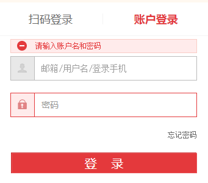
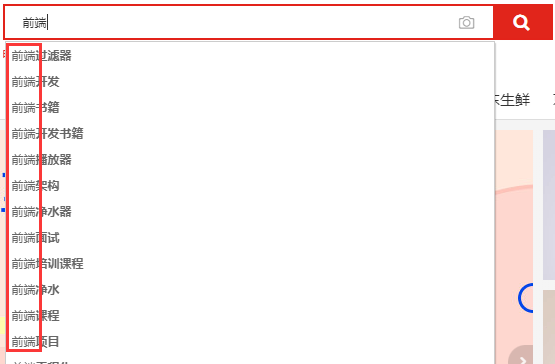
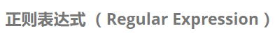
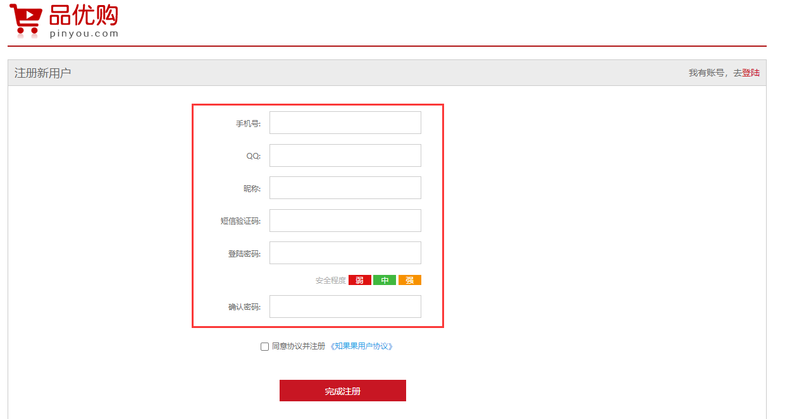
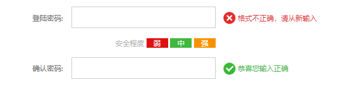
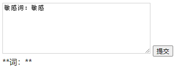

# JavaScript高级第04天（查表看得懂就足够了）

# 1 - 正则表达式 

目标：

1. 了解什么是正则表达式
2. 在JS中的应用
3. 正则表达式中的特殊字符
4. 正则表达式的替换操作

## 1.1 正则表达式的概念

> **正则表达式（ Regular Expression ）：**是用于匹配字符串中字符组合的模式。在JavaScript中，正则表达式也是**对象**。
>
> 正则表通常被用来检索、替换那些符合某个模式（规则）的文本

**实际作用：**

1. 匹配文本(查)：

   ​		例如验证表单：用户名表单只能输入英文字母、数字或者下划线， 昵称输入框中可以输入中文(匹配)；

   

2. 过滤文本(改)：

   ​		过滤掉页面内容中的一些敏感词(替换)；

3. 提取文本(切)：

   ​		从字符串中获取目标的特定部分文本(提取) ；



`注：其他语言也会使用正则表达式，但我们前端则使用 JavaScript 正则表达式完成表单验证。`

## 1.2 正则表达式的特点

1. 灵活性、逻辑性和功能性非常的强。
2. 可以迅速地用极简单的方式达到字符串的复杂控制。
3. 对于刚接触的人来说，比较晦涩难懂。比如：`^\w+([-+.]\w+)*@\w+([-.]\w+)*\.\w+([-.]\w+)*$`
4. 实际开发,一般都是**直接复制写好的正则表达式**，但是要求会使用正则表达式并且根据实际情况修改正则表达式.   比如用户名:   `/^[a-z0-9_-]{3,16}$/`


## 1.3 正则表达式在js中的使用

### 1.3.1 创建正则 - `new RegExp`

在 JavaScript 中，可以通过两种方式创建一个正则表达式。

**方式一：**利用`RegExp`对象的**构造函数**创建 



**CODE01**

```js
var regExp = new RegExp(/123/);
console.log(regExp);

console.log(typeof regExp);
```

**方式二：**利用字面量创建 正则表达式

```js
 var rg = /123/;
```

### 1.3.2 检测正则 - `test`

> test() 正则对象方法，用于检测字符串是否符合该规则，该对象会返回 true 或 false，其参数是测试字符串。

**CODE02**

```js
 var rg = /123/;
console.log(rg.test(123));//匹配字符中是否出现123  出现结果为true
console.log(rg.test('abc'));//匹配字符中是否出现123 未出现结果为false

// 思考：如果测试的是'123'字符串呢？
console.log(rg.test('123'));
```

## 1.4 正则表达式中的特殊字符

> 一个正则表达式可以由简单的字符构成，比如` /abc/`；
>
> 也可以是简单和特殊字符的组合，比如 `/ab*c/ `；
>
> 其中特殊字符也被称为元字符，在正则表达式中是具有特殊意义的专用符号，如 `^ 、$ 、+ `等。

特殊字符非常多，可以参考： 

LINK：[MDN正则特殊字符](https://developer.mozilla.org/zh-CN/docs/Web/JavaScript/Guide/Regular_Expressions)

`下面，分门别类的来介绍各常用特殊字符`

### 1.4.1 边界符 (`^ $`)

> 正则表达式中的边界符（位置符）用来提示字符所处的位置，主要有两个字符

| 边界符 | 说明                           |
| ------ | ------------------------------ |
| ^      | 表示匹配行首的文本（以谁开始） |
| $      | 表示匹配行尾的文本（以谁结束） |

如果 ^和 $ 在一起，表示必须是精确匹配。

**CODE03**

```js
var rg = /abc/; // 正则表达式里面不需要加引号 不管是数字型还是字符串型
// /abc/ 只要包含有abc这个字符串返回的都是true
console.log(rg.test('abc'));
console.log(rg.test('abcd'));
console.log(rg.test('aabcd'));
console.log('---------------------------');

// /^abc/ 开头必须以abc开头
var reg = /^abc/;
console.log(reg.test('abc')); // true
console.log(reg.test('abcd')); // true
console.log(reg.test('aabcd')); // false
console.log('---------------------------');

// /abc$/ 结尾必须以abc开头
var reg1 = /abc$/;
console.log(reg1.test('abc')); // true
console.log(reg1.test('abcd')); // false
console.log(reg1.test('aabc')); // true
console.log('---------------------------');

var reg2 = /^abc$/; // 精确匹配 要求必须是 abc字符串才符合规范
console.log(reg2.test('abc')); // true
console.log(reg2.test('abcd')); // false
console.log(reg2.test('aabcd')); // false
console.log(reg2.test('abcabc')); // false
```

### 1.4.2 字符类

> 字符类表示有**一系列字符**可供选择，只要匹配**其中一个**就可以了。所有可供选择的字符都放在方括号内。
>
> 简单来说就是更加模糊的匹配

#### 1.4.2.1 [] 方括号 (匹配模式)

>  表示有一系列字符可供选择，只要匹配其中一个就可以了

**CODE04**

```js
// 只要包含有a 或者 包含有b 或者包含有c 都返回为true
// 对比/abc/
var rg = /[abc]/;
console.log(rg.test('andy')); // true
console.log(rg.test('baby')); // true
console.log(rg.test('color')); // true
console.log(rg.test('red')); // false

// 三选一 只有是a 或者是b 或者是c 这三个字母才返回 true
var rg1 = /^[abc]$/; 
console.log(rg1.test('aa')); // false
console.log(rg1.test('a')); // true
console.log(rg1.test('b')); // true
console.log(rg1.test('c')); // true
console.log(rg1.test('abc')); // true

// 26个英文字母任何一个字母返回 true  - 表示的是a到z 的范围
var reg = /^[a-z]$/;
console.log(reg.test('a')); // true
console.log(reg.test('z')); // true
console.log(reg.test('A')); // false
```

**字符组合**

```js
// 大小写英文
var reg1 = /^[a-zA-Z]$/;
// 大小写英文+数字
var reg2 = /^[a-zA-Z0-9]$/;
// 大小写英文+数字+_-
var reg1 = /^[a-zA-Z0-9_-]$/;
console.log(reg1.test('a'));
console.log(reg1.test('B'));
console.log(reg1.test(8));
console.log(reg1.test('-'));
console.log(reg1.test('_'));
console.log(reg1.test('!'));
// 给正则加个!
var reg1 = /^[a-zA-Z0-9_-!]$/; // 报错
var reg1 = /^[a-zA-Z0-9!_-]$/; // 正确
// 原因: 有时候特殊符号组合起来是需要一定先后顺序的，遇到一个记一个
```

**取反： [^]方括号内加^**

```js
//取反 方括号内部加上 ^ 表示取反，只要包含方括号内的字符，都返回 false 。
var reg2 = /^[^a-zA-Z0-9]$/;
console.log(reg2.test('a'));
console.log(reg2.test('B'));
console.log(reg2.test(8));
console.log(reg2.test('!'));
```


> 思考： 上面[]方括号内的正则都只能检查一个字符，如果想要检查多个该怎么办呢？


#### 1.4.2.2 量词符

> 量词符用来设定某个模式出现的次数。

| 量词  | 说明            |
| ----- | --------------- |
| *     | 重复0次或更多次 |
| +     | 重复1次或更多次 |
| ?     | 重复0次或1次    |
| {n}   | 重复n次         |
| {n,}  | 重复n次或更多次 |
| {n,m} | 重复n到m次      |

1. \* 相当于 >= 0 可以出现0次或者很多次

   **CODE05**

   ```js
   var reg = /^a*$/;
   console.log(reg.test(''));
   console.log(reg.test('a'));
   console.log(reg.test('aa'));
   console.log(reg.test('aaaaaa'));
   
   // 对比一下下面的精准匹配
   var reg = /^a$/;
   console.log(reg.test('a'));
   console.log(reg.test('aa'));
   ```

2. \+ 相当于 >= 1 可以出现1次或者很多次

   ```js
   var reg = /^a+$/;
   console.log(reg.test(''));
   console.log(reg.test('a'));
   console.log(reg.test('aa'));
   console.log(reg.test('aaaaaa'));
   ```

3. ?  相当于 1 || 0， 只可以出现一次或0次

   ```js
   var reg = /^a?$/;
   console.log(reg.test(''));
   console.log(reg.test('a'));
   console.log(reg.test('aa'));
   console.log(reg.test('aaaaaa'));
   ```

4. { 3 } 需要重复3次

   ```js
   var reg = /^a{3}$/;
   console.log(reg.test(''));
   console.log(reg.test('a'));
   console.log(reg.test('aa'));
   console.log(reg.test('aaaaaa'));
   console.log(reg.test('aaa'));
   ```

5. { 3, }  大于等于3

   ```js
   var reg = /^a{3,}$/;
   console.log(reg.test(''));
   console.log(reg.test('a'));
   console.log(reg.test('aa'));
   console.log(reg.test('aaaaaa'));
   console.log(reg.test('aaa'));
   ```

6. {3, 16}  大于等于3 并且 小于等于16

   ```js
   var reg = /^a{3,16}$/;
   console.log(reg.test(''));
   console.log(reg.test('a'));
   console.log(reg.test('aa'));
   console.log(reg.test('aaaaaa'));
   console.log(reg.test('aaa'));
   console.log(reg.test('aaaaaaaaaaaaaaaaaaaaa'));
   ```

#### 1.4.2.3 匹配模式与量词的混合使用(输入验证)

> 问题： 创建用户名，要求长度在6~16位，且只能出现字母数字和`_-`
>
> **CODE06**

```js
//  量词可以设定某个模式出现的次数
var reg = /^[a-zA-Z0-9_-]{6,16}$/;
/* 
这个模式用户只能输入英文字母 数字 下划线 短横线但是有边界符和[]这就限定了只能多选1
通过量词来确定字符串中的每一个字符是否符合要求
{6,16} 中间不能有空格

一下内容既要满足 匹配模式 又要满足 数量限制 才会返回 true
*/
console.log(reg.test('a'));
console.log(reg.test('8'));
console.log(reg.test('18'));
console.log(reg.test('aa'));
console.log('-------------');
console.log(reg.test('andy-red'));
console.log(reg.test('andy_red'));
console.log(reg.test('andy007'));
console.log(reg.test('andy!007'));

```

#### 1.4.2.4 案例：用户名表单验证

**需求：**

1. 如果用户名输入合法, 则后面提示信息为:  用户名合法,并且颜色为绿色
2. 如果用户名输入不合法, 则后面提示信息为:  用户名不符合规范, 并且颜色为红色


**分析：**

1. 用户名只能为英文字母,数字,下划线或者短横线组成, 并且用户名长度为6~16位；

2. 首先准备好这种正则表达式模式 `/$[a-zA-Z0-9-_]{6,16}^/`；

3. 当表单失去焦点就开始验证；

4. 如果符合正则规范, 则让后面的span标签添加 right类；

5. 如果不符合正则规范, 则让后面的span标签添加 wrong类

   **CODE07**

```html
<style>
    span {
        color: #aaa;
        font-size: 14px;
    }

    .right {
        color: green;
    }

    .wrong {
        color: red;
    }
</style>
<body>
    <input type="text" class="uname">
    <span>请输入用户名</span>
</body>
```

**逻辑代码：**

```js
// 获取输入框
var uname = document.querySelector('.uname');
// 获取后面的提示信息
var span = document.querySelector('span');
// 创建正则
var reg = /^[a-zA-Z0-9_-]{6,16}$/;

// 给输入框添加失焦事件
uname.onblur = function() {
    // 正则判断
    if (reg.test(this.value)) {
        console.log('正确的');
        span.className = 'right'; // 修改类名
        span.innerHTML = '用户名格式输入正确'; // 修改提示文本
    } else {
        console.log('错误的');
        span.className = 'wrong'; // 修改类名
        span.innerHTML = '用户名格式输入不正确'; // 修改提示文本
    }
}
```

#### 1.4.2.5 括号总结

1. 中括号 字符集合。匹配方括号中的任意字符. 

   **CODE08**

   ```js
   // 表示abc中任意一个即可
   var reg = /^[abc]$/
   ```

2. 大括号  量词符.  里面表示重复次数

   ```js
   // 表示重复3个a
   var rag = /^a{3}$/
   
   var rag = /^abc{3}$/ // 它只是让c重复三次 精准匹配abccc
   ```

   > 思考： 如何让`abc`都重复3次呢？

3. 小括号表示优先级

   ```js
   var reg = /^(abc){3}$/; // 它是让abcc重复三次
   console.log(reg.test('abc'))
   console.log(reg.test('abcabcabc'))
   console.log(reg.test('abccc'))
   ```

[正则表达式在线测试](https://c.runoob.com/)

### 1.4.3 预定义类

>  预定义类指的是某些常见模式的简写方式


*辅助记忆： 大写就是取反*

> 练习：验证座机号
>
> 座机号格式： 010-12345678  或者  0530-1234567
>
> 也就是：先有3~4个数字，然后中横线`-`连接，最后7~8位数字

**CODE09**

```JS
// 方法一
// 补充： 正则表达式里也有或者符号 |
var reg = /^\d{3}-\d{8}|\d{4}-\d{7}$/;

// 方法二
var reg = /^\d{3,4}-\d{7,8}$/;
```

## 1.5 案例：表单验证





### 1.5.1 手机号验证

> `^(13[0-9]|14[5|7]|15[0|1|2|3|4|5|6|7|8|9]|18[0|1|2|3|5|6|7|8|9])\d{8}$`

分析：

1. 号码开头3位规则

   1. `13[0-9]` 
   2. `14[5|7]`
   3. `15[0|1|2|3|4|5|6|7|8|9]`
   4. `18[0|1|2|3|5|6|7|8|9]`

2. 后续8位

   1. `\d{8}`

      **CODE10**

```js
// 网页加载完毕后立刻执行的操作
window.onload = function () {
    // 手机号码的正则(精简版)
    var regTel = /^1[3|4|5|7|8]\d{9}$/; 
    // 获取手机号输入框的元素
    var tel = document.querySelector('#tel');
	// 失焦事件
    tel.onblur = function () {
        // 验证通过与不通过更换元素的类名与元素中的内容
        if (regTel.test(this.value)) {
            // nextElementSibling返回下一个兄弟元素
            this.nextElementSibling.className = 'success';
            this.nextElementSibling.innerHTML = '<i class="success_icon"></i> 恭喜您输入正确';
        } else {
            this.nextElementSibling.className = 'error';
            this.nextElementSibling.innerHTML = '<i class="error_icon"></i>格式不正确,请从新输入 ';
        }
    }
}
```

### 1.5.2 QQ验证

> /^[1-9]\d{4,}$/

分析： 开头不能是0，至少5位数

```js
window.onload = function () {
    // QQ的正则
    var regQq = /^[1-9]\d{4,}$/;
    // 获取手机号输入框的元素
    var qq = document.querySelector('#qq');
	qq.onblur = function () {
		// 验证通过与不通过更换元素的类名与元素中的内容
        if (regQq.test(this.value)) {
            // nextElementSibling返回下一个兄弟元素
            this.nextElementSibling.className = 'success';
            this.nextElementSibling.innerHTML = '<i class="success_icon"></i> 恭喜您输入正确';
        } else {
            this.nextElementSibling.className = 'error';
            this.nextElementSibling.innerHTML = '<i class="error_icon"></i>格式不正确,请从新输入 ';
        }
    }
}
```

### 1.5.3 封装事件函数

> 上面两个验证发现点击事件内的代码是一样的，那么封装成一个功能方法

```js
/*
* 创建验证方法
* @params ele 需要监听失焦事件的元素
* @params reg 正则规则
* 
* @ return null
*/
function regexp(ele, reg) {
    ele.onblur = function() {
        if (reg.test(this.value)) {
            this.nextElementSibling.className = 'success';
            this.nextElementSibling.innerHTML = '<i class="success_icon"></i> 恭喜您输入正确';
        } else {
            this.nextElementSibling.className = 'error';
            this.nextElementSibling.innerHTML = '<i class="error_icon"></i> 格式不正确，请从新输入 ';
        }
    }
};
```

```js
// 将电话和qq的验证改写一下
var regTel = /^1[3|4|5|7|8]\d{9}$/; // 手机号码的正则表达式
var regQq = /^[1-9]\d{4,}$/;

var tel = document.querySelector('#tel');
var qq = document.querySelector('#qq');

regexp(tel, regTel);
regexp(qq, regQq);
```

### 1.5.4 昵称

> `/^[\u4e00-\u9fa5]{2,8}$/`
>
> 注意：以上是中文的unicode编码，代表的是第一个中文的编码到最后一个中文的编码

分析： 需要输入2~8位的中文

```js
var regnc = /^[\u4e00-\u9fa5]{2,8}$/;
var nc = document.querySelector('#nc');
regexp(nc, regnc); // 昵称
```

### 1.5.5 短信验证

> `/^\d{6}$/`

分析： 6位任意数字

```js
var regmsg = /^\d{6}$/;
var msg = document.querySelector('#msg');
regexp(msg, regmsg); // 短信验证
```

### 1.5.6 密码验证

> `/^[a-zA-Z0-9_-]{6,16}$/`

分析：密码需要6~16位，英文数字或者下划线和中划线

```js
var regpwd = /^[a-zA-Z0-9_-]{6,16}$/;
var pwd = document.querySelector('#pwd');
regexp(pwd, regpwd); // 密码框
```

### 1.5.7 再次输入密码验证

> 只需要匹配上一次输入的密码框是否一致

```js
var surepwd = document.querySelector('#surepwd');
surepwd.onblur = function() {
    if (this.value == pwd.value) {
        this.nextElementSibling.className = 'success';
        this.nextElementSibling.innerHTML = '<i class="success_icon"></i> 恭喜您输入正确';
    } else {
        this.nextElementSibling.className = 'error';
        this.nextElementSibling.innerHTML = '<i class="error_icon"></i> 两次密码输入不一致';
    }
}
```

## 1.6 正则替换 - replace

> replace() 方法可以实现替换字符串操作，用来替换的参数可以是一个字符串或是一个正则表达式。

**替换字符串**

**CODE11**

```js
var str = 'andy和red';
var newStr = str.replace('andy', 'baby');
```

**替换正则**

```js
var str = 'andy和red';
var newStr = str.replace(/andy/, 'baby');
console.log(newStr);
```

**案例：过滤敏感词**

> 输入一串字符，点击提交，将里面的目标敏感词替换成*后显示在下面的div里



**CODE12**

```html
<style>
    textarea {
        width: 300px;
        height: 100px;
        border: 1px solid #ccc;
    }
</style>
<body>
    <textarea name="" id="message"></textarea> <button>提交</button>
    <div></div>
</body>
```

```js
// 获取控件元素
var text = document.querySelector('textarea');
var btn = document.querySelector('button');
var div = document.querySelector('div');
// 添加点击事件
btn.onclick = function () {
    div.innerHTML = text.value.replace(/敏感/, '**');
    // div.innerHTML = text.value.replace(/敏感|脱敏/, '**');
    // div.innerHTML = text.value.replace(/敏感|脱敏/g, '**');
}
```

`/g`：正则表达式后的"g"是一个表示全局搜索选项或标记，将在整个字符串查找并返回所有匹配结果。

### 1.6.1 正则表达式参数

> 语法： /正则/[switch]
>
> switch（也称为修饰符）表示按照什么模式来匹配

1. `g`：全局匹配
2. `i`：忽略大小写
3. `gi`：全局匹配且忽略大小写