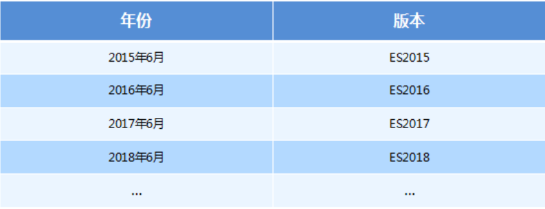
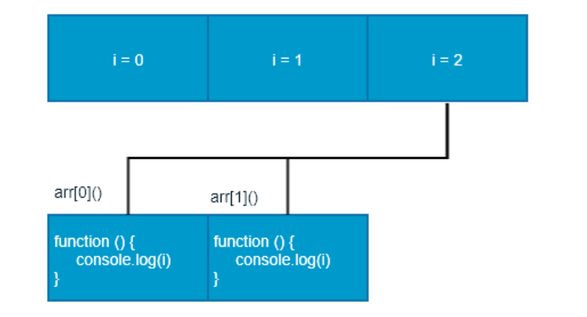
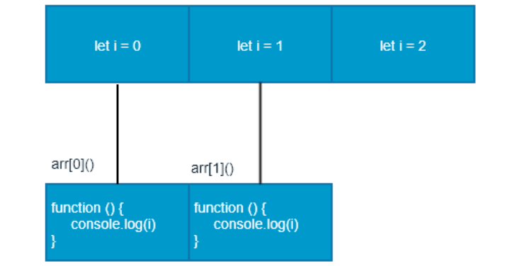
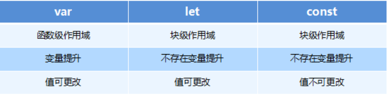
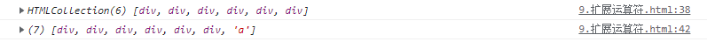

# JavaScript高级第05天 - ES6

> ES6 全称ECMAScript，由ECMA国际化标准化组织制定的脚本语言标准化规范
>
> ES6泛指ES2015版本及后续版本

目标：

1. **let、const两个新的声明变量**
2. **解构赋值**
3. **箭头函数**
4. **扩展运算符**
5. **各大实用方法**

# 1 - ES6相关概念（看个乐）

## 1.1 ES6的概念

> ES6泛指ES2015版本及后续版本（记住这句话就行了）

ES 的全称是 ECMAScript , 它是由 ECMA 国际标准化组织,制定的一项**脚本语言的标准化规范**。



**为什么使用 ES6** 

​		每一次标准的诞生都意味着语言的完善，功能的加强。JavaScript语言本身也有一些令人不满意的地方。

- 变量提升特性增加了程序运行时的不可预测性
- 语法过于松散，实现相同的功能，不同的人可能会写出不同的代码

# 2 - let （★★★★★）

> ES6中新增了用于声明变量的关键字， 让var直接退休

## 2.1 概念

**let** 语句声明一个块级作用域的本地变量，并且可选的将其初始化为一个值。

## 2.2 语法

```js
let var = value
```

## 2.3 参数

`var`：变量名。必须是合法的标识符。

`value`：变量的初始值。可以是任意合法的表达式。

## 2.4 描述

**`let`**允许你声明一个作用域被限制在 [`块`](https://developer.mozilla.org/zh-CN/docs/Web/JavaScript/Reference/Statements/block)级中的变量、语句或者表达式。与 [`var`](https://developer.mozilla.org/zh-CN/docs/Web/JavaScript/Reference/Statements/var) 关键字不同的是， [`var`](https://developer.mozilla.org/zh-CN/docs/Web/JavaScript/Reference/Statements/var)声明的变量只能是全局或者整个函数块的。 [`var`](https://developer.mozilla.org/zh-CN/docs/Web/JavaScript/Reference/Statements/var) 和 `let` 的不同之处在于后者是在编译时才初始化。

## 2.5 特点（★★★★★记！）

### 2.5.1 作用域规则 - 块级作用域

`let`声明的变量只在**其声明的块或子块中可用**，这一点，与`var`相似。二者之间最主要的区别在于使用`let`关键字声明的变量才具有块级作用域，使用`var`声明的变量不具备块级作用域特性。

```js
// 声明变量
let b = 20;
console.log(b)

// 块级作用域
if (true) {
    let b = 20;
    console.log(b) // 20
    if (true) {
        let c = 30;
    }
    console.log(c); // error: c is not defined
}
console.log(b) // error: b is not defined

// 对比var
if (true) {
    var b = 20;
    console.log(b) // 20
    if (true) {
        var c = 30;
    }
    console.log(c); // 30
}
console.log(b) // 20
```

**作用：可防止循环变量变成全局变量**

```js
for (let i = 0; i < 2; i++) {}
console.log(i);

// 对比var
for (var i = 0; i < 2; i++) {}
console.log(i);
```

### 2.5.2 没有变量提升

只有先声明，后使用

```js
console.log(a);
let a = 100; // error  a is not defined
```

### 2.5.3 重复声明

在同一个函数或块作用域中重复声明同一个变量会引起[`SyntaxError`](https://developer.mozilla.org/zh-CN/docs/Web/JavaScript/Reference/Global_Objects/SyntaxError)。

```js
 let foo;
 let foo; // SyntaxError thrown.
```

**在switch语句中只有一个块，可能因此出现错误**

```js
let x = 1;
switch(x) {
    case 0:
        let foo;
        break;

    case 1:
        let foo; // SyntaxError for redeclaration.
        break;
}

// 一个嵌套在 case 子句中的块会创建一个新的块作用域的词法环境，就不会产生上诉重复声明的错误。
let x = 1;

switch(x) {
    case 0: {
        let foo;
        break;
    }
    case 1: {
        let foo;
        break;
    }
}
```

### 2.5.4 暂时死区

与通过  `var` 声明的有初始化值 `undefined` 的变量不同，通过 `let` 声明的变量直到它们的**定义被执行时才初始化(没有变量声明提升)**。在变量初始化前访问该变量会导致 `ReferenceError`。该变量处在一个自块顶部到初始化处理的“暂存死区”中。

```js
 var tmp = 123;
 if (true) { 
     tmp = 'abc';
     let tmp; // ReferenceError
 } 
```

## 2.6 面试题了解let

```js
 var arr = [];
 for (var i = 0; i < 2; i++) {
     arr[i] = function () {
         console.log(i); 
     }
 }
 arr[0](); // ?
 arr[1](); // ?
```

> 思考： 执行结果是什么？
>
>  
>
> 答：var在全局作用域中，function执行时循环已经结束了，获取的都是2，一下是图解
>
> 问：如何解决呢？



**解决方案一： 通过立即执行函数构建函数作用域**

```js
var arr = [];
for (var i = 0; i < 2; i++) {
    (function (i) {
        arr[i] = function () {
            console.log(i); 
        }
    })(i)
}
 arr[0](); // ?
 arr[1](); // ?
```

**解决方案二： 使用let 具有块级作用域**

> 每次循环都会产生一个块级作用域，每个块级作用域中的变量都是不同的，函数执行时输出的是自己上一级（循环产生的块级作用域）作用域下的i值

```js
 let arr = [];
 for (let i = 0; i < 2; i++) {
     arr[i] = function () {
         console.log(i); 
     }
 }
 arr[0]();
 arr[1]();
```



# 3 - const (★★★★★)

> 声明常量，常量就是值（内存地址）不能变化的量

## 3.1 概念

​		常量是块级范围的，非常类似用 [let](https://developer.mozilla.org/zh-CN/docs/Web/JavaScript/Reference/Statements/let) 语句定义的变量。但常量的值是无法（通过重新赋值）改变的，也不能被重新声明。（简单理解：固定了栈内存）

## 2.2 语法

```js
const NAME_1 = value
```

## 2.3 参数

`NAME_1`：变量名。必须是合法的标识符。

`value`：变量的初始值。可以是任意合法的表达式。

## 2.4 描述

​		此声明创建一个常量，其作用域可以是全局或本地声明的块。 与`var`变量不同，全局常量不会变为 window 对象的属性。需要一个常数的初始化器；也就是说，**必须在声明的同一语句中指定它的值（这是有道理的，因为以后不能更改）**。

​	**`const`声明**创建一个值的**只读引用**。但这并不意味着它所持有的值是不可变的，只是变量标识符不能重新分配(可以改堆内存)。例如，在引用内容是对象的情况下，这意味着可以改变对象的内容（例如，其参数）。

## 2.5 特点 (★★★★★ - 与let非常相似)

### 2.5.1 基本写法

常量在声明的时候可以使用大小写，但通常情况下全部用**大写字母。**

```js
// 定义常量MY_FAV并赋值7
const MY_FAV = 7;
```

### 2.5.2 声明常量时必须赋值

```js
const MY_FAV // 'const' declarations must be initialized.
// Missing initializer in const declaration
```

### 2.5.3 重新声明会报错

```js
const MY_FAV = 7;
const MY_FAV = 8; // error Identifier 'MY_FAV' has already been declared
```

### 2.5.4 块级作用域

> 注意块作用域的性质很重要

```js
if (true) {
    const a = 10;
    if (true) {
        const a = 20;
        console.log(a);
    }
    console.log(a);
}
console.log(a);
```

### 2.5.5 暂时死区

```js
 var tmp = 123;
 if (true) { 
     console.log(num);
     const tmp; // ReferenceError
 } 
```

### 2.5.6 赋值引用类型

> 常量可以定义成对象和数组

```js
const MY_OBJECT = {'key': 'value'};

// 重写对象和上面一样会失败
// Uncaught TypeError: Assignment to constant variable.
MY_OBJECT = {'OTHER_KEY': 'value'};

// 但对象属性并不在保护的范围内
// 下面这个声明会成功执行
MY_OBJECT.key = 'otherValue';


// 也可以用来定义数组
const MY_ARRAY = [];
// 可以向数组填充数据
MY_ARRAY.push('A'); // ["A"]
// 但是，将一个新数组赋给变量会引发错误
// Uncaught TypeError: Assignment to constant variable.
MY_ARRAY = ['B'];
```

# 4 - var、let、const的区别

1. 使用 `var` 声明的变量，其作用域为该语句所在的函数内，且存在**变量提升现象**
2. 使用 `let` 和 `const` 声明的变量，其作用域为该语句所在的**代码块**内（块级作用域），不存在变量提升
3. `const`拥有`let`的全部特性
4. 使用 `const` 声明的是常量，必须在声明时赋值，在后面出现的代码中不能再修改该常量的值(**修改栈内存**)，并且建议const变量全部大写



# 5 - 解构赋值(★★★)

## 5.1 概念

​		**解构赋值**语法是一种 Javascript 表达式。通过**解构赋值,** 可以将属性/值从对象/数组中取出,赋值给其他变量。

## 5.2 语法

```js
// 数组解构
// 数组解构允许我们按照一一对应的关系从数组中提取值 然后将值赋值给变量
let a, b, rest;
[a, b] = [10, 20];
console.log(a); // 10
console.log(b); // 20

[a, b, ...rest] = [10, 20, 30, 40, 50];
console.log(a); // 10
console.log(b); // 20
console.log(rest); // [30, 40, 50]

// 对象解构
// 对象解构允许我们使用变量的名字匹配对象的属性 匹配成功 将对象属性的值赋值给变量
// 写法一
let a, b;
({ a, b } = { a: 10, b: 20 });
// 写法二
let { a, b } = { a: 10, b: 20 };
console.log(a); // 10
console.log(b); // 20

let rest;
// Stage 4（已完成）提案中的特性
({ a, b, ...rest } = { a: 10, b: 20, c: 30, d: 40 });
console.log(a); // 10
console.log(b); // 20
console.log(rest); // { c: 30, d: 40 }
```

## 5.3 描述

​		对象和数组逐个对应表达式，或称对象字面量和数组字面量，提供了一种简单的定义**一个特定的数据组的方法。**

​		解构赋值使用了相同的语法，不同的是在表达式左边定义了要从原变量中取出什么变量。

```js
let x = [1, 2];
let [y, z, w] = x;
console.log(y); // 1
console.log(z); // 2
console.log(w); // undefined
```

## 5.4 解构数组

### 5.4.1 变量声明并赋值时的解构

```js
let foo = ["one", "two", "three"];

let [one, two, three] = foo;
console.log(one); // "one"
console.log(two); // "two"
console.log(three); // "three"
```

### 5.4.2 变量声明后赋值时的解构

> 通过解构分离变量的声明，可以为一个变量赋值。

```js
let a, b;

[a, b] = [1, 2];
console.log(a); // 1
console.log(b); // 2
```

### 5.4.3 默认值

> 为了防止从数组中取出一个值为`undefined`的对象，可以在表达式左边的数组中为任意对象预设默认值。

```js
let a, b;

[a=5, b=7] = [1];
console.log(a); // 1
console.log(b); // 7
```

### 5.4.4 交换变量

> 在一个解构表达式中可以交换两个变量的值。
>
> 没有解构赋值的情况下，交换两个变量需要一个临时变量

```js
let a = 1;
let b = 3;

[a, b] = [b, a];
console.log(a); // 3
console.log(b); // 1
```

### 5.4.5 解析一个从函数返回的数组

> 从一个函数返回一个数组是十分常见的情况。解构使得处理返回值为数组时更加方便。
>
> 在下面例子中，要让 `[1, 2]` 成为函数的 `f()` 的输出值，可以使用解构在一行内完成解析。
>
>  
>
> 后续学习接口接收后端返回参数时，时常用到

```js
function f() {
  return [1, 2];
}

let a, b;
[a, b] = f();
console.log(a); // 1
console.log(b); // 2
```

### 5.4.6 忽略某些返回值

> 你也可以忽略你不感兴趣的返回值：

```js
function f() {
  return [1, 2, 3];
}

let [a, , b] = f();
console.log(a); // 1
console.log(b); // 3
```

**也可以忽略全部返回值**

```js
[,,] = f();
```

### 5.4.7 将剩余数组赋值给一个变量 （与剩余参数结合使用）

> 当解构一个数组时，可以使用剩余模式，将数组剩余部分赋值给一个变量。

```js
let [a, ...b] = [1, 2, 3];
console.log(a); // 1
console.log(b); // [2, 3]
```

**注意：如果剩余元素右侧有逗号，会抛出 [`SyntaxError`](https://developer.mozilla.org/zh-CN/docs/Web/JavaScript/Reference/Global_Objects/SyntaxError)，因为剩余元素必须是数组的最后一个元素。**

```js
let [a, ...b,] = [1, 2, 3];
// SyntaxError: rest element may not have a trailing comma
```


## 5.5 解构对象

### 5.5.1 基本赋值

```js
let o = {p: 42, q: true};
let {p, q} = o;

console.log(p); // 42
console.log(q); // true
```

### 5.5.2 无声明赋值

> 一个变量可以独立于其声明进行解构赋值。

```js
let a, b;

({a, b} = {a: 1, b: 2});
```

注意：

1. 赋值语句周围的圆括号 `( ... )` 在使用对象字面量无声明解构赋值时是必须的。
2. `{a, b} = {a: 1, b: 2}` 不是有效的独立语法，因为左边的 `{a, b}` 被认为是一个块而不是对象字面量。
3. 然而，`({a, b} = {a: 1, b: 2})` 是有效的，正如 `var {a, b} = {a: 1, b: 2}`
4.  `( ... )` 表达式之前需要有一个分号，否则它可能会被当成上一行中的函数执行

```js
// 第4点
function fn () {}
let a, b
let f = fn
({a, b} = {a: 1, b: 2})
// let f = fn({a, b} = {a: 1, b: 2})
```

### 5.5.3 给新的变量赋值

> 可以从一个对象中提取变量并赋值给和对象属性名不同的新的变量名。

```js
let o = {p: 42, q: true};
let {p: foo, q: bar} = o;

console.log(foo); // 42
console.log(bar); // true 
```

### 5.5.4 默认值

> 变量可以先赋予默认值。当要提取的对象对应属性解析为 undefined，变量就被赋予默认值。

```js
let {a = 10, b = 5} = {a: 3};

console.log(a); // 3
console.log(b); // 5
```

### 5.5.5 给新变量重新命名并提供默认值

> 一个属性可以同时 1）从一个对象解构，并分配给一个不同名称的变量 2）分配一个默认值，以防未解构的值是 `undefined`。

```js
let {a:aa = 10, b:bb = 5} = {a: 3};

console.log(aa); // 3
console.log(bb); // 5
```

### 5.5.6 函数参数默认值

es5版本（老版本）

```js
function drawES5Chart(options) {
  options = options === undefined ? {} : options;
  var size = options.size === undefined ? 'big' : options.size;
  var cords = options.cords === undefined ? { x: 0, y: 0 } : options.cords;
  var radius = options.radius === undefined ? 25 : options.radius;
  console.log(size, cords, radius);
  // now finally do some chart drawing
}

drawES5Chart({
  cords: { x: 18, y: 30 },
  radius: 30
});
```

es6版本（目前版本）

```js
function drawES2015Chart({size = 'big', cords = { x: 0, y: 0 }, radius = 25} = {})
{
  console.log(size, cords, radius);
  // do some chart drawing
}

drawES2015Chart({
  cords: { x: 18, y: 30 },
  radius: 30
});
```

# 6 - 剩余参数 - `...`

## 6.1 概念

​		**剩余参数**语法允许我们将一个不定数量的参数表示为一个数组。

## 6.2 语法

```js
function fn (a, b, ...theArgs) {
  // ...
}

// 示例
function fn (a, b, ...theArgs) {
  console.log(a); // 1
  console.log(b); // 2
  console.log(theArgs); // [3, 4, 5]
}
fn([1, 2, 3, 4, 5])
```

## 6.3 描述

​		如果函数的最后一个命名参数以`...`为前缀，则它将成为一个由剩余参数组成的真数组，其中从`0`（包括）到`theArgs.length`（排除）的元素由传递给函数的实际参数提供。

​		在上面的例子中，`theArgs`将收集该函数的第三个参数（因为第一个参数被**映射**到`a`，而第二个参数映射到`b`）和所有后续参数。

**剩余参数和`argument`对象的区别**

1. 剩余参数只包含那些没有对应形参的实参，而 `arguments` 对象包含了传给函数的所有实参。
2. `arguments`对象不是一个真正的数组，而剩余参数是真正的 `Array`实例，也就是说你能够在它上面直接使用所有的数组方法，比如 `sort`，`map`，`forEach`或`pop`。
3. `arguments`对象还有一些附加的属性 （如`callee`属性）。

```js
function fn1 (a, b) {
    console.log(a, b)
	console.log(arguments)
}

function fn2 (a, b, ...theArgs) {
    console.log(a, b)
	console.log(theArgs)
}

fn1(1, 2, 3, 4, 5);
fn2(1, 2, 3, 4, 5);
```

# 7 - 箭头函数(★★★★★)

> 作用：简化函数

## 7.1 概念

​		**箭头函数表达式**的语法比函数表达式更简洁，并且没有自己的`this`，`arguments`，`super`或`new.target`。箭头函数表达式更适用于那些本来需要匿名函数的地方，并且**它不能用作构造函数**。

## 7.2 语法

### 7.2.1 基础语法

```js
// 写法一: 基本写法
(param1, param2, …, paramN) => { statements }

// 写法二: 如果函数中只有一行代码，并且这行代码就是函数的返回值
(param1, param2, …, paramN) => expression
//相当于：(param1, param2, …, paramN) =>{ return expression; }

// 写法三: 当只有一个参数时，圆括号是可选的：
(singleParam) => { statements }
singleParam => { statements }

// 写法四: 没有参数的函数应该写成一对圆括号。
() => { statements }
```

## 7.2.2 高级写法

```js
// 加括号的函数体返回对象字面量表达式：
params => ({ foo: bar})
//相当于：(params) =>{ return { foo: bar } }

// 支持剩余参数和默认参数
(param1, param2, ...rest) => { statements }
(param1 = defaultValue1, param2, …, paramN = defaultValueN) => { statements }

// 同样支持参数列表解构
let f = ([a, b] = [1, 2], {x: c} = {x: a + b}) => a + b + c;
f();  // 6
```

### 7.3 描述(this指向特点)

引入箭头函数有两个方面的作用：更简短的函数并且不绑定`this`。**指向的是函数定义位置上下文的this**

```js
let num = 1;

function fn (element) {
  return element + 1;
}; // 返回值为 2
fn(num)

// 方法一: 上面的普通函数可以改写成如下的箭头函数
let fn1 = (element) => {
  return element + 1;
}; // 2
fn1(num)

// 方法二: 当箭头函数的函数体只有一个 `return` 语句时，可以省略 `return` 关键字和方法体的花括号
let fn2 = (element) => element + 1; // 2
fn2(num)

// 方法三: 当箭头函数只有一个参数时，可以省略参数的圆括号
let fn3 = element => {
 return element + 1;
} // 2
fn3(num)
```

## 7.4 this指向 （箭头函数没有单独的this）

**复习：**在箭头函数出现之前，每一个新函数根据它是被如何调用的来定义这个函数的this值：

- 如果该函数是一个构造函数，this指针指向一个新的对象
- 在严格模式下的函数调用下，this指向`undefined`
- 如果该函数是一个对象的方法，则它的this指针指向这个对象


**箭头函数不绑定this关键字，箭头函数中的this，指向的是函数定义位置的上下文this**

```js
const obj = { name: '张三'} 
function fn () { 
    console.log(this); // this 指向 是obj对象
    return () => { 
        console.log(this);//this 指向 的是箭头函数定义的位置，那么这个箭头函数定义在fn里面，而这个fn指向是的obj对象，所以这个this也指向是obj对象
    } 
} 
const resFn = fn.call(obj); 
resFn();
```

## 7.5 总结

1. **箭头函数中不绑定this**，箭头函数中的this指向是它所定义的位置，可以简单理解成，定义箭头函数中的作用域的this指向谁，它就指向谁
2. 箭头函数的优点在于解决了this执行环境所造成的一些问题。比如：**解决了匿名函数this指向的问题**（匿名函数的执行环境具有全局性），包括setTimeout和setInterval中使用this所造成的问题

```js
function Person () {
    // Person() 构造函数定义 `this`作为它自己的实例.
    this.age = 0;

    setTimeout(function growUp () {
        // 在非严格模式, growUp ()函数定义 `this`作为全局对象,
        // 与在 Person()构造函数中定义的 `this`并不相同.
        // 此时需要创建that，通过将this值分配给封闭的变量，可以解决this问题。
        this.age++;
    }, 1000);
}

let p = new Person(); // 0

// 箭头函数不会创建自己的this, 它只会从自己的作用域链的上一层继承this。因此，在下面的代码中，传递给setTimeout的函数内的this与封闭函数中的this值相同：
function Person(){
    this.age = 0;

    setTimeout(() => {
        this.age++; // |this| 正确地指向 p 实例
    }, 1000);
}

let p = new Person(); // 1
```

## 7.6 箭头函数面试题

一下代码输出的是什么？

```js
let age = 100;

let obj = {
    age: 20,
    say: () => {
        alert(this.age)
    },
    say2: function () {
        alert(this.age)
    }
}

obj.say(); // 输出什么？
obj.say2(); // 输出什么？
// 箭头函数this指向的是被声明的作用域里面，而对象没有作用域的，所以箭头函数虽然在对象中被定义，但是this指向的是全局作用域
```

# 8 - 扩展运算符 - `...`

## 8.1 概念

​		扩展运算符可以将数组或者对象转为用逗号分隔的参数序列

## 8.2 语法

```js
let arr = [value1, value2, value3 ...]
...arr // => 输出 value1, value2, value3 ...
```

## 8.3 描述 （扩展运算符 与 剩余参数的区别）

> **扩展运算符**是将数组拆成独立的个体
>
> **剩余参数**是将独立的个体整合成一个数组

```js
let ary = [1, 2, 3];
...ary  // 1, 2, 3
console.log(...ary.toString()); // 逗号分隔的参数序列
console.log(...ary); // 1 2 3,相当于下面的代码
console.log(1, 2, 3);
```


## 8.4 作用

### 8.4.1 合并数组

```js
// 方法一 
let ary1 = [1, 2, 3];
let ary2 = [3, 4, 5];
let ary3 = [...ary1, ...ary2];

// 方法二 
ary1.push(...ary2);

// 方法三
let ary4 = ary1.concat(ary2);
```

### 8.4.2 将伪数组转换为真正的数组

**html**

```html
<div>1</div>
<div>4</div>
<div>3</div>
<div>6</div>
<div>2</div>
<div>5</div>
```

**js**

```js
let oDivs = document.getElementsByTagName('div');
console.log(oDivs);
oDivs.push('a'); // error  oDivs.push is not a function
// 转换成真正的数组
oDivs = [...oDivs];
console.log(oDivs);
```



# 9 - Array扩展功能

## 9.1 Array.from() - 创建新数组

### 9.1.1 概念

​		`Array.from()` 方法对一个类数组或可迭代对象(伪数组)创建一个新的，**浅拷贝**的数组实例。

### 9.1.2 语法

```js
Array.from(arrayLike, mapFn);
```

### 9.1.3 参数

`arrayLike`

​		想要转换成数组的伪数组对象或可迭代对象。

`mapFn` 可选

​		如果指定了该参数，新数组中的每个元素会执行该回调函数

### 9.1.4 返回值

​		一个新的数组实例

### 9.1.5 描述

`Array.from()` 可以通过以下方式来创建数组对象：

- 伪数组对象（拥有一个 `length` 属性和若干索引属性的任意对象）

- [可迭代对象](https://developer.mozilla.org/zh-CN/docs/Web/JavaScript/Reference/Iteration_protocols)（可以获取对象中的元素,如 Map和 Set 等）

  ​	`Array.from()` 方法有一个可选参数 `mapFn`，让你可以在最后生成的数组上再执行一次 [`map`](https://developer.mozilla.org/zh-CN/docs/Web/JavaScript/Reference/Global_Objects/Array/map) 方法后再返回。也就是说` Array.from(obj, mapFn) `就相当于` Array.from(obj).map(mapFn)`

```js
// 伪数组
let arrayLike = {
    "0": "1",
    "1": "2",
    "length": 2
}

let ary1 = Array.from(arrayLike);
console.log(ary1);

let ary2 = Array.from(arrayLike, item => item * 2)
console.log(ary2)
```

## 9.2 find() - 找目标元素

### 9.2.1 概念

 		`find()` 方法返回数组中满足提供的测试函数的**第一个元素**的值。否则返回 `undefined`。

### 9.2.2 语法

```js
arr.find(callback)
```

### 9.2.3 参数

`callback`: 在数组每一项上执行的函数，接收 3 个参数：

- `element`

  当前遍历到的元素。

- `index`可选

  当前遍历到的索引。

- `array`可选

  数组本身。

### 9.2.4 返回值

​		数组中第一个满足所提供测试函数的元素的值，否则返回 `undefined`。

### 9.2.5 描述

​		`find`方法对数组中的每一项元素执行一次 `callback` 函数，直至有一个 `callback` 返回 `true`。当找到了这样一个元素后，该方法会**立即返回**这个元素的值，否则返回  `undefined`。注意 `callback `函数会为数组中的每个索引调用即从 `0 `到 `length - 1`，而不仅仅是那些被赋值的索引，这意味着对于稀疏数组来说，该方法的效率要低于那些只遍历有值的索引的方法。

```js
let ary = [
    {
        id: 1,
        name: '张三'
    },
    {
        id: 2,
        name: '李四'
    }
];
let target = ary.find(item => item.id === 2);
console.log(target) // {id: 2, name: '李四'}

let target2 = ary.find(item => item.id === 3);
console.log(target2) // undefined
```

## 9.3 findIndex() - 找目标元素的索引

### 9.3.1 概念

 		`findIndex()`方法返回数组中满足提供的测试函数的第一个元素的**索引**。若没有找到对应元素则返回-1。

### 9.3.2 语法

```js
arr.findIndex(callback)
```

### 9.3.3 参数

`callback`: 在数组每一项上执行的函数，接收 3 个参数：

- `element`

  当前遍历到的元素。

- `index`可选

  当前遍历到的索引。

- `array`可选

  数组本身。

### 9.3.4 返回值

​		数组中通过提供测试函数的第一个元素的**索引**。否则，返回-1

### 9.3.5 描述

​		`findIndex`方法对数组中的每个数组索引`0..length-1`（包括）执行一次`callback`函数，直到找到一个`callback`函数返回真实值（强制为`true`）的值。如果找到这样的元素，`findIndex`会立即返回该元素的索引。如果回调从不返回真值，或者数组的`length`为0，则`findIndex`返回-1。

```js
let ary = [10, 20, 50];
let index = ary.findIndex(item => item > 15);
console.log(index)
```

### 9.3.6 indexOf() 与 findIndex() 的区别

- `indexOf` ：查找值作为第一个参数，采用 `===` 比较，更多的是用于查找基本类型，如果是对象类型，则是判断是否是同一个对象的引用

  ```js
  const sisters = ['a', 'b', 'c', 'd', 'e'];
  console.log(sisters.indexOf('b'));
  ```

- `findIndex` ：比较函数作为第一个参数，多用于非基本类型(例如对象)的数组索引查找，或查找条件很复杂

## 9.4 includes() - 判断是否包含特定元素

### 9.4.1 概念

 		`includes()` 方法用来**判断一个数组是否包含一个指定的值**，根据情况，如果包含则返回 `true`，否则返回 `false`。

### 9.4.2 语法

```js
arr.includes(valueToFind, fromIndex)
```

### 9.4.3 参数

`valueToFind`：需要查找的元素值。

*注意：使用 `includes()`比较字符串和字符时是区分大小写的。*

`fromIndex`：

​		从`fromIndex` 索引处开始查找 `valueToFind`。如果为负值，则按升序从 `array.length + fromIndex` 的索引开始搜 （即使从末尾开始往前跳 `fromIndex` 的绝对值个索引，然后往后搜寻）。默认为 0。

### 9.4.4 返回值

返回一个布尔值 `Boolean` 如果在数组中（或 `fromIndex` 指定的范围中）找到了 `valueToFind`，则返回 `true`，否则返回 `false`。

### 9.4.5 描述

```js
[1, 2, 3].includes(2);     // true
[1, 2, 3].includes(4);     // false
[1, 2, 3].includes(3, 3);  // false
[1, 2, 3].includes(3, -1); // true
[1, 2, NaN].includes(NaN); // true
```

# 10 - String扩展方法

## 10.1 模板字符串 - ` `` `

### 10.1.1 概念

​		模板字面量 是允许嵌入表达式的字符串字面量。你可以使用多行字符串和字符串插值功能。它们在ES2015规范的先前版本中被称为“模板字符串”。

### 10.1.2 语法

```js
let str = `string text`

let str = `string text line 1
let str =  string text line 2`

let str = `string text ${expression} string text`
```

### 10.1.3 描述

		1. 模板字符串使用反引号 (` `` `) 来代替普通字符串中的用双引号和单引号。
  		2. 模板字符串可以包含特定语法（`${expression}`）的占位符。占位符中的表达式和周围的文本会一起传递给一个默认函数，该函数负责将所有的部分连接起来
        		3. 在模版字符串内使用反引号（`）时，需要在它前面加转义符（\）。

### 10.1.4 特点

1. 模板字符串可以解析变量

   ```js
   let name = '张三'; 
   let sayHello = `hello,my name is ${name}`; // hello, my name is zhangsan
   ```

2. 模板字符串中可以换行

   ```js
   let result = { 
       name: 'zhangsan', 
       age: 20,
       sex: '男' 
   } 
   let html = `<div>
   <span>${result.name}</span>
   <span>${result.age}</span>
   <span>${result.sex}</span>
   </div>`;
   
   console.log(html)
   
   // es5的古老写法
   console.log('string text line 1\n' + 'string text line 2');
   ```

3. 在模板字符串中可以调用函数

   ```js
   const goFun = function () { 
       return '函数调用！';
   }; 
   let str = `函数调用了吗？ ${goFun()}`;
   console.log(str); // 函数调用了吗？函数调用！
   ```

## 10.2 startsWith() 和 endsWith()

### 10.2.1 概念

- `startsWith()` 方法用来判断当前字符串是否以另外一个给定的子字符串**开头**，并根据判断结果返回 `true` 或 `false`。
- `endsWith()` 方法用来判断当前字符串是否以另外一个给定的子字符串**结尾**，并根据判断结果返回 `true` 或 `false`。

### 10.2.2 语法

```js
str.startsWith(searchString, position)
str.endsWith(searchString, position)
```

### 10.2.3 参数

`searchString`：要搜索的子字符串。

`position` 可选：在 `str` 中搜索 `searchString` 的开始位置，默认值为 0。

### 10.2.4 返回值

​		如果在字符串的开头找到了给定的字符则返回**`true`**；否则返回**`false`**。

### 10.2.5 描述

​		这个方法能够让你确定一个字符串是否以另一个字符串开头。这个方法区分大小写。

```js
let str = "To be, or not to be, that is the question.";

alert(str.startsWith("To be"));         // true
alert(str.startsWith("not to be"));     // false
alert(str.startsWith("not to be", 10)); // true
```

## 10.3 repeat() - 重复字符串

### 10.3.1 概念

​		**`repeat()`** 构造并返回一个新字符串，该字符串包含被连接在一起的指定数量的字符串的副本。

### 10.3.2 语法

```js
str.repeat(count)
```

### 10.3.3 参数

`count`：介于 `0` 和 [`+Infinity`](https://developer.mozilla.org/zh-CN/docs/Web/JavaScript/Reference/Global_Objects/Number/POSITIVE_INFINITY) 之间的整数。表示在新构造的字符串中重复了多少遍原字符串。

### 10.3.4 返回值

 包含指定字符串的指定数量副本的新字符串。

### 10.3.5 描述

```js
'x'.repeat(3)      // "xxx" 
'hello'.repeat(2)  // "hellohello"
```

# 11 - Set 数据结构

> **`Set`** 对象允许你存储任何类型的**唯一值**，无论是原始值或者是对象引用。

## 11.1 概念

​		`Set`对象是值的集合，你可以按照插入的顺序迭代它的元素。 Set中的元素只会**出现一次**，即 Set 中的元素是唯一的

​		*注意： `NaN`和`undefined`都可以被存储在Set 中， `NaN`之间被视为相同的值（NaN被认为是相同的，尽管 NaN !== NaN）。*

## 11.2 语法

```js
const s = new Set();

// Set函数可以接受一个数组作为参数，用来初始化。
const set = new Set([1, 2, 3, 4, 4]); // {1, 2, 3, 4}
```

## 11.3 实例属性

`Set.prototype.size`：返回 Set 对象中的值的个数

```js
const set = new Set([1, 2, 3, 4, 4]);
console.log(set.size)
```


## 11.3 实例方法

- add(value)：在`Set`对象尾部添加一个元素。返回该`Set`对象；
- has(value)：返回一个布尔值，表示该值在`Set`中存在与否；
- delete(value)：移除`Set`中与这个值相等的元素，返回`Set.prototype.has(value)`在这个操作前会返回的值（即如果该元素存在，返回`true`，否则返回`false`）。`Set.prototype.has(value)`在此后会返回`false`；
- clear()：移除`Set`对象内的所有元素，没有返回值；

```js
const s4 = new Set();
// 向set结构中添加值 使用add方法
s4.add('a')
s4.add('b')
s4.add('c').add('d')
console.log(s4.size)

// 从set结构中删除值 用到的方法是delete
const r1 = s4.delete('c');
console.log(s4.size)
console.log(r1);

// 判断某一个值是否是set数据结构中的成员 使用has
const r2 = s4.has('d');
console.log(r2)

// 清空set数据结构中的值 使用clear方法
s4.clear();
console.log(s4.size);
```

## 11.4 应用

 1. 网页搜索关键字， 重复的内容并不会记录

 2. 数组去重，方法如下

    ```js
    let arr = [1, 2, 3, 4, 5, 5, 5, 5, 5, 6]
    
    let set = new Set(arr)
    console.log(set)
    
    // 方法一: 扩展运算符
    arr = [...set]
    console.log(arr)
    
    // 方法二: 使用Array.from() 见9.1.5 
    let ary1 = Array.from(set)
    ```


## 11.5 Set遍历 

>  Set 结构的实例与数组一样，也拥有forEach方法，用于对每个成员执行某种操作，没有返回值。

```js
let s = new Set([1, 2, 3, 4, 5, 5, 5, 5, 5, 6])
s.forEach(value => console.log(value))
```

