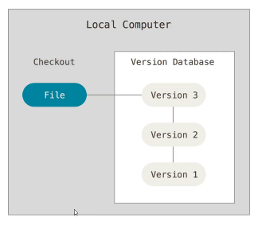
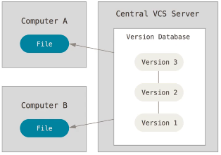
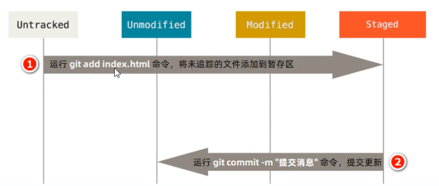

# GIT第一天

目标： 

1. 掌握git基本命令的使用
2. 学会创建远程代码仓库
3. 学会git分支的使用

# 一. 版本控制（端好茶杯听故事）

**给你们看看爷的毕设历程**


1. **操作麻烦：** 没出都需要复制 → 粘贴 → 重命名
2. **命名不规范：**无法通过文件名知道具体做了哪些修改
3. **容易丢失：**如果硬盘故障和不小心删除，文件很容易丢失
4. **协作困难：** 需要手动合并每一个人对项目文件的修改，合并时及其容易出错


## 1.1 版本控制软件

> 说白了就是把文件丢网上通过每次上传时候文件的差异性对比来表现不同的版本

概念： 版本控制软件是一个用来记录文件变化，以便将来查阅特定版本修订情况的系统，因此有时也叫做“**版本控制系统**”。

优势：

1. 操作简便：只需识记几组简单的**终端命令**，即可快速上手常见的版本控制软件
2. 易于对比：基于版本控制软件提供的功能，能够方便地比较文件的变化细节，从而查找出导致问题的原因
3. 易于回溯：可以将选定的文件回溯到之前的状态，甚至将整个项目都回退到过去某个时间点的状态
4. 不易丢失：在版本控制软件中，被用户误删除的文件，可以轻松的恢复回来
5. 协作方便：基于版本控制软件提供的**分支**功能，可以轻松实现多人协作开发时的代码合并操作

## 1.2 版本控制系统分类


### 1.2.1 本地版本控制系统

> 自娱自乐控制系统

**特点：**使用软件来记录文件的不同版本，提高了工作效率，降低了手动维护版本的出错率



**缺点：**

1. 单机运行，不支持多人协作开发
2. 版本数据库故障后，所有历史更新记录会丢失

### 1.2.2 集中化版本控制系统

> 代表作品：SVN
>
> 思考： 为什么它会被取缔？

**特点：**基于**服务器、客户端**的运行模式

1. 服务器保存文件的所有更新记录
2. 客户端只保留最新的文件版本



**优点：**联网运行，支持多人协作开发

**缺点：**

1. 不支持离线提交版本更新
2. 中心服务器崩溃后，所有人无法正常工作
3. 版本数据库故障后，所有历史更新记录会丢失

### 1.2.3 分布式版本控制系统

> `github`、`gitlub`

**特点：**基于服务器、客户端的运行模式

1. 服务器保存文件的所有更新版本
2. **客户端是服务器的完整备份**，并不是只保留文件的最新版本


**优点：**

1. 联网运行，支持多人协作开发
2. 客户端断网后支持离线本地提交版本更新
3. 服务器故障或损坏后，可使用任何一个客户端的备份进行恢复

# 二. GIT (二回书说到。。。)

> Git 是一个开源的分布式版本控制系统，是目前世界上最先进、最流行的版本控制系统。可以快速高效地处理项目版本管理。

**特点：**项目越大越复杂，协同开发者越多，越能体现出 Git 的高性能和高可用性！

## 2.1 GIT的特性

Git 之所以快速和高效，主要依赖于它的如下两个特性：

1. 直接记录快照，而不是**差异比较**
2. 近乎所有操作都是本地执行

### 2.1.1  SVN 的差异比较

> 只改变修改过的文件，且每个文件只修改并记录修改的部分内容

​		传统的版本控制系统（例如 SVN）是基于差异的版本控制，它们存储的是一组基本文件和每个文件随时间逐步累积的差异。


**好处：**节省磁盘空间

**缺点：**耗时、效率低（在每次切换版本的时候，都需要在基本文件的基础上，应用每个差异，从而生成目标版本对应的文件）

### 2.1.2 Git 的记录快照

​		Git 快照是在原有文件版本的基础上**重新生成一份新的文件**，类似于备份。为了效率，如果文件没有修改，Git 不再重新存储该文件，而是**只保留一个链接指向之前存储的文件**。


**缺点：**占用磁盘空间较大

**优点：**版本切换时非常快，因为每个版本都是完整的文件快照，切换版本时直接恢复目标版本的快照即可。

**特点：**空间（dollar）换时间

## 2.2 GIT操作在本地执行


在 Git 中的绝大多数操作都只需要访问本地文件和资源，一般不需要来自网络上其它计算机的信息。

**特性：**

1. 断网后依旧可以在本地对项目进行版本管理
2. 联网后，把本地修改的记录同步到云端服务器即可

## 2.3  Git 中的三个区域

> 使用 Git 管理的项目，拥有三个区域，分别是工作区、暂存区、Git 仓库。

开发流程

1. 在工作区中开发编写代码
2. 将写好的代码放到暂存区等待提交
3. 放到线上服务器的git仓库中


## 2.4 Git 中的三种状态

1. 已修改 modified

   表示修改了文件，但还没将修改的结果放到暂存区

2. 已暂存 staged

   表示对已修改文件的当前版本做了标记，使之包含在下次提交的列表中

3. 已提交 committed

   表示文件已经安全地保存在本地的 Git 仓库中

**注意：**

1. 工作区的文件被修改了，但还没有放到暂存区，就是已修改状态。
2. 如果文件已修改并放入暂存区，就属于已暂存状态。
3. 如果 Git 仓库中保存着特定版本的文件，就属于已提交状态。

## 2.5 GIT基本工作流程


基本的 Git 工作流程如下：

1. 在工作区中修改文件
2. 将你想要下次提交的更改进行暂存
3. 提交更新，找到暂存区的文件，将快照永久性存储到 Git 仓库

# 三. 安装GIT

## 3.1 在 Windows 中下载并安装 Git

[GIT]: https://git-scm.com/downloads	"下载地址"

## 3.2 配置用户信息

​		安装完 Git 之后，要做的第一件事就是设置自己的用户名和邮件地址。因为通过 Git 对项目进行版本管理的时候，Git 需要使用这些基本信息，来记录是谁对项目进行了操作：

```c#
# 设置用户名称（昵称）
$git config --global user.name "Restia"

# 设置邮箱
$git config --global user.email "yanhailun0123@hotmail.com"
```

*注意：如果使用了 --global 选项，那么该命令只需要运行一次，即可永久生效。*

**步骤：**

1. 随便在哪里鼠标右键，找到 `Git Bash Here`

   

2. 输入上面的两行代码

   

**用可爱的小乌龟创建：**

[GIT龟龟使用教程]https://blog.csdn.net/qq_39898191/article/details/108798128


## 3.3 Git 的全局配置文件

​		通过 git config --global user.name 和 git config --global user.email 配置的用户名和邮箱地址，会被写

入到 C:/Users/用户名文件夹/.gitconfig 文件中。这个文件是 Git 的**全局配置文件**，**配置一次即可永久生效**。


## 3.4 检查配置信息

​		除了使用记事本查看全局的配置信息之外，还可以运行如下的终端命令，快速的查看 Git 的全局配置信息：

```
# 查看所有全局配置
$git config --list --global

# 查看指定的全局配置项
$git config user.name
$git config user.email
```


## 3.5 GIT 获取帮助信息

​		可以使用 git help <verb> 命令，无需联网即可在浏览器中打开帮助手册，

```
# 打开 git config 命令帮助手册
$git help config
```

如果不想查看完整的手册，那么可以用 -h 选项获得更简明的“help”输出：

```
# 获取 git config 命令的快捷参考
$git config -h
```

GIT常用操作命令 https://blog.csdn.net/qq_42014192/article/details/114834258 (并不常用)

# 四. GIT基本操作

## 4.1 获取 Git 仓库的两种方式

1. 将尚未进行版本控制的本地目录**转换**为 Git 仓库
2. 从其它服务器**克隆**一个已存在的 Git 仓库

以上两种方式都能够在自己的电脑上得到一个可用的 Git 仓库

## 4.2 在现有目录中初始化仓库

如果自己有一个尚未进行版本控制的项目目录，想要用 Git 来控制它，需要执行如下两个步骤：

1. 在项目目录中，通过鼠标右键打开“Git Bash” 
2. 执行 git init 命令将当前的目录转化为 Git 仓库


```
# 初始化仓库
$git init
```

`git init` 命令会创建一个名为 .git 的隐藏目录，**这个 .git 目录就是当前项目的 Git 仓库**，里面包含了初始的必要文件，这些文件是 Git 仓库的必要组成部分。


## 4.3 工作区中文件的4种状态

工作区中的每一个文件可能有 4 种状态，这四种状态共分为两大类

**Git 操作的终极结果：**让工作区中的文件都处于“未修改”的状态。


## 4.4 检查文件的状态

可以使用 git status 命令查看文件处于什么状态，例如：

```
$git status
```


在状态报告中可以看到新建的 index.html 文件出现在 Untracked files（未跟踪的文件） 下面。

未跟踪的文件意味着 Git 在之前的快照（提交）中没有这些文件；Git 不会自动将之纳入跟踪范围，除非明确地告诉它“我需要使用 Git 跟踪管理该文件”。

**龟龟又是怎么做的呢？**

步骤： 在项目文件内右键鼠标，选择显示日志


## 4.5 以精简的方式显示文件状态

使用 git status 输出的状态报告很详细，但有些繁琐。如果希望以精简的方式显示文件的状态，可以使用如下

两条完全等价的命令，其中 **-s** 是 **--short** 的简写形式：

```
$git status -s
$git status --short
```

未跟踪文件前面有红色的` ?? `标记


## 4.6 将文件添加到暂存区 - git add （跟踪新文件）

​		使用命令 git add 开始跟踪一个文件。 所以，要跟踪 index.html 文件，运行如下的命令即可：

```
$git add index.html
```

​		此时再运行 git status 命令，会看到 index.html 文件在 Changes to be committed 这行的下面，说明**已被跟踪，并处于暂存状态**：


## 4.7 提交更新（commit - 提交）

​		现在暂存区中有一个index.html文件等待被提交到GIT仓库中进行保存，可以执行git commit命令进行提交，其中 -m选项后面是本次的提交消息，用来对提交的内容做进一步的描述：

```
$git commit -m "描述信息"
```

提交成功之后，会显示如下的信息：


查看文件状态: 证明工作区中所有的文件都处于**“未修改”**的状态，**没有任何文件需要被提交**。


整个流程介绍：




**龟龟又是怎么做的呢？**

步骤：

1. 右键选择GIT 提交
2. 输入好备注，然后点击提交，最后关闭弹框
3. 右键`TortoiseGit` => 找到显示日志查看状态


## 4.8 对已提交的文件进行修改

​		目前，index.html 文件**已经被 Git 跟踪**，并且**工作区和 Git 仓库**中的 index.html 文件**内容保持一致**。当我们修改了工作区中 index.html 的内容之后，再次运行 **git status 和 git status -s** 命令，会看到如下的内容：


​		文件 index.html 出现在 Changes not staged for commit 这行下面，说明**已跟踪文件的内容发生了变化，但还没有放到暂存区**。

*注意：修改过的、没有放入暂存区的文件前面有红色的 M 标记。*

**龟龟又是怎么显示的呢？**


## 4.9 暂存已修改的文件 - git add

​		目前，工作区中的 index.html 文件已被修改，如果要暂存这次修改，需要再次运行 **git add** 命令，这个命令是个多功能的命令，主要有如下 3 个功效：

1. 可以用它开始**跟踪新文件**
2. 把**已跟踪的、且已修改**的文件放到暂存区
3. 把有冲突的文件标记为**已解决状态**

```
$git add index.html // 把已修改的文件放暂存区

$git status // 查看详细文件的文件状态报告
$git status -s // 查看精简报告
```


## 4.10 提交已暂存的文件

再次运行 git commit -m "提交消息" 命令，即可将暂存区中记录的 index.html 的快照，提交到 Git 仓库中

```
$git commit -m '修改了index.html中的内容'
```


整个流程介绍：


**龟龟又是怎么做的呢？**

步骤：

1. 右键选择GIT 提交
2. 输入好备注，然后点击提交，最后关闭弹框
3. 右键`TortoiseGit` => 找到显示日志查看状态


## 4.11 代码回滚(撤销对文件的修改)

> 撤销操作的本质：用 Git 仓库中保存的文件，覆盖工作区中指定的文件。

撤销对文件的修改指的是：把对工作区中对应文件的修改，**还原**成 Git 仓库中所保存的版本。

操作的结果：**所有的修改会丢失，且无法恢复！危险性比较高，请慎重操作！**


```js
# git checkout -- 要回滚的文件名 （注意空格！！！！）
$git checkout -- index.html
```


**龟龟又是怎么做的呢？**

步骤：

1. 右键`TortoiseGit` => 找到还原字样

   

2. 选中要回滚的文件，点击确认

   

## 4.12 向暂存区中一次性添加多个文件

如果需要被暂存的文件个数比较多，可以使用如下的命令，一次性将所有的新增和修改过的文件加入暂存区：

```
$git add .
```


## 4.13 取消暂存的文件

如果需要从暂存区中移除对应的文件，可以使用如下的命令

```
$git reset HEAD 需要移除的文件名
```


## 4.14 跳过使用暂存区域

> 让git操作和我们使用龟龟的步骤一样

​		Git 标准的工作流程是**工作区 → 暂存区 → Git 仓库**，但有时候这么做略显繁琐，此时可以跳过暂存区，直接将工作区中的修改提交到 Git 仓库，这时候 Git 工作的流程简化为了工作区 → Git 仓库。

​		Git 提供了一个跳过使用暂存区域的方式， 只要在提交的时候，给 **git commit 加上 -a 选项**，Git 就会自动把所有已经跟踪过的文件暂存起来一并提交，从而**跳过 git add** 步骤：

```
$git commit -a -m "描述信息"
```

## 4.15 移除文件

从 Git 仓库中移除文件的方式有两种：

1. 从 Git 仓库和工作区中同时移除对应的文件
2. 只从 Git 仓库中移除指定的文件，但保留工作区中对应的文件

```
# 从git仓库和工作区中同时移除index.js文件
$git rm -f index.js
```


```
# 只从git仓库中移除 index.css 但保留工作区中的 index.css 文件
$git rm --cached index.css
```


## 4.16 忽略文件（★★★ - 会认就可以 - 基本上一个项目只会配置非常少的忽略设置）

​		一般我们总会有些文件无需纳入 Git 的管理，也不希望它们总出现在未跟踪文件列表。 在这种情况下，我们可以创建一个名为 .gitignore 的配置文件，列出要忽略的文件的匹配模式

文件 .gitignore 的格式规范如下：

1. 以 # 开头的是注释
2. 以 / 结尾的是目录 （★★★）
3. 以 / 开头防止递归
4. 以 ! 开头表示取反
5. 可以使用 glob 模式进行文件和文件夹的匹配（glob 指简化了的正则表达式）

## 4.17 glob 模式

所谓的 glob 模式是指简化了的正则表达式：

1. **星号 \*** 匹配零个或多个任意字符
2. **[abc]** 匹配任何一个列在方括号中的字符 （此案例匹配一个 a 或匹配一个 b 或匹配一个 c） 
3. **问号 ?** 只匹配一个任意字符
4. 在方括号中使用**短划线**分隔两个字符， 表示所有在这两个字符范围内的都可以匹配（比如 [0-9] 表示匹配
5. 所有 0 到 9 的数字）
6. **两个星号 \**** 表示匹配任意中间目录（比如 a/**/z 可以匹配 a/z 、 a/b/z 或 a/b/c/z 等）

```
# 忽略 index.css 这个文件
index.css

#忽略所有 .html 文件
*.html

# 但排除所有的lib.html, 及时在前面忽略过.html文件
!lib.html

# 只忽略当前目录下的 TODO 文件，而不会了subdir/TODO
/TODO

# 忽略任何目录下名为build的文件夹
build/

# 忽略 doc/notes.txt, 但不忽略 doc/server/arch.txt
doc/*.txt

# 忽略doc/ 目录以及其所有子目录下的.pdf文件
doc/**/*.pdf
```

## 4.18 查看提交历史

如果希望回顾项目的提交历史，可以使用 git log 这个简单且有效的命令。

```
# 按时间先后顺序列出所有提交历史，最近的提交放在最上面
$git log

# 只会展示最新的两条提交历史， 数组可以按需进行修改
$git log -2

# 在一行上展示最近的两条提交历史信息
$ git log -2 --pretty=oneline

#在一行上展示最近两条提交历史的信息，并定义输出的格式
# %h 提交的简写哈希值 %an作者名字 %ar作者修订的时间 %s提交说明
$git log -2 --pretty=format:"%h | %an | %ar | %s"
```


**龟龟就厉害咯**

步骤：

1. 右键`TortoiseGit` => 找到`显示日志`

   

## 4.19 回退到指定的版本

```
# 在一行上展示所有的提交历史
$git log --pretty=oneline

# 使用 git reset --hard 命令更具指定提交 ID 回退到指定版本
$git reset --hard <CommitID>

# 在旧版本中使用git reflog --pretty=oneline 命令，查看命令操作历史
$git reflog --pretty=online

# 再次根据最新的提交ID,跳转到最新的版本
$git reset --hard <CommitID>
```


**龟龟又是怎么做的呢？**

步骤：

1. 右键`TortoiseGit` => 找到`显示日志`

2. 选择需要回滚的版本右键，选择重置

   

   

3. 查看改变的历史工作树

   

4. 右键`TortoiseGit` => 找到`显示引用历史`恢复到最新版本

   

   

# 五. 小结

1. 初始化GIT仓库命令

   ```
   git init
   ```

2. 查看文件状态命令

   ```
   git status
   git status -s
   ```

3. 一次性将文件加入暂存区的命令

   ```
   git add .
   ```

4. 将暂存区文件提交到GIT仓库的命令

   ```
   git commit -m "提交消息"
   ```


