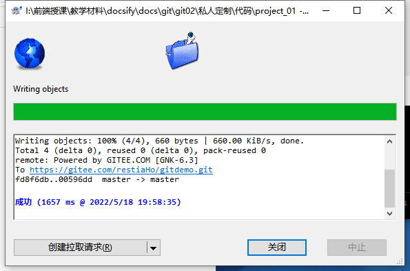
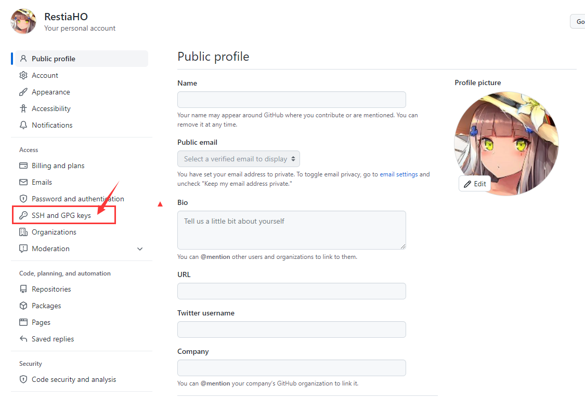
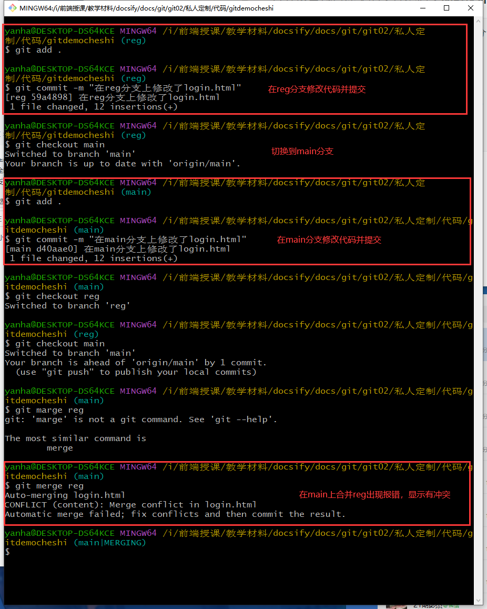
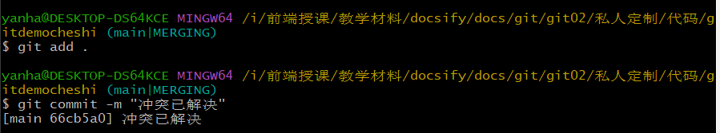

# GIT第二天

# 一. 开源

## 1.1 开源概念

> 把代码（信息）丢到网上给大家分享的就是开源， 有个笑话：我的账号密码被开源了


## 1.2 开源许可协议

> 02 3:19

​		开源并不意味着完全没有限制，为了**限制使用者的使用范围**和**保护作者的权利**，每个开源项目都应该遵守开源许可协议（ Open Source License ）。

**常见的 5 种开源许可协议**

1. BSD（Berkeley Software Distribution） 

2. Apache Licence 2.0

3. **GPL**（GNU General Public License） 
   1. 具有传染性的一种开源协议，不允许修改后和衍生的代码做为闭源的商业软件发布和销售
   2. 使用 GPL 的最著名的软件项目是：Linux
4. LGPL（GNU Lesser General Public License） 
5. **MIT**（Massachusetts Institute of Technology, MIT） 
   1. 是目前限制最少的协议，唯一的条件：在修改后的代码或者发行包中，必须包含原作者的许可信息
   2. 使用 MIT 的软件项目有：jquery、Node.js


**为什么要拥抱开源**

开源的核心思想是“**我为人人，人人为我**”，人们越来越喜欢开源大致是出于以下 3 个原因：

1. 开源给使用者更多的控制权
2. 开源让学习变得容易
3. 开源才有真正的安全

开源是软件开发领域的大趋势，拥抱开源就像站在了巨人的肩膀上，不用自己重复造轮子，让开发越来越容易。

## 1.3 开源项目托管平台

专门用于免费存放开源项目源代码的网站，叫做**开源项目托管平台**。目前世界上比较出名的开源项目托管平台

主要有以下 3 个：

1. `Github`（全球最牛的开源项目托管平台，**没有之一**）← 自己用
2. `Gitlab`（对代码私有性支持较好，因此企业用户较多） ← 上班用
3. `Gitee`（又叫做码云，是国产的开源项目托管平台。访问速度快、纯中文界面、使用友好）← 不用

## 1.4 注册 Github 账号的流程

1. 访问 Github 的官网首页 https://github.com/
2. 点击“Sign up”按钮跳转到注册页面
3. 填写可用的用户名、邮箱、密码
4. 通过点击箭头的形式，将验证图片摆正
5. 点击“Create account”按钮注册新用户
6. 登录到第三步填写的邮箱中，点击激活链接，完成注册

# 二. `Github`

## 2.1 完成注册

## 2.2 新建空白远程仓库

步骤：

1. 开启创建仓库页面

   

2. 自定义项目名称和说明 => 创建

   

## 2.3 远程仓库的两种访问方式

Github 上的远程仓库，有两种访问方式，分别是 HTTPS 和 SSH。它们的区别是：

1. HTTPS：**零配置**；但是每次访问仓库时，需要重复输入 Github 的账号和密码才能访问成功
2. SSH：**需要进行额外的配置**；但是配置成功后，每次访问仓库时，不需重复输入 Github 的账号和密码

*注意：在实际开发中，推荐使用 SSH 的方式访问远程仓库。*

## 2.4 基于 HTTPS 将本地仓库上传到 Github


**龟龟会怎么做呢？**

步骤：

1. 提交其他的代码后点击推送

   

2. 推送点击确定（注意分支）

   

3. 成功

   

## 2.5 GIT的push操作 （推送 - 也就是更新仓库★★★）

```
# 1. 添加暂存区
$git add .

# 2. 提交更新
$git commit -m "2 commit"

# 3. 推送到云端
$git push
```


**龟龟是怎么做的呢？**步骤同2.4！

## 2.6  SSH key

1. SSH key 的**作用**：实现本地仓库和 Github 之间免登录的加密数据传输。
2. SSH key 的**好处**：免登录身份认证、数据加密传输。
3. SSH key 由**两部分组成**，分别是：
   1. id_rsa（私钥文件，存放于客户端的电脑中即可）
   2. id_rsa.pub（公钥文件，需要配置到 Github 中）

### 2.6.1  生成 SSH key

1. 打开 Git Bash
2. 粘贴如下的命令，并将 `your_email@example.com` 替换为注册 Github 账号时填写的邮箱：
   - ssh-keygen -t rsa -b 4096 -C "your_email@example.com" 
3. 连续敲击 3 次回车，即可在 `C:\Users\用户名文件夹\.ssh` 目录中生成 `id_rsa` 和 `id_rsa.pub` 两个文件


### 2.6.2 配置SSH key

1. 使用记事本打开 id_rsa.pub 文件，复制里面的文本内容

2. 在浏览器中登录 Github，点击头像 -> Settings -> SSH and GPG Keys -> New SSH key

   

3. 将 id_rsa.pub 文件中的内容，粘贴到 Key 对应的文本框中

4. 在 Title 文本框中任意填写一个名称，来标识这个 Key 从何而来

   

### 2.6.3 检测 Github 的 SSH key 是否配置成功

1. 打开 Git Bash，输入如下的命令并回车执行

   ```
   ssh -T git@github.com
   ```

2. 上述的命令执行成功后，可能会看到如下的提示消息：

   

3. 输入 yes 之后，如果能看到类似于下面的提示消息，证明 SSH key 已经配置成功了：

   

## 2.6.4 基于 SSH 将本地仓库上传到 Github


## 2.6.5 将远程仓库克隆到本地

```
$git clone 远程代码地址
```


**龟龟会怎么做呢？**

步骤

1. 右键克隆

   

2. 输入仓库url地址并确认

   

3. 搞定

   

# 三. 分支

## 3.1 分支的概念

可以认为分支就是当前工作目录中代码的一份**副本**。使用分支，可以让我们从开发主线上分离出来，以免影响开发主线。

## 3.2 分支在实际开发中的作用

在进行多人协作开发的时候，为了防止互相干扰，提高协同开发的体验，建议每个开发者都基于分支进行项目功能的开发


## 3.3 master（main） 主分支

> 项目核心代码，正常情况下是不允许开发工程师直接将代码push（推送）上去的

​		在初始化本地 Git 仓库的时候，Git 默认已经帮我们创建了一个名字叫做 master 的分支。通常我们把这个master 分支叫做主分支。


在实际工作中，master 主分支的作用是：**用来保存和记录整个项目已完成的功能代码**。

因此，不允许程序员直接在 master 分支上修改代码，因为这样做的风险太高，容易导致整个项目崩溃。

## 3.4 功能分支

> 我已知的公司好像似乎大概，都不会这么干，因为如果两个功能之间有交集的话，这么分配分支无疑是坐牢

由于程序员不能直接在 master 分支上进行功能的开发，所以就有了功能分支的概念。

**功能分支**指的是专门用来**开发新功能的分支**，它是临时从 master 主分支上分叉出来的，当新功能开发且测试完毕后，最终需要合并到 master 主分支上，如图所示：


## 3.5 查看分支列表

```
$git branch
```


*注意：分支名字前面的 ***** 号表示当前所处的分支。*


**龟龟怎么看呢？**

步骤：

1. 右键`tortoisegit` => 切换检出

   

2. 点击查看

   


## 3.6 创建新分支

```
$git branch 分支名称
```


**龟龟是怎么做的呢？**

步骤：

1. 右键`tortoisegit` => 切换检出

2. 勾选创建新分支，然后自定义名称

   


## 3.7  切换分支

使用如下的命令，可以切换到指定的分支上进行开发：

```
$git checkout login
```


**龟龟是怎么做的呢？**

步骤：

1. 右键`tortoisegit` => 切换检出

2. 在`切换到`模块选择需要切换的分支，点击确认

   


## 3.8 分支的快速创建和切换

使用如下的命令，可以创建指定名称的新分支，并立即切换到新分支上

```
# -b 表示创建一个新分支
# checkout 表示切换到创建的分支上
$git checkout -b 新建分支名称
```


**龟龟是怎么做的呢？**

步骤:

1.  右键`tortoisegit` => 创建分支

   

2. 自定义新分支名称，选择该分支基于哪个分支创建，勾选切换到新分支选项

   

## 3.9 合并分支

功能分支的代码开发测试完毕之后，可以使用如下的命令，将完成后的代码合并到 master 主分支上

```
# 切换到 master 分支
$git checkout master

# 在 master 分支上运行 git merge 命令，将 login 分支的代码合并到 master 分支
$git merge login
```


**合并分支时的注意点：**假设要把 C 分支的代码合并到 A 分支，则必须**先切换到 A 分支**上，**再运行 git** **merge 命令**，来合并 C 分支


**龟龟是怎么做的呢？**

步骤：

1. 右键`tortoisegit` => 创建分支

   

2. 选择从哪个分支上合并过来

   

## 3.10 删除分支

```
$git branch -d 分支名称
```


**龟龟是怎么做的呢？** 龟龟好像没有删除功能


## 3.11 遇到冲突时的分支合并

​		如果在两个不同的分支中，对同一个文件进行了不同的修改，Git 就没法干净的合并它们。 此时，我们需要打开这些包含冲突的文件然后**手动解决冲突**。

```
# 假设：在把reg分支合并到 master 分支期间，代码冲突了
$git checkout master
$git merge reg

# 打开包括冲突的文件，手动解决冲突后，再执行如下命令
$git add .
$git commit -m "解决冲突"
```




**文件冲突提示删除`HEAD`包含的文字，保留`reg`的：**


**重新提交**




**龟龟怎么做呢？**

步骤：

1. 出现冲突报错

   

2. 点击解决进入冲突文件列表页

   

3. 双击打开问题文件

   - 红色部分是两个不同分支的冲突点
   - 橙色部分是原始代码

   

4. 在红色区域右键选择`使用此文本块`

   

   

5. 点击保存并标记已解决

   

   

## 3.12 将本地分支推送到远程仓库

如果是**第一次**将本地分支推送到远程仓库，需要运行如下的命令：

```
# -u 表示第一次吧本地分支和远程分支进行关联，只在第一次推送的时候需要带 -u 参数
$git push -u 远程仓库的别名 本地分支名称:远程分支名称

# 实际案例
$git push -u origin payment:pay

#如果希望远程分支的名称和蹦迪分支名称保持一致，可以对命令进行简化
$git push -u origin payment
```

*注意：第一次推送分支需要带 -u 参数，此后可以直接使用 git push 推送代码到远程分支。*


**龟龟怎么做呢？** 正常的推送（push）操作会自动帮忙完成。


## 3.13 查看远程仓库中所有的分支列表

```
git remote show 远程仓库名称
```


## 3.14 跟踪分支

跟踪分支指的是：从远程仓库中，把远程分支下载到本地仓库中。需要运行的命令如下：

```
# 从远程仓库，把对应的远程分支下载到本地仓库，保持本地分支和远程分支名称相同
$git checkout 远程分支的名称
$git checkout pay

# 从远程仓库，把对应的远程分支下载到本地仓库，并吧下载的本地分支重新命名
$git checkout -b 本地分支名称 远程仓库名称/远程分支名称
$git checkout -b payment origin/pay
```


##  3.15 拉取(pull)远程分支的最新的代码(★★★)

可以使用如下的命令，把远程分支最新的代码下载到本地对应的分支中：

```
$git pull
```


**龟龟怎么做呢？**

步骤：

1. 右键`tortoisegit` => 拉取

   

## 3.16 删除远程分支

```
# 删除远程仓库中，指定名称的远程分支
$git push 远程仓库名称 --delete 远程分支名称
$git push origin --delete pay
```


