# vue移动端第一天

# 项目阶段怎么来学习?

- 看视频/笔记/老师,看一下,敲一下
  缺点: 不费脑子,效果差
  优点: 轻松
- 看项目图/成品效果来敲
  缺点: 费脑子,难以坚持
  优点: 效果好
- 敲2遍
  第一遍,跟着老师走,看下老师思路,避免一些坑
  第二遍,敲重点,用2天自习,敲完70%包含知识点,而且增加难度,先敲,然后实在敲不动,再看你课上敲过的代码


# 今日目标

- 能使用 Vue CLI 创建项目
- 回顾 Vant 组件库的导入方式
- 掌握制作使用字体图标的方式
- 掌握如何在 Vue 项目中处理 REM 适配
- 理解 axios 请求模块的封装

> 以上均为固定模式，每个公司对于配置的要求是不同的，我们需要学习的跟随标准规则文档来进行标准化构建项目的能力，而不是死记硬背、硬班照用

# 一、项目初始化

> 如果你还没有安装 VueCLI，请执行下面的命令安装或是升级：
>
> ```sh
> npm install --global @vue/cli
> ```

1. 在命令行中输入以下命令创建 Vue 项目：

```sh
vue create toutiao-m
```

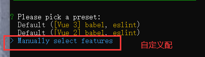

> manually：自定义勾选特性配置，选择完毕之后，才会进入装包
>
> 手动选择特性，支持更多自定义选项

2. 详细信息选择

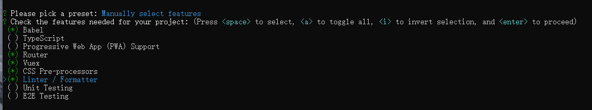

> 分别选择：
> Babel：es6 转 es5
> Router：路由
> Vuex：数据容器，存储共享数据
> CSS Pre-processors：CSS 预处理器，后面会提示你选择 less、sass、stylus(CSS 的预处理器) 等
> Linter / Formatter：代码格式校验


3. 选择vue版本，选择2.X版本

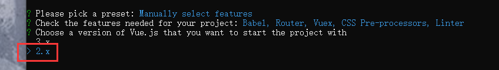

4. 是否使用history模式

> history模式虽然url没有#比较简洁，但在无后端支持时兼容性很差所以选择hash模式，输入`n`

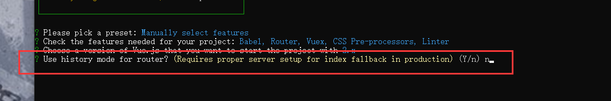

5. 选择 CSS 预处理器，这里选择我们熟悉的 Less

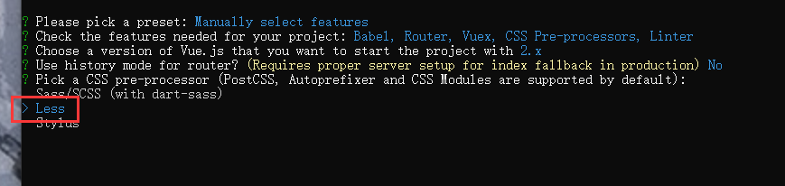

6. 选择校验工具，这里选择 ESLint + [Standard（js代码规则）](https://standardjs.com/)


7. 选择合适触发代码格式校验

   > 选择在什么时机下触发代码格式校验：
   >
   > - Lint on save：每当保存文件的时候
   > - Lint and fix on commit：每当执行 `git commit` 提交的时候
   >
   > 这里建议两个都选上，更严谨。
   
   **在setting.json中加入以下代码用于让格式化操作适应该eslint规则**
   
   ```json
   "vetur.format.defaultFormatter.js": "vscode-typescript",
   "javascript.format.insertSpaceBeforeFunctionParenthesis": true,
   ```
   

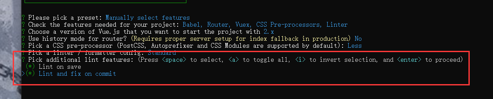

8. Babel、ESLint 等工具会有一些额外的配置文件，选择这些工具相关的配置文件写到哪里

   > - In dedicated config files：分别保存到单独的配置文件
   > - In package.json：保存到 package.json 文件中
   >
   > 这里建议选择第 1 个，保存到单独的配置文件，这样方便我们做自定义配置。

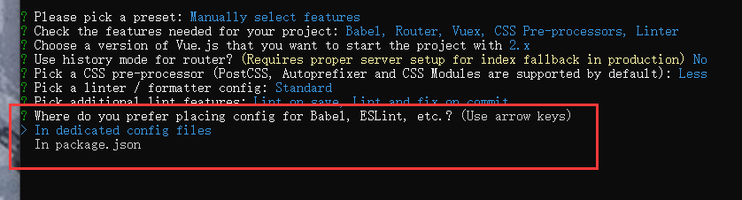

9. 选择是否将之前的选择进行保存，以便以后直接使用

   > 选n，不需要

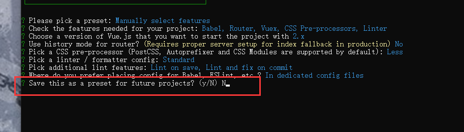

10. 等待安装

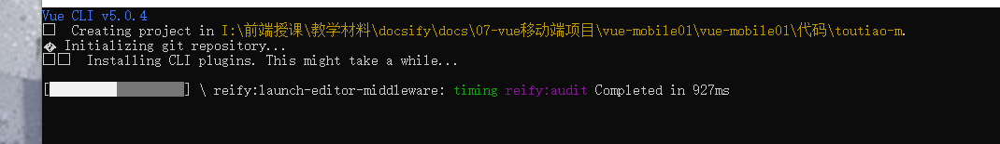

```bash
# 进入你的项目目录
cd toutiao-webapp

# 启动开发服务
npm run serve
```

11. 发现有很多文件的代码顶部报红

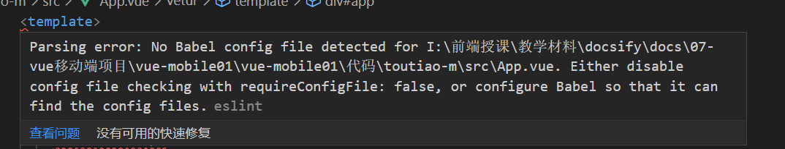

>  解决方式是在`.eslintrc.js`中设置

```
  parserOptions: {
    parser: '@babel/eslint-parser',
    requireConfigFile: false
  },
```

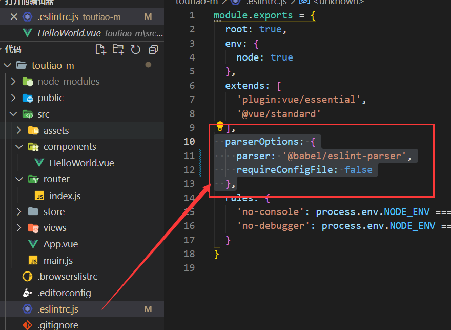

12. 关于eslint的配置

- 可以关闭eslint

  [参考](https://cli.vuejs.org/zh/config/#lintonsave)
  注意修改配置,需要重启
  在`vue.config.js`当中写

  ```js
  module.exports = {
      lintOnSave: false
  }
  ```

- 安装扩展自动修复eslint(建议不用，自己手动修复)

  (1)安装扩展:
  ESLint
  ESLint Chinese Rules
  (2) 在js当中修复错误
  (2.1)修改错误-方式1-通点击悬浮,修复,点击fix
  (2.1)修改错误-方式2-通过保存文件的时候自动修复(推荐)
  打开设置文件,粘贴配置 （点击左小角齿轮图标->设置->点击右上角,文件图标）

  ```js
  "editor.formatOnSave": false,
  "editor.codeActionsOnSave": {
      "source.fixAll.eslint": true
  }
  ```

  **注意1** 在配置当中有下面配置,要删除,因为现在格式化js任务只交给eslint,

  ```js
  "[javascript]": {}
  ```

  **注意2** 添加项目到vscode一定要是根路径(看到node_modules)

  (3)在vue文件当中修复错误（点击左小角齿轮图标->设置->点击右上角,文件图标）

  ```js
  "vetur.format.defaultFormatter.js": "none",
  ```

  **注意3** 用到eslint,要禁用掉一些格式化js的扩展
  例如:js-css-format


# 二. 加入 Git 版本管理

几个好处：

- 代码备份
- 多人协作
- 历史记录
- ...


（1）创建远程仓库

- [GitHub](https://github.com/lipengzhou)
- [码云](https://gitee.com/)
- [Coding](https://coding.net/)
- ...

（2）将本地仓库推到线上

如果没有本地仓库。

```shell
# 创建本地仓库
git init

# 将文件添加到暂存区
git add .

# 提交历史记录
git commit "提交日志"

# 添加远端仓库地址
git remote add origin 你的远程仓库地址

# 推送提交
git push -u origin master
```

如果已有本地仓库（Vue CLI 已经帮我们初始化好了）。

```shell
# 添加远端仓库地址
git remote add origin 你的远程仓库地址

# 推送提交
git push -u origin master
```

如果之后项目代码有了变动需要提交：

```shell
git add
git commit
git push
```

龟龟的操作流程：

1. 初始化git，构建版本库

   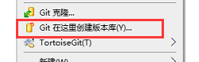

2. 将代码提交到本地

   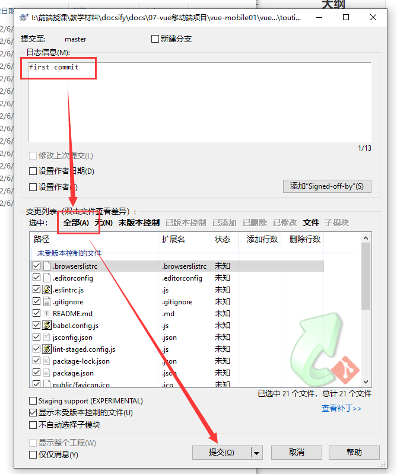

3. 将文件推送到git仓库

   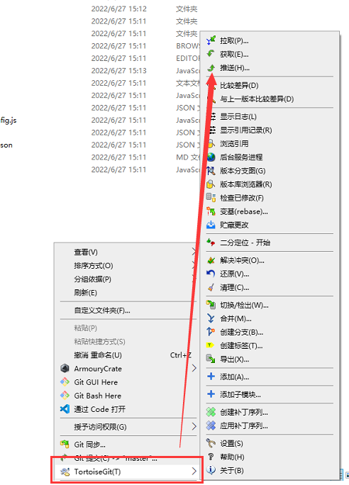

   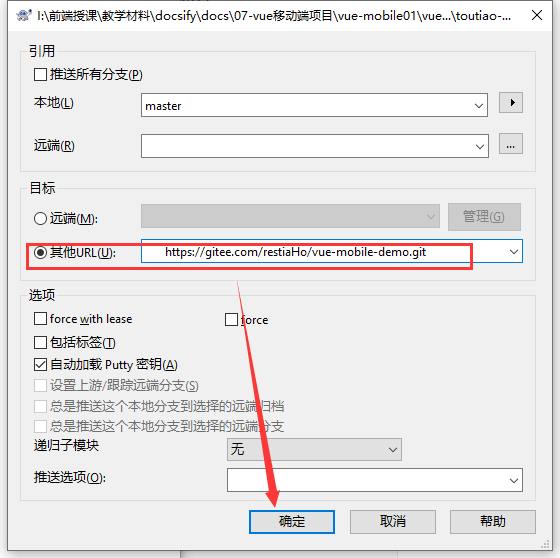

4. 如果之后项目代码有了变动就重复 **步骤2和步骤3**

# 三.调整初始目录结构

默认生成的目录结构不满足我们的开发需求，所以这里需要做一些自定义改动。

这里主要就是下面的两个工作：

- 删除初始化的默认文件
- 新增调整我们需要的目录结构

1. 将 `App.vue` 修改为

   > 注意： style标签结束后需要多一个回车(迎合eslint规范)

   ```vue
   <template>
     <div id="app">
       <h1>黑马头条</h1>
       <router-view />
     </div>
   </template>
   
   <script>
   export default {
     name: 'App'
   }
   </script>
   
   <style scoped lang="less">
   
   </style>
   
   ```

2. 将 `router/index.js` 修改为

   ```JS
   import Vue from 'vue'
   import VueRouter from 'vue-router'
   
   Vue.use(VueRouter)
   
   const routes = [
   
   ]
   
   const router = new VueRouter({
     routes
   })
   
   export default router
   
   ```

3. 删除

   - src/views/About.vue
   - src/views/Home.vue
   - src/components/HelloWorld.vue
   - src/assets/logo.png

4. 创建以下几个目录

   - src/api 目录
     - 存储接口封装
   - src/utils 目录
     - 存储一些工具模块
   - src/styles 目录
     - index.less 文件，存储全局样式
     - 在 `main.js` 中加载全局样式 `import './styles/index.less'`

   ```
   .                                 
   ├── README.md                     
   ├── babel.config.js               
   ├── package-lock.json             
   ├── package.json                  
   ├── public                        
   │   ├── favicon.ico               
   │   └── index.html                
   └── src                           
       ├── api
       ├── App.vue                   
       ├── assets                    
       ├── components                
       ├── main.js                   
       ├── router
       ├── utils
       ├── styles
       ├── store                     
       └── views
   ```

5. 将项目目录结构调整后更新到远程仓库

   ```bash
   git add . 
   git commit -m '项目目录结构初始化'
   git push
   将本地仓库代码与远程仓库代码保持一致
   ```

# 四. 导入图标素材

> **05-项目初始化-导入图标素材**
>
> 设计师为我们单独提供了设计稿中的图标

设计稿中的小图标如果只用这个图片的话，可能会显示模糊（设计稿如下）

- 为了方便使用，我们在这里把它制作为字体图标。

- 制作字体图标的工具有很多，在这里我们推荐大家使用：https://www.iconfont.cn/。

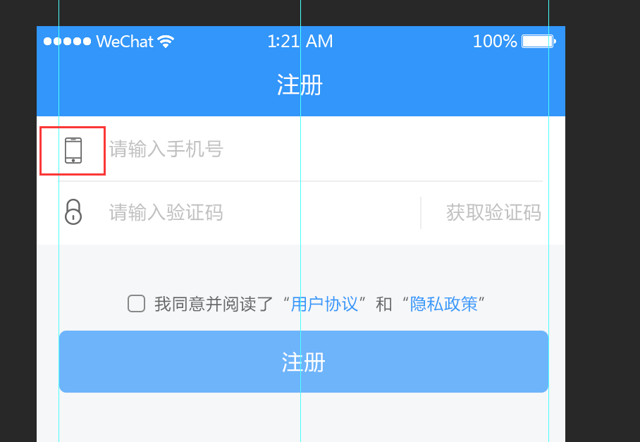

## 4.1 注册账户

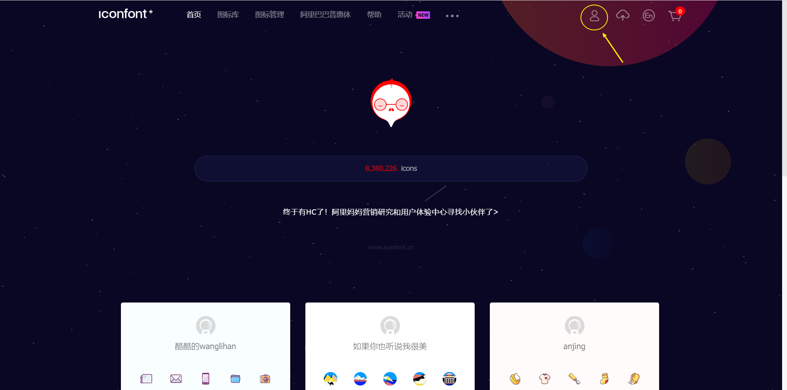


> 直接选择第三方登录即可

## 4.2 创建项目

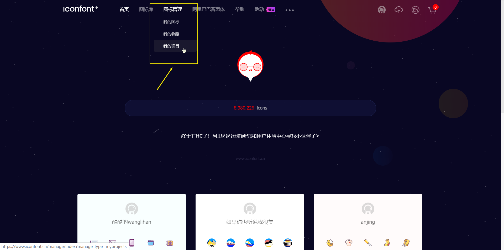

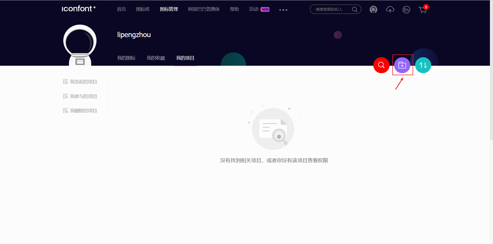

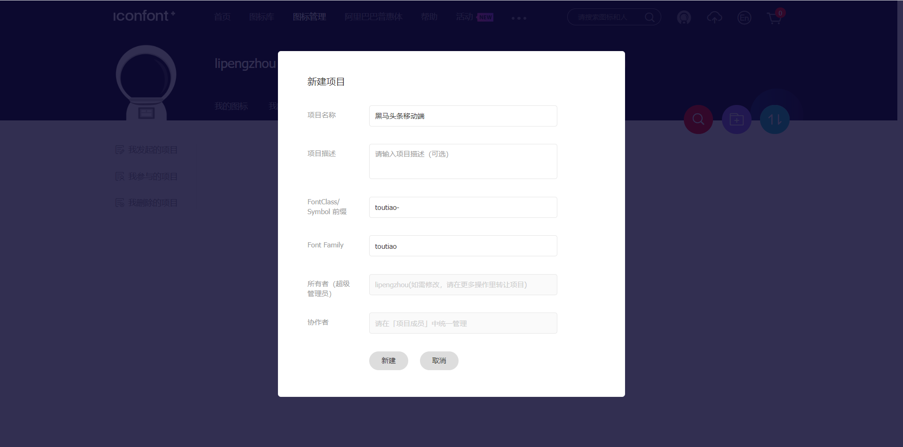

## 4.3 上传图标到项目

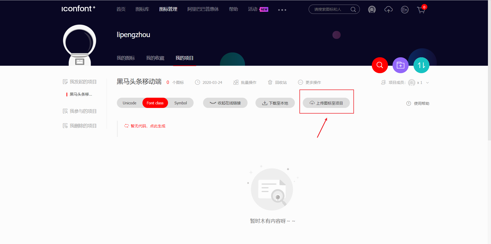

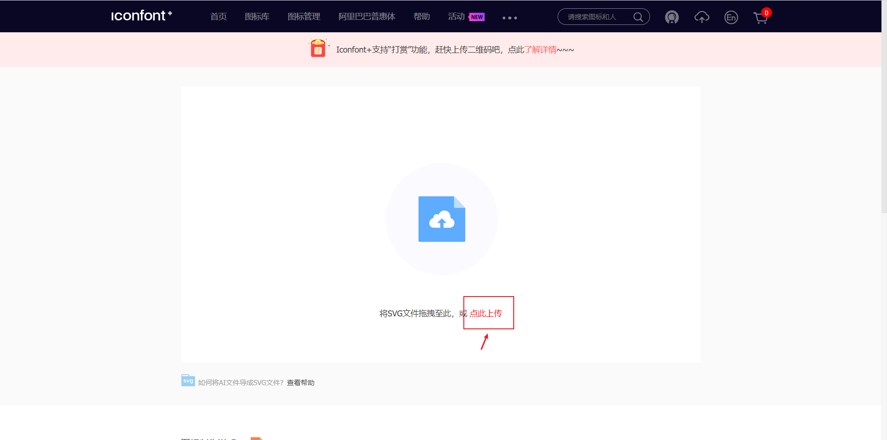

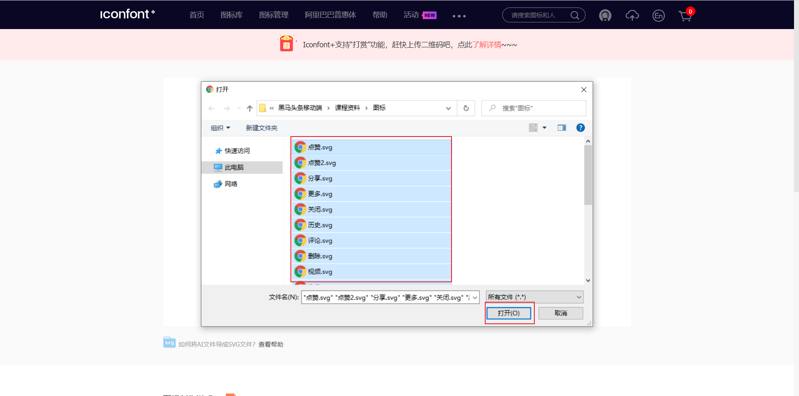

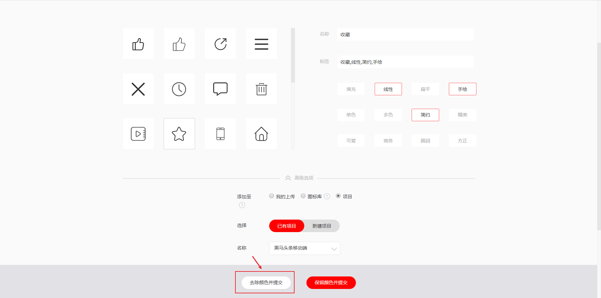

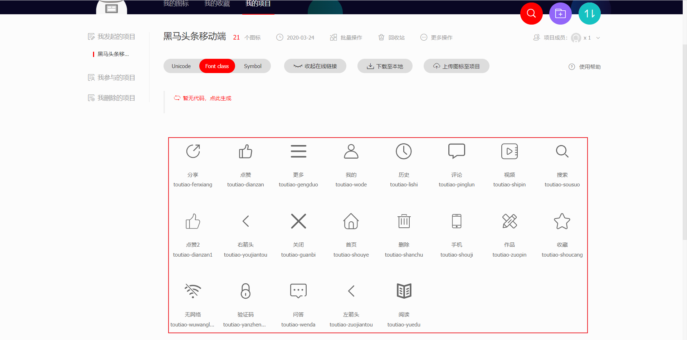

## 4.4 生成链接

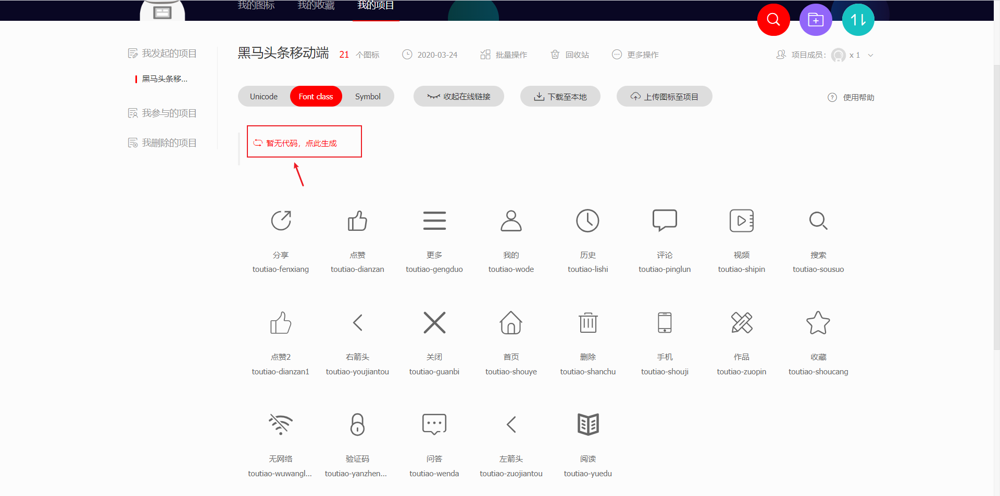

## 4.5 配置到项目中使用

1. 在styles目录下创建icon.less,将对应的图标样式代码复制过来

   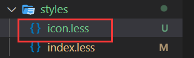

2. 在index.lee中引用图标样式

   ```css
   // 全局样式文件
   
   // 加载图标样式图标
   @import './icon.less';
   ```

3. 在App.vue中使用字体图标

   ```html
   <div id="app">
       <router-view/>
       <i class="toutiao toutiao-lishi"></i>
   </div>
   ```

4. 将资料中的素材图片复制到自己项目的assets文件夹中，并将favicon.ico剪切到public目录下，替换默认的ico

   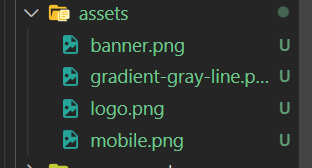

# 五.引入 Vant 组件库


Vant 是有赞商城前端开发团队开发的一个基于 Vue.js 的移动端组件库，它提供了非常丰富的移动端功能组件，简单易用。

- [官方文档](https://youzan.github.io/vant/#/zh-CN/)
- [GitHub 仓库](https://github.com/youzan/vant)

下面是在 Vant 官网中列出的一些优点：

- 60+ 高质量组件
- 90% 单元测试覆盖率
- 完善的中英文文档和示例
- 支持按需引入
- 支持主题定制
- 支持国际化
- 支持 TS
- 支持 SSR

在我们的项目中主要使用 Vant 作为核心组件库，下面我们根据[官方文档](https://youzan.github.io/vant/#/zh-CN/quickstart#yin-ru-zu-jian)将 Vant 导入项目中。

将 Vant 引入项目一共有四种方式：

- 方式一：自动按需引入组件
  - 和方式二一样，都是按需引入，但是加载更方便一些（需要额外配置插件）
  - 优点：打包体积小
  - 缺点：每个组件在使用之前都需要手动加载注册

- 方式二：手动按需引入组件
  - 在不使用插件的情况下，可以手动引入需要的组件
  - 优点：打包体积小
  - 缺点：每个组件在使用之前都需要手动加载注册

- 方式三：导入所有组件
  - Vant 支持一次性导入所有组件，引入所有组件会增加代码包体积，因此不推荐这种做法
  - 优点：导入一次，使用所有
  - 缺点：打包体积大

- 方式四：通过 CDN 引入
  - 使用 Vant 最简单的方法是直接在 html 文件中引入 CDN 链接，之后你可以通过全局变量`vant`访问到所有组件。
  - 优点：适合一些演示、示例项目，一个 html 文件就可以跑起来
  - 缺点：不适合在模块化系统中使用

这里建议为了前期开发的便利性我们选择方式三：导入所有组件，在最后做打包优化的时候根据需求配置按需加载以降低打包体积大小。

1. 安装 Vant

```shell
npm i vant
```

2. 在 `main.js` 中加载注册 Vant 组件

```javascript
import Vue from 'vue'
import Vant from 'vant'
import 'vant/lib/index.css'

Vue.use(Vant)
```

3. 查阅文档使用组件

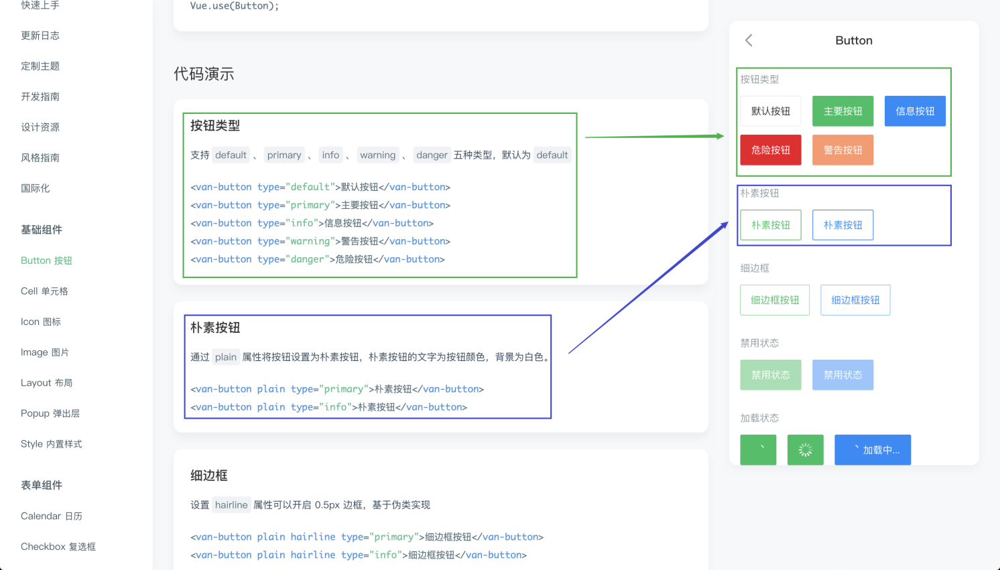

> Vant 的文档非常清晰，左侧是组件目录导航，中间是效果代码，右边是效果预览。


例如我们在根组件使用 Vant 中的组件：

```html
<van-button type="default">默认按钮</van-button>
<van-button type="primary">主要按钮</van-button>
<van-button type="info">信息按钮</van-button>
<van-button type="warning">警告按钮</van-button>
<van-button type="danger">危险按钮</van-button>

<van-cell-group>
  <van-cell title="单元格" value="内容" />
  <van-cell title="单元格" value="内容" label="描述信息" />
</van-cell-group>
```


> 如果在页面中能够正常的看到下面的效果，则说明 Vant 导入成功了。

## 5.1 使用vant的方式

1. **方式1** 去文档找组件,复制代码,粘贴到编辑器里面,进行修改
2. **方式2**
   - 安装扩展
     vant-helper
     Vant Snippets
   - 通过`<van-`,选择写组件代码
   - 查看组件说明文档
     光标放到组件上面,按下`ctrl + shift + z`

# 六. 移动端 REM 适配

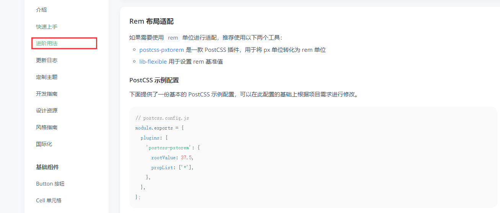

Vant 中的样式默认使用 `px` 作为单位，如果需要使用 `rem` 单位，推荐使用以下两个工具：

- [postcss-pxtorem](https://github.com/cuth/postcss-pxtorem) 是一款 postcss 插件，用于将单位转化为 rem
- [lib-flexible](https://github.com/amfe/lib-flexible) 用于设置 rem 基准值

下面我们分别将这两个工具配置到项目中完成 REM 适配。

## 6.1 **使用 lib-flexible 动态设置 REM 基准值**

> html 标签的字体大小

1. 安装

   ```bash
   npm i amfe-flexible
   ```

2. 然后在 `main.js` 中加载执行该模块

   > 通过amfe-flexible修改font-size,屏幕的宽度1/10

   ```
   // 动态设置rem加载
   import 'amfe-flexible'
   ```

3. 最后测试：在浏览器中切换不同的手机设备尺寸，观察 html 标签 `font-size` 的变化。

   

   > 例如在 iPhone 6/7/8 设备下，html 标签字体大小为 37.5 px


   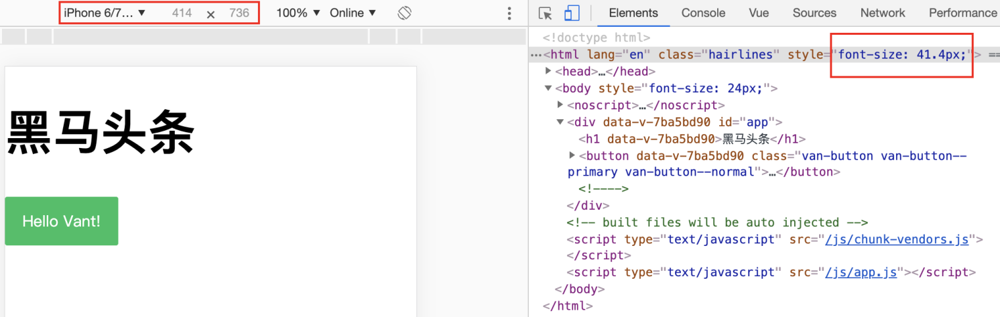

   > 例如在 iPhone 6/7/8 Plus 设备下，html 标签字体大小为 41.4 px

## 6.2 使用 postcss-pxtorem 将 `px` 转为 `rem`

> 基准值是37.5

1. 安装

   ```bash
   # yarn add -D postcss-pxtorem
   # -D 是 --save-dev 的简写
   npm install postcss-pxtorem -D
   ```

2. 然后在**项目根目录**中创建 `.postcssrc.js` 文件

   ```
   module.exports = {
     plugins: {
       'autoprefixer': {
         browsers: ['Android >= 4.0', 'iOS >= 8']
       },
       'postcss-pxtorem': {
         rootValue: 37.5,
         propList: ['*']
       }
     }
   }
   ```

3. **配置完毕，重新启动服务**

   最后测试：**刷新浏览器页面**，审查元素的样式查看是否已将 `px` 转换为 `rem`。

   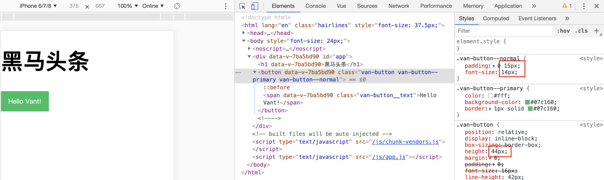

   > 这是没有配置转换之前的。


   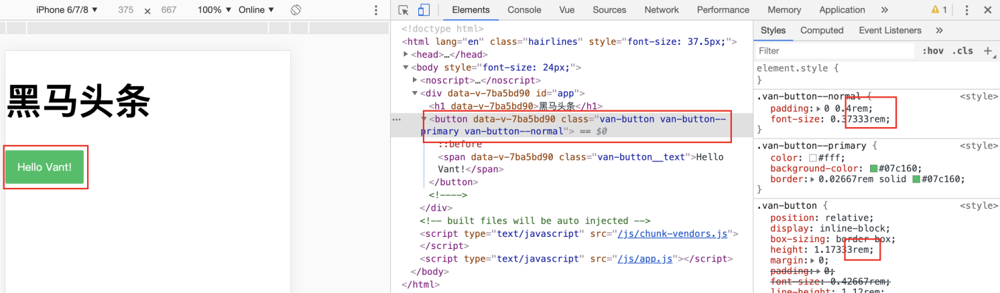

   > 这是转换之后的，可以看到 px 都被转换为了 rem。

4. 发现通过style行内设置的`px`样式不会转化为`rem`，但其他的设置css样式形式会自动转化

   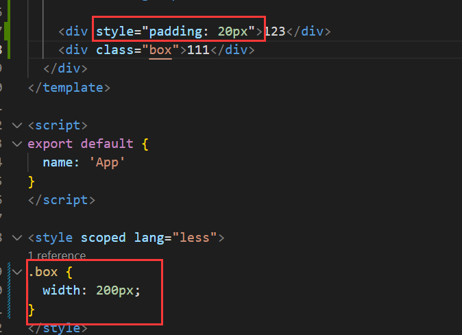

# 七. 关于 `.postcssrc.js` 配置文件

>  `.postcssrc.js` 是 PostCSS 的配置文件。

## 7.1 PostCSS 介绍

[PostCSS](https://postcss.org/) 是一个处理 CSS 的处理工具，本身功能比较单一，它主要负责解析 CSS 代码，再交由插件来进行处理，它的插件体系非常强大，所能进行的操作是多种多样的，例如：

- [Autoprefixer](https://github.com/postcss/autoprefixer) 插件可以实现自动添加浏览器相关的声明前缀
- [PostCSS Preset Env](https://github.com/csstools/postcss-preset-env) 插件可以让你使用更新的 CSS 语法特性并实现向下兼容
- [postcss-pxtorem](https://github.com/cuth/postcss-pxtorem) 可以实现将 px 转换为 rem
- ...

目前 PostCSS 已经有 [200 多个功能各异的插件](https://github.com/postcss/postcss/blob/master/docs/plugins.md)。开发人员也可以根据项目的需要，开发出自己的 PostCSS 插件。


PostCSS 一般不单独使用，而是与已有的构建工具进行集成。

[Vue CLI 默认集成了 PostCSS](https://cli.vuejs.org/zh/guide/css.html#postcss)，并且默认开启了 [autoprefixer](https://github.com/postcss/autoprefixer) 插件。

> Vue CLI 内部使用了 PostCSS。
>
> 你可以通过 `.postcssrc` 或任何 [postcss-load-config](https://github.com/michael-ciniawsky/postcss-load-config) 支持的配置源来配置 PostCSS。也可以通过 `vue.config.js` 中的 `css.loaderOptions.postcss` 配置 [postcss-loader](https://github.com/postcss/postcss-loader)。
>
> 我们默认开启了 [autoprefixer](https://github.com/postcss/autoprefixer)。如果要配置目标浏览器，可使用 `package.json` 的 [browserslist](https://cli.vuejs.org/zh/guide/browser-compatibility.html#browserslist) 字段。

## 7.2 Autoprefixer 插件的配置

1. 设置 Autoprefixer 插件

   ```js
   // postcss.config.js
   // postCSS 配置文件
   module.exports = {
     // 配置要使用PostCSS插件
     plugins: {
       // 配置使用 autoprefixer 插件
       // 作用：生成浏览器 CSS 样式规则前缀
       'autoprefixer': { // autoprefixer 插件的配置
         // 配置要兼容到的环境信息
         browsers: ['Android >= 4.0', 'iOS >= 8']
       },
       // 配置使用 postcss-pxtorem 插件
       'postcss-pxtorem': {
         rootValue: 37.5,
         propList: ['*'],
       },
     },
   };
   ```

   [autoprefixer](https://github.com/postcss/autoprefixer) 是一个自动添加浏览器前缀的 PostCss 插件，`browsers` 用来配置兼容的浏览器版本信息，但是写在这里的话会**引起编译器警告。**

   ```
   Replace Autoprefixer browsers option to Browserslist config.
   Use browserslist key in package.json or .browserslistrc file.
   
   Using browsers option can cause errors. Browserslist config
   can be used for Babel, Autoprefixer, postcss-normalize and other tools.
   
   If you really need to use option, rename it to overrideBrowserslist.
   
   Learn more at:
   https://github.com/browserslist/browserslist#readme
   https://twitter.com/browserslist
   ```

   警告意思就是说你应该将 `browsers` 选项写到 `package.json` 或 `.browserlistrc` 文件中。

   > 其实是因为vue/cli已经帮我们配置过一次了，所以将以上配置屏蔽掉

   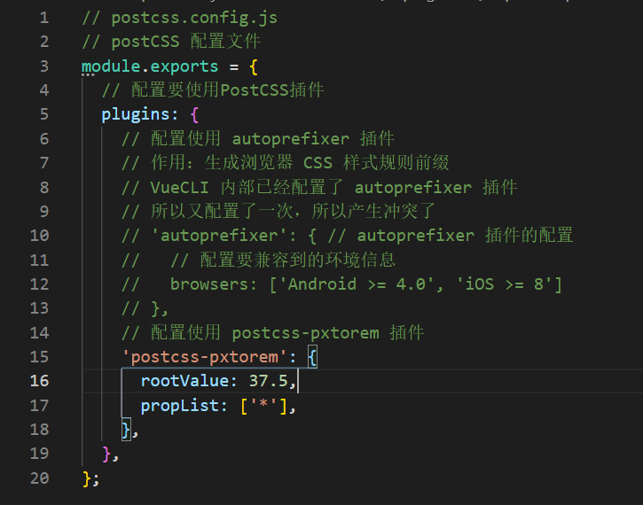

## 7.3 postcss-pxtorem 插件的配置

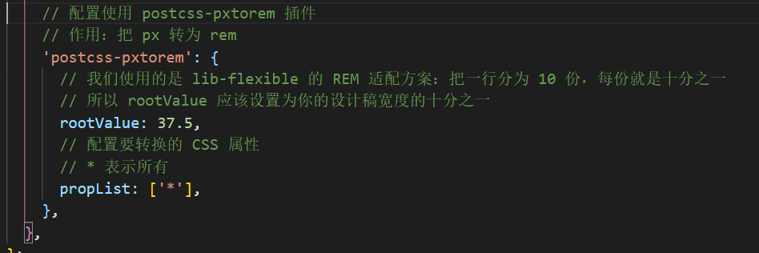

- `rootValue`：表示根元素字体大小，它会根据根元素大小进行单位转换
- `propList` 用来设定可以从 px 转为 rem 的属性
  - 例如 `*` 就是所有属性都要转换，`width` 就是仅转换 `width` 属性

1. `rootValue` 应该如何设置呢？

   > 如果你使用的是基于 lib-flexable 的 REM 适配方案，则应该设置为你的设计稿的十分之一。
   > 例如设计稿是 750 宽，则应该设置为 75。

2. 大多数设计稿的原型都是以 iphone6 为原型，iphone6 设备的宽是 750，我们的设计稿也是这样。

   > 因为 Vant 是基于 375 写的，所以如果你设置为 75 的话，Vant 的样式就小了一半。
   >
   > 所以如果设置为 `37.5` 的话，Vant 的样式是没有问题的，但是我们在测量设计稿的时候都必须除2才能使用，否则就会变得很大。

3. 解决自己设计稿与vant设计稿不同换算的方案

   - 如果是 Vant 的样式，就把 `rootValue` 设置为 37.5 来转换
   - 如果是我们的样式，就按照 75 的 `rootValue` 来转换

   

   通过[查阅文档](https://github.com/cuth/postcss-pxtorem#options)我们可以看到 `rootValue` 支持两种参数类型：

   - 数字：固定值
   - 函数：动态计算返回
     - postcss-pxtorem 处理每个 CSS 文件的时候都会来调用这个函数
     - 它会把被处理的 CSS 文件相关的信息通过参数传递给该函数

   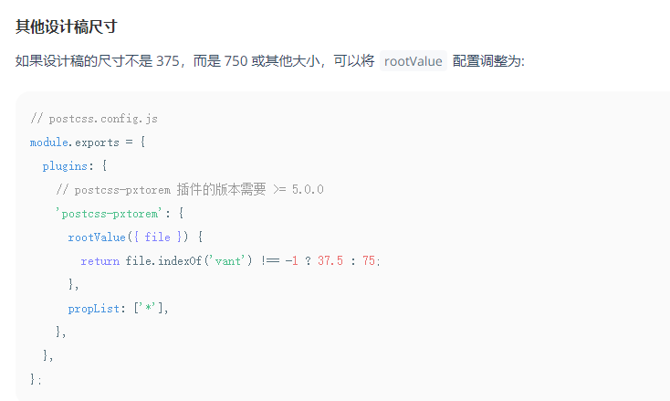

4. 配置完毕，把服务重启一下。

# 八. 封装axios请求模块

和之前项目一样，这里我们还是使用 [axios](https://github.com/axios/axios) 作为我们项目中的请求库，为了方便使用，我们把它封装为一个请求模块，在需要的时候直接加载即可。

> 头条新接口： http://toutiao.itheima.net/api.html#u7528u6237u8ba4u8bc1uff08u767bu5f55u6ce8u518cuff090a3ca20id3du7528u6237u8ba4u8bc1uff08u767bu5f55u6ce8u518cuff093e203ca3e

1. 安装

   ```bash
   npm i axios
   ```

2. 创建 `src/utils/request.js`

   ```js
   /**
    * 封装 axios 请求模块
    */
   import axios from "axios"
   
   // axios.defaults.baseURL = 'http://ttapi.research.itcast.cn/'
   // 高级api-create,用来解决什么问题?
   // create解决项目当中有多个请求地址,会让代码更好维护
   const request = axios.create({
     baseURL: "http://toutiao.itheima.net/" // 基础路径
   })
   
   export default request
   ```

   **通过api-create来创建的请求地址可以设置多个**

   ```js
   import axios from 'axios'
   const request1 = axios.create({
       baseURL: 'http://127.0.0.1/api'
   })
   const request2 = axios.create({
       baseURL: 'http://www.itcast.cn/api'
   })
   let p = request1({
       url: '/login',
       method: 'post',
       data: {
           username: 'zs',
           password: '123'
       }
   })
   
   request2({
       url: '/users',
       method: 'get',
       params: {
           page: 1,
           size: 10
       }
   })
   ```

3. 如何使用

   - 方式一（简单方便，但是不利于接口维护）：我们可以把请求对象挂载到 `Vue.prototype` 原型对象中，然后在组件中通过 `this.xxx` 直接访问

     ```js
     this.$axios({
     	methods: 'GET',
     	url: 'xxx'
     })
     ```

     

   - 方式二（推荐）：我们把每一个请求都封装成每个独立的功能函数，在需要的时候加载调用，这种做法更便于接口的管理和维护

     ```js
     export const login = data => {
       return request({
         method: 'POST',
         url: '/v1_0/authorizations',
         data
       })
     }
     ```

   在我们的项目中建议使用方式二，更推荐（在随后的业务功能中我们就能学到）。

# 九. 案例 - 登录注册

目标：

1. 实现登录页面的布局
2. 能够实现基本登录功能

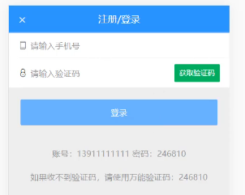

## 9.1 创建组件并配置路由

1. 创建 `src/views/login/login.vue` 并写入以下内容

   ```vue
   <template>
     <div class="login-container">登录页面</div>
   </template>
   
   <script>
   export default {
     name: 'LoginPage',
     data () {
       return {}
     }
   }
   </script>
   <style scoped lang="less"></style>
   
   ```

2.  `src/router/index.js` 中配置登录页的路由表

   ```vue
   const routes = [
     // 重定向
     {
       path: '/',
       redirect: '/login'
     },
     {
       path: '/login',
       name: 'login',
       component: () => import('../views/login/login.vue') // 懒加载
     }
   ]
   ```

3. 访问 `/login` 查看是否能访问到登录页面。

   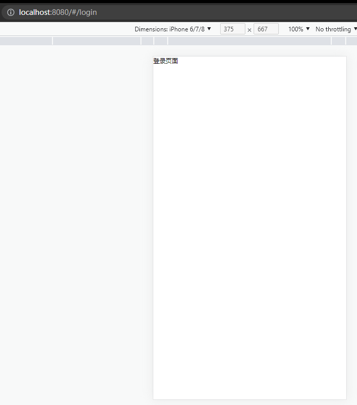

## 9.2 布局结构

1. 分析页面结构

   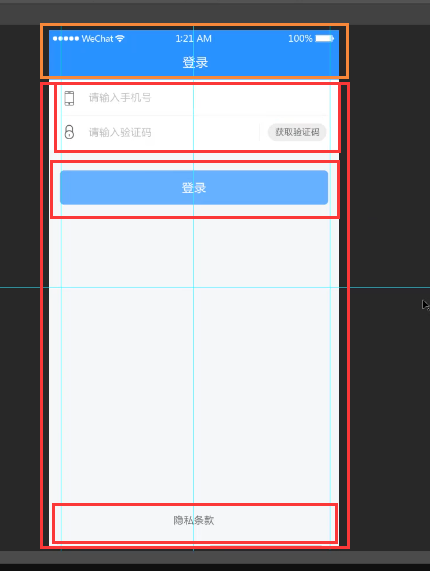

2. 这里主要使用到三个 Vant 组件

   - [NavBar 导航栏](https://youzan.github.io/vant/#/zh-CN/nav-bar)
   - [Form 表单](https://youzan.github.io/vant/#/zh-CN/form)
     - [Field 输入框](https://youzan.github.io/vant/#/zh-CN/field)
     - [Button 按钮](https://youzan.github.io/vant/#/zh-CN/button)

   > 一个经验：使用组件库中的现有组件快速布局，再慢慢调整细节，效率更高（刚开始可能会感觉有点麻烦，越用越熟，慢慢的就有了自己的思想）。

   ```vue
   <template>
     <div class="login-container">
       <!-- 导航栏 -->
       <van-nav-bar title="登录" />
   
       <!-- 导航栏 -->
       <van-form @submit="onSubmit">
         <van-field
           v-model="username"
           name="用户名"
           label="用户名"
           placeholder="用户名"
           :rules="[{ required: true, message: '请填写用户名' }]"
         />
         <van-field
           v-model="password"
           type="password"
           name="密码"
           label="密码"
           placeholder="密码"
           :rules="[{ required: true, message: '请填写密码' }]"
         />
         <div style="margin: 16px;">
           <van-button block type="info" native-type="submit">提交</van-button>
         </div>
       </van-form>
     </div>
   </template>
   
   <script>
   export default {
     name: 'LoginPage',
     data () {
       return {
         username: '',
         password: ''
       }
     },
     methods: {
       onSubmit (value) {
         console.log(value)
       }
     }
   }
   </script>
   ```

3. 布局样式

   > 写样式的原则：将公共样式写到全局（`src/styles/index.less`），将局部样式写到组件内部。

   - `src/styles/index.less`全局样式设置背景颜色和顶部导航

     ```less
     body {
       background-color: #f5f7f9;
     }
     
     .page-nav-bar {
       background-color: #3296fa;
       .van-nav-bar__title {
         color: #ffffff;
       }
     }
     ```

   - 使用插槽配置输入框图标

     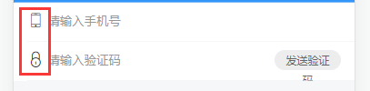

     ```vue
     <van-field
                v-model="username"
                name="用户名"
                label="用户名"
                placeholder="用户名"
                :rules="[{ required: true, message: '请填写用户名' }]"
                >
       <!-- slot老式写法 -->
       <i slot="left-icon" class="toutiao toutiao-shouji"></i>
     </van-field>
     <van-field
                v-model="password"
                type="password"
                name="密码"
                label="密码"
                placeholder="密码"
                :rules="[{ required: true, message: '请填写密码' }]"
                >
       <!-- slot新式写法 -->
       <template #left-icon>
     		<i class="toutiao toutiao-yanzhengma"></i>
       </template>
     </van-field>
     
     <style scoped lang="less">
     .login-container {
       .toutiao {
         font-size: 38px;
       }
     }
     </style>
     ```

   - 配置`发送验证`按钮

     ```vue
     <van-field
                v-model="password"
                type="password"
                name="密码"
                label="密码"
                placeholder="密码"
                :rules="[{ required: true, message: '请填写密码' }]"
                >
       <!-- slot新式写法 -->
       <template #left-icon>
     		<i class="toutiao toutiao-yanzhengma"></i>
       </template>
     
       <template #button>
     		<van-button class="send-sms-btn" round size="small" type="default">发送验证</van-button>
       </template>
     </van-field>
     
     <style scoped lang="less">
     .login-container {
       .send-sms-btn {
         background-color: #ededed;
       }
       .send-sms-btn {
         width: 152px;
         line-height: 46px;
         background-color: #ededed;
         font-size: 22px;
         color: #666;
       }
     }
     </style>
     ```

   - 设置登录按钮布局

     ```vue
     <!-- 提交按钮 -->
     <div class="login-btn-wrap">
       <van-button class="login-btn" block type="info" native-type="submit">登录</van-button>
     </div>
     
     <style scoped lang="less">
     .login-container {
       .login-btn-wrap {
         padding: 53px 33px;
         .login-btn {
           background-color: #6db4fb;
           border: none;
         }
       }
     }
     </style>
     ```

## 9.3 实现基本登录功能

> 实现输入框的双向绑定，封装登陆请求方法

思路：

- 注册点击登录的事件
- 获取表单数据（根据接口要求使用 v-model 绑定）
- 表单验证
- 发请求提交
- 根据请求结果做下一步处理

1. 根据接口要求绑定获取表单数据

   - 在登录页面组件的实例选项 data 中添加 `user` 数据字段
   - 在表单中使用 `v-model` 绑定对应数据

   ```vue
   <van-form @submit="onSubmit">
     <van-field
                v-model="user.mobile"
                label="手机号"
                placeholder="请输入手机号"
                clearable
                >
       <!-- slot老式写法 -->
       <i slot="left-icon" class="toutiao toutiao-shouji"></i>
     </van-field>
     <van-field
                v-model="user.code"
                type="password"
                label="密码"
                placeholder="请输入验证码"
                >
       <!-- slot新式写法 -->
       <template #left-icon>
   			<i class="toutiao toutiao-yanzhengma"></i>
       </template>
   
       <template #button>
   			<van-button class="send-sms-btn" round size="small" type="default">发送验证</van-button>
       </template>
     </van-field>
     <!-- 提交按钮 -->
     <div class="login-btn-wrap">
       <van-button class="login-btn" block type="info" native-type="submit" @click="">登录</van-button>
     </div>
   </van-form>
   
   <script>
   export default {
     name: 'LoginPage',
     data () {
       return {
         user: {
           mobile: '',
           code: ''
         }
       }
     },
     methods: {
       onSubmit () {
         console.log(this.user)
       }
     }
   }
   </script>
   ```

2. 请求接口登录

   - 创建 `src/api/user.js` 封装请求方法

     ```js
     /**
      * 用户相关的请求模块
      */
     import request from '../utils/request.js'
     /**
     * 用户登录
     */
     export const login = data => {
       return request({
         method: 'POST',
         url: '/v1_0/authorizations',
         data
       })
     }
     
     ```

   - 创建 `src/api/index.js`作为公共出口导出接口

     ```js
     import { login } from './user.js'
     
     export const loginAPI = login
     
     ```

   - `login.vue`引入login请求方法

     ```
     import { loginAPI } from '@/api/user.js'
     ```

   - 完善表单提交事件函数

     ```js
     async onSubmit () {
         const user = this.user
         try {
             const res = await loginAPI(user)
             console.log('登录成功', res)
         } catch (err) {
             if (err.response.status === 400) {
               console.log('手机号或验证码错误', err)
             } else {
               console.log('登录失败，稍后重试', err)
             }
         }
     }
     ```


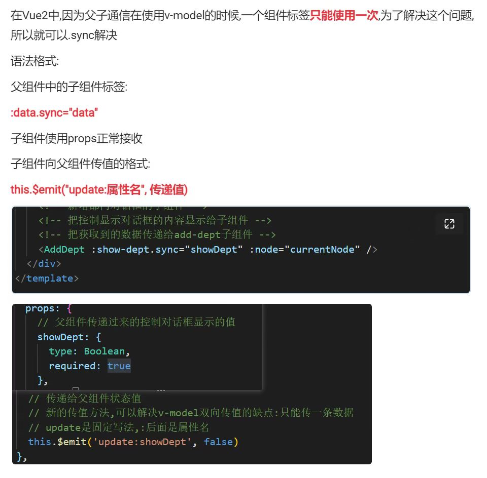


