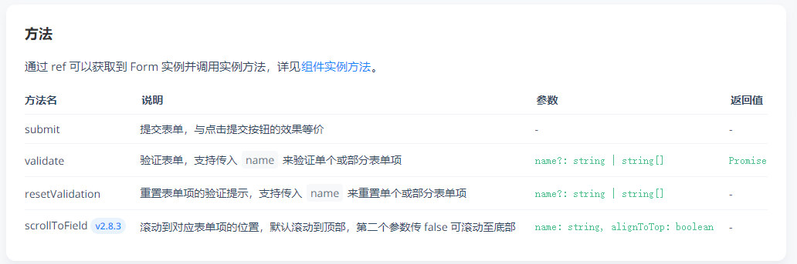
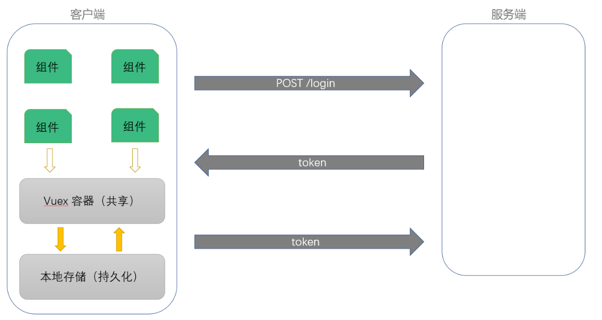

# VUE移动端第二天

目标：

1. 能够掌握Vant中Toast提示组件的使用
2. 能够理解API请求模块的封装
3. 能够理解验证码的实现思路
4. 能够了解Vue中处理表单验证的方式

# 一. 登录注册

## 1.1 登录状态提示

Vant 中内置了[Toast 轻提示](https://youzan.github.io/vant/#/zh-CN/toast)组件，可以实现移动端常见的提示效果。


```js
// 简单文字提示
Toast("提示内容");

// loading 转圈圈提示
Toast.loading({
  duration: 0, // 持续展示 toast
  message: "加载中...",
  forbidClick: true // 是否禁止背景点击
});

// 成功提示
Ttoast.success("成功文案");

// 失败提示
Toast.fail("失败文案");
```

> 提示：在组件中可以直接通过 `this.$toast` 调用。

**注意：**Toast 默认采用单例模式，即同一时间只会存在一个 Toast，如果需要在同一时间弹出多个 Toast，可以参考下面的示例

```js
Toast.allowMultiple();
const toast1 = Toast('第一个 Toast');
const toast2 = Toast.success('第二个 Toast');
toast1.clear();
toast2.clear();
```


下面为我们的登录功能增加 toast 交互提示。

**步骤：**

1. 在点击登录后`onSubmit`方法调用是，开启加载的`toast`提示

   ```js
   async onSubmit () {
     this.$toast.loading({
       message: '加载中...',
       forbidClick: true
     })
   }
   ```

   > 发现过一段时间后加载提示才消失，不符合预期
   >
   > 我们希望当接口还没有请求到数据时，就一直处于加载状态，加载完成后才关闭加载状态并显示成功或者失败

2. 改进加载

   ```js
   async onSubmit () {
     this.$toast.loading({
       duration: 0, // 持续时间，0表示持续展示不停止
       forbidClick: true, // 是否禁止背景点击
       message: '登录中...' // 提示消息
     })
   
     // 1. 获取表单元素
     const user = this.user
     // 2. 提交请求数据
   
     try {
       const res = await loginAPI(user)
       console.log('登录成功', res)
       // 提示 success 或者 fail 的时候，会先把其它的 toast 先清除
       this.$toast.success('登录成功')
     } catch (err) {
       if (err.response.status === 400) {
         console.log('手机号或验证码错误', err)
       } else {
         console.log('登录失败，稍后重试', err)
       }
       this.$toast.fail('登录失败，手机号或验证码错误')
     }
     // 3. 根据请求结果处理后续操作
   }
   ```

## 1.2 表单验证

参考文档：[Form 表单验证](https://youzan.github.io/vant/#/zh-CN/form#xiao-yan-gui-ze)

> 通过`van-field`组件的`rules`属性来设置表单验证规则
>
> 


1. 将表单的规则丹徒提取到data中进行统一管理，（各项规则为数组可以放置多个规则逐一判断）

   **template**

   ```vue
   <van-field v-model="user.mobile" label="手机号" placeholder="请输入手机号" clearable :rules="userFormRules.mobile"></van-field>
   
   <van-field v-model="user.code" type="password" label="密码" placeholder="请输入验证码" :rules="userFormRules.code"></van-field>
   ```

   **js**

   ```js
   data () {
     return {
       userFormRules: {
         mobile: [{
           required: true,
           message: '手机号不能为空'
         }, {
           pattern: /^1[3|5|7|8]\d{9}$/,
           message: '手机号格式错误'
         }],
         code: [{
           required: true,
           message: '验证码不能为空'
         }, {
           pattern: /^\d{6}$/,
           message: '验证码格式错误'
         }]
       }
     }
   }
   ```

## 1.3 验证码处理

### 1.3.1 验证手机号

1. 为发送验证按钮注册点击事件并消除自动提交表单事件

   

   ```vue
   <van-button
               class="send-sms-btn"
               native-type="button"
               round
               size="small"
               type="default"
               @click="onSendSms()"
   >发送验证</van-button>
   ```

2. 给发送验证码按钮注册点击事件

   ```js
   // 获取验证码
   onSendSms () {}
   ```

3. 为点击事件设置手机号验证 

   > 查阅文档发现可以使用ref来获取From表单的实例方法
   >
   > 

   - 修改手机号的输入框`name属性`

     ```vue
     <van-field v-model="user.mobile" label="手机号" placeholder="请输入手机号" clearable :rules="userFormRules.mobile" name="mobile">
     ```

   - 验证手机号

     > 注意验证时的返回值是一个Promise实例，需要用async和await

     ```js
     // 获取验证码
     async onSendSms () {
       // 1. 校验手机号
       try {
         await this.$refs.loginForm.validate('mobile')
       } catch (err) {
         return console.log('验证失败', err)
       }
     }
     ```

### 1.3.2 验证通过切换为倒计时组件

1. 在 data 中添加数据用来控制倒计时的显示和隐藏

   ```js
   data () {
     return {
       ...
       isCountDownShow: false
     }
   }
   ```

2. 使用倒计时组件

   

   > 通过v-if 来切换倒计时组件与获取验证组件

   ```vue
   <template #button>
   <!-- time: 倒计时时间 -->
   <van-count-down
                   v-if="isCountDownShow"
                   :time="1000 * 60"
                   format="ss s"
                   @finish="isCountDownShow = false"
                   />
   <van-button v-else class="send-sms-btn" native-type="button" round size="small" type="default" @click="onSendSms()">
     发送验证</van-button>
   </template>
   ```

3. 点击倒计时切换倒计时组件和发送验证码按钮显示

   ```js
   // 获取验证码
   async onSendSms () {
     // 1. 校验手机号
     try {
       await this.$refs.loginForm.validate('mobile')
     } catch (err) {
       return console.log('验证失败', err)
     }
   
     // 2. 验证通过，显示倒计时
     this.isCountDownShow = true
   }
   ```

### 1.3.3 发送验证码

1. 在 `api/user.js` 中添加封装数据接口

   ```js
   /**
   * 发送手机验证码
   */
   export const getSmsCode = mobile => {
     return request({
       method: 'GET',
       url: `/v1_0/sms/codes/${mobile}`
     })
   }
   ```

2. 在 `api/index.js`输出到外部

   ```js
   import { getSmsCode } from './user.js'
   
   export const getSmsCodeAPI = getSmsCode
   ```

3. 给发送验证码按钮注册的点击事件编写发送处理

   > 这里只需要发送后接口返回成功即可，接口成功后的返回值对我们的项目没有作用
   >
   > 如何查看验证码：http://toutiao.itheima.net/ 

   **如果在1分钟内重复请求，会受到请求限制！**

   

   ```js
   // 获取验证码
   async onSendSms () {
     // 1. 校验手机号
     try {
       await this.$refs.loginForm.validate('mobile')
     } catch (err) {
       return console.log('验证失败', err)
     }
   
     // 2. 验证通过，显示倒计时
     this.isCountDownShow = true
   
     // 3. 请求发送验证码
     try {
       await getSmsCodeAPI(this.user.mobile)
       this.$toast('发送成功')
     } catch (err) {
       // 发送失败，关闭倒计时
       this.isCountDownShow = false
       if (err.response.status === 429) {
         this.$toast('发送太频繁了，请稍后重试')
       } else {
         this.$toast('发送失败，请稍后重试')
       }
     }
   }
   ```

## 1.4 处理用户 Token


Token 是用户登录成功之后服务端返回的一个身份令牌，在项目中的多个业务中需要使用到：

- 访问需要授权的 API 接口
- 校验页面的访问权限
- ...

> 问题：Token往哪儿存？
>
> 我们只有在第一次用户登录成功之后才能拿到 Token。所以为了能在其它模块中获取到 Token 数据，我们需要把它存储到一个公共的位置，方便随时取用。

- 本地存储
  - 获取麻烦
  - 数据不是响应式
- Vuex 容器（推荐）
  - 获取方便
  - 响应式的

使用容器存储 Token 的思路：



- 登录成功，将 Token 存储到 Vuex 容器中
  - 获取方便
  - 响应式
- 为了持久化，还需要把 Token 放到本地存储
  - 持久化

> 总结： Vuex状态管理工具可有可无  (*･ω-q) 

1. 在 `src/store/index.js` 中

   ```js
   import Vue from 'vue'
   import Vuex from 'vuex'
   
   Vue.use(Vuex)
   
   export default new Vuex.Store({
     // 1. 存储数据的地方 - 类比于vue文件的data()
     state: {
       // 一个对象，储存当前登录用户的token数据
       user: {}
     },
     // 2. 外界修改store中state的属性值，必须通过mutations中设置的修改方法 - 类比methods
     // 注意：这里方法里面的代码和.vue文件中的书写方式有差异，注意区分
     mutations: {
       setUser (state, data) {
         state.user = data
       }
     },
     // 3. 涉及到异步操作后修改state数据时，必须先过actions中的自定义方法，通过actions去调用mutations中的方法
     actions: {
     },
     // 4. 是state中数据的计算属性 - 类比computed
     getters: {
     },
     // 5. 模块化vuex，可以让每一个模块拥有自己的 state、mutation、action、 getters，使得结构非常清晰，方便管理。
     modules: {
     }
   })
   
   ```

2. 登录成功以后将后端返回的 token 调用commit方法存到store中

   ```js
   async onSubmit () {
   	...
     try {
       const res = await loginAPI(user)
       console.log('登录成功', res)
       // 调用store中的方法，将接口返回的token存到状态管理器中
       this.$store.commit('setUser', res.data.data)
   
       // 提示 success 或者 fail 的时候，会先把其它的 toast 先清除
       this.$toast.success('登录成功')
     } catch (err) {
       ...
   },
   ```

   

3. 将 store中的 token 相关数据存储到容器中

   ```js
   const TOKEN_KEY = 'TOUTIAO_USER'
   
   export default new Vuex.Store({
     state: {
       user: JSON.parse(window.localStorage.getItem(TOKEN_KEY))
     },
     mutations: {
       setUser (state, data) {
         state.user = data
         // 为了防止刷新丢失，需要把数据备份到本地存储
         window.localStorage.setItem(TOKEN_KEY, JSON.stringify(state.user))
       }
     },
   	...
   })
   ```

## 1.5 优化封装本地存储操作模块 - 封装localStrage功能

1. 创建 `src/utils/storage.js` 模块

   - 存储
   - 获取
   - 删除

   ```js
   /**
    * 封装本地存储操作模块
    */
   
   /**
    * 存储数据
    */
   export const setItem = (key, value) => {
     // 将数组、对象类型的数据转换为 JSON 格式字符串进行存储
     if (typeof value === 'object') {
       value = JSON.stringify(value)
     }
     window.localStorage.setItem(key, value)
   }
   
   /**
    * 获取数据
    */
   export const getItem = key => {
     const data = window.localStorage.getItem(key)
     try {
       return JSON.parse(data)
     } catch (err) {
       return data
     }
   }
   
   /**
    * 删除数据
    */
   export const removeItem = key => {
     window.localStorage.removeItem(key)
   }
   
   ```

2. 在store/index.js引入方法

   ```js
   import { getItem, setItem } from '../utils/storage.js'
   ```

3. 使用方法

   ```js
   import { getItem, setItem } from '../utils/storage.js'
   const TOKEN_KEY = 'TOUTIAO_USER'
   
   export default new Vuex.Store({
     state: {
       user:getItem(TOKEN_KEY)
     },
     mutations: {
       setUser (state, data) {
         state.user = data
         // 为了防止刷新丢失，需要把数据备份到本地存储
         setItem(TOKEN_KEY, state.user)
       }
     },
   	...
   })
   ```

## 1.6 Vuex各属性的使用

1. 创建测试用store.js

   ```js
   import Vue from 'vue'
   import Vuex from 'vuex'
   
   Vue.use(Vuex)
   
   export default new Vuex.Store({
     // state存放状态,
     state: {
       name: 'tom', // 需要共用的数据
       age: '22'
     },
     // getter为state的计算属性
     getters: {
       getName: (state) => state.name, // 获取name
       getAge: (state) => state.age
     },
     // mutations可更改状态的逻辑，同步操作
     mutations: {
       setName: (state, data) => { state.name = data },
       setAge: (state, data) => { state.age = data }
     },
     // 提交mutation，异步操作
     actions: {
       acSetName (context, name) {
         setTimeout(() => {
           // 延时1秒提交至mutations中的方法
           context.commit('setName', name)
         }, 1000)
       },
   
       acSetAge (context, age) {
         setTimeout(() => {
           context.commit('setAge', age)
         }, 1000)
       }
     },
     // 将store模块化
     modules: {
     }
   })
   
   ```

2. 创建页面`comOne.vue`测试计算属性

   ```vue
   <template>
     <div class="wrapper">
       asd
       <!-- 读取mapGetters中的getName与getAge -->
       <div>
         name：<span>{{ getName }}</span>
       </div>
       <div>
         age：<span>{{ getAge }}</span>
       </div>
     </div>
   </template>
   
   <script>
   import { mapState, mapGetters } from 'vuex' // 导入vuex的辅助函数
   export default {
     components: {},
     // 计算属性computed无法传递参数
     computed: {
       // 映射 state 中的数据为计算属性
       ...mapState(['name', 'age']),
       // 映射 getters 中的数据为计算属性
       ...mapGetters(['getName', 'getAge'])
     }
   }
   </script>
   <style scoped>
   </style>
   
   ```

3. 创建`comTwo.vue`测试同步异步方法

   ```vue
   <template>
     <div class="wrapper">
       <div>
         <span>同步修改：</span>
         <!--直接回车调用mapMutations中的setName方法与setAge方法-->
         <input
           v-model="nameInp"
           @keydown.enter="setName(nameInp)"
           placeholder="同步修改name"
         />
         <input
           v-model="ageInp"
           @keydown.enter="setAge(ageInp)"
           placeholder="同步修改age"
         />
       </div>
   
       <div>
         <span>异步修改：</span>
         <!--直接回车调用mapAtions中的acSetName方法与acSetAge方法-->
         <input
           v-model="acNameInp"
           @keydown.enter="acSetName(acNameInp)"
           placeholder="异步修改name"
         />
         <input
           v-model="AcAgeInp"
           @keydown.enter="acSetAge(AcAgeInp)"
           placeholder="异步修改age"
         />
       </div>
     </div>
   </template>
   
   <script>
   import { mapMutations, mapActions } from 'vuex' // 导入vuex的辅助函数
   export default {
     components: {},
     data () {
       return {
         nameInp: '', // 绑定输入框的值
         ageInp: '',
         acNameInp: '',
         AcAgeInp: ''
       }
     },
     methods: {
       // 用于生成与 mutations 对话的方法，即：包含 $store.commit(xx) 的函数
       ...mapMutations(['setName', 'setAge']),
       // 用于生成与 actions 对话的方法，即：包含 $store.dispatch(xx) 的函数
       ...mapActions(['acSetName', 'acSetAge'])
     }
   }
   </script>
   <style scoped>
   </style>
   
   ```

## 1.7 关于 Token 过期问题

登录成功之后后端会返回两个 Token：

- `token`：访问令牌，有效期2小时
- `refresh_token`：刷新令牌，有效期14天，用于访问令牌过期之后重新获取新的访问令牌


我们的项目接口中设定的 `Token` 有效期是 2 小时，超过有效期服务端会返回 `401` 表示 Token 无效或过期了。


为什么过期时间这么短？

- 为了安全，例如 Token 被别人盗用


过期了怎么办？

- ~~让用户重新登录~~，用户体验太差了
- 使用 `refresh_token` 解决 `token` 过期


如何使用 `refresh_token` 解决 `token` 过期？

> 到课程的后面我们开发的业务功能丰富起来之后，再给大家讲解 Token 过期处理。
>
> 大家需要注意的是**在学习测试的时候如果收到 401 响应码，请重新登录**。


# 二. 个人中心

> 09 - 模块介绍 4:52

目标：

1. 制作底部导航tabbar
2. 制作顶部登录、未登录状态
3. 制作宫格导航布局
4. 制作用户退出登录功能


## 2.1 底部导航 - tabbar

通过分析页面，我们可以看到，首页、问答、视频、我的 都使用的是同一个底部标签栏，我们没必要在每个页面中都写一个，所以为了通用方便，我们可以使用 Vue Router 的嵌套路由来处理。

- 父路由：一个空页面，包含一个 tabbar，中间留子路由出口
- 子路由
  - 首页
  - 问答
  - 视频
  - 我的

### 2.1.1 配置页面组件及路由

**步骤:**

1. 创建 `src/views/layout/layout.vue`

   ```vue
   <template>
     <div class="layout-container">
       组件布局
     </div>
   </template>
   
   <script>
   export default {
     name: 'LayoutIndex'
   }
   </script>
   
   <style scoped lang="less">
   
   </style>
   ```

2. 然后将 layout 组件配置到一级路由

   ```js
   {
     path: '/',
     component: () => import('@/views/layout')
   }
   ```

3. 在`src/views/layout/layout.vue`设置子路由出口

   ```vue
   <template>
     <div class="layout-container">
       <!-- 子路由出口 -->
       <router-view />
       <!-- /子路由出口 -->
   
       <!-- 底部标签导航栏 -->
     </div>
   </template>
   ```

4. 设置tabbar

   

   ```vue
   <!-- route: 开启路由模式 -->
   <van-tabbar class="layout-tabbar" route>
     <van-tabbar-item to="/">
       <i slot="icon" class="toutiao toutiao-shouye"></i>
       <span class="text">首页</span>
     </van-tabbar-item>
     <van-tabbar-item to="/qa">
       <i slot="icon" class="toutiao toutiao-wenda"></i>
       <span class="text">问答</span>
     </van-tabbar-item>
     <van-tabbar-item to="/video">
       <i slot="icon" class="toutiao toutiao-shipin"></i>
       <span class="text">视频</span>
     </van-tabbar-item>
     <van-tabbar-item to="/my">
       <i slot="icon" class="toutiao toutiao-wode"></i>
       <span class="text">{{ $store.state.user ? '我的' : '未登录' }}</span>
     </van-tabbar-item>
   </van-tabbar>
   ```

5. 设置相应的文件

   

   ```vue
   <template>
     <div class="home-container">首页</div>
   </template>
   
   <script>
   export default {
     name: 'HomePage',
     components: {},
     props: {},
     data () {
       return {}
     },
     computed: {},
     watch: {},
     created () {},
     mounted () {},
     methods: {}
   }
   </script>
   
   <style scoped></style>
   
   ```

   

6. 设置路由

   ```js
     {
       path: '/',
       component: () => import('../views/layout/layout.vue'),
       children: [
         {
           path: '', // 默认子路由，只能有1个
           name: 'home',
           component: () => import('..//views/home/home.vue')
         },
         {
           path: '/qa',
           name: 'qa',
           component: () => import('..//views/qa/qa.vue')
         },
         {
           path: '/video',
           name: 'video',
           component: () => import('..//views/video/video.vue')
         },
         {
           path: '/my',
           name: 'my',
           component: () => import('..//views/my/my.vue')
         }
       ]
   	}
   ```

## 2.2 我的 - 页面布局

### 2.2.1 未登录头部状态

**步骤：**

1. 分析页面布局

   

2. 编写html和css

   ```vue
   <template>
     <div class="my-container">
       <div class="header not-login">
         <div class="login-btn">
           
           <span class="text">登录 / 注册</span>
         </div>
       </div>
     </div>
   </template>
   
   <style scoped lang="less">
   .my-container {
     .header {
       height: 361px;
       background: url("../../assets/banner.png");
       // background: url("~@/assets/banner.png");
       background-size: cover;
     }
     .not-login {
       display: flex;
       justify-content: center;
       align-items: center;
       .login-btn {
         display: flex;
         flex-direction: column;
         justify-content: center;
         align-items: center;
         .mobile-img {
           width: 132px;
           height: 132px;
           margin-bottom: 15px;
         }
         .text {
           font-size: 28px;
           color: #fff;
         }
       }
     }
   }
   </style>
   ```

### 2.2.2 跳转登录

**步骤：**

1. 给为登录的图标设置点击事件

   ```vue
   <div v-else class="header not-login">
     <div class="login-btn" @click="$router.push('/login')">
       
       <span class="text">登录 / 注册</span>
     </div>
   </div>
   ```

### 2.2.3 关闭登录页

**login/login.vue**

```vue
<!-- 导航栏 -->
<van-nav-bar class="page-nav" title="登录">
  <van-icon slot="left" name="cross" @click="$router.back()" />
</van-nav-bar>
```

**发现页面上的关闭图标颜色没有改变**

`styles.index.less`

```css
.page-nav {
  background-color: #3296fa;
  .van-nav-bar__title, .van-icon {
    color: #fff;
  }
}
```

**点击登录按钮通过时**

```js
async onSubmit () {
	...
  // 3. 根据请求结果处理后续操作
  // 登录成功，跳转回原来页面
  // back 的方式不严谨，后面讲功能优化的时候再说
  this.$router.back()
},
```


### 2.2.4 已登录头部

1. 页面分析

   

2. 配置 基本信息的html和css

   ```vue
   <!-- 已登录头部 -->
   <div class="header user-info">
     <!-- 基本信息 -->
     <div class="base-info">
       <div class="left">
         <van-image
                    class="avatar"
                    src="https://img.yzcdn.cn/vant/cat.jpeg"
                    round
                    fit="cover"
                    />
         <span class="name">黑马头条</span>
       </div>
       <div class="right">
         <van-button size="mini" round>编辑资料</van-button>
       </div>
     </div>
   </div>
   ```

   ```css
   .user-info {
     .base-info {
       height: 231px;
       padding: 76px 32px 23px;
       box-sizing: border-box;
       display: flex;
       justify-content: space-between;
       align-items: center;
       .left {
         display: flex;
         align-items: center;
         .avatar {
           width: 132px;
           height: 132px;
           border: 4px solid #fff;
           margin-right: 23px;
         }
         .name {
           font-size: 30px;
           color: #fff;
         }
       }
     }
   }
   ```

3. 配置 粉丝、关注html和css

   ```vue
   <div class="my-container">
     ...
     <!-- 已登录 -->
     <div class="header user-info">   
       ...
       <!-- 粉丝、关注 -->
       <div class="data-stats">
         <div class="data-item">
           <span class="count">10</span>
           <span class="text">头条</span>
         </div>
         <div class="data-item">
           <span class="count">10</span>
           <span class="text">关注</span>
         </div>
         <div class="data-item">
           <span class="count">10</span>
           <span class="text">粉丝</span>
         </div>
         <div class="data-item">
           <span class="count">10</span>
           <span class="text">获赞</span>
         </div>
       </div>
     </div>
   </div>
   ```

   ```css
   .data-stats {
     display: flex;
     .data-item {
       height: 130px;
       flex: 1;
       display: flex;
       flex-direction: column;
       justify-content: center;
       align-items: center;
       color: #fff;
       .count {
         font-size: 36px;
       }
       .text {
         font-size: 23px;
       }
     }
   }
   ```

### 2.2.5 宫格导航

1. 页面分析

   

2. 使用vant中的`grid`组件

   

3. 配置HTML和CSS

   ```VUE
   <!-- 宫格导航 -->
   <van-grid class="grid-nav mb-9" :column-num="2" clickable>
     <van-grid-item class="grid-item">
       <i slot="icon" class="toutiao toutiao-shoucang"></i>
       <span slot="text" class="text">收藏</span>
     </van-grid-item>
     <van-grid-item class="grid-item">
       <i slot="icon" class="toutiao toutiao-lishi"></i>
       <span slot="text" class="text">历史</span>
     </van-grid-item>
   </van-grid>
   <!-- /宫格导航 -->
   ```

   ```css
   .grid-nav {
     .grid-item {
       height: 141px;
       i.toutiao {
         font-size: 45px;
       }
       .toutiao-shoucang {
         color: #eb5253;
       }
       .toutiao-lishi {
         color: #ff9d1d;
       }
       span.text {
         font-size: 28px;
       }
     }
   }
   ```

### 2.2.6 单元格导航

1. 页面分析

   

2. 使用vant中的`cell`组件

   

3. 配置HTML和CSS

   ```vue
   <van-cell title="消息通知" is-link />
   <van-cell class="mb-9" title="小智同学" is-link />
   <van-cell class="logout-cell" title="退出登录" />
   ```

   ```css
   .logout-cell {
     text-align: center;
     color: #d86262;
   }
   
   .mb-9 {
     margin-bottom: 9px;
   }
   ```

### 2.2.7 处理已登录和未登录的页面展示

1. 页面分析

   

2. 获取vuex中的user

   ```vue
   <script>
     // 通过内置 mapState 方法将state中的数据映射到组件中
     import { mapState } from 'vuex'
   
     export default {
       ...
       name: 'MyIndex',
       computed: {
         ...mapState(['user'])
       }
     }
   </script>
   ```

3. 通过user处理显示登录结构和未登录结构

   ```vue
   <!-- 已登录 -->
   <div v-if="user" class="userInfo header">
   </div>
   <!-- 未登录 -->
   <div v-else class="header not-login">
   </div>
   <!-- 退出 -->
   <van-cell v-if="user" class="logout-cell" title="退出登录" center/>
   ```

### 2.2.8 用户退出


1. 给退出按钮注册点击事件

   ```vue
   <van-cell @click="onLogout()" v-if="user" class="logout-cell" title="退出登录" center/>
   ```

2. 使用vant的`dialog`组件

   

3. 退出处理

   ```js
   onLogout () {
     // 退出提示
     // 在组件中需要使用 this.$dialog 来调用弹框组件
     this.$dialog.confirm({
       title: '确认退出吗？'
     }).then(() => {
       // on confirm
       // 确认退出：清除登录状态（容器中的 user + 本地存储中的 user）
       this.$store.commit('setUser', null)
     }).catch(() => {
       // on cancel
       console.log('取消执行这里')
     })
   }
   ```

4. 添加clickable点击效果

   ```vue
   <van-cell
     v-if="user"
     class="logout-cell"
     clickable
     title="退出登录"
     @click="onLogout"
   />
   ```

### 2.2.9 展示登录用户信息


1. 查阅接口文档找到对应接口

   

2. 在 `api/user.js` 中添加封装数据接口

   ```js
   import store from '@/store'
   
   /**
    * 获取用户自己的信息
    */
   export const getUserInfo = () => {
     return request({
       method: 'GET',
       url: '/v1_0/user',
       // 发送请求头数据
       headers: {
         // 注意：该接口需要授权才能访问
         //       token的数据格式：Bearer token数据，注意 Bearer 后面有个空格
         Authorization: `Bearer ${store.state.user.token}`
       }
     })
   }
   
   ```

3. 在 `api/index.js`输出到外部

   ```js
   import { getUserInfo } from './user.js'
   
   export const getUserInfoAPI = getUserInfo
   ```

4. 在 `views/my/index.vue` 请求加载数据

   

   ```js
   import { getUserInfoAPI } from '../../api/index.js'
   
   export default {
     data () {
       return {
         userInfo: {}
       }
     },
     created () {
       // 如果用户登录了，则请求加载用户信息数据
       if (this.user) {
         this.loadUserInfo()
       }
     },
   
     methods: {
       // 获取用户详细信息
       async loadUserInfo () {
         try {
           const res = await getUserInfoAPI()
           console.log(res.data.data)
           this.userInfo = res.data.data
         } catch (err) {
           this.$toast('获取数据失败，请稍后重试')
         }
       }
     }
   }
   ```

5. 将获取到的数据展示到页面上

   ```vue
   <!-- 已登录 -->
   <div v-if="user" class="userInfo header">
     <!-- 基本信息 -->
     <div class="base">
       <div class="left">
         <van-image
                    fit="cover"
                    :src="userInfo.photo"
                    class="avatar"
                    round
                    />
         <span class="name">{{ userInfo.name }}</span>
       </div>
       <div class="right">
         <van-button type="default" size="mini" round>编辑资料</van-button>
       </div>
     </div>
     <!-- 粉丝、关注 -->
     <div class="data">
       <div class="data-item">
         <span>{{ userInfo.art_count }}</span>
         <span>头条</span>
       </div>
       <div class="data-item">
         <span>{{ userInfo.follow_count }}</span>
         <span>关注</span>
       </div>
       <div class="data-item">
         <span>{{ userInfo.fans_count }}</span>
         <span>粉丝</span>
       </div>
       <div class="data-item">
         <span>{{ userInfo.like_count }}</span>
         <span>获赞</span>
       </div>
     </div>
   </div>
   ```

### 2.2.10 优化设置 Token

项目中的接口除了登录之外大多数都需要提供 token 才有访问权限。

通过接口文档可以看到，后端接口要求我们将 token 放到请求头 `Header` 中并以下面的格式发送。


> 字段名称：`Authorization`
>
> 字段值：`Bearer token`，注意 `Bearer` 和 `token` 之间有一个空格

方式一：在每次请求的时候手动添加（麻烦）。

```js
axios({
  method: "",
  url: "",
  headers: {
    Authorization: "Bearer token"
  }
})
```

方式二：使用请求拦截器统一添加（推荐，更方便）。


在 `src/utils/request.js` 中添加拦截器统一设置 token：

```js
import axios from 'axios'
import store from '../store/index.js'

const request = axios.create({
  baseURL: 'http://toutiao.itheima.net/' // 接口的基准路径
})

// 请求拦截器
// Add a request interceptor
request.interceptors.request.use(function (config) {
  // Do something before request is sent
  // config ：本次请求的配置对象
  // config 里面有一个属性：headers
  const { user } = store.state
  if (user && user.token) {
    config.headers.Authorization = `Bearer ${user.token}`
  }
  return config
}, function (error) {
  // 如果请求出错 - 抛出异常
  // Do something with request error
  return Promise.reject(error)
})
```

`api.user.js`注释掉store和获取用户信息携带的请求头

```js
import request from '@/utils/request'
// import store from '@/store'

/**
 * 获取用户自己的信息
 */
export const getUserInfo = () => {
  return request({
    method: 'GET',
    url: '/v1_0/user'
    // 发送请求头数据
    // headers: {
    //   // 注意：该接口需要授权才能访问
    //   //       token的数据格式：Bearer token数据，注意 Bearer 后面有个空格
    //   Authorization: `Bearer ${store.state.user.token}`
    // }
  })
}
```


# 三. 自建快捷代码片段

1. 点击文件->首先项->用户代码片段

2. 输入vue,选中

3. 粘贴

   ```json
   {
   	// Place your 全局 snippets here. Each snippet is defined under a snippet name and has a scope, prefix, body and 
   	// description. Add comma separated ids of the languages where the snippet is applicable in the scope field. If scope 
   	// is left empty or omitted, the snippet gets applied to all languages. The prefix is what is 
   	// used to trigger the snippet and the body will be expanded and inserted. Possible variables are: 
   	// $1, $2 for tab stops, $0 for the final cursor position, and ${1:label}, ${2:another} for placeholders. 
   	// Placeholders with the same ids are connected.
   	// Example:
   	// "Print to console": {
   	// 	"scope": "javascript,typescript",
   	// 	"prefix": "log", 快捷键名称
   	// 	"body": [
   	// 		"console.log('$1');",
   	// 		"$2"
   	// 	],
   	// 	"description": "Log output to console"
   	// }
   	"emptyVue": {
   		"prefix": "emptyVue",
   		"body": [
   			"<template>\r",
   			"  <div>\r",
   			"  </div>\r",
   			"</template>\r",
   			"\r",
   			"<script>\r",
   			"export default {\r",
   			"  name: '',\r",
   			"  data () {\r",
   			"    return {\r",
   			"\r",
   			"    }\r",
   			"  },\r",
   			"  methods: {\r",
   			"\r",
   			"  }\r",
   			"}\r",
   			"</script>\r",
   			"\r",
   			"<style lang=\"less\" scoped>\r",
   			"\r",
   			"</style>\r",
   			""
   		],
   		"description": "空白的vue"
   	}
   }
   ```

   

