# VUE移动端第三天

目标：

1. 制作头部导航栏
2. 制作频道列表切换
3. 学习`vant-list`组件使用

# 一. 首页 - 文章列表


## 1.1 头部导航

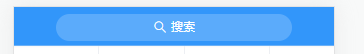

1. 使用导航栏组件
2. 在导航栏组件中插入按钮
   - 文本
   - 图标
3. 样式调整
   - 宽高
   - 背景色
   - 边框
   - 文本大小
   - 图标大小

**步骤：**

1. 在`home.vue`中设置导航

   **注意：** 

   1. UI组件默认样式可能会对实际布局产生影响，需要将其覆盖
   2. 如果通过类名无法修改样式，尝试使用`/deep/`来深度设置

   ```vue
   <template>
     <div class="home-container"  fixed>
       <!-- 导航栏 -->
       <van-nav-bar class="page-nav-bar">
         <van-button
           class="search-btn"
           slot="title"
           type="info"
           size="small"
           round
           icon="search"
         >搜索</van-button>
       </van-nav-bar>
       <!-- /导航栏 -->
     </div>
   </template>
   
   <style scoped lang="less">
   .home-container {
     padding-top: 174px;
     padding-bottom: 100px;
     /deep/.van-nav-bar__title {
       max-width: unset;
     }
     .search-btn {
       width: 555px;
       height: 64px;
       background-color: #5babfb;
       border: none;
       font-size: 28px;
       .van-icon {
         font-size: 32px;
       }
     }
   }
   </style>
   
   ```

## 1.2 频道列表

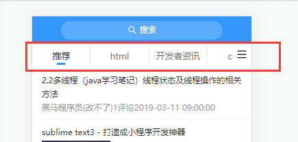

### 1.2.1 使用 Tab 标签页组件

> 参考：[Tab 标签页组件](https://youzan.github.io/vant/#/zh-CN/tab)
>
> 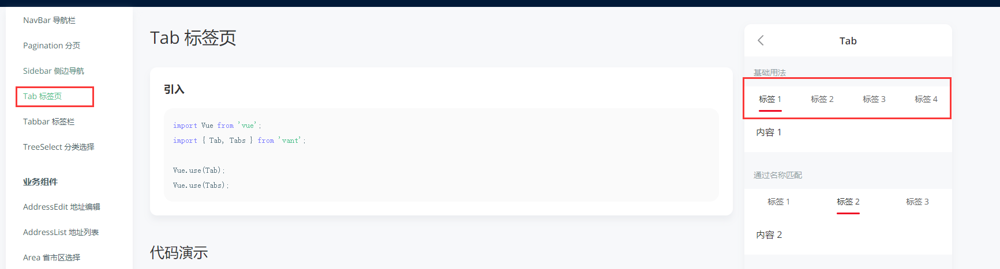

1. 实现滑动导航

   ```vue
       <!-- 频道列表 -->
       <!--
         通过v-model绑定当前激活标签对应的索引值，默认情况下启用第一个标签
         通过animated属性可以开启切换标签内容时的转场动画
         通过swipeable属性可以开启滑动切换标签页
         通过swipe-threshold属性设置最低滑动标签数
       -->
       <van-tabs v-model="active" animated swipeable swipe-threshold="3">
         <van-tab title="标签 1">内容 1</van-tab>
         <van-tab title="标签 2">内容 2</van-tab>
         <van-tab title="标签 3">内容 3</van-tab>
         <van-tab title="标签 4">内容 4</van-tab>
       </van-tabs>
   ```

2. 定义active

   ```js
     data () {
       return {
         active: 0
       }
     }
   ```

### 1.2.2 基础样式调整

- 标签项
  + 右边框
  + 下边框
  + 宽高
  + 文字大小
  + 文字颜色
- 底部条
  + 宽高
  + 颜色
  + 位置

```css
/deep/ .channel-tabs {
  .van-tabs__wrap {
    position: fixed;
    top: 92px;
    z-index: 1;
    left: 0;
    right: 0;
    height: 82px;
  }

  .van-tab {
    border-right: 1px solid #edeff3;
    min-width: 200px;
    font-size: 30px;
    color: #777777;
  }

  .van-tab--active {
    color: #333333;
  }

  .van-tabs__nav {
    padding-bottom: 0;
  }

  .van-tabs__line {
    bottom: 8px;
    width: 31px !important;
    height: 6px;
    background-color: #3296fa;
  }
}
```

### 1.2.3 处理汉堡按钮

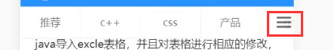

1. 使用插槽插入内容

   ```vue
   <van-tabs class="channel-tabs" v-model="active" animated swipeable swipe-threshold="3">
     <van-tab title="标签 1">内容 1</van-tab>
     <van-tab title="标签 2">内容 2</van-tab>
     <van-tab title="标签 3">内容 3</van-tab>
     <van-tab title="标签 4">内容 4</van-tab>
     <van-tab title="标签 5">内容 5</van-tab>
     <div slot="nav-right" class="hamburger-btn">
       <i class="toutiao toutiao-gengduo"></i>
     </div>
   </van-tabs>
   ```

2. 样式调整

   - 定位
   - 内容居中
   - 宽高
   - 背景色、透明度
   - 字体图标大小

   > 通过`ps`在图层右键复制`css`样式

   ```css
   .hamburger-btn {
     position: fixed;
     right: 0;
     display: flex;
     justify-content: center;
     align-items: center;
     width: 66px;
     height: 82px;
     background-color: #fff;
     background-color: rgba(255, 255, 255, 0.902);
   }
   ```

3. 使用微元素设置渐变边框

   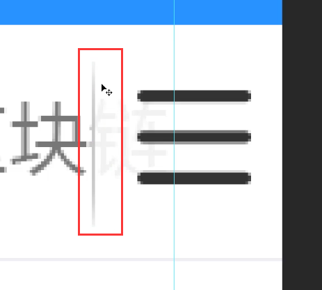

   + 定位
   + 宽高
   + 背景图
   + 背景图填充模式

   添加占位符充当内容区域

   ```vue
   <van-tabs class="channel-tabs" v-model="active" animated swipeable swipe-threshold="3">
     <van-tab title="标签 1">内容 1</van-tab>
     <van-tab title="标签 2">内容 2</van-tab>
     <van-tab title="标签 3">内容 3</van-tab>
     <van-tab title="标签 4">内容 4</van-tab>
     <van-tab title="标签 5">内容 5</van-tab>
     <div slot="nav-right" class="placeholder"></div>
     <div slot="nav-right" class="hamburger-btn">
       <i class="toutiao toutiao-gengduo"></i>
     </div>
   </van-tabs>
   ```

   CSS 样式：

   ```css
   .placeholder {
     flex-shrink: 0; /* flex布局需要用这个属性不让它参与flex计算 */
     width: 66px;
     height: 82px;
   }
   
   .hamburger-btn {
     position: fixed;
     right: 0;
     display: flex;
     justify-content: center;
     align-items: center;
     width: 66px;
     height: 82px;
     background-color: #fff;
     background-color: rgba(255, 255, 255, 0.902);
   
     i.toutiao {
       font-size: 33px;
     }
   
     &:before {
       content: "";
       position: absolute;
       left: 0;
       width: 2px;
       height: 58px;
       background-image: url(../../assets/gradient-gray-line.png);
       background-size: contain;
     }
   }
   ```

### 1.2.4 展示频道列表

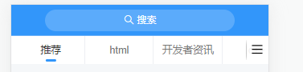

思路：

1. 找数据接口
2. 把接口封装为请求方法
3. 在组件中请求获取数据
4. 模板绑定

1. 在`api/user.js`中封装请求接口

   ```js
   /**
    * 获取用户频道列表
    */
   export const getUserChannels = () => {
     return request({
       method: 'GET',
       url: '/v1_0/user/channels'
     })
   }
   ```

2. 在`api/index.js`出口中导出

   ```js
   import { getUserChannels } from './user.js'
   
   export const getUserChannelsAPI = getUserChannels
   ```

3. 请求获取数据

   ```vue
   <script>
     // 1. 导入 获取频道列表的方法
     import { getUserChannelsAPI } from '../../api/index.js'
     export default {
       name: 'HomeIndex',
       components: {},
       props: {},
       data () {
         return {
           active: 0,
           channels: [] // 频道列表
         }
       },
   
       created () {
         // 调用获取频道列表
         this.loadChannels()
       },
   
       methods: {
         async loadChannels () {
           try {
             const { data } = await getUserChannelsAPI()
             this.channels = data.data.channels
             console.log(this.channels)
           } catch (err) {
             this.$toast('获取频道列表数据失败')
           }
         }
       }
     }
   </script>
   ```

4. 模板绑定

   ```vue
   <van-tabs class="channel-tabs" v-model="active" animated swipeable>
     <van-tab v-for="item in channels" :key="item.id" :title="item.name">
       {{ item.name }}
     </van-tab>
     <div slot="nav-right" class="placeholder">
     </div>
     <div slot="nav-right" class="hamburger-btn">
       <i class="toutiao toutiao-gengduo"></i>
     </div>
   </van-tabs>
   ```

## 1.3 文章列表

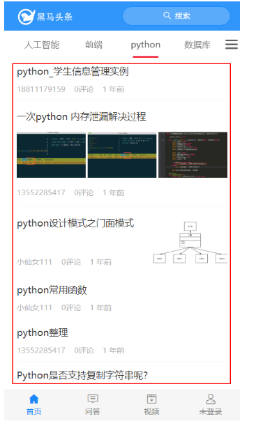

### 1.3.1 思路分析

1. 获取数据思路

   1. 找到数据接口
   2. 封装请求方式
   3. 在组件中请求获取数据，将数据存储到 data 的变量中
   4. 模板绑定展示

2. 根据不同的频道加载不同的文章列表

   1. 方案一：每次切换tab频道都重新获取一下该频道的列表数据

      如：

      - 有一个 `list` 数组，用来存储文章列表

      - 查看 `a` 频道：请求获取数据，让 `list = a` 频道文章

      - 查看 `b` 频道：请求获取数据，让 `list = b` 频道文章

      - 查看 `c` 频道：请求获取数据，让 `list = c` 频道文章

        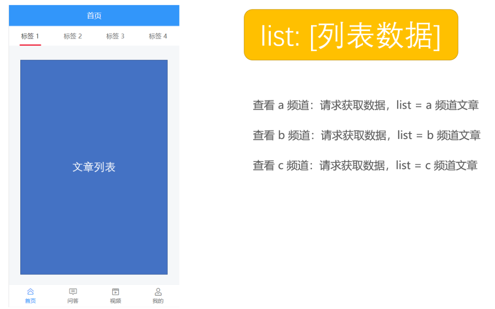

      > 问题： **加载过的数据列表能否不要重新加载？**

   2. 方案二： 准备**多个 list 数组，每个频道对应一个，查看哪个频道就把数据往哪个频道的列表数组中存放，这样的话就不会导致覆盖问题**。

      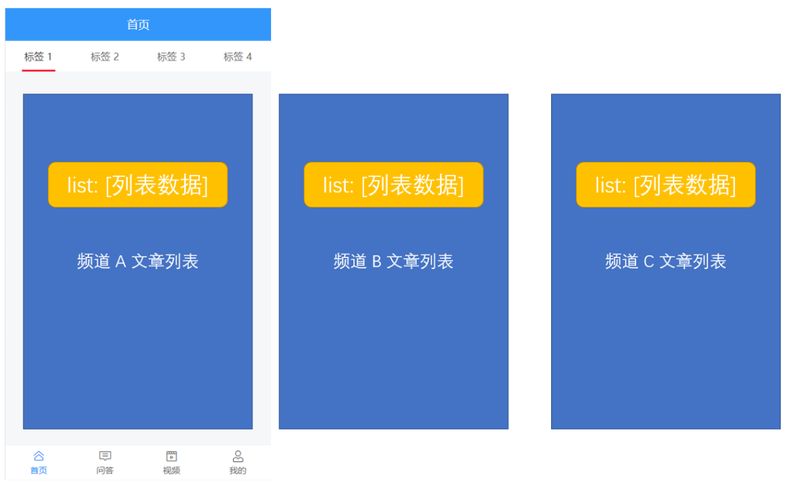

      > 问题： 可是有多少频道就得有多少频道文章数组，我们都一个一个声明的话会非常麻烦，所以这里的建议是利用组件来处理。

   3. 方案三：封装一个文章列表组件，在频道列表中`<van-tab>`中吧文章列表遍历出来

      **注意：** `<van-tab>`组件再切换不同的频道时，加载过的数据页面是不会重新加载

      

      ​		**因为文章列表组件中请求获取文章列表数据需要频道 id，所以 频道 id 应该作为 props 参数传递给文章列表组件，为了方便，我们直接把频道对象传递给文章列表组件就可以了。**

      

      在文章列表中请求获取对应的列表数据，展示到列表中。

      最后把组件在频道列表中遍历出来，就像下面这样。

      

### 1.3.2 创建文章列表组件

1. 创建 `src/views/home/components/article-list.vue`

   ```vue
   <template>
     <div class="article-list"></div>
   </template>
   
   <script>
   export default {
     name: 'ArticleList',
     props: {
       channel: {
         type: Object,
         default: () => ({})
       }
     }
   }
   </script>
   
   <style scoped lang="less"></style>
   
   ```

2. 在 `home/index.vue` 中注册使用

   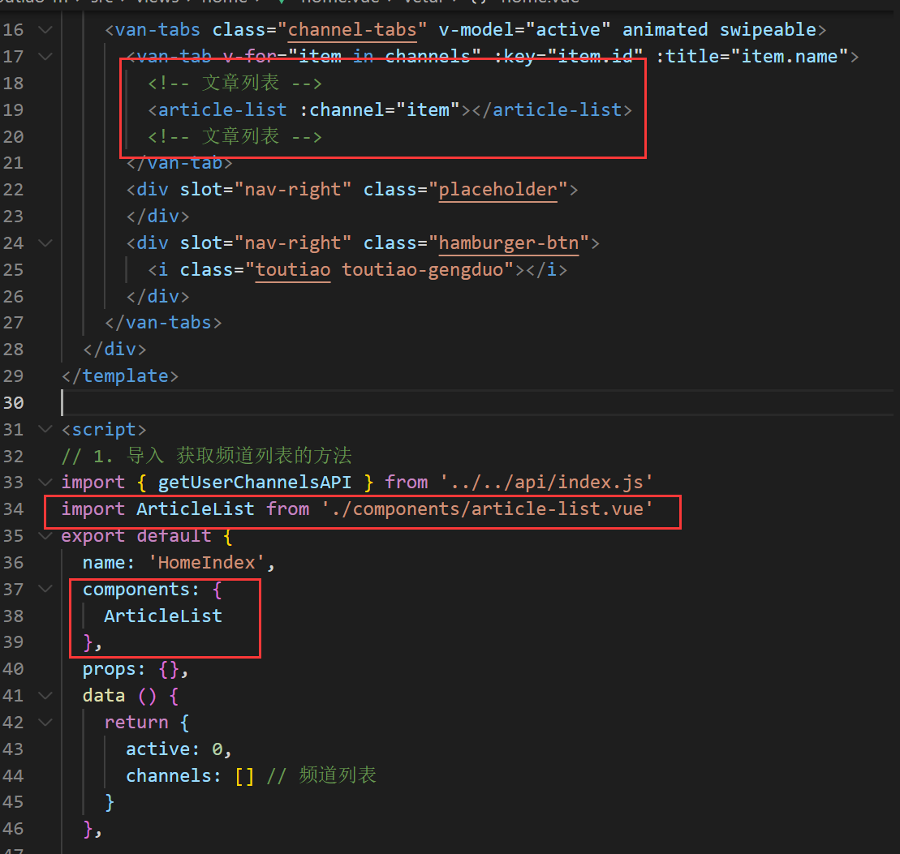

   答疑：

   - 为什么标签内容是懒渲染的？

     - 因为这是 Tab 标签页组件本身支持的默认功能，如果不需要可以通过配置 `:lazy-render="false"` 来关闭这个效果。

       

### 1.3.3 使用List列表组件

> [List 列表组件](https://youzan.github.io/vant/#/zh-CN/list)：瀑布流滚动加载，用于展示长列表。
>
> 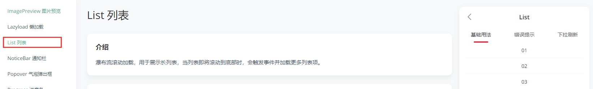

List 组件通过 loading 和 finished 两个变量控制加载状态，
当组件初始化或滚动到到底部时，会触发 load 事件并将 loading 设置成 true，此时可以发起异步操作并更新数据，数据更新完毕后，将 loading 设置成 false 即可。
若数据已全部加载完毕，则直接将 finished 设置成 true 即可。

  - `load 事件`：
    + List 初始化后会触发一次 load 事件，用于加载第一屏的数据。
    + 如果一次请求加载的数据条数较少，导致列表内容无法铺满当前屏幕，List 会继续触发 load 事件，直到内容铺满屏幕或数据全部加载完成。
  - `loading 属性`：控制加载中的 loading 状态
    + 非加载中，loading 为 false，此时会根据列表滚动位置判断是否触发 load 事件（列表内容不足一屏幕时，会直接触发）
    + 加载中，loading 为 true，表示正在发送异步请求，此时不会触发 load 事件
  - `finished 属性`：控制加载结束的状态
    + 在每次请求完毕后，需要手动将 loading 设置为 false，表示本次加载结束
    + 所有数据加载结束，finished 为 true，此时不会触发 load 事件
- List 初始化后会触发一次 load 事件，用于加载第一屏的数据
          如果一次请求加载的数据条数较少，导致列表内容无法铺满当前屏幕，List 会继续触发 load 事件，直到内容铺满屏幕或数据全部加载完成

**测试`van-list`组件加载功能 - 复制vant官网文档上的内容**

```vue
<template>
  <div class="article-list">
    <van-list
      v-model="loading"
      :finished="finished"
      finished-text="没有更多了"
      @load="onLoad"
    >
      <van-cell v-for="item in list" :key="item" :title="item" />
    </van-list>
  </div>
</template>

<script>
export default {
  name: 'ArticleList',
  props: {
    channel: {
      type: Object,
      default: () => ({})
    }
  },
  data () {
    return {
      list: [], // 存储列表数据的数组
      loading: false, // 控制加载中 loading 状态
      finished: false // 控制数据加载结束的状态
    }
  },
  methods: {
    // 初始化或滚动到底部的时候会触发调用 onLoad
    onLoad () {
      console.log('onLoad')
      // 1. 请求获取数据
      // setTimeout 仅做示例，真实场景中一般为 ajax 请求
      setTimeout(() => {
        // 2. 把请求结果数据放到 list 数组中
        for (let i = 0; i < 10; i++) {
          // 0 + 1 = 1
          // 1 + 1 = 2
          // 2 + 1 = 3
          this.list.push(this.list.length + 1)
        }

        // 3. 本次数据加载结束之后要把加载状态设置为结束
        //     loading 关闭以后才能触发下一次的加载更多
        this.loading = false

        // 4. 判断数据是否全部加载完成
        if (this.list.length >= 40) {
          // 如果没有数据了，把 finished 设置为 true，之后不再触发加载更多
          this.finished = true
        }
      }, 1000)
    }
  }
}
</script>
```

### 1.3.4 加载文章列表数据

1. 实现思路

   - 找到数据接口
   - 封装请求方法
   - 请求获取数据
   - 模板绑定

2. 创建 `src/api/article.js` 封装获取文章列表数据的接口

   ```JS
   /**
    * 文章接口模块
    */
   import request from '../utils/request.js'
   
   /**
    * 获取频道的文章列表
    */
   export const getArticles = params => {
     return request({
       method: 'GET',
       url: '/v1_0/articles',
       params
     })
   }
   ```

3. 在`api/index.js`中导出

   ```js
   import { getArticles } from './article.js'
   
   export const getArticlesAPI = getArticles
   ```

4. 然后在首页文章列表组件 `onload` 的时候请求加载文章列表

   ```JS
   import { getArticlesAPI } from '../../../api/index.js'
   export default {
   	...
     methods: {
       // 初始化或滚动到底部的时候会触发调用 onLoad
       async onLoad () {
         // 1. 请求获取数据
         try {
           const { data: res } = await getArticlesAPI({
             channel_id: this.channel.id, // 频道 id
             timestamp: this.timestamp || Date.now() // 时间戳，请求新的推荐数据传当前的时间戳，请求历史推荐传指定的时间戳
           })
           console.log(res)
         } catch (err) {
           console.log(err)
         }
       }
     }
   }
   ```

5. 将数据渲染到页面

   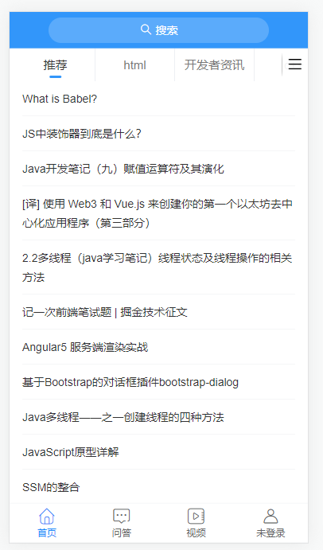

   **JS部分**

   ```html
   <script>
   import { getArticlesAPI } from '../../../api/index.js'
   export default {
     name: 'ArticleList',
     props: {
       channel: {
         type: Object,
         default: () => ({})
       }
     },
     data () {
       return {
         list: [], // 存储列表数据的数组
         loading: false, // 控制加载中 loading 状态
         finished: false, // 控制数据加载结束的状态
         timestamp: null // 请求下一页数据的时间戳
       }
     },
     methods: {
       // 初始化或滚动到底部的时候会触发调用 onLoad
       async onLoad () {
         // 1. 请求获取数据
         try {
           const { data: res } = await getArticlesAPI({
             channel_id: this.channel.id, // 频道 id
             timestamp: this.timestamp || Date.now() // 时间戳，请求新的推荐数据传当前的时间戳，请求历史推荐传指定的时间戳
           })
           console.log(res)
           // 2. 把数据添加到 list 数组中
           this.list.push(...res.data.results)
   
           // 3. 设置本次加载中 loading 状态结束
           this.loading = false
   
           // 4. 判断数据是否加载结束
           if (res.data.results.length) {
             // 更新获取下一页数据的时间戳
             this.timestamp = res.data.pre_timestamp
           } else {
             // 没有数据了，设置加载状态结束，不再触发上拉加载更多了
             this.finished = true
           }
         } catch (err) {
           this.loading = false
           console.log(err)
         }
       }
     }
   }
   </script>
   ```

   **template部分**

   ```vue
   <van-list
             v-model="loading"
             :finished="finished"
             finished-text="没有更多了"
             @load="onLoad"
             >
     <van-cell v-for="item in list" :key="item.art_id" :title="item.title" />
   </van-list>
   ```

### 1.3.5 请求数据失败时的处理

示例：

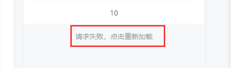

1. 查阅官网

   - `vant-list`组件中有一个`error`属性以及`error-text`属性，这两个属性可以提供错误提升方案
   - 通过修改error的布尔值来切换是否错误
   - 用户点击错误提示后会重新触发 load 事件

   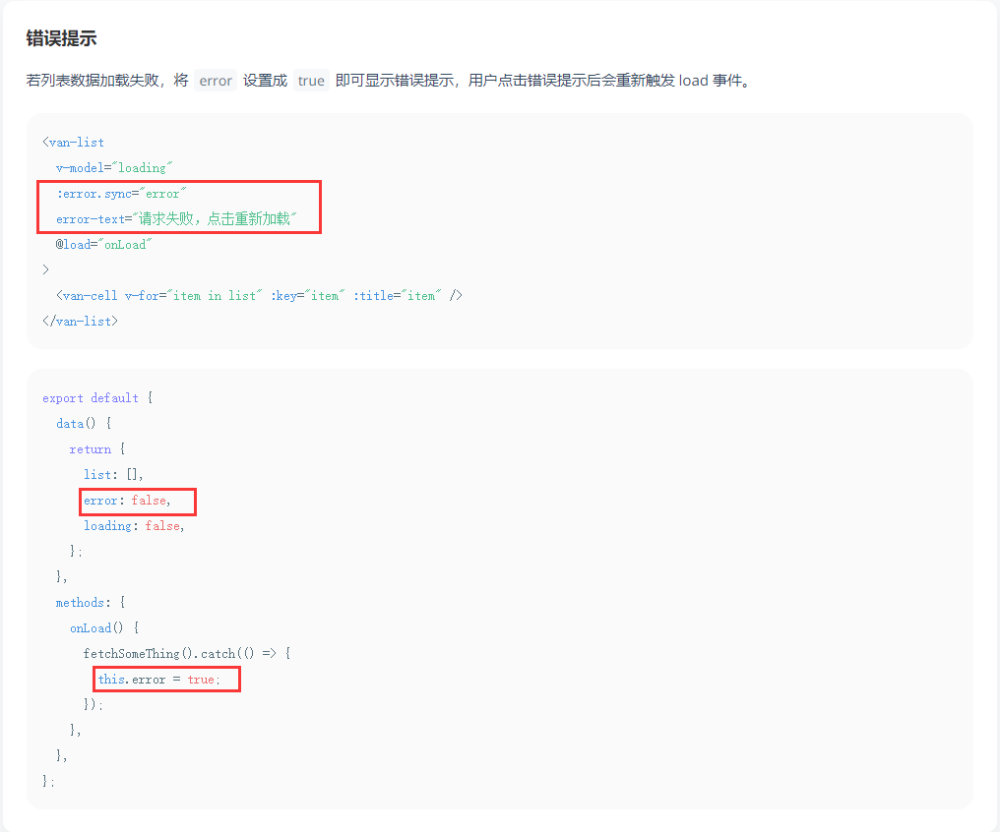

2. 添加属性

   **template**

   ```vue
   <van-list
             v-model="loading"
             :finished="finished"
             :error.sync="error"
             error-text="请求失败，点击重新加载"
             finished-text="没有更多了"
             @load="onLoad"
             >
     <van-cell v-for="item in list" :key="item.art_id" :title="item.title" />
   </van-list>
   ```

   **JS部分**

   ```js
   export default {
     ...
     data () {
       return {
         list: [], // 存储列表数据的数组
         loading: false, // 控制加载中 loading 状态
         finished: false, // 控制数据加载结束的状态
         timestamp: null, // 请求下一页数据的时间戳
         error: false // 控制列表加载失败的提示状态
     	}
     },
     methods: {
       // 初始化或滚动到底部的时候会触发调用 onLoad
       async onLoad () {
         // 1. 请求获取数据
         try {
           const { data: res } = await getArticlesAPI({
             channel_id: this.channel.id, // 频道 id
             timestamp: this.timestamp || Date.now() // 时间戳，请求新的推荐数据传当前的时间戳，请求历史推荐传指定的时间戳
           })
           console.log(res)
           // 2. 把数据添加到 list 数组中
           this.list.push(...res.data.results)
   
           // 3. 设置本次加载中 loading 状态结束
           this.loading = false
           // 4. 判断数据是否加载结束
           if (res.data.results.length) {
             // 更新获取下一页数据的时间戳
             this.timestamp = res.data.pre_timestamp
           } else {
             // 没有数据了，设置加载状态结束，不再触发上拉加载更多了
             this.finished = true
           }
   				
           // 主动报错测试
           JSON.parse('asd')
         } catch (err) {
           // 展示错误提示状态
           this.error = true
   
           // 请求失败了，loading 也需要关闭
           this.loading = false
           console.log(err)
         }
       }
     }
   }
   ```

## 1.4 下拉刷新列表

**示例：**


### 1.4.1 基本组件使用

1. 实现思路：

   - 注册下拉刷新事件（组件）的处理函数
   - 发送请求获取文章列表数据
   - 把获取到的数据添加到当前频道的文章列表的顶部
   - 提示用户刷新成功！

2. 使用 Vant 中的 [PullRefresh 下拉刷新](https://youzan.github.io/vant/#/zh-CN/pull-refresh) 组件

   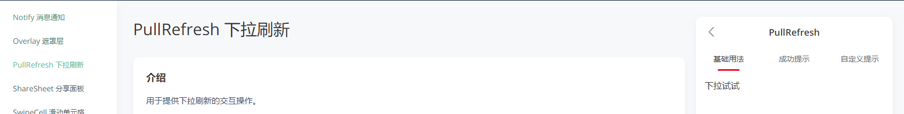

3. 用`<van-pull-refresh>`组件包裹`<van-list>`, 并设置相关数据

   ```VUE
   <template>
     <div class="article-list">
       <van-pull-refresh
         v-model="isreFreshLoading"
         :success-text="refreshSuccessText"
         :success-duration="1500"
         @refresh="onRefresh"
       >
         <van-list
           v-model="loading"
           :finished="finished"
           :error.sync="error"
           error-text="请求失败，点击重新加载"
           finished-text="没有更多了"
           @load="onLoad"
         >
           <van-cell v-for="item in list" :key="item.art_id" :title="item.title" />
         </van-list>
       </van-pull-refresh>
     </div>
   </template>
   
   <script>
   export default {
     data () {
       return {
         isreFreshLoading: false, // 控制下拉刷新的 loading 状态
         refreshSuccessText: '刷新成功' // 下拉刷新成功提示文本
       }
     },
     methods: {
       // 当下拉刷新的时候会触发调用该函数
       onRefresh () {
         this.isreFreshLoading = false
         this.refreshSuccessText = '刷新成功'
       }
     }
   }
   </script>
   ```

### 1.4.2 定义下拉方法

1. 下拉刷新时会触发组件的 `refresh` 事件

2. 在事件的回调函数中可以进行同步或异步操作，操作完成后将 `v-model` 设置为 `false`，表示加载完成。

   **注意: **每次下拉刷新后需要把状态值还原，否则会一直咋加载

   ```js
   // 当下拉刷新的时候会触发调用该函数
       async onRefresh () {
         try {
           // 1. 请求获取数据
           const { data: res } = await getArticlesAPI({
             channel_id: this.channel.id, // 频道ID
             timestamp: Date.now() // 下拉刷线，每次请求获取最新数据，所以传递当前最新时间戳
           })
   
           // 2. 将数据追加到列表的顶部
           this.list.unshift(...res.data.results)
   
           // 3. 关闭下拉刷新的 loading 状态
           this.isreFreshLoading = false
           
           // 更新下拉刷新成功提示的文本
           this.refreshSuccessText = `刷新成功，更新了${res.data.results.length}条数据`
         } catch (error) {
           // 关闭下拉并且提示失败
           this.refreshSuccessText = '刷新失败'
           this.isreFreshLoading = false
         }
       }
   ```

## 1.5 记录滚动位置

> 问：为什么列表滚动会相互影响？
>
> 答：因为每个列表并不是在自己内部进行滚动的，耳塞整个公共的body在滚动

1. 如何快速找到那个元素产生滚动？

   **将下列代码粘贴到控制台输出一下，就可以知道哪个元素产生了滚动**

   ```js
   function findScroller(element) {
     element.onscroll = function() { console.log(element)}
     Array.from(element.children).forEach(findScroller);
   }
   
   findScroller(document.body)
   ```

   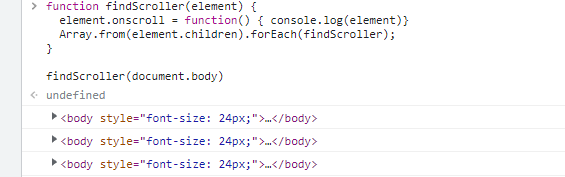

2. 解决方案： 为每个标签列表设置独立的滚动容器

   **就是让组件内部设置固定高度，让这个组件盒子内部滚动**

`views\home\components\article-list.vue`

```vue
<style scoped lang="less">
.article-list {
  // 百分比单位是相对于父元素的，这里高度其实为0
  // height: 100%;
  // overflow-y: auto;

  // 视口（在移动端是布局视口）单位：vw 和 vh，不受父元素影响
  // 1vw = 视口宽度的百分之一
  // 1vh = 视口高度的百分之一
  /*
    兼容性：
    1. 在pc端已经兼容到IE9
    2. 移动端 IOS8以上， Androld 4.4 以上
    3. 微信x5内核
    已经2202年了，基本上就没有这种兼容性问题
  */
  height: 79vh;
  overflow-y: auto;
}
</style>
```

# 二. 文章列表项

目标：


分析： 

1. 文章列表项共有3种形式展示
2. 在很多页面中都会用到这个列表项

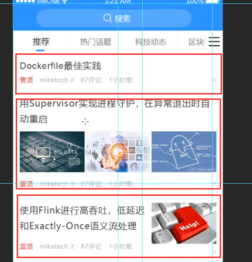

## 2.1 准备组件

> 在我们项目中有好几个页面中都有这个文章列表项内容，如果我们在每个页面中都写一次的话不仅效率低而且维护起来也麻烦。所以最好的办法就是我们把它封装为一个组件，然后在需要使用的组件中加载使用即可。

1. 创建 `src/components/article-item/article-item.vue` 组件

   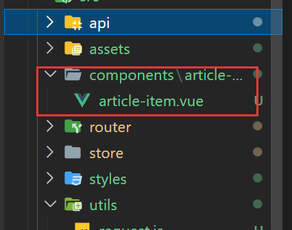

   ```vue
   <template>
     <div class="article-item">文章列表项</div>
   </template>
   
   <script>
   export default {
     name: 'ArticleItem',
     props: {
       article: {
         type: Object,
         default: () => ({})
       }
     }
   }
   </script>
   
   <style scoped lang="less"></style>
   
   ```

2. 在文章列表组件中注册使用文章列表项组件

   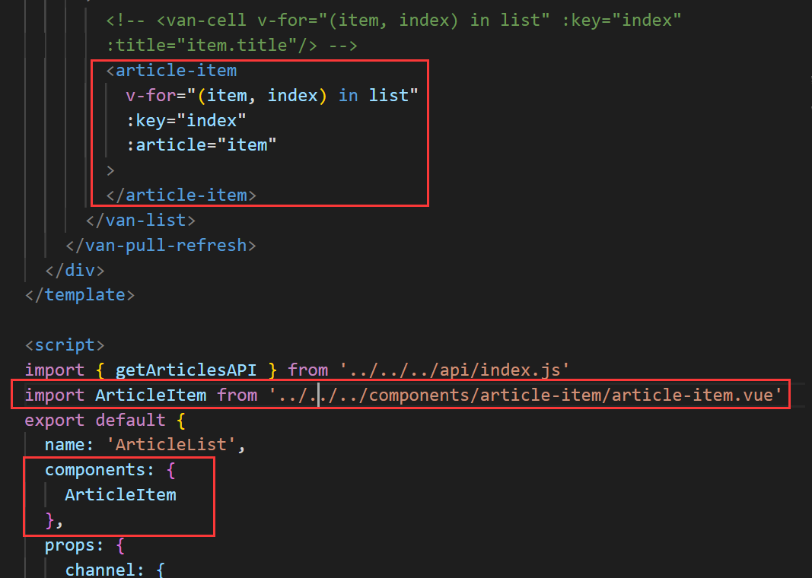

## 2.2 展示列表项内容

- 使用 Cell 单元格组件
- 使用插槽展示标题
- 使用插槽展示底部信息

**注意：**注意区分不同图片数量的内容展示方式的不同

```vue
<template>
  <van-cell class="article-item">
    <!-- 标题信息 -->
    <template #title>
      <div class="title">{{ article.title }}</div>
    </template>

    <!-- 底部信息 -->
    <template #label>
      <!-- 根据type数量来判断有没有封面 0是没有 1是有一个 3是有3个 -->
      <div v-if="article.cover.type === 3" class="cover-wrap">
        <div
          class="cover-item"
          v-for="(img, index) in article.cover.images"
          :key="index"
        >
          <van-image
            width="100"
            height="100"
            :src="img"
          />
        </div>
      </div>
      <div>
        <span>{{ article.aut_name }}</span>
        <span>{{ article.comm_count }}评论</span>
        <span>{{ article.pubdate }}</span>
      </div>
    </template>

    <!-- 右侧图片信息 -->
    <!-- 根据type数量来判断有没有封面 0是没有 1是有一个 3是有3个 -->
    <template #default v-if="article.cover.type === 1">
      <van-image
        width="100"
        height="100"
        :src="article.cover.images[0]"
      />
    </template>
  </van-cell>
</template>

<script>
export default {
  name: 'ArticleItem',
  props: {
    article: {
      type: Object,
      default: () => ({})
    }
  }
}
</script>

<style scoped lang="less">

</style>

```

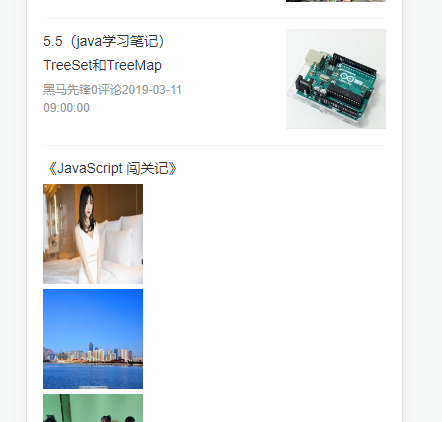

## 2.3 样式调整

- 文章标题

  + 字号

  + 颜色

  + 多行文字省略

    

- 单图封面

  + 封面容器 - 让右侧图片固定，左侧自适应

    * 去除 flex: 1，固定宽高

    * 左内边距

      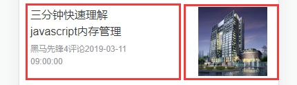

  + 封面图

    * 宽高
    * 填充模式：cover

    **template**

    ```vue
    <!-- 标题信息 -->
    <template #title>
    <!-- 设置vant中的内置class让标题两行后省略 -->
    	<div class="title van-multi-ellipsis--l2">{{ article.title }}</div>
    </template>
    
    <!-- 右侧图片信息 -->
    <!-- 给图片添加类名 -->
    <template #default v-if="article.cover.type === 1">
    	<van-image
                 class="right-color"
                 fit="cover"
                 :src="article.cover.images[0]"
                 />
    </template>
    ```

    **CSS**

    ```CSS
    .article-item {
      .title {
        font-size: 32px;
        color: #3a3a3a;
      }
      /* 固定右侧盒子 */
        .van-cell__value {
        flex: unset;
        width: 232px;
        height: 146px;
        padding-left: 25px;
      }
      /* 设置图片样式 */
      .right-color {
        width: 100%;
        height: 146px;
      }
    }
    ```

- 底部文本信息

  + 字号
  + 颜色
  + 间距

  **template**

  ```vue
  <!-- 设置底部文字容器 -->
  <div class="label-info-wrap">
    <span>{{ article.aut_name }}</span>
    <span>{{ article.comm_count }}评论</span>
    <span>{{ article.pubdate }}</span>
  </div>
  ```

  **CSS**

  ```CSS
  /* 底部文字样式 */
  .label-info-wrap span {
    font-size: 22px;
    color: #b4b4b4;
    margin-right: 25px;
  }
  ```

- 多图封面

  + 外层容器
    * flex 容器
    * 上下外边距
  + 图片容器
    * 平均分配容器空间：flex: 1;
    * 固定高度
    * 容器项间距
  + 图片
    * 宽高
    * 填充模式

  **template**

  ```vue
  <!-- 根据type数量来判断有没有封面 0是没有 1是有一个 3是有3个 -->
  <div v-if="article.cover.type === 3" class="cover-wrap">
    <div class="cover-item" v-for="(img, index) in article.cover.images" :key="index">
      <van-image class="right-color" fit="cover" :src="img" />
    </div>
  </div>
  ```

  **CSS**

  ```CSS
  /* 多图展示样式 */
    .cover-wrap {
      display: flex;
      padding: 30px 0;
  
      .cover-item {
        /* 每张图均分宽度 */
        flex: 1;
        height: 146px;
  
        &:not(:last-child) {
          padding-right: 4px;
        }
      }
    }
  ```

**完整代码**

```vue
<template>
  <van-cell class="article-item">
    <!-- 标题信息 -->
    <template #title>
      <!-- 设置vant中的内置class让标题两行后省略 -->
      <div class="title van-multi-ellipsis--l2">{{ article.title }}</div>
    </template>

    <!-- 底部信息 -->
    <template #label>
      <!-- 根据type数量来判断有没有封面 0是没有 1是有一个 3是有3个 -->
      <div v-if="article.cover.type === 3" class="cover-wrap">
        <div class="cover-item" v-for="(img, index) in article.cover.images" :key="index">
          <van-image class="right-color" fit="cover" :src="img" />
        </div>
      </div>
      <!-- 设置底部文字容器 -->
      <div class="label-info-wrap">
        <span>{{ article.aut_name }}</span>
        <span>{{ article.comm_count }}评论</span>
        <span>{{ article.pubdate }}</span>
      </div>
    </template>

    <!-- 右侧图片信息 -->
    <!-- 根据type数量来判断有没有封面 0是没有 1是有一个 3是有3个 -->
    <template #default v-if="article.cover.type === 1">
      <van-image class="right-color" fit="cover" :src="article.cover.images[0]" />
    </template>
  </van-cell>
</template>

<script>
export default {
  name: 'ArticleItem',
  props: {
    article: {
      type: Object,
      default: () => ({})
    }
  }
}
</script>

<style scoped lang="less">
.article-item {
  .title {
    font-size: 32px;
    color: #3a3a3a;
  }

  /* 固定右侧盒子 */
  .van-cell__value {
    flex: unset;
    width: 232px;
    height: 146px;
    padding-left: 25px;
  }

  /* 设置图片样式 */
  .right-color {
    width: 100%;
    height: 146px;
  }

  /* 底部文字样式 */
  .label-info-wrap span {
    font-size: 22px;
    color: #b4b4b4;
    margin-right: 25px;
  }

  /* 多图展示样式 */
  .cover-wrap {
    display: flex;
    padding: 30px 0;

    .cover-item {
      /* 每张图均分宽度 */
      flex: 1;
      height: 146px;

      &:not(:last-child) {
        padding-right: 4px;
      }
    }
  }
}
</style>
```

## 2.4 关于第三方图片资源403问题

> 02 07:10

**原因：** 项目的接口数据是后端通过爬虫抓取的第三方平台内容，而第三方平台对图片资源做了防盗链保护处理。

**问：** 第三方平台怎么处理图片资源保护的？

**答：** 服务端一般使用 Referer 请求头识别访问来源，然后处理资源访问。

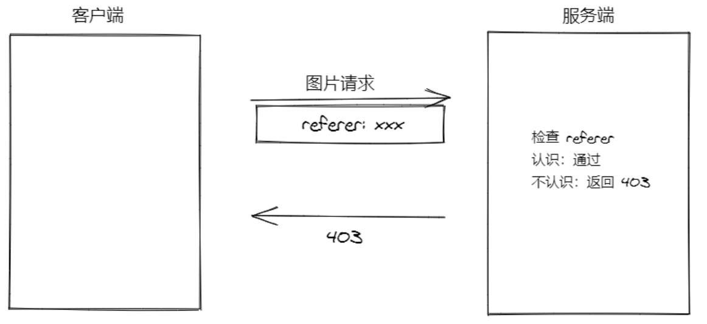

**问：** Referer 是什么东西？

> 扩展参考：http://www.ruanyifeng.com/blog/2019/06/http-referer.html

**答：** Referer 是 HTTP 请求头的一部分，当浏览器向 Web 服务器发送请求的时候，一般会带上 Referer，它包含了当前请求资源的来源页面的地址。服务端一般使用 Referer 请求头识别访问来源，可能会以此进行统计分析、日志记录以及缓存优化等。

> 需要注意的是 referer 实际上是 "referrer" 误拼写。参见 [HTTP referer on Wikipedia](https://zh.wikipedia.org/wiki/HTTP_referer) （HTTP referer 在维基百科上的条目）来获取更详细的信息。


**问：**怎么解决？

**答：**不要发送 referrer ，对方服务端就不知道你从哪来的了，姑且认为是你是自己人吧。

用 `<a>`、`<area>`、``、`<iframe>`、`<script>` 或者 `<link>` 元素上的 `referrerpolicy` 属性为其设置独立的请求策略，例如：

```html

```

或者直接在 HTMl 页面头中通过 meta 属性全局配置：

```html
<meta name="referrer" content="no-referrer" />
```

## 2.5 处理相对时间 - dayJs

推荐两个第三方库：

- [Moment.js](https://momentjs.com/)
- [Day.js](https://day.js.org/)

两者都是专门用于处理时间的 JavaScript 库，功能差不多，因为 Day.js 的设计就是参考的 Moment.js。但是 Day.js 相比 Moment.js 的包体积要更小一些，因为它采用了插件化的处理方式。

[Day.js](https://day.js.org/zh-CN/) 是一个轻量的处理时间和日期的 JavaScript 库，和 [Moment.js](https://momentjs.com/) 的 API 设计保持完全一样，如果您曾经用过 Moment.js, 那么您已经知道如何使用 Day.js 。

- Day.js 可以运行在浏览器和 Node.js 中。
- 🕒 和 Moment.js 相同的 API 和用法
- 💪 不可变数据 (Immutable)
- 🔥 支持链式操作 (Chainable)
- 🌐 国际化 I18n
- 📦 仅 2kb 大小的微型库
- 👫 全浏览器兼容

### 2.5.1 基本使用

1. 安装

   ```bash
   npm i dayjs
   ```

2. 使用最基本的dayjs

   `utils/dayjs.js`

   ```js
   import dayjs from 'dayjs'
   // 加载中文语言包
   import 'dayjs/locale/zh-cn'
   
   // dayjs 默认语音是英文，将其配置成中文
   dayjs.locale('zh-cn')
   
   console.log(dayjs().format('YYYY-MM-DD'))
   ```

3. 在 `main.js` 中加载初始化

   ```js
   import './utils/dayjs'
   ```

### 2.5.2 使用dayjs处理时间

1. 定义过滤器 `utils/dayjs.js`

   ```js
   import Vue from 'vue'
   import dayjs from 'dayjs'
   
   // 加载中文语言包
   import 'dayjs/locale/zh-cn'
   
   import relativeTime from 'dayjs/plugin/relativeTime'
   
   // 配置使用处理相对时间的插件
   dayjs.extend(relativeTime)
   
   // 配置使用中文语言包
   dayjs.locale('zh-cn')
   
   // 定义一个全局过滤器，然后就可以在任何组件的模板中使用了
   // 其实过滤器就相当于一个全局可用的方法（仅供模板使用）
   // 参数1：过滤器名称
   // 参数2：过滤器函数
   // 使用方式：{{ 表达式 | 过滤器名称 }}
   // 管道符前面的表达式的结果会作为参数传递到过滤器函数中
   // 过滤器的返回值会渲染到使用过滤器的模板位置
   Vue.filter('relativeTime', value => {
       return dayjs().to(dayjs(value))
   })
   
   // dayjs() 获取当前最新时间
   // console.log(dayjs().format('YYYY-MM-DD'))
   
   // console.log(dayjs().to(dayjs('2015'))) // 2 年以前
   ```

2. 使用过滤器

   ```vue
   <!-- 设置底部文字容器 -->
   <div class="label-info-wrap">
     <span>{{ article.aut_name }}</span>
     <span>{{ article.comm_count }}评论</span>
     <span>{{ article.pubdate | relativeTime }}</span>
   </div>
   ```


