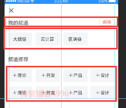

# VUE移动端第四天

# 一. 首页 - 频道编辑

> 通过汉堡按钮点击进入频道设置


**目标：**

1. 创建弹出层
2. 实现频道编辑的页面布局
3. 完成频道的增删改
4. 频道数据的持久化

## 1.1 处理页面弹出层

1. Vant 中内置了 [Popup 弹出层](https://youzan.github.io/vant/#/zh-CN/popup) 组件

   

2. 在首页`home.vue`中 `data`中添加一个数据用来控制弹层的显示和隐藏

   ```js
   data () {
     return {
       ...
       isChennelEditShow: true // 这里我们先设置为 true 就能看到弹窗的页面了
     }
   }
   ```

3. `home.vue`在频道列表后添加弹出层组件

   

   ```vue
   <!-- 频道编辑 -->
   <van-popup class="edit-channel-popup" v-model="isChennelEditShow" position="bottom" :style="{ height: '100%' }" closeable close-icon-position="top-left">内容</van-popup>
   <!-- /频道编辑 -->
   ```

4. 点击汉堡按钮修改`isChennelEditShow`

   ```vue
   <div slot="nav-right" class="hamburger-btn" @click="isChennelEditShow = true">
     <i class="toutiao toutiao-gengduo"></i>
   </div>
   ```

5. 给弹框区域设置一点样式，让内容与关闭按钮不重叠

   ```css
   .edit-channel-popup {
     padding-top: 100px;
   	box-sizing: border-box;
   }
   ```

## 1.2 创建频道编辑组件

1. 创建 `views/home/components/channel-edit.vue`

   ```vue
   <template>
     <div class="channel-edit">频道编辑</div>
   </template>
   
   <script>
   export default {
     name: 'ChannelEdit',
     data () {
       return {}
     },
     methods: {}
   }
   </script>
   
   <style scoped lang="less"></style>
   
   ```

2. 在首页中加载注册, 在弹出层中使用频道编辑组件

   

## 1.3 页面布局

1. 搭建html结构

   - 通过`van-cell`设置频道标题
   - 通过`van-grid`设置频道小框

   

   ```vue
   <template>
     <div class="channel-edit">
       <van-cell :border="false">
         <div slot="title" class="title-text">我的频道</div>
         <van-button
           size="mini"
           round
           type="danger"
           plain
         >编辑</van-button>
       </van-cell>
   
       <van-grid :gutter="10">
         <van-grid-item
           class="channel-item"
           v-for="value in 8"
           :key="value"
           text="文字"
         />
       </van-grid>
   
       <van-cell :border="false">
         <div slot="title" class="title-text">频道推荐</div>
       </van-cell>
   
       <van-grid :gutter="10">
         <van-grid-item
           class="channel-item"
           v-for="value in 8"
           :key="value"
           text="文字"
         />
       </van-grid>
     </div>
   </template>
   
   <script>
   export default {
     name: 'ChannelEdit',
     data () {
       return {}
     },
     methods: {}
   }
   </script>
   
   <style scoped lang="less"></style>
   
   ```

   

2. CSS样式设计

   ```css
   .channel-edit {
     .title-text {
       height: 100%;
       line-height: 58px;
       font-size: 32px;
       color: #333333;
     }
   
     .edit-btn {
       line-height: 48px;
       width: 104px;
       height: 48px;
       font-size: 26px;
       color: #f85959;
       border: 1px solid #f85959;
     }
   
     .channel-item {
       height: 86px;
       width: 160px;
   
       /* 设置按钮背景 */
       /deep/ .van-grid-item__content {
         background-color: #f5f5f6;
   
         /* 设置按钮字体样式 */
         .van-grid-item__text {
           color: #222;
           font-size: 28px;
           margin-top: 0;
         }
       }
     }
   }
   ```

3. 推荐平道 `+`号处理

   ```vue
   <van-grid :gutter="10">
   <van-grid-item
     class="channel-item"
     v-for="value in 8"
     :key="value"
     text="文字"
     icon="plus"
   />
   </van-grid>
   ```

   **CSS样式**

   ```css
   /deep/ .recommend-grid {
     .van-grid-item__content {
       white-space: nowrap;
       flex-direction: row;
   
       /* 设置按钮字体样式 */
   
       .van-icon-plus {
         font-size: 28px;
         margin-right: 6px;
       }
     }
   }
   ```

4. 我的频道右上角关闭图标

   **template**

   ```vue
   <van-grid class="my-grid" :gutter="10">
     <van-grid-item class="channel-item" v-for="value in 8" :key="value" text="文字" icon="close"/>
   </van-grid>
   ```

   **CSS**

   ```css
     /deep/ .my-grid {
       .van-grid-item__content {
         .van-icon-close {
           position: absolute;
           right: -10px;
           top: -10px;
           font-size: 30px;
           color: #cacaca;
           z-index: 2;
         }
       }
     }
   ```


## 1.4 展示我的频道

1. 将父组件中的`channels`传递给频道组件

   ```VUE
   <!-- 频道编辑 -->
   <van-popup
              class="edit-channel-popup"
              v-model="isChennelEditShow"
              position="bottom"
              :style="{ height: '100%' }"
              closeable
              close-icon-position="top-left"
              >
     <channal-edit :myChannels="channels"></channal-edit>
   </van-popup>
   <!-- /频道编辑 -->
   ```

2. 在频道编辑组件中声明接收父组件的 `userChannels` 频道列表数据并遍历展示

   ```js
     props: {
       myChannels: {
         type: Array,
         default: () => []
       }
     },
   ```

   ```vue
   <van-grid class="my-grid" :gutter="10">
     <van-grid-item
                    class="channel-item"
                    v-for="(channelItem, index) in myChannels"
                    :key="index"
                    :text="channelItem.name"
                    icon="close"
                    />
   </van-grid>
   ```

## 1.5 处理激活频道高亮


1. 将首页的active传递给编辑频道组件

   ```vue
   <!-- 传递channels 传递active高亮索引-->
   <channel-edit :active="active" :myChannels="channels" />
   ```

2. 编辑频道组件接收数据

   ```js
     props: {
       myChannels: {
         type: Array,
         default: () => []
       },
       active: {
         type: Number,
         default: 0
       }
     },
   ```

3. 修改结构，根据active设置高亮类名

   **思路：**在我的频道列表遍历时，判断遍历项的索引项的索引是否等于激活的频道标签索引，如果一样则作用一个高亮的CSS类名

   ```vue
       <van-grid class="my-grid" :gutter="10">
         <van-grid-item
           class="channel-item"
           v-for="(channelItem, index) in myChannels"
           :key="index"
           icon="close"
         >
           <span class="text" :class="{active: active === index}" slot="text">{{ channelItem.name }}</span>
         </van-grid-item>
       </van-grid>
   ```

4. 添加active样式，和text样式

   

## 1.6 展示推荐频道列表


思路：

1. 没有用来获取推荐频道的数据接口，但是我们有获取所有频道列表的数据接口。

2. `所有频道列表 - 我的频道 = 剩余推荐的频道`

### 1.6.1 获取所有频道接口

1. 创建`src\api\channel.js`封装数据接口

   ```js
   /**
    * 频道请求模块
    */
   import request from '@/utils/request'
   
   /**
    * 获取所有频道列表
    */
   export const getAllChannels = () => {
     return request({
       method: 'GET',
       url: '/v1_0/channels'
     })
   }
   
   ```

2. 在`src\api\index.js`将接口输出

   ```js
   import { getAllChannels } from './channel.js'
   
   export const getAllChannelsAPI = getAllChannels
   ```

3. 在`channel-edit.vue`中引用接口

   ```js
   import { getAllChannelsAPI } from '../../../api/index.js'
   ```

4. 在编辑频道组件`channel-edit.vue`中请求获取所有频道数据

   ```js
   data () {
       return {
         allChannels: [] // 所有频道
       }
     },
     created () {
       // 获取所有频道
       this.loadAllChannels()
     },
     methods: {
       async loadAllChannels () {
         try {
           const { data: res } = await getAllChannelsAPI()
           this.allChannels = res.data.channels
           console.log(res.data)
         } catch (err) {
           this.$toast('获取频道列表数据失败')
         }
       }
     }
   ```

### 1.6.2 处理展示推荐频道

>  思路：`所有频道 - 用户频道 = 推荐频道`

1. 封装计算属性筛选数据

   - 遍历所有频道
   - 对每一个频道都判断：该频道是否属于我的频道
   - 如果不属于我的频道，则收集起来
   - 直到遍历结束，剩下来就是那些剩余的推荐频道

   ```js
     computed: {
       // 计算属性会观测内部依赖数据的变化
       // 如果依赖的数据发生变化，则计算属性会重新执行
       recommendChannels () {
         // 数组的 filter 方法：遍历数组，把符合条件的元素存储到新数组中并返回
         const list = this.allChannels.filter(channel => {
           // 数组的 find 方法：遍历数组，把符合条件的第1个元素返回
           return !this.myChannels.find(myChannel => {
             return myChannel.id === channel.id
           })
         })
         return list
       }
     },
   ```

2. 模板绑定

   ```vue
       <van-grid class="recommend-grid" :gutter="10">
         <van-grid-item
           class="channel-item"
           v-for="channel in recommendChannels"
           :key="channel.id"
           :text="channel.name"
           icon="plus"
         />
       </van-grid>
   ```

**扩展：使用lodash一步搞定筛选**

```js
  computed: {
    recommendChannels () {
      return [...this.$_.differenceBy(this.allChannels, this.myChannels, 'id')]
    }
  }
```

## 1.7 添加频道


**思路：**

- 给推荐频道列表中每一项注册点击事件
- 获取点击的频道项
- 将频道项添加到我的频道中
- ~~将当前点击的频道项从推荐频道中移除~~
  - 不需要删除，因为我们获取数据使用的是计算属性，当我频道发生改变，计算属性重新求值了

1. 给推荐频道中的频道注册点击事件

   

2. 在添加频道事件处理函数中

   ```js
     data () {
       return {
         myChannelsClone: this.myChannels
       }
     },
     methods: {
       // 添加频道
       onAddChannel (channel) {
         // 不可以直接修改父组件传递过来的参数，所以拷贝一份在data中
         this.myChannelsClone.push(channel)
       }
     }
   ```

> 然后你会神奇的发现点击的那个推荐频道跑到我的频道中了，我们并没有去手动的删除点击的这个推荐频道，但是它没了！
>
> 主要是因为推荐频道是通过一个计算属性获取的，计算属性中使用了 channels（我的频道）数据，所以只要我的频道中的数据发生变化，那么计算属性就会重新运算获取最新的数据。

## 1.8 编辑频道

**思路：**

- 给我的频道中的频道项注册点击事件
- 在事件处理函数中
  - 如果是编辑状态，则执行删除频道操作
  - 如果是非编辑状态，则执行切换频道操作


### 1.8.1 处理编辑状态

1. 在 data 中添加数据用来控制编辑状态的显示

   

2. 在我的频道项中根据编辑状态添加删除图标

   

   

3. 处理点击编辑按钮

   > 编辑和完成字样相互切换

   ```vue
         <van-button
           class="edit-btn"
           size="mini"
           round
           type="danger"
           plain
           @click="isEditShow = !isEditShow"
         >
           {{ isEditShow ? '完成': '编辑' }}
         </van-button>
   ```

4. 控制推荐不删除

   ```vue
   <van-icon v-show="isEdit && index!==0" slot="icon" name="close"></van-icon>
   ```

### 1.8.2 切换频道

> 功能需求：在非编辑器状态下切换频道。

1. 给我的频道项注册点击事件

   

2. 处理函数

   ```js
       // 频道功能方法
       onMyChannelClick (channel, index) {
         if (this.isEditShow) {
           // 1. 编辑状态删除频道
         } else {
           // 2. 非编辑状态切换频道( 通过isEditShow判断)
           this.$emit('update-active', index)
         }
       }
   ```

3. 在父组件中监听处理自定义事件

   ```js
   <!-- 传递channels 传递active高亮索引 定义update-active事件-->
   <channel-edit @update-active="onUpdateActive" :active="active" :myChannels="channels" />
   ```

4. 定义事件函数

   ```js
       // 子组件切换频道
       onUpdateActive (index) {
         this.active = index
         this.isChennelEditShow = false
       }
   ```

### 1.8.3 删除频道

>  功能需求：在编辑状态下删除频道。

1. 完善执行删除操作

   ```js
   // 频道功能方法
       onMyChannelClick (channel, index) {
         if (this.isEditShow) {
           // 1. 编辑状态删除频道
           this.myChannelsClone.splice(index, 1)
   
           // 2. 让激活频道的索引 - 1
           if (index <= this.active) {
             this.$emit('update-active', this.active - 1, true)
           }
         } else {
           // 2. 非编辑状态切换频道( 通过isEditShow判断)
           this.$emit('update-active', index)
         }
       }
   ```

2. 完善update-active方法

   ```vue
       // 子组件切换频道
       onUpdateActive (index, isShow = false) {
         this.active = index
         this.isChennelEditShow = isShow
       }
   ```

3. 判断是否为推荐,如果是推荐则不要删除

   

## 1.9 频道数据持久化

### 1.9.1 业务分析

> 01 频道数据持久化-业务分析  7:40

频道编辑这个功能，无论用户是否登录用户都可以使用。

不登录也能使用

- 数据存储在本地
- 不支持同步功能

登录也能使用

- 数据存储在线上后台服务器
- 更换不同的设备可以同步数据

### 1.9.2 添加频道

**思路：**

- 如果未登录，则存储到本地
- 如果已登录，则存储到线上
  - 找到数据接口
  - 封装请求方法
  - 请求调用

1. 通过状态管理器中的user来判断用户是否登录

2. 在`channel-edit.vue`中导入vuex中的mapState、storage中的方法

   ```js
   import { mapState } from 'vuex'
   ```

   ```js
    computed: {
       ...mapState(['user']),
     },
   ```

3. 根据user判断是否登陆

   > 获取操作后续在制作

   ```js
   import { setItem } from '../../../utils/storage.js'
   
   // 添加频道
   onAddChannel (channel) {
     // 不可以直接修改父组件传递过来的参数，所以拷贝一份在data中
     this.myChannelsClone.push(channel)
   
     // 数据持久化处理
     // 未登录，把数据储存到本地
     // 一登录, 把数据请求接口放到线上
     if (this.user) {
       // 已登录
     } else {
       // 未登陆 把数据存储到本地
       setItem('TOUTIAO_CHANNELS', this.myChannels)
     }
   },
   ```

4. 如果已登录，封装添加频道的请求方法

   ```js
   /**
    * 添加用户频道
    */
   export const addUserChannel = channel => {
     return request({
       method: 'PATCH',
       url: '/v1_0/user/channels',
       data: {
         channels: [channel]
       }
     })
   }
   ```

5. 在`api/index.js`中输出

   ```js
   import { addUserChannel } from './channel.js'
   export const addUserChannelAPI = addUserChannel
   ```

6. 引入addUserChannel方法

7. 修改添加频道的处理逻辑

   ```js
       // 添加频道
       async onAddChannel (channel) {
         // 不可以直接修改父组件传递过来的参数，所以拷贝一份在data中
         this.myChannelsClone.push(channel)
   
         // 数据持久化处理
         // 未登录，把数据储存到本地
         // 一登录, 把数据请求接口放到线上
         if (this.user) {
           // 已登录
           try {
             // 已登录，数据存储到线上
             await addUserChannelAPI({
               id: channel.id, // 频道 id
               seq: this.myChannels.length // 频道的 序号
             })
             this.$toast('添加成功')
           } catch (err) {
             this.$toast('保存失败')
           }
         } else {
           // 未登陆 把数据存储到本地
           setItem('TOUTIAO_CHANNELS', this.myChannels)
         }
       },
   ```

### 1.9.3 删除频道

**思路：**

- 如果未登录，则存储到本地
- 如果已登录，则存储到线上
  - 找到数据接口
  - 封装请求方法
  - 请求调用

1. 封装删除用户频道请求方法

   ```js
   /**
    * 删除用户指定频道
    */
   export const deleteUserChannel = channelId => {
     return request({
       method: 'DELETE',
       url: `/v1_0/user/channels/${channelId}`
     })
   }
   ```

2. 在`api/index.js`中输出

   ```js
   import { deleteUserChannelAPI } from './channel.js'
   export const deleteUserChannelAPI = deleteUserChannel
   ```

3. 在**onMyChannelClick**函数中执行删除操作最后面调用删除持久化的方法

   

4. 定义deleteChannel方法

   ```js
   // 删除数据持久化
       async deleteChannel (channel) {
         try {
           if (this.user) {
             // 已登录，将数据存储到线上
             await deleteUserChannelAPI(channel.id)
           } else {
             // 未登录，将数据存储到本地
             setItem('channles', this.myChannels)
           }
         } catch (err) {
           console.log(err)
           this.$toast('删除频道失败，请稍后重试')
         }
       }
   ```

### 1.9.4 正确的获取首页频道列表数据（未登录状态的列表）


> 提示：获取登录用户的频道列表和获取默认推荐的频道列表是同一个数据接口。后端会根据接口中的 token 来判定返回数据。

1. 导入mapstate获取user

   ```js
   import { mapState } from 'vuex'
   
   computed: {
       ...mapState(['user'])
   },
   ```

   ```js
   async loadChannels () {
         try {
           let tempChannels = []
           console.log(this.user, 'this.user')
           if (this.user) {
             // 已登录，请求获取线上的频道数据
             const { data: res } = await getUserChannelsAPI()
             tempChannels = res.data.channels
           } else {
             // 未登录
             const localChannels = getItem('TOUTIAO_CHANNELS')
             if (localChannels) {
               // 有本地频道数据，则使用
               tempChannels = localChannels
             } else {
               // 没有本地频道数据，则请求获取默认推荐的频道列表
               const { data: res } = await getUserChannelsAPI()
               tempChannels = res.data.channels
             }
           }
           // 将数据更新到组件中
           this.channels = tempChannels
         } catch (err) {
           this.$toast('获取频道列表数据失败')
         }
       },
   ```

2. 优化

   ```js
   async loadChannels () {
       try {
           let channles = []
           const localChannels = getItem('TOUTIAO_CHANNELS')
           if (this.user || !localChannels) {
               // 登录 或者 本地没有存储 获取后端数据
               const { data: res } = await getUserChannels()
               this.channels = res.data.channels
               return false
           } else {
               // 未登录并且本地没有数据
               channles = localChannels
           }
           this.channels = channles
       } catch (err) {
           this.$toast('获取频道列表数据失败')
       }
   }
   ```


