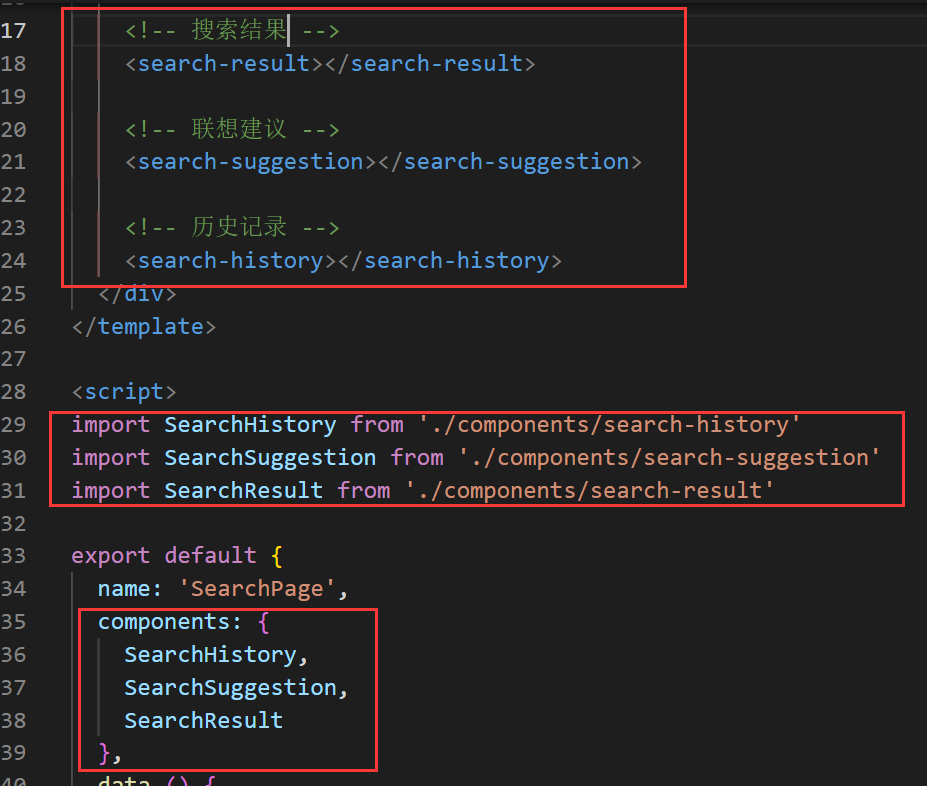

## VUE移动端第五天

# 一. 文章搜索


**目标：**

1. 制作搜索弹出层
2. 制作搜索联想建议与搜索结果
3. 历史记录展示、修改
4. 通过历史记录查询搜索内容

## 1.1 创建组件并配置路由

1. 给搜索按钮添加to属性

   

2. 创建 `src/views/search/search.vue`

   

   ```VUE
   <template>
     <div>搜索页面</div>
   </template>
   
   <script>
   export default {
     name: 'SearchPage',
     data () {
       return {}
     },
     methods: {}
   }
   </script>
   
   <style lang="less" scoped>
   
   </style>
   ```

3. 把搜索页面的路由配置到根组件路由（一级路由）

   ```
     {
       path: '/search',
       name: 'search',
       component: () => import('../views/search/search.vue')
     }
   ```

## 1.2 页面布局

### 1.2.1 搜索栏


1. 使用`vant-search`搜索栏结构

   

2. vant组件搜索栏中的事件监听

   > 07-页面布局收缩框 4:30 手机演示

   ```vue
   <template>
     <div class="search-container">
       <!-- 顶部搜索事件监听
       Tips: 在 van-search 外层增加 form 标签，且 action 不为空，即可在 iOS 输入法中显示搜索按钮。
       -->
       <form action="/">
         <van-search
           v-model="searchText"
           show-action
           background="#3296fa"
           placeholder="请输入搜索关键词"
           @search="onSearch"
           @cancel="onCancel"
         />
       </form>
     </div>
   </template>
   
   <script>
   export default {
     name: 'SearchPage',
     data () {
       return {
         searchText: ''
       }
     },
     methods: {
       onSearch (val) {
         this.$toast(val)
       },
       onCancel () {
         this.$toast('取消')
         this.$router.back()
       }
     }
   }
   </script>
   
   <style lang="less" scoped>
   .search-container {
     .van-search__action {
       color: white;
     }
   }
   </style>
   
   ```

### 1.2.2 搜索历史

1. 创建 `src/views/search/components/search-history.vue`

   

   ```vue
   <template>
     <div class="search-history">
       <van-cell title="搜索历史">
         <span>全部删除</span>
         <span>完成</span>
         <van-icon name="delete" />
       </van-cell>
       <van-cell title="hello">
         <van-icon name="close" />
       </van-cell>
       <van-cell title="hello">
         <van-icon name="close" />
       </van-cell>
       <van-cell title="hello">
         <van-icon name="close" />
       </van-cell>
       <van-cell title="hello">
         <van-icon name="close" />
       </van-cell>
     </div>
   </template>
   
   <script>
   export default {
     name: 'SearchHistory',
     data () {
       return {}
     },
     methods: {}
   }
   </script>
   
   <style scoped lang="less"></style>
   
   ```

### 1.2.3 联想建议

1. 创建 `src/views/search/components/search-suggestion.vue`

   

   ```vue
   <template>
     <div class="search-suggestion">
       <van-cell title="黑马程序员..." icon="search"></van-cell>
       <van-cell title="黑马程序员..." icon="search"></van-cell>
       <van-cell title="黑马程序员..." icon="search"></van-cell>
       <van-cell title="黑马程序员..." icon="search"></van-cell>
       <van-cell title="黑马程序员..." icon="search"></van-cell>
     </div>
   </template>
   
   <script>
   export default {
     name: 'SearchSuggestion',
     data () {
       return {}
     },
     methods: {}
   }
   </script>
   
   <style scoped lang="less"></style>
   
   ```

### 1.2.4 搜索结果

1. 创建 `src/views/search/components/search-result.vue`

   

   ```vue
   <template>
     <div class="search-result">
       <van-list
         v-model="loading"
         :finished="finished"
         finished-text="没有更多了"
         @load="onLoad"
       >
         <van-cell v-for="item in list" :key="item" :title="item" />
       </van-list>
     </div>
   </template>
   
   <script>
   export default {
     name: 'SearchResult',
     data () {
       return {
         list: [],
         loading: false,
         finished: false
       }
     },
     methods: {
       onLoad () {
         // 异步更新数据
         // setTimeout 仅做示例，真实场景中一般为 ajax 请求
         setTimeout(() => {
           for (let i = 0; i < 10; i++) {
             this.list.push(this.list.length + 1)
           }
   
           // 加载状态结束
           this.loading = false
   
           // 数据全部加载完成
           if (this.list.length >= 40) {
             this.finished = true
           }
         }, 1000)
       }
     }
   }
   </script>
   
   <style scoped lang="less"></style>
   
   ```

### 1.2.5 组件应用



## 1.3 处理页面展示逻辑

1. 在 `data` 中添加数据用来控制搜索结果的显示状态

   ```js
     data () {
       return {
         searchText: '',
         isResultShow: false // 控制搜索结果的展示
       }
     },
   ```

2. 在模板中绑定条件渲染

   ```vue
       <!-- 搜索结果 有结果就展示 -->
       <search-result v-if="isResultShow"></search-result>
   
       <!-- 联想建议 有内容则建议 -->
       <search-suggestion v-else-if="searchText"></search-suggestion>
   
       <!-- 历史记录 -->
       <search-history v-else></search-history>
   ```

3. 触发搜索，显示搜索结果

   ```vue
       onSearch (val) {
         this.isResultShow = true
       },
   ```

4. 获取焦点,隐藏搜索结果

   

## 1.4 搜索联想建议

**基本思路：**

- 当搜索框输入内容的时候，请求加载联想建议的数据
- 将请求得到的结果绑定到模板中

**步骤：**

一、将父组件中搜索框输入的内容传给联想建议子组件

二、在子组件中监视搜索框输入内容的变化，如果变化则请求获取联想建议数据

三、将获取到的联想建议数据展示到列表中

### 1.4.1 获取并监听输入框内容的变化

1. 将父组件中搜索框输入的内容传给联想建议子组件

   ```vue
   <search-suggestion :searchText="searchText" v-else></search-suggestion>
   ```

2. 在子组件中监视搜索框输入内容的变化，如果变化则请求获取联想建议数据

   ```VUE
     props: {
       searchText: {
         type: String,
         default: ''
       }
     },
     watch: {
       searchText: {
         // 监视的处理函数
         handler (newVal) {
           console.log(newVal)
         },
         // 首次监视触发
         immediate: true
       }
     },
   ```

### 1.4.2 请求获取展示数据

1. 定义获取建议的方法  `search.js`

   ```js
   /**
    * 搜索相关
    */
   import request from '../utils/request.js'
   
   export const getSearchSuggestions = query => {
     return request({
       method: 'GET',
       url: '/v1_0/suggestion',
       params: {
         q: query
       }
     })
   }
   ```

2. 在`api/index.js`中输出

   ```js
   import { getSearchSuggestions } from './search.js'
   
   export const getSearchSuggestionsAPI = getSearchSuggestions
   ```

3. 引入getSearchSuggestionsAPI

   ```js
   import { getSearchSuggestionsAPI } from '../../../api/index.js'
   ```

4. 定义加载数据的方法并调用getSearchSuggestionsAPI

   

   ```js
   data () {
       return {
         suggestions: [] // 联想建议数据列表
       }
     },
     watch: {
       searchText: {
         // 监视的处理函数
         handler (newVal) {
           // 调用查询方法
           this.loadSearchSuggestion(newVal)
         },
         // 首次监视触发
         immediate: true
       }
     },
     methods: {
       // 查询数据进口
       async loadSearchSuggestion (val) {
         try {
           const { data: res } = await getSearchSuggestionsAPI(val)
           this.suggestions = res.data.options
         } catch {
           this.$toast('获取失败')
         }
       }
     }
   ```

5. 模板渲染

   ```vue
     <div class="search-suggestion">
       <van-cell
       v-for="(item, index) in suggestions"
       :key="index"
       :title="item"
       icon="search"></van-cell>
     </div>
   ```

### 1.4.3 防抖优化

1. 安装lodash

   ```bash
   npm i lodash
   ```

2. 引入防抖方法

   方案一：全局引入`main.js`

   ```js
   // 导入lodash
   import _ from 'lodash'
   
   Vue.prototype.$_ = _
   ```

   方案二：按需引入 `search-suggestion.vue`

   ```js
   // lodash 支持按需加载，有利于打包结果优化
   import { debounce } from "lodash"
   ```

3. 修改函数

   **注意:**`debounce`中的回调函数必须是function不可以是箭头函数

   

> 思考： 那原生的基本防抖该怎么写呢？

```js
function myDebounce(callback, num) {
  // 闭包，延长时间的timer的生命周期
  let timer = null
  // 高阶函数，一个函数返回另一个函数
  return function (val) {
    const that = this
    if (timer) {
      return clearTimeout(timer)
    }

    timer = setTimeout(() => {
      // 使用call、apply改变this指向
      callback.call(that, val)
    })
  }
}
```


### 1.4.4 搜索关键词高亮

#### 1.4.4.1 思路分析

**问：** 如何将字符串中的指定字符在**网页**中高亮展示？

**答：**将需要高亮的字符包裹 HTML 标签，为其单独设置颜色。如：

```html
"Hello <span style="color: red">World</span>"
```


**问：**在 Vue 中如何渲染带有 HTML 标签的字符串？

**答：**使用`v-html`命令符

```vue
<div>{{ htmlStr }}</div>
<div v-html="htmlStr"></div>

data () {
  return {
    htmlStr: 'Hello <span style="color: red">World</span>'
  }
}
```


**问：**如何把字符串中指定字符统一替换为高亮（包裹了 HTML）的字符？

**答：**使用`replace`方法进行替换

```js
const str = "Hello World"

// 结果：<span style="color: red">Hello</span> World
"Hello World".replace('Hello', '<span style="color: red">Hello</span>')

// 需要注意的是，replace 方法的字符串匹配只能替换第1个满足的字符
// <span style="color: red">Hello</span> World Hello abc
"Hello World Hello abc".replace('Hello', '<span style="color: red">Hello</span>')

// 如果想要全文替换，使用正则表达式
// g 全局
// i 忽略大小写
// <span style="color: red">Hello</span> World <span style="color: red">Hello</span> abc
"Hello World Hello abc".replace(/Hello/gi, '<span style="color: red">Hello</span>')
```

> 如果感觉使用正则麻烦，可是使用`split`和`join`的组合用法

```js
var str = "hello world 你好 hello";

// ["", " world 你好 ", ""]
const arr = str.split("hello");

// "<span>hello</span> world 你好 <span>hello</span>"
arr.join("<span>hello</span>");
```

#### 1.4.4.2 高亮操作

1. 将文本设置为插槽

   ```vue
       <van-cell
       v-for="(item, index) in suggestions"
       :key="index"
       icon="search">
         <span slot="title" v-html="item"></span>
       </van-cell>
   ```

2. 在 methods 中添加一个方法处理高亮

   ```js
       highlight (text) {
         const highlightStr = `<span class="active">${this.searchText}</span>`
   
   			// 方案一
         // 正则表达式 // 中间的内容都会当作匹配字符来使用，而不是数据变量
         // 如果需要根据数据变量动态的创建正则表达式，则手动 new RegExp
         // RegExp 正则表达式构造函数
         //    参数1：匹配模式字符串，它会根据这个字符串创建正则对象
         //    参数2：匹配模式，要写到字符串中
         // const reg = new RegExp(this.searchText, 'gi')
         // return text.replace(reg, highlightStr)
   
         // 方案二
         return text.split(this.searchText).join(highlightStr)
       }
   ```

3. 在联想建议列表项中绑定调用

   ```vue
   <template>
     <div class="search-suggestion">
       <van-cell
       v-for="(item, index) in suggestions"
       :key="index"
       icon="search">
         <span slot="title" v-html="highlight(item)"></span>
       </van-cell>
     </div>
   </template>
   
   <style scoped lang="less">
   .search-suggestion {
     /deep/ span.active {
       color: #3296fa;
     }
   }
   </style>
   
   ```

## 1.5 搜索结果

**思路：**

- 找到数据接口
- 请求获取数据
- 将数据展示到模板中

### 1.5.1 点击建议，传递搜索内容

1. 点击联想进行搜索

   

2. 定义父元素自定义事件和函数

   ```vue
   <!-- 搜索联想 -->
   <search-suggestion @search="onSearch" v-else :search-text="value" />
   ```

   ```js
   // 事件函数
   onSearch (val) {
       this.value = val
       this.isShowSearchResult = true
   }
   ```

### 1.5.2 搜索处理完成-请求获取数据

1. 子组件`search-result.vue`中传入搜索结果

   ```vue
   <!-- 搜索结果 -->
   <search-result v-if="isResultShow" :searchText="searchText" />
   <!-- /搜索结果 -->
   ```

   ```js
     props: {
       searchText: {
         type: String,
         default: ''
       }
     },
   ```

2. 在 `api/serach.js` 添加封装获取搜索结果的请求方法

   ```js
   export const getSearchResult = params => {
     return request({
       method: 'GET',
       url: '/v1_0/search',
       params
     })
   }
   ```

3. 在`api/index.js`中输出

   ```js
   import { getSearchResult } from './search.js'
   
   export const getSearchResultAPI = getSearchResult
   ```

4. 请求获取数据

   ```js
   import { getSearchResultAPI } from '../../../api/index.js'
   ```

   ```js
   data () {
       return {
         list: [],
         loading: false,
         finished: false,
         page: 1,
         perPage: 20
       }
     },
     methods: {
       async onLoad () {
         try {
           // 1. 请求获取数据
           const { data: res } = await getSearchResultAPI({
             page: this.page, // 页码
             per_page: this.perPage, // 每页大小
             q: this.searchText // 搜索关键字
           })
           // 2. 将数据添加到列表中
           this.list.push(...res.data)
           // 3. 设置加载状态结束
           this.loading = false
           // 4. 判断数据是否加载完毕
           if (res.data.length) {
             this.page++ // 更新获取下一页数据的页码
           } else {
             this.finished = true // 没有数据了，将加载状态设置结束，不再 onLoad
           }
         } catch (error) {
           // 加载失败了 loading 也要关闭
           this.loading = false
         }
       }
     }
   ```

5. 模板绑定

   ```vue
       <van-list
         v-model="loading"
         :finished="finished"
         finished-text="没有更多了"
         @load="onLoad"
       >
         <van-cell v-for="item in list" :key="item.art_id" :title="item.title" />
       </van-list>
   ```

6. 错误提示

   

   

### 1.5.3 顶部固定

**src\views\search\search.vue**

```css
<style lang="less" scoped>
.search-container {
  padding-top: 106px;
  .van-search__action {
    color: white;
  }

  .van-search {
    position: fixed;
    top: 0;
    left: 0;
    right: 0;
    z-index: 1;
  }
}
</style>
```

## 1.6 搜索历史记录

### 1.6.1 添加历史记录

> 当发生搜索的时候我们才需要记录历史记录。

1. 在`src\views\search\search.vue` 的 data 中添加一个数据用来存储历史记录

   ```js
     data () {
       return {
         searchText: '',
         isResultShow: false, // 控制搜索结果的展示
         searchHistories: [] // 搜索的历史记录数据
       }
     },
   ```

2. 在触发搜索的时候，记录历史记录

   ```js
       onSearch (val) {
         // 更新文本框内容
         this.searchText = val
   
         // 存储搜索历史记录
         // 要求：不要有重复历史记录、最新的排在最前面
         const index = this.searchHistories.indexOf(val)
         if (index !== -1) {
           this.searchHistories.splice(index, 1)
         }
         this.searchHistories.unshift(val)
   
         // 渲染搜索结果
         this.isResultShow = true
       },
   ```

### 1.6.2 展示历史记录

1. 将数据传递给搜索历史组件

   ```vue
   <!-- 搜索历史 -->
   <search-history v-else-if="!value" :searchHistories="searchHistories" />
   ```

2. 搜索历史组件接收数据

   ```js
     props: {
       searchHistories: {
         type: Array,
         default: () => []
       }
     },
   ```

3. 显示搜索历史

   ```vue
    <div class="search-history">
       <van-cell title="搜索历史">
         <span>全部删除</span>
         <span>完成</span>
         <van-icon name="delete" />
       </van-cell>
       <van-cell :title="item" v-for="(item, index) in searchHistory" :key="index">
         <van-icon name="close"></van-icon>
       </van-cell>
     </div>
   ```

### 1.6.3 删除历史记录

**基本思路：**

- 给历史记录中的每一项注册点击事件
- 在处理函数中判断
  - 如果是删除状态，则执行删除操作
  - 如果是非删除状态，则执行搜索操作

#### 1.6.3.1 处理删除相关元素的展示状态

```js
  data () {
    return {
    	// 在 data 中添加一个数据用来控制删除相关元素的显示状态
      isDeleteShow: false
    }
  },
```

```vue
  <div class="search-history">
    <van-cell title="搜索历史">
      <template v-if="isDeleteShow">
        <span>全部删除</span>
        &nbsp;&nbsp;
        <span @click="isDeleteShow = false">完成</span>
      </template>
      <van-icon v-else name="delete" @click="isDeleteShow = true"/>
    </van-cell>
    <van-cell
      :title="item"
      v-for="(item, index) in searchHistories"
      :key="index"
    >
      <van-icon v-if="isDeleteShow" name="close"></van-icon>
    </van-cell>
  </div>
```

#### 1.6.3.2 处理删除操作

1. 给每个历史选项绑定点击事件

   

2. 修改点击方法

   ```js
       onHistoryClick (item, index) {
         if (this.isDeleteShow) {
           // 删除状态，删除历史记录数据
           this.searchHistoriesClone.splice(index, 1)
         } else {
           // 非删除状态，直接进入搜索
         }
       }
   ```

3. 删除全部 - 调用父组件方法让历史列表清空

   **search-history.vue**

   

   **search.vue**

   

4. 点击搜索

   

   

## 1.7 数据持久化

1. 利用 watch 监视统一存储数据

   `search.vue`

   ```js
     import { setItem } from '@/utils/storage'
     
     watch: {
       searchHistories (value) {
         setItem('TOUTIAO_SEARCH_HISTORIES', value)
       }
       // searchHistories: {
       //   handler () {}
       // }
     },
   ```

2. 初始化的时候从本地存储获取数据

   ```js
     data () {
       return {
         searchText: '',
         isResultShow: false, // 控制搜索结果的展示
         searchHistories: getItem('TOUTIAO_SEARCH_HISTORIES') || [] // 搜索的历史记录数据
       }
     },
   ```


