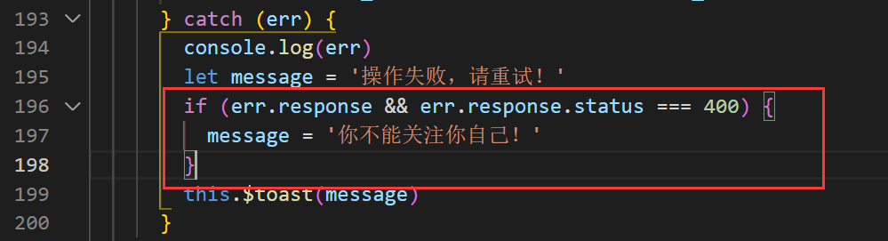

# VUE移动端第六天

# 一. 文章详情

**目标：**

1. 制作文章详情文本内容
2. 完成关注作者功能
3. 完成文章影像预览、切换功能
4. 完成文章收藏、点赞


## 1.1 创建组件并配置路由 - 路由 props 传参

1. 创建 `views/article/article.vue` 组件

   ```vue
   <template>
     <div class="article-container">
     </div>
   </template>
   
   <script>
   export default {
     name: 'ArticleIndex',
     props: {
       articleId: {
         type: [Number, String], // 当不确定数据类型时，可以使用数组的形式
         default: null
       }
     },
     data () {
       return {
   
       }
     },
     methods: {
   
     }
   }
   </script>
   
   <style lang="less" scoped>
   
   </style>
   
   ```

2. 然后将该页面配置到根级路由

   > [官方文档：路由 props 传参](https://router.vuejs.org/zh/guide/essentials/passing-props.html)

   ```JS
     {
       path: '/article/:articleId',
       name: 'article',
       component: () => import('../views/article/article.vue'),
       props: true // 开启 Props 传参，把路由参数映射到组件的 props 数据中
     }
   ```

   **问：**为什么不直接用$route.query来获取id，而是要把路由中的参数改到props里呢？

   **答：**这个组件不一定是仅用在路由跳转上的，设置到props中可以让这个组件后续与其他组件进行嵌套使用

   

3. 在`article-item.vue`组件中设置跳转方式

   

   **另一种写法：非常不建议！要写对象就声明方法在方法里写！！！**

   

## 1.2 页面布局

使用到的 Vant 中的组件：

- [NavBar 导航栏](https://youzan.github.io/vant/#/zh-CN/nav-bar)

- [Loading 加载](https://youzan.github.io/vant/#/zh-CN/loading)
- [Cell 单元格](https://youzan.github.io/vant/#/zh-CN/cell)
- [Button 按钮](https://youzan.github.io/vant/#/zh-CN/button)
- [Image 图片](https://youzan.github.io/vant/#/zh-CN/image)
- [Divider 分割线](https://youzan.github.io/vant/#/zh-CN/divider)
- [Icon 图标](https://youzan.github.io/vant/#/zh-CN/icon)

```VUE
<template>
  <div class="article-container">
    <!-- 导航栏 -->
    <van-nav-bar
      class="page-nav-bar"
      left-arrow
      title="黑马头条"
    ></van-nav-bar>
    <!-- /导航栏 -->

    <div class="main-wrap">
      <!-- 加载中 -->
      <div class="loading-wrap">
        <van-loading
          color="#3296fa"
          vertical
        >加载中</van-loading>
      </div>
      <!-- /加载中 -->

      <!-- 加载完成-文章详情 -->
      <div class="article-detail">
        <!-- 文章标题 -->
        <h1 class="article-title">这是文章标题</h1>
        <!-- /文章标题 -->

        <!-- 用户信息 -->
        <van-cell class="user-info" center :border="false">
          <van-image
            class="avatar"
            slot="icon"
            round
            fit="cover"
            src="https://img.yzcdn.cn/vant/cat.jpeg"
          />
          <div slot="title" class="user-name">黑马头条号</div>
          <div slot="label" class="publish-date">14小时前</div>
          <van-button
            class="follow-btn"
            type="info"
            color="#3296fa"
            round
            size="small"
            icon="plus"
          >关注</van-button>
          <!-- <van-button
            class="follow-btn"
            round
            size="small"
          >已关注</van-button> -->
        </van-cell>
        <!-- /用户信息 -->

        <!-- 文章内容 -->
        <div class="article-content">这是文章内容</div>
        <van-divider>正文结束</van-divider>
      </div>
      <!-- /加载完成-文章详情 -->

      <!-- 加载失败：404 -->
      <div class="error-wrap">
        <van-icon name="failure" />
        <p class="text">该资源不存在或已删除！</p>
      </div>
      <!-- /加载失败：404 -->

      <!-- 加载失败：其它未知错误（例如网络原因或服务端异常） -->
      <div class="error-wrap">
        <van-icon name="failure" />
        <p class="text">内容加载失败！</p>
        <van-button class="retry-btn">点击重试</van-button>
      </div>
      <!-- /加载失败：其它未知错误（例如网络原因或服务端异常） -->
    </div>

    <!-- 底部区域 -->
    <div class="article-bottom">
      <van-button
        class="comment-btn"
        type="default"
        round
        size="small"
      >写评论</van-button>
      <van-icon
        name="comment-o"
        badge="123"
        color="#777"
      />
      <van-icon
        color="#777"
        name="star-o"
      />
      <van-icon
        color="#777"
        name="good-job-o"
      />
      <van-icon name="share" color="#777777"></van-icon>
    </div>
    <!-- /底部区域 -->
  </div>
</template>

<script>
export default {
  name: 'ArticleIndex',
  components: {},
  props: {
    articleId: {
      type: [Number, String],
      required: true
    }
  },
  data () {
    return {}
  },
  computed: {},
  watch: {},
  created () {},
  mounted () {},
  methods: {}
}
</script>

<style scoped lang="less">
.article-container {
  .main-wrap {
    padding-top: 92px;
    padding-bottom: 88px;
    overflow-y: scroll;
    background-color: #fff;
  }
  .article-detail {
    .article-title {
      font-size: 40px;
      padding: 50px 32px;
      margin: 0;
      color: #3a3a3a;
    }

    .user-info {
      padding: 0 32px;
      .avatar {
        width: 70px;
        height: 70px;
        margin-right: 17px;
      }
      .van-cell__label {
        margin-top: 0;
      }
      .user-name {
        font-size: 24px;
        color: #3a3a3a;
      }
      .publish-date {
        font-size: 23px;
        color: #b7b7b7;
      }
      .follow-btn {
        width: 170px;
        height: 58px;
      }
    }

    .article-content {
      padding: 55px 32px;
      /deep/ p {
        text-align: justify;
      }
    }
  }

  .loading-wrap {
    padding: 200px 32px;
    display: flex;
    align-items: center;
    justify-content: center;
    background-color: #fff;
  }

  .error-wrap {
    padding: 200px 32px;
    display: flex;
    flex-direction: column;
    align-items: center;
    justify-content: center;
    background-color: #fff;
    .van-icon {
      font-size: 122px;
      color: #b4b4b4;
    }
    .text {
      font-size: 30px;
      color: #666666;
      margin: 33px 0 46px;
    }
    .retry-btn {
      width: 280px;
      height: 70px;
      line-height: 70px;
      border: 1px solid #c3c3c3;
      font-size: 30px;
      color: #666666;
    }
  }

  .article-bottom {
    position: fixed;
    left: 0;
    right: 0;
    bottom: 0;
    display: flex;
    justify-content: space-around;
    align-items: center;
    box-sizing: border-box;
    height: 88px;
    border-top: 1px solid #d8d8d8;
    background-color: #fff;
    .comment-btn {
      width: 282px;
      height: 46px;
      border: 2px solid #eeeeee;
      font-size: 30px;
      line-height: 46px;
      color: #a7a7a7;
    }
    .van-icon {
      font-size: 40px;
      .van-info {
        font-size: 16px;
        background-color: #e22829;
      }
    }
  }
}
</style>

```


## 1.3 获取文章详情数据

1. 封装请求文章的详情方法

   ```js
   /**
    * 获取文章
    */
   export const getArticleById = articleId => {
     return request({
       method: 'GET',
       url: `/v1_0/articles/${articleId}`
     })
   }
   ```

2. `api.index.js`中输出

   ```js
   import { getArticleById } from './article.js'
   
   export const getArticleByIdAPI = getArticleById
   ```

3. 在`article.vue`中定义加载数据方法

   ```js
   import { getArticleByIdAPI } from '../../api/index.js'
   export default {
   	...
     created () {
       // 获取文章详情
       this.loadArtcileInfo()
     },
     methods: {
       async loadArtcileInfo () {
         try {
           const res = await getArticleByIdAPI(this.articleId)
           console.log(res)
         } catch (err) {
           this.$toast('获取失败')
         }
       }
     }
   }
   ```

## 1.4  关于后端返回数据中的大数字问题（了解）

> 视频 11 12 13 
>
> 现在前后端已经统一了这种大数的传递方式，所以在非数学计算的场景中几乎是不会有这种情况出现的

之所以请求文章详情返回 404 是因为我们请求发送的文章 ID （article.art_id）不正确。

JavaScript 能够准确表示的整数范围在`-2^53`到`2^53`之间（不含两个端点），超过这个范围，无法精确表示这个值，这使得 JavaScript 不适合进行科学和金融方面的精确计算。

```javascript
Math.pow(2, 53) // 9007199254740992

9007199254740992  // 9007199254740992
9007199254740993  // 9007199254740992

Math.pow(2, 53) === Math.pow(2, 53) + 1
// true
```

上面代码中，超出 2 的 53 次方之后，一个数就不精确了。
ES6 引入了`Number.MAX_SAFE_INTEGER`和`Number.MIN_SAFE_INTEGER`这两个常量，用来表示这个范围的上下限。

```javascript
Number.MAX_SAFE_INTEGER === Math.pow(2, 53) - 1
// true
Number.MAX_SAFE_INTEGER === 9007199254740991
// true

Number.MIN_SAFE_INTEGER === -Number.MAX_SAFE_INTEGER
// true
Number.MIN_SAFE_INTEGER === -9007199254740991
// true
```

上面代码中，可以看到 JavaScript 能够精确表示的极限。

后端返回的数据一般都是 **JSON 格式的字符串**。

```json
'{ "id": 9007199254740995, "name": "Jack", "age": 18 }'
```

如果这个字符不做任何处理，你能方便的获取到字符串中的指定数据吗？非常麻烦。所以我们要把它转换为 JavaScript 对象来使用就很方便了。

幸运的是 axios 为了方便我们使用数据，它会在内部使用 `JSON.parse()` 把后端返回的数据转为 JavaScript 对象。

```javascript
// { id: 9007199254740996, name: 'Jack', age: 18 }
JSON.parse('{ "id": 9007199254740995, "name": "Jack", "age": 18 }')
```

可以看到，超出安全整数范围的 id 无法精确表示，这个问题并不是 axios 的错。

了解了什么是大整数的概念，接下来的问题是如何解决？

### 1.4.1 利用json-bigint处理大数字问题

[json-bigint](https://github.com/sidorares/json-bigint) 是一个第三方包，它可以帮我们很好的处理这个问题。

使用它的第一步就是把它安装到你的项目中。

```shell
npm i json-bigint
```

下面是使用它的一个简单示例。

```javascript
const jsonStr = '{ "art_id": 1245953273786007552 }'

console.log(JSON.parse(jsonStr)) // 1245953273786007600
// JSON.stringify()

// JSONBig 可以处理数据中超出 JavaScript 安全整数范围的问题
console.log(JSONBig.parse(jsonStr)) // 把 JSON 格式的字符串转为 JavaScript 对象

// 使用的时候需要把 BigNumber 类型的数据转为字符串来使用
console.log(JSONBig.parse(jsonStr).art_id.toString()) // 1245953273786007552

console.log(JSON.stringify(JSONBig.parse(jsonStr)))

console.log(JSONBig.stringify(JSONBig.parse(jsonStr))) // 把 JavaScript 对象 转为 JSON 格式的字符串转
```


> json-bigint 会把超出 JS 安全整数范围的数字转为一个 BigNumber 类型的对象，对象数据是它内部的一个算法处理之后的，我们要做的就是在使用的时候转为字符串来使用。


通过 Axios 请求得到的数据都是 Axios 处理（JSON.parse）之后的，我们应该在 Axios 执行处理之前手动使用 json-bigint 来解析处理。Axios 提供了自定义处理原始后端返回数据的 API：`transformResponse` 。

```javascript
import axios from 'axios'

import jsonBig from 'json-bigint'

var json = '{ "value" : 9223372036854775807, "v2": 123 }'

console.log(jsonBig.parse(json))

const request = axios.create({
  baseURL: 'http://ttapi.research.itcast.cn/', // 接口基础路径

  // transformResponse 允许自定义原始的响应数据（字符串）
  transformResponse: [function (data) {
    try {
      // 如果转换成功则返回转换的数据结果
      return jsonBig.parse(data)
    } catch (err) {
      // 如果转换失败，则包装为统一数据格式并返回
      return {
        data
      }
    }
  }]
})

export default request

```

修改props类型

```js
props: {
    articleId: {
      type: [Number, String, Object],
      required: true
    }
  }
```


> 扩展：ES2020 BigInt
>
> ES2020 引入了一种新的数据类型 BigInt（大整数），来解决这个问题。BigInt 只用来表示整数，没有位数的限制，任何位数的整数都可以精确表示。
>
> 参考链接：
>
> - [https://developer.mozilla.org/zh-CN/docs/Web/JavaScript/Reference/Global_Objects/BigInt](https://developer.mozilla.org/zh-CN/docs/Web/JavaScript/Reference/Global_Objects/BigInt)
> - [http://es6.ruanyifeng.com/#docs/number#BigInt-%E6%95%B0%E6%8D%AE%E7%B1%BB%E5%9E%8B]

## 1.5 展示文章详情

1. 在组件中调用获取文章详情

   ```js
     data () {
       return {
         article: {} // 文章详情
       }
     },
     created () {
       // 获取文章详情
       this.loadArtcileInfo()
     },
     methods: {
       async loadArtcileInfo () {
         try {
           const { data: res } = await getArticleByIdAPI(this.articleId)
           this.article = res.data
         } catch (err) {
           this.$toast('获取失败')
         }
       }
     }
   ```

2. 模板绑定

   - 文章标题

     

   - 文章作者头像

   - 作者名称

   - 发布时间

     

   - 文章内容

     

   - 完整代码

     ```vue
           <!-- 加载完成-文章详情 -->
           <div class="article-detail">
             <!-- 文章标题 -->
             <h1 class="article-title">{{article.title}}</h1>
             <!-- /文章标题 -->
     
             <!-- 用户信息 -->
             <van-cell class="user-info" center :border="false">
               <van-image
                 class="avatar"
                 slot="icon"
                 round
                 fit="cover"
                 :src="article.aut_photo"
               />
               <div slot="title" class="user-name">{{ article.aut_name }}</div>
               <div slot="label" class="publish-date">{{ article.pubdate | relativeTime }}</div>
               <van-button
                 class="follow-btn"
                 type="info"
                 color="#3296fa"
                 round
                 size="small"
                 icon="plus"
               >关注</van-button>
               <!-- <van-button
                 class="follow-btn"
                 round
                 size="small"
               >已关注</van-button> -->
             </van-cell>
             <!-- /用户信息 -->
     
             <!-- 文章内容 -->
             <div class="article-content"  v-html="article.content"></div>
             <van-divider>正文结束</van-divider>
           </div>
     ```

## 1.6 处理加载内容

**需求：**

- 加载中，显示 loading
- 加载成功，显示文章详情
- 加载失败，显示错误提示
  - 如果 404，提示资源不存在
  - 其它的，提示加载失败，用户可以点击重试重新加载

**步骤：**

1. 声明一个加载状态，和失败时的状态码

   ```js
     data () {
       return {
         article: {}, // 文章详情
         loading: true, // 加载中的 loading 状态
         errStatus: 0 // 失败的状态码
       }
     },
   ```

2. 设置html中个展示盒子的判断

   ```vue
   <!-- 加载中 -->
   <div class="loading-wrap" v-if="loading">
   <!-- 加载完成-文章详情 -->
   <div v-else-if="article.title" class="article-detail">
   <!-- 加载失败：404 -->
   <div v-else-if="errStatus === 404" class="error-wrap">
   <!-- 加载失败：其它未知错误（例如网络原因或服务端异常） -->
   <div v-else class="error-wrap">
   ```

3. 设置查询方法中的逻辑

   

   ```js
   async loadArtcileInfo () {
         this.loading = true // 开启加载查询
         try {
           const { data: res } = await getArticleByIdAPI(this.articleId)
           this.article = res.data
           // this.loading = false // 请求成功关闭加载
         } catch (err) {
           // 请求失败，判断现在那种报错提示框
           if (err.response && err.response.status === 404) {
             this.errStatus = 404
           }
           this.$toast('获取失败')
         }
   
         // 无论成功还是失败，都需要关闭 loading
         this.loading = false
       }
   ```

4. 点击重新加载功能

   

## 1.7 关于文章正文的样式

>  文章正文包括各种数据：段落、标题、列表、链接、图片、视频等资源。
>
> 将 [github-markdown-css](https://github.com/sindresorhus/github-markdown-css) 样式文件引入

1. 下载css样式文件

   

2. 导入样式

   

3. 添加类名

   

4. 配置不要转换样式文件中的字号

   ```js
   'postcss-pxtorem': {
     	rootValue ({ file }) {
       return file.indexOf('vant') !== -1 ? 37.5 : 75
     },
       propList: ['*'],
       exclude: 'github-markdown'
   }
   ```

## 1.8 图片点击预览 - ImagePreview

> 如果图片有问题用文章id：7817来尝试


1. 导入

   ```js
   import { ImagePreview } from 'vant';
   ```

2. 使用

   

   ```js
   ImagePreview({
     images: [
       'https://img.yzcdn.cn/vant/apple-1.jpg',
       'https://img.yzcdn.cn/vant/apple-2.jpg'
     ],
     // 预览图片的起始位置
     startPosition: 1,
     // 点击关闭
     onClose () {
       // do something
       console.log('关闭')
     }
   })
   ```

3. 在获取文章数据后，获取所有的图片DOM节点

   

   

   ```js
       // 初始化数据
       previewImage () {
         // 得到所有的 img 节点
         const articleContent = this.$refs['article-content']
         const imgs = articleContent.querySelectorAll('img')
         console.log(imgs)
       }
   ```

4. 遍历所有 img 节点，给每个节点注册点击事件

   ```js
       // 初始化数据
       previewImage () {
         // 得到所有的 img 节点
         const articleContent = this.$refs['article-content']
         const imgs = articleContent.querySelectorAll('img')
         // 获取所有 img 地址
         const images = []
         imgs.forEach((img, index) => {
           images.push(img.src)
   
           // 给每个 img 注册点击事件，在处理函数中调用预览
           img.onclick = () => {
             ImagePreview({
               // 预览的图片地址数组
               images,
               // 起始位置，从 0 开始
               startPosition: index
             })
           }
         })
       }
   ```


## 1.9 关注用户


**思路：**

- 给按钮注册点击事件
- 在事件处理函数中
  - 如果已关注，则取消关注
  - 如果没有关注，则添加关注

### 1.9.1 视图处理

```vue
          <van-button
            class="follow-btn"
            type="info"
            color="#3296fa"
            round
            size="small"
            icon="plus"
            v-if="article.is_followed"
          >关注</van-button>
          <van-button
            class="follow-btn"
            round
            size="small"
            v-else
          >已关注</van-button>
```

### 1.9.2 功能处理

- 找到数据接口
- 封装请求方法
- 请求调用
- 视图更新

1. 在 `api/user.js` 中添加封装请求方法

   ```js
   /**
    * 关注用户
    */
   export const addFollow = target => {
     return request({
       method: 'POST',
       url: '/v1_0/user/followings',
       data: {
         target
       }
     })
   }
   
   /**
    * 取消关注用户
    */
   export const deleteFollow = target => {
     return request({
       method: 'DELETE',
       url: `/v1_0/user/followings/${target}`
     })
   }
   ```

2. `api.index.js`中输出

   ```JS
   import { addFollow, deleteFollow } from './user.js'
   
   export const addFollowAPI = addFollow
   export const deleteFollowAPI = deleteFollow
   ```

3. 给关注/取消关注按钮注册点击事件

   ```js
   import { getArticleByIdAPI, addFollowAPI, deleteFollowAPI } from '../../api/index.js'
   ```

   ```js
       async onFollow () {
         try {
           if (this.article.is_followed) {
             // 已关注，取消关注
             await deleteFollowAPI(this.article.aut_id)
             // this.article.is_followed = false
           } else {
             // 没有关注，添加关注
             await addFollowAPI(this.article.aut_id)
             // this.article.is_followed = true
           }
           this.article.is_followed = !this.article.is_followed
         } catch (err) {
           console.log(err)
           this.$toast('操作失败，请重试！')
         }
       }
   ```

4. 用户不可以关注自己

   

1.9.3 loading 效果

**两个作用：**

- 交互反馈
- 防止网络慢用户多次点击按钮导致重复触发点击事件

1. 给button添加loading属性

   ```vue
             <van-button
               class="follow-btn"
               type="info"
               color="#3296fa"
               round
               size="small"
               icon="plus"
               :loading="btnLoading"
               v-if="article.is_followed"
               @click="onFollow()"
             >关注</van-button>
             <van-button
               class="follow-btn"
               round
               size="small"
               v-else
               :loading="btnLoading"
               @click="onFollow()"
             >已关注</van-button>
   ```

   

   

### 1.9.3 组件封装

> 04 - 18:28

1. 封装组件

   ```vue
   <template>
     <van-button
       class="follow-btn"
       type="info"
       color="#3296fa"
       round
       size="small"
       icon="plus"
       :loading="btnLoading"
       v-if="article.is_followed"
       @click="onFollow()"
     >
       关注
     </van-button>
   
     <van-button
       class="follow-btn"
       round
       size="small"
       v-else
       :loading="btnLoading"
       @click="onFollow()"
     >
       已关注
     </van-button>
   </template>
   
   <script>
   import { addFollowAPI, deleteFollowAPI } from '../../api/index.js'
   export default {
     name: 'follow-user',
     props: {
       isFollowed: { // 是否关注
         type: Boolean,
         default: false
       },
       userId: { // 用户id
         type: String,
         default: ''
       }
     },
     data () {
       return {
         btnLoading: false
       }
     },
     methods: {
       // 切换关注状态
       async onFollow () {
         this.btnLoading = true // 展示关注按钮的 loading 状态
         try {
           if (this.isFollowed) {
             // 已关注，取消关注
             await deleteFollowAPI(this.userId)
             // this.article.is_followed = false
           } else {
             // 没有关注，添加关注
             await addFollowAPI(this.userId)
             // this.article.is_followed = true
           }
           // this.article.is_followed = !this.article.is_followed
           // 更新视图
           this.$emit('update-follow', !this.isFollowed)
         } catch (err) {
           console.log(err)
           let message = '操作失败，请重试！'
           if (err.response && err.response.status === 400) {
             message = '你不能关注你自己！'
           }
           this.$toast(message)
         }
         this.btnLoading = false // 关闭关注按钮的 loading 状态
       }
     }
   }
   </script>
   
   <style lang="less" scoped>
   
   </style>
   
   ```

2. 引入组件

   

3. 使用组件

   ```vue
            <follow-user
               class="follow-btn"
               :isFollowed="article.is_followed"
               :user-id="article.aut_id"
               @update-follow="article.is_followed = $event"
             />
   ```

4. 删除多余代码

### 1.9.4组件中使用v-model

> 能够修改父组件传入的数据

**模板中的 $event 是事件参数**

​      当我们传递给子组件的数据既要使用还要修改。

​       传递：props

​        :is-followed="article.is_followed"

​       修改：自定义事件

​        @update-is_followed="article.is_followed = $event"

​      简写方式：在组件上使用 v-model

​       value="article.is_followed"

​       @input="article.is_followed = $event"


​      如果需要修改 v-model 的规则名称，可以通过子组件的 model 属性来配置修改

​      一个组件上只能使用一次 v-model，

​      如果有多个数据需要实现类似于 v-model 的效果，咋办？

​      可以使用属性的 .sync 修饰符。

​	  :isFollowed.sync="article.is_followed"

​	  this.$emit('update:isFollowed', true)

1. 使用v-model

   ```vue
             <follow-user
               class="follow-btn"
               v-model="article.is_followed"
               :user-id="article.aut_id"
             />
   ```

2. 组件内部添加model

   ```js
   model: {
       prop: 'is_followed',
       event: 'update-follow'
   }
   ```
   
3. 如果使用 .sync 修饰符的方式

   ```vue
   <follow-user
                class="follow-btn"
                :isFollowed.sync="article.is_followed"
                :user-id="article.aut_id"
                />
   ```

   ```js
   this.$emit('update:isFollowed', !this.isFollowed)
   ```

## 1.10 文章收藏

> 该功能和关注用户的处理思路几乎一样，建议自己编写。

### 1.10.1 封装组件


```vue
<template>
  <van-button icon="'star-o'"/>
</template>

<script>
export default {
  name: 'CollectArticle',
  data () {
    return {}
  },
  methods: {}
}
</script>

<style scoped lang="less">

</style>

```

### 1.10.2 使用组件

1. 导入组件

   ```js
   import CollectArticle from '../../components/collect-article/collect-article.vue'
   ```

   ```vue
         <collect-article></collect-article>
         <!-- <van-icon
           color="#777"
           name="star-o"
         /> -->
   ```

2. 传递数据处理视图

   ```vue
   <collect-article v-model="article.is_collected"></collect-article>
   ```

   **collect-article.vue**

   ```vue
   <template>
     <van-button
       :icon="value ? 'star' : 'star-o'"
       :class="{collected: value}"
     />
   </template>
   <script>
   export default {
     name: 'CollectArticle',
     props: {
       value: {
         type: Boolean,
         default: false
       }
     },
     data () {
       return {}
     },
     methods: {}
   }
   </script>
   
   <style scoped lang="less">
   .collected {
     .van-icon {
       color: #ffa500;
     }
   }
   </style>
   ```

### 1.10.3 功能处理

**思路：**

- 给收藏按钮注册点击事件
- 如果已经收藏了，则取消收藏
- 如果没有收藏，则添加收藏

**步骤：**

1. 在 `api/article.js` 添加封装数据接口

   ```js
   /**
    * 收藏文章
    */
   export const addCollect = target => {
     return request({
       method: 'POST',
       url: '/v1_0/article/collections',
       data: {
         target
       }
     })
   }
   
   /**
    * 取消收藏文章
    */
   export const deleteCollect = target => {
     return request({
       method: 'DELETE',
       url: `/v1_0/article/collections/${target}`
     })
   }
   ```

2. `api.index.js`中输出

   ```js
   import { addCollect, deleteCollect } from './article.js'
   export const deleteFollowAPI = deleteFollow
   export const addCollectAPI = addCollect
   ```

3. 给收藏按钮注册点击事件

   ```vue
   <template>
     <van-button
       :icon="value ? 'star' : 'star-o'"
       :class="{collected: value}"
       @click="onCollect"
       :loading="loading"
     />
   </template>
   
   <script>
   import { addCollectAPI, deleteCollectAPI } from '../../api/index.js'
   export default {
     name: 'CollectArticle',
     props: {
       value: {
         type: Boolean,
         default: false
       },
       articleId: {
         type: String,
         default: ''
       }
     },
     data () {
       return {
         loading: false
       }
     },
     methods: {
       async onCollect () {
   
       }
     }
   }
   </script>
   
   <style scoped lang="less">
   .collected {
     .van-icon {
       color: #ffa500;
     }
   }
   </style>
   
   ```

4. 处理函数

   ```js
   async onCollect () {
         this.loading = true
         try {
           if (this.value) {
             // 已收藏，取消收藏
             await deleteCollectAPI(this.articleId)
           } else {
             // 没有收藏，添加收藏
             await addCollectAPI(this.articleId)
           }
   
           // 更新视图
           // 自定义事件修改数据并不是立即的
           this.$emit('input', !this.value)
   
           this.$toast.success(!this.value ? '收藏成功' : '取消收藏')
         } catch (err) {
           this.$toast.fail('操作失败，请重试！')
         }
         this.loading = false
       }
   }
   ```

5. 父组件传递文章id

   ```vue
   <collect-article :article-id="article.art_id" v-model="article.is_followed" />
   ```

6. 将底部区域调整到正文下面

## 1.11 文章点赞

### 1.11.1 封装接口

```js

/**
 * 点赞文章
 */
export const addLike = target => {
  return request({
    method: 'POST',
    url: '/v1_0/article/likings',
    data: {
      target
    }
  })
}

/**
 * 取消点赞文章
 */
export const deleteLike = target => {
  return request({
    method: 'DELETE',
    url: `/v1_0/article/likings/${target}`
  })
}

```

### 1.11.2 封装组件

> 直接拷贝文章，在进行微调

```vue
<template>
  <van-button
    :icon="value === 1 ? 'good-job' : 'good-job-o'"
    :class="{collected: value === 1 }"
    @click="onCollect"
    :loading="loading"
  />
</template>

<script>
import { addLikeAPI, deleteLikeAPI } from '../../api/index.js'
export default {
  name: 'LikeArticle',
  props: {
    value: {
      type: Boolean,
      default: false
    },
    articleId: {
      type: String,
      default: ''
    }
  },
  data () {
    return {
      loading: false
    }
  },
  methods: {
    async onCollect () {
      this.loading = true
      try {
        let status = -1
        if (this.value === 1) {
          // 已收藏，取消收藏
          await deleteLikeAPI(this.articleId)
        } else {
          // 没有收藏，添加收藏
          await addLikeAPI(this.articleId)
          status = 1
        }

        // 更新视图
        this.$emit('input', status)

        this.$toast.success(status === 1 ? '点赞成功' : '取消点赞')
      } catch (err) {
        this.$toast.fail('操作失败，请重试！')
      }
      this.loading = false
    }
  }
}
</script>

<style scoped lang="less">
.collected {
  .van-icon {
    color: red;
  }
}
</style>

```

### 1.11.3 组件使用

**template**


**JS**


**CSS**


