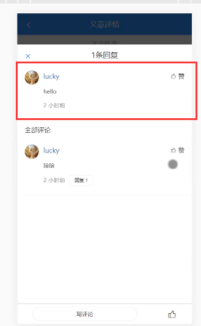
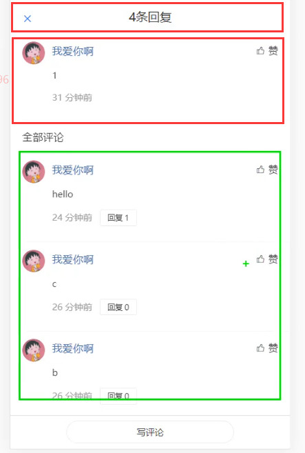

# VUE移动端第七天

# 一. 文章评论

**目标：**

1. 制作评论列表
2. 发布评论
3. 评论详情（回复）


## 1.1 展示文章评论列表

>  为了更好的开发和维护，这里我们把文章评论单独封装到一个组件中来处理。

1. 创建 `src/views/article/components/article-comment.vue`

   把熟悉的`van-list`组件挂载上去

   ```VUE
   <template>
     <div class="comment-list">
       <van-list
         v-model="loading"
         :finished="finished"
         finished-text="没有更多了"
         @load="onLoad"
       >
         <van-cell v-for="item in list" :key="item" :title="item" />
       </van-list>
     </div>
   </template>
   
   <script>
   export default {
     name: 'CommentList',
     data () {
       return {
         list: [],
         loading: false,
         finished: false
       }
     },
     methods: {
       onLoad () {
         // 异步更新数据
         // setTimeout 仅做示例，真实场景中一般为 ajax 请求
         setTimeout(() => {
           for (let i = 0; i < 10; i++) {
             this.list.push(this.list.length + 1)
           }
   
           // 加载状态结束
           this.loading = false
   
           // 数据全部加载完成
           if (this.list.length >= 40) {
             this.finished = true
           }
         }, 1000)
       }
     }
   }
   </script>
   
   <style lang="less" scoped>
   
   </style>
   
   ```

2. 在文章详情页面中加载注册文章评论子组件

   

   

## 1.2 获取列表数据并渲染

1. 创建`api/commit.js`评论请求模块

   ```js
   /**
    * 评论请求模块
    */
   import request from '@/utils/request'
   
   /**
    * 获取文章评论列表
    */
   export const getComments = params => {
     return request({
       method: 'GET',
       url: '/v1_0/comments',
       params
     })
   }
   ```

2. 在`api/index.js`中输出

   ```js
   import { getComments } from './commit.js'
   export const getCommentsAPI = getComments
   ```

3. 请求获取数据

   ```js
   import { getCommentsAPI } from '../../../api/index.js'
   export default {
     name: 'CommentList',
     props: {
       articleId: {
         type: String,
         default: ''
       }
     },
     data () {
       return {
         list: [],
         loading: false,
         finished: false,
         offset: null, // 请求下一页数据的页码
         totalCount: 0, // 总数据条数
         error: false
       }
     },
     methods: {
       async onLoad () {
         try {
           // 1. 请求获取数据
           const { data: res } = await getCommentsAPI({
             type: 'a', // 评论类型，a-对文章(article)的评论，c-对评论(comment)的回复
             source: this.articleId.toString(), // 源id，文章id或评论id
             offset: this.offset, // 获取评论数据的偏移量，值为评论id，表示从此id的数据向后取，不传表示从第一页开始读取数据
             limit: 10 // 每页大小
           })
           console.log(res)
           // 2. 将数据添加到列表中
           this.list.push(...res.data.results)
           // 更新总数据条数
           this.totalCount = res.data.total_count
   
           // 3. 将加载更多的 loading 设置为 false
           this.loading = false
   
           // 4. 判断是否还有数据
           if (res.data.results.length) {
             this.offset = res.data.last_id // 更新获取下一页数据的页码
           } else {
             this.finished = true // 没有数据了，关闭加载更多
           }
         } catch (error) {
           this.error = true
           this.loading = false
         }
       }
     }
   }
   ```

4. 模板绑定

   ```vue
       <van-list
         v-model="loading"
         :finished="finished"
         finished-text="没有更多了"
         :error="error"
         error-text="加载失败，请点击重试"
         @load="onLoad"
       >
         <van-cell v-for="(item, index) in list" :key="index">
           {{ item.content }}
         </van-cell>
       </van-list>
   ```

## 1.3 展示文章评论总数量


1. 在评论组件获取到文章数据量后传递给父组件

   ```js
           // 把文章评论的总数量传递到外部
           this.$emit('onload-success', res.data)
   ```

2. 父组件定义事件

   ```vue
           <!-- 文章评论 -->
           <comment-list :articleId="article.art_id" @onload-success="onloadSuccess"/>
           <!-- /文章评论 -->
   ```

   ```js
       onloadSuccess (data) {
         this.totalCommentCount = data.total_count
       }
   ```

3. 定义`totalCommentCount`总评论数

   ```js
     data () {
       return {
         totalCommentCount: 0 // 评论总数
       }
     },
   ```

4. 在评论图标上使用

   
   
5. 为了刚进入文章详情页面时就能够看到评论数

   `comment-list.vue`

   

   

## 1.4 文章评论项



1. 定义评论组件`\article\components\comment-item.vue`

   ```vue
   <template>
     <van-cell class="comment-item">
       <van-image
         slot="icon"
         class="avatar"
         round
         fit="cover"
         src="https://img.yzcdn.cn/vant/cat.jpeg"
       />
       <div slot="title" class="title-wrap">
         <div class="user-name">用户名称</div>
         <van-button
           class="like-btn"
           icon="good-job-o"
         >赞</van-button>
       </div>
   
       <div slot="label">
         <p class="comment-content">这是评论内容</p>
         <div class="bottom-info">
           <span class="comment-pubdate">4天前</span>
           <van-button
             class="reply-btn"
             round
           >回复 0</van-button>
         </div>
       </div>
     </van-cell>
   </template>
   
   <script>
   export default {
     name: 'CommentItem',
     data () {
       return {}
     },
     methods: {}
   }
   </script>
   
   <style scoped lang="less">
   .comment-item {
     .avatar {
       width: 72px;
       height: 72px;
       margin-right: 25px;
     }
     .title-wrap {
       display: flex;
       justify-content: space-between;
       align-items: center;
       .user-name {
         color: #406599;
         font-size: 26px;
       }
     }
     .comment-content {
       font-size: 32px;
       color: #222222;
       word-break: break-all;
       text-align: justify;
     }
     .comment-pubdate {
       font-size: 19px;
       color: #222;
       margin-right: 25px;
     }
     .bottom-info {
       display: flex;
       align-items: center;
     }
     .reply-btn {
       width: 135px;
       height: 48px;
       line-height: 48px;
       font-size: 21px;
       color: #222;
     }
     .like-btn {
       height: 30px;
       padding: 0;
       border: none;
       font-size: 19px;
       line-height: 30px;
       margin-right: 7px;
       .van-icon {
         font-size: 30px;
       }
     }
   }
   </style>
   
   ```

2. 在`\article\components\comment-list.vue`中使用组件，并传递数据

   

3. 评论项组件接收数据

   ```js
     props: {
       comment: {
         type: Object,
         default: () => ({})
       }
     },
   ```

4. 模板绑定数据

   

   

## 1.5 评论点赞

> 与文章收藏、点赞非常相似


1. 在 `api/comment.js` 中添加封装两个数据接口

   ```js
   /**
    * 评论点赞
    */
   export const addCommentLike = target => {
     return request({
       method: 'POST',
       url: '/v1_0/comment/likings',
       data: {
         target
       }
     })
   }
   
   /**
    * 取消评论点赞
    */
   export const deleteCommentLike = target => {
     return request({
       method: 'DELETE',
       url: `/v1_0/comment/likings/${target}`
     })
   }
   ```

2. 在`api/index.js`中输出

   ```js
   import { addCommentLike, deleteCommentLike } from './commit.js'
   
   export const addCommentLikeAPI = addCommentLike
   export const deleteCommentLikeAPI = deleteCommentLike
   ```

3. 然后给评论项中的 `like` 图标注册点击事件

   ```vue
       <div slot="title" class="title-wrap">
         <div class="user-name">{{ comment.aut_name }}</div>
         <van-button
           class="like-btn"
           :class="{
             liked: comment.is_liking
           }"
           :icon="comment.is_liking ? 'good-job' : 'good-job-o'"
           :loading="commentLoading"
           @click="onCommentLike(item)"
         >{{ comment.like_count || '赞' }}</van-button>
       </div>
   ```

   

   

4. 在事件处理函数中进行设置

   ```js
   data () {
       return {
         commentClone: this.comment,
         commentLoading: false
       }
     },
     methods: {
       async onCommentLike () {
         this.commentLoading = true
         try {
           if (this.comment.is_liking) {
             // 已赞，取消点赞
             await deleteCommentLikeAPI(this.comment.com_id)
             this.commentClone.like_count--
           } else {
             // 没有点赞，添加点赞
             await addCommentLikeAPI(this.comment.com_id)
             this.commentClone.like_count++
           }
           this.commentClone.is_liking = !this.comment.is_liking
         } catch (err) {
           this.$toast('操作失败，请重试')
         }
         this.commentLoading = false
       }
     }
   ```

## 1.6 发布评论

### 1.6.1 准备弹出层


1. 使用弹层组件 `article.vue`

   

   ```vue
   <van-popup
              v-model="isPostShow"
              position="bottom"
              >
     123
   </van-popup>
   ```

   ```js
   data () {
       return {
         ...
         isPostShow: false // 控制发布评论的显示状态
       }
     },
   ```

2. 点击按钮显示弹层

   

### 1.6.2 封装组件

1. 新建`article\components\comment-post.vue`，并添加基本结构

   

   ```vue
   <template>
     <div class="post-comment">
       <van-field
         class="post-field"
         v-model="message"
         rows="2"
         autosize
         type="textarea"
         maxlength="50"
         placeholder="优质评论将会被优先展示"
         show-word-limit
       />
       <van-button
         class="post-btn"
         size="small"
       >发布</van-button>
     </div>
   </template>
   
   <script>
   export default {
     name: 'CommentPost',
     data () {
       return {
         message: ''
       }
     },
     methods: {}
   }
   </script>
   
   <style scoped lang="less">
   .post-comment {
     display: flex;
     align-items: center;
     padding: 32px 0 32px 32px;
     .post-field {
       background-color: #f5f7f9;
     }
     .post-btn {
       width: 150px;
       border: none;
       padding: 0;
       color: #6ba3d8;
       &::before {
         display: none;
       }
     }
   }
   </style>
   
   ```

2. 在加载注册

   

3. 在发布评论的弹层中使用

   ```vue
           <!-- 发布评论 -->
           <van-popup
             v-model="isPostShow"
             position="bottom"
           >
             <comment-post></comment-post>
           </van-popup>
           <!-- 发布评论 -->
   ```

### 1.6.3 发布评论

1. 在 `api/comment.js` 中添加封装数据接口

   ```js
   /**
    * 发布文章评论或评论回复
    */
   export const addComment = data => {
     return request({
       method: 'POST',
       url: '/v1_0/comments',
       data
     })
   }
   ```

2. 在`api/index.js`中输出

   ```js
   import { addComment } from './commit.js'
   
   export const addCommentAPI = addComment
   ```

3. 绑定获取添加评论的输入框数据并且注册发布按钮的点击事件

   

4. 在事件处理函数中

   ```js
   import { addCommentAPI } from '../../../api/index.js'
   export default {
     name: 'CommentPost',
     props: {
       articleId: {
         type: String,
         default: ''
       }
     },
     data () {
       return {
         message: ''
       }
     },
     methods: {
       async onAddComment () {
         try {
           const message = this.message.trim()
   
           // 非空校验
           if (!message.length) {
             return
           }
   
           // 请求添加
           const res = await addCommentAPI({
             target: this.articleId, // 评论的目标id（评论文章即为文章id，对评论进行回复则为评论id）
             content: message, // 评论内容
             art_id: null // 文章id，对评论内容发表回复时，需要传递此参数，表明所属文章id。对文章进行评论，不要传此参数。
           })
   
           console.log(res)
         } catch (error) {
           this.$toast.fail('发布失败')
         }
       }
     }
   }
   ```

### 1.6.4 发布成功处理

> 1. 发布成功后需要关闭弹出层
> 2. 将发布内容置顶到列表顶部
> 3. 清空原弹窗文本框

1. 发布成功通过$emit向父组件传递数据

   

2. 父组件定义事件并接受数据

   ```vue
   <comment-post :articleId="article.art_id" @post-success="postSuccess"></comment-post>
   ```

   ```js
       postSuccess (res) {
         // 关闭弹出层
         this.isPostShow = false
         // 将发布内容显示到列表顶部
       }
   ```

3. 通过refs调用`comment-list.vue`的方法来进行添加

   `src\views\article\article.vue`

   

   `src\views\article\components\comment-list.vue`

   

4. 发布成功后，清空输入框

   

### 1.6.5 完善空内容处理 （没有内容时禁用发布按钮）

```vue
  <div class="post-comment">
    <van-field
      class="post-field"
      v-model.trim="message"
      rows="2"
      autosize
      type="textarea"
      maxlength="50"
      placeholder="优质评论将会被优先展示"
      show-word-limit
    />
    <van-button
      type="primary"
      size="small"
      @click="onAddComment()"
      :disabled="!message.length"
    >发布</van-button>
  </div>
```

## 1.7 评论回复

目标： 

1. 开启评论回复弹框
2. 显示评论回复列表
3. 发布回复评论


### 1.7.1 准备弹出层

1. 在`\article\article.vue`中设置弹出层

   ```js
   data () {
     return {
       ...
       isReplyShow: false // 回复评论显示状态
     }
   }
   ```

   ```vue
       <!--
         弹出层是懒渲染的：只有在第一次展示的时候才会渲染里面的内容，之后它的关闭和显示都是在切换内容的显示和隐藏
        -->
       <van-popup
         v-model="isReplyShow"
         position="bottom"
         style="height: 100%;"
       >
       </van-popup>
       <!-- /评论回复 -->
   ```

   **注意：**这个弹出层一定要写在`<div class="main-wrap">`外面，这样才不会有样式影响

### 1.7.2 点击回复展示弹出层

1. 在 `comment-item.vue` 组件中点击回复按钮的时候，对外发布自定义事件

   

2. 在`comment-list.vue`中接收，并发送给`article.vue`

   

3. 在`article.vue`中接收到数据以后，开启回复评论弹框

   

   ```js
       onReplyClick (event) {
         console.log(event)
   
         // 显示评论回复弹出层
         this.isReplyShow = true
       }
   ```

### 1.7.3 封装评论回复组件



1. 封装`comment-reply.vue`组件

   ```vue
   <template>
     <div>
       评论回复
     </div>
   </template>
   
   <script>
   export default {
     name: 'CommentReply',
     data () {
       return {
   
       }
     },
     methods: {
   
     }
   }
   </script>
   
   <style lang="less" scoped>
   
   </style>
   
   ```

2. 使用组件

   

### 1.7.4 获取回复评论数据

1. 将之前控制评论回复弹出框时传递过来的数据传给`comment-reply`组件

   

   

   

2. `comment-reply`接受数据

   ```js
     props: {
       comment: {
         type: Object,
         default: () => ({})
       }
     },
   ```

### 1.7.5 处理头部及当前评论项

1. 使用`van-nav-bar`组件来设置头部

   ```vue
   <!-- 头部 -->
   		<van-nav-bar
         title="xxx条回复"
       >
         <van-icon
           slot="left"
           name="cross"
         />
       </van-nav-bar>
   ```

2. 引入评论项`comment-item.vue`

   

   ```css
   .scroll-wrap {
     position: fixed;
     top: 92px;
     left: 0;
     right: 0;
     bottom: 88px;
     overflow-y: auto;
   }
   ```

3. 显示回复数量

   

4. 关闭回复弹框

   `comment-reply.vue`

   

   `article.vue`

   

### 1.7.6 展示评论回复列表

**基本思路：**

- 回复列表和文章的评论列表几乎是一样的
- 重用把之前封装的评论列表


1. 导入评论列表组件`comment-list`

   

2. 使用组件，并传参

   **注意：**获取`文章评论`和`获取评论回复`的接口是一样的，只是参数不一样`type`和`source`

   解决方案：添加`type`动态参数

   `comment-reply.vue`

   ```vue
         <comment-list
           :commentList="list"
           :articleId="comment.com_id"
           type="c"
         />
   ```

   **comment-list**

   

   

> 会发现评论回复区域有重复的数据出现
>
> 其原因是之前在created中设置了自动调用

### 1.7.7 解决回评论回复列表重复数据问题

>  问题的原因列表组件刚加载就调用了两次`onLoad`方法

通过查阅文档，添加一个属性即可解决


```js
  created () {
    // 当你手动初始 onLoad 的话，它不会自动开始初始的 loading
    // 所以我们要手动的开启初始 loading
    this.loading = true
    this.onLoad()
  },
```

### 1.7.8 解决评论回复列表不重新获取的问题

> 描述： 当切换不同的评论回复时，发现其列表部分不会更新
>
> 原因：弹层组件的切换问题
>
> - 如果初始的条件是 false，则弹层的内容不会渲染
> - 程序运行期间，当条件变为 true 的时候，弹层才渲染了内容
> - 之后切换弹层的展示，弹层只是通过 CSS 控制隐藏和显示
>
> 弹层渲染出来以后就只是简单的切换显示和隐藏，里面的内容也不再重新渲染了，所以会导致我们的评论的回复列表不会动态更新了。解决办法就是在每次弹层显示的时候重新渲染组件。

```vue
    <!-- 评论回复 -->
    <!--
      弹出层是懒渲染的：只有在第一次展示的时候才会渲染里面的内容，之后它的关闭和显示都是在切换内容的显示和隐藏
     -->
    <van-popup
      v-model="isReplyShow"
      position="bottom"
      style="height: 100%;"
    >
    <comment-reply v-if="isReplyShow" :comment="currentComment"  @close="isReplyShow = false"></comment-reply>
    </van-popup>
    <!-- /评论回复 -->
```

### 1.7.9 发布回复


1. 构建按钮结构

   ```vue
         <!-- 底部区域 -->
         <div class="reply-bottom">
           <van-button
             class="write-btn"
             size="small"
             round
             @click="isPostShow = true"
           >写评论</van-button>
         </div>
       <!-- /底部区域 -->
   ```

   ```js
     data () {
       return {
         list: [],
         isPostShow: false
       }
     },
   ```

   ```css
   .reply-bottom {
     position: fixed;
     bottom: 0;
     left: 0;
     right: 0;
     height: 88px;
     display: flex;
     align-items: center;
     justify-content: center;
     background-color: #fff;
     border-top: 1px solid #d8d8d8;
     .write-btn {
       width: 60%;
     }
   }
   ```

2. 点击按钮展示发布评论组件

   1. 引入发布组件

      

      发现，很多时候组件都需要`article.vue`父组件传递过来的`articleid`怎么简单来写呢？见拓展

   2. 修改评论提交方法

      

   3. 发布成功后，处理完成内容

      ```js
          postSuccess (data) {
            // 更新回复的数量
            this.commentClone.reply_count++
            // 关闭弹出层
            this.isPostShow = false
            // 将发布内容显示到列表顶部
            console.log(this.list)
            this.list.unshift(data.new_obj)
          }
      ```

      

   


## 拓展：依赖注入 - 将数据传递给所有的子代

> https://cn.vuejs.org/v2/guide/components-edge-cases.html#%E4%BE%9D%E8%B5%96%E6%B3%A8%E5%85%A5
>
> https://cn.vuejs.org/v2/api/#provide-inject


> `provide` 选项允许我们指定我们想要**提供**给后代组件的数据/方法。

`article.vue`中，通过`provide`将id传给所有的子组件

```js
  // 给所有的后代组件提供数据
  // 注意：不要滥用
  provide: function () {
    return {
      articleIdPro: this.articleId
    }
  },
```


> `inject` 接收指定的我们想要添加在这个实例上的 属性
>
> 其写法和props完全一致

`comment-post.vue`

```js
  inject: {
    articleIdPro: {
      type: String,
      default: ''
    }
  },
```


