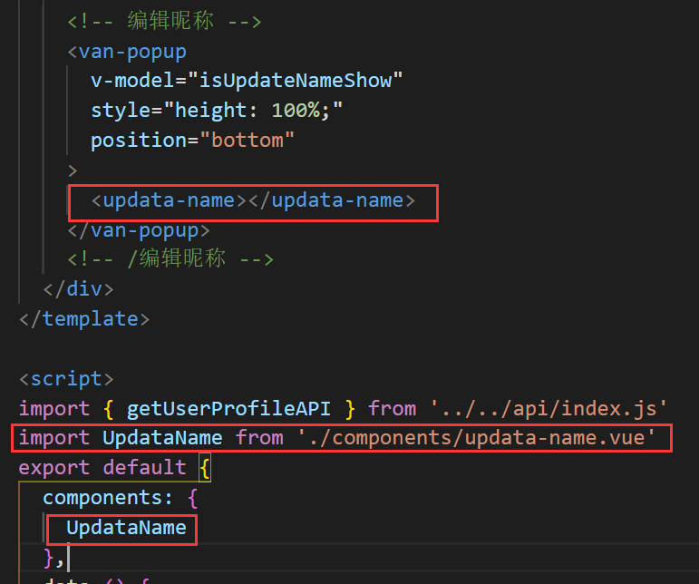

#  VUE移动端第八天

# 一. 用户页面

目标：

1. 点击编辑资料进入个人信息页面
2. 完成基本页面的布局
3. 使用vant组件自行完成以下内容
   1. 完成昵称设置
   2. 完成性别选择
   3. 完成生日选择
4. 通过图片裁剪工具完成头像裁剪功能


## 1.1 创建组件并配置路由

1. 创建 `views/user-profile/user-profile.vue`

   ```vue
   <template>
   	<div class="user-profile">
       用户资料
     </div>
   </template>
   
   <script>
   export default {
     data () {
       return {
   
       }
     }
   }
   </script>
   
   <style scoped lang='less'>
   
   </style>
   
   ```

2. 配置到**根路由**

   ```js
     {
       path: '/user',
       component: () => import('../views//user-profile/user-profile.vue')
     }
   ```

   思考：为什么不放到路由`/my`下作为子路由

3. 修改我的页面的编辑资料`my.vue`

   ```vue
           <div class="right">
             <van-button size="mini" round to="/user">编辑资料</van-button>
           </div>
   ```

## 1.2 页面布局

1. 基本结构

   - 设置导航

     ```vue
         <!-- 导航栏 -->
         <van-nav-bar
           class="page-nav-bar"
           title="个人信息"
           left-arrow
           @click-left="$router.back()"
         />
         <!-- /导航栏 -->
     ```

   - 个人信息(单元格区域)

     ```vue
     <van-cell title="头像" is-link center class="photo-cell">
       <van-image
                  class="avatar"
                  fit="cover"
                  round
                  src="https://img.yzcdn.cn/vant/cat.jpeg"
                  />
     </van-cell>
     <van-cell title="昵称" value="内容" is-link />
     <van-cell title="性别" value="内容" is-link />
     <van-cell title="生日" value="内容" is-link />
     ```

     ```vue
     <style scoped lang='less'>
     .user-profile {
       .avatar {
         width: 60px;
         height: 60px;
       }
       
       .photo-cell {
         .van-cell__value {
           display: flex;
           flex-direction: row-reverse;
         }
       }
     }
     </style>
     ```

## 1.3 展示用户信息

**步骤：**

- 封装数据接口
- 请求获取数据
- 模板绑定

1. 在 `api/user.js` 中添加获取指定用户信息的数据接口

   ```js
   /**
    * 获取当前登录用户的个人资料
    */
   export const getUserProfile = target => {
     return request({
       method: 'GET',
       url: '/v1_0/user/profile'
     })
   }
   ```

2. 在`api/index.js`中输出

   ```js
   import { getUserProfile } from './user.js'
   
   export const getUserProfileAPI = getUserProfile
   ```

3. 在用户页面请求获取数据

   ```js
   import { getUserProfileAPI } from '../../api/index.js'
   export default {
     data () {
       return {
         user: {} // 个人信息
       }
     },
   
     created () {
       // 获取用户基本信息
       this.loadProfile()
     },
   
     methods: {
       async loadProfile () {
         try {
           const { data: res } = await getUserProfileAPI()
           this.user = res.data
         } catch (err) {
           this.$toast('数据获取失败')
         }
       }
     }
   }
   ```

4. 模板绑定

   ```vue
       <!-- 个人信息 -->
       <van-cell title="头像" is-link>
       <van-image
         class="avatar"
         fit="cover"
         round
         :src="user.photo"
       />
       </van-cell>
       <van-cell title="昵称" :value="user.name" is-link />
       <van-cell title="性别" :value="user.gender === 0 ? '男' : '女'" is-link />
       <van-cell title="生日" :value="user.birthday" is-link />
       <!-- /个人信息 -->
   ```

## 1.4 修改昵称（自学部分）


### 1.4.1 弹框处理

1. 弹框结构

   ```vue
    <!-- 编辑昵称 -->
       <van-popup
         v-model="isUpdateNameShow"
         style="height: 100%;"
         position="bottom"
       >
         编辑昵称
       </van-popup>
       <!-- /编辑昵称 -->
   ```

2. 定义`isUpdateNameShow: false`

   ```js
     data () {
       return {
         user: {}, // 个人信息
         isUpdateNameShow: false // 昵称弹框状态
       }
     },
   ```

3. 点击弹层修改`isUpdateNameShow`

   ```vue
   <van-cell title="昵称" :value="user.name" is-link @click="isUpdateNameShow = true"/>
   ```

### 1.4.2 封装编辑昵称内容组件

1. 在当前页面中封装基本组件`updata-name.vue`

   

   ```vue
   <template>
     <div class="updata-name">
       昵称修改
     </div>
   </template>
   
   <script>
   export default {
     name: 'UpdataName',
     data () {
       return {
   
       }
     }
   }
   </script>
   
   <style scoped lang='less'>
   
   </style>
   
   ```

2. 引入组件/注册/使用

   

### 1.4.3 修改昵称组件

1. 导航栏结构

   ```vue
       <!-- 导航栏 -->
       <van-nav-bar
         title="编辑昵称"
         left-text="取消"
         right-text="确定"
         @click-left="$emit('close')"
       />
       <!-- /导航栏 -->
   ```

2. 父组件定义close事件

   ```vue
   <updata-name @close="isUpdateNameShow = false"></updata-name>
   ```

3. 定义输入框基本结构

   `updata-name.vue`

   ```vue
       <!-- 输入框 -->
       <div class="field-wrap">
         <van-field
           v-model.trim="localName"
           rows="2"
           autosize
           type="textarea"
           maxlength="7"
           placeholder="请输入昵称"
           show-word-limit
         />
       </div>
       <!-- /输入框 -->
   ```

   ```css
   .field-wrap {
     padding: 20px;
   }
   ```

   `user-profile.vue`

   ```css
     .van-popup {
       background: #f5f7f9;
     }
   ```

### 1.4.4 数据处理

1. 将父组件中的昵称传递给子组件

   ```vue
   <updata-name v-model="user.name" @close="isUpdateNameShow = false"></updata-name>
   ```

2. 子组件`updata-name`接收到数据同步给`localName`

   ```js
     props: {
       value: {
         type: String,
         default: ''
       }
     },
     data () {
       return {
         localName: this.value
       }
     },
   ```

3. 组件利用v-if进行销毁创建,从而清空输入框

   ```vue
         <updata-name v-if="isUpdateNameShow" v-model="user.name" @close="isUpdateNameShow = false"></updata-name>
   ```

### 1.4.5 更新昵称处理完成

1. 封装更新昵称的api

   ```js
   /**
    * 更新用户资料
    */
   export const updateUserProfile = data => {
     return request({
       method: 'PATCH',
       url: '/v1_0/user/profile',
       data
     })
   }
   ```

2. `在api/index.js`中输出

   ```js
   import { updateUserProfile } from './user.js'
   
   export const updateUserProfileAPI = updateUserProfile
   ```

3. 定义点击右侧确定按钮的事件和事件函数

   ```vue
       <!-- 导航栏 -->
       <van-nav-bar
         title="编辑昵称"
         left-text="取消"
         right-text="确定"
         @click-left="$emit('close')"
         @click-right="onConfirm()"
       />
       <!-- /导航栏 -->
   ```

   ```js
   async onConfirm () {
     this.$toast.loading({
       message: '保存中...',
       forbidClick: true, // 禁止背景点击
       duration: 0 // 持续展示
     })
   
     try {
       const localName = this.localName
       if (!localName.length) {
         this.$toast('昵称不能为空')
         return
       }
   
       await updateUserProfileAPI({
         name: localName
       })
   
       // 更新视图
       this.$emit('input', localName)
   
       // 关闭弹层
       this.$emit('close')
   
       // 提示成功
       this.$toast.success('更新成功')
     } catch (err) {
       this.$toast.fail('更新失败')
     }
   }
   ```

4. 优化409

   ```js
   catch (err) {
       console.dir(err)
       if (err.response && err.response.status === 409) {
           return this.$toast('用户名已存在')
       }
       this.$toast('更新失败')
   }
   ```

## 1.5 修改性别（自学部分）


### 1.5.1 弹层和基本组件

1. 定义`updata-gender`组件

   ```vue
   <template>
     <div class="update-gender">
       <van-picker
         show-toolbar
         title="标题"
         :columns="columns"
         @cancel="$emit('close')"
       />
     </div>
   </template>
   
   <script>
   export default {
     name: 'UpdateGender',
     props: {
       value: {
         type: Number,
         required: true
       }
     },
     data () {
       return {
         columns: ['男', '女'],
         localGender: this.value
       }
     },
     methods: {
     }
   }
   </script>
   
   <style scoped lang="less"></style>
   
   ```

2. 准备弹出层

   

3. 点击性别cell，弹出弹出层

   ```vue
       <van-cell title="性别" :value="user.gender === 0 ? '男' : '女'" is-link @click="isUpdateGenderShow = true"/>
   ```

### 1.5.2 默认值的设置

1. 利用v-model传递给子组件,并利用v-if实现组件销毁

   ```vue
         <updata-gender
           v-if="isUpdateGenderShow"
           @close="isUpdateGenderShow = false"
           v-model="user.gender"
         />
   ```

2. `updata-gender`组件接收数据并设置默认值

   ```vue
     <div class="update-gender">
       <van-picker
         show-toolbar
         title="标题"
         :columns="columns"
         :default-index="value"
         @cancel="$emit('close')"
       />
     </div>
   ```

### 1.5.3 点击确定修改数据

1. 利用change获取选择值

   ```vue
     <div class="update-gender">
       <van-picker
         show-toolbar
         title="标题"
         :columns="columns"
         :default-index="value"
         @cancel="$emit('close')"
         @change="onChange"
       />
     </div>
   ```

   ```js
       onChange (picker, value, index) {
         this.localGender = index
       }
   ```

2. 引入更新信息方法

   ```vue
       <van-picker
         show-toolbar
         title="标题"
         :columns="columns"
         :default-index="value"
         @cancel="$emit('close')"
         @change="onChange"
         @confirm="onConfirm"
       />
   ```

   ```js
   async onConfirm () {
     this.$toast.loading({
       message: '保存中...',
       forbidClick: true, // 禁止背景点击
       duration: 0 // 持续展示
     })
   
     try {
       const localGender = this.localGender
   
       await updateUserProfileAPI({
         gender: localGender
       })
   
       // 更新视图
       this.$emit('input', localGender)
   
       // 关闭弹层
       this.$emit('close')
   
       // 提示成功
       this.$toast.success('更新成功')
     } catch (err) {
       this.$toast.fail('更新失败')
     }
   }
   ```

## 1.6 更新生日（自学部分）

### 1.6.1 弹层和基本组件

1. 定义组件`updata-birthdy.vue`

   ```vue
   <template>
    <div class="update-birthdy">
       更新生日
     </div>
   </template>
   
   <script>
   export default {
     name: 'UpdataBirthday',
     data () {
       return {
   
       }
     },
     methods: {
   
     }
   }
   </script>
   
   <style lang="less" scoped>
   
   </style>
   
   ```

2. 编辑生日弹层处理

   

3. 点击显示弹层

   ```js
       <van-cell title="生日" :value="user.birthday" is-link @click="isUpdateBirthdayShow = true"/>
   ```

### 1.6.2 用日期组件展示生日

1. 使用组件

   ```vue
    <div class="update-birthdy">
       <!--
         currentDate 双向绑定了日期选择器
           设置日期选择器的默认值
           同步日期选择器选择的日期
         min-date: 可选的最小日期
         max-date: 可选的最大日期
        -->
       <van-datetime-picker
         v-model="currentDate"
         type="date"
         :min-date="minDate"
         :max-date="maxDate"
         @cancel="$emit('close')"
         @confirm="onConfirm"
       />
     </div>
   ```

   ```js
     props: {
       value: {
         type: String,
         default: ''
       }
     },
   	data () {
       return {
         minDate: new Date(1970, 0, 1),
         maxDate: new Date(),
         currentDate: new Date(this.value)
       }
     },
   ```

### 1.6.3 取消和确定

1. 点击确定，注册事件和事件函数

   ```js
   import { updateUserProfileAPI } from '../../../api/index.js'
   import dayjs from 'dayjs'
   
   async onConfirm () {
     this.$toast.loading({
       message: '保存中...',
       forbidClick: true, // 禁止背景点击
       duration: 0 // 持续展示
     })
   
     try {
       const currentDate = dayjs(this.currentDate).format('YYYY-MM-DD')
   
       await updateUserProfileAPI({
         birthday: currentDate
       })
   
       // 更新视图
       this.$emit('input', currentDate)
   
       // 关闭弹层
       this.$emit('close')
   
       // 提示成功
       this.$toast.success('更新成功')
     } catch (err) {
       this.$toast.fail('更新失败')
     }
   }
   ```


## 1.7 修改头像


### 1.7.1 图片上传预览

1. 准备file类型输入框,并通过点击头像触发上传

   **设置hidden属性让其隐藏**

   ```vue
       <!-- 头像上传 -->
       <input
         type="file"
         hidden
         ref="file"
         @change="onFileChange"
       />
   ```

2. 让头像单元格手动触发上传框点击事件

   ```vue
       <!-- 个人信息 -->
       <van-cell title="头像" is-link @click="$refs.file.click()">
         <van-image
           class="avatar"
           fit="cover"
           round
           :src="user.photo"
         />
       </van-cell>
   ```

3. 给input定义change事件

4. 获取上传文件信息

   ```js
       onFileChange () {
         // 获取文件对象
         const file = this.$refs.file.files[0]
   
         // 基于文章对象获取 blob 数据
         this.img = window.URL.createObjectURL(file)
   
         // 解决办法就是每次使用完毕，把它的 value 清空
         this.$refs.file.value = ''
       }
   ```

### 1.7.2 图片上传预览功能处理

1. 定义弹出层

   ```vue
       <!-- 编辑头像弹层 -->
       <van-popup
         v-model="isUpdatePhotoShow"
         style="height: 100%"
         position="bottom"
       >
         hello
       </van-popup>
       <!-- 编辑头像弹层 -->
   ```

2. 上传图片后展示弹出层

   ```js
       onFileChange () {
         // 获取文件对象
         const file = this.$refs.file.files[0]
   
         // 基于文章对象获取 blob 数据
         this.img = window.URL.createObjectURL(file)
   
         // 展示预览图片弹出层
         this.isUpdatePhotoShow = true
   
         // file-input 如果选了同一个文件不会触发 change 事件
         // 解决办法就是每次使用完毕，把它的 value 清空
         this.$refs.file.value = ''
       }
   ```

3. 定义更新图片组件`updata-photo.vue`

   ```vue
   <template>
       <div>
         
       </div>
   </template>
   
   <script>
   export default {
     props: {
       img: {
         type: String,
         default: ''
       }
     }
   }
   </script>
   
   <style scoped lang='less'>
   
   </style>
   
   ```

4. 引用、注册、使用

   ```js
   import UpdataPhoto from './components/updata-photo.vue'
   
     components: {
       UpdataName,
       UpdataGender,
       UpdataBirthday,
       UpdataPhoto
     },
   ```

   ```vue
       <!-- 编辑头像弹层 -->
       <van-popup
         v-model="isUpdatePhotoShow"
         style="height: 100%"
         position="bottom"
       >
         <updata-photo :img="img"></updata-photo>
       </van-popup>
       <!-- 编辑头像弹层 -->
   ```

### 1.7.3 图片上传预览样式处理

1. 页面结构

   ```vue
   <template>
   <div class="updata-photo">
       
       <div class="toolbar">
         <span class="cancel">取消</span>
         <span class="confirm">完成</span>
       </div>
     </div>
   </template>
   ```

2. CSS

   ```
   .updata-photo {
     background-color: #000;
     height: 100%;
     .toolbar {
       position: fixed;
       left: 0;
       right: 0;
       bottom: 0;
       display: flex;
       justify-content: space-between;
       .cancel, .confirm {
         width: 90px;
         height: 90px;
         font-size: 30px;
         display: flex;
         justify-content: center;
         align-items: center;
         color: #fff;
       }
     }
   }
   .img {
     display: block;
     max-width: 100%;
   }
   ```

3. 点击取消

   ```vue
   <span class="cancel" @click="$emit('close')">取消</span>
   ```

   ```vue
   <updata-photo :img="img" @close="isUpdatePhotoShow = false"></updata-photo>
   ```

### 1.7.4 头像剪裁

方案一： 结合服务器的图片上传剪裁预览 （前端仅展示，其余操作交给后端）


方案二：纯客户端的图片裁切上传流程（前端摊上事儿啦）

今天使用第三方图片处理库`cropperjs`来实现

### 1.7.5 cropperjs基本使用

> [官网](https://github.com/fengyuanchen/cropperjs)

1. 安装cropperjs

   ```bash
   npm install cropperjs
   ```

2. 在`updata-photo.vue`引入css、js

   ```js
   import 'cropperjs/dist/cropper.css'
   import Cropper from 'cropperjs'
   ```

3. 在mounted中初始化

   ```js
   data () {
     return {
       cropper: null
     }
   },
   mounted () {
       // 获取图片页面元素
       const image = this.$refs.img
       this.cropper = new Cropper(image, {
         viewMode: 1, // 定义裁剪模式，0：裁剪框可以扩展到画布外， 1,2,3会将裁剪框限制在画布内
         dragMode: 'move', // 拖动模式 move: 移动画布
         aspectRatio: 1, // 截图比例, 1:1可以简写为1
         autoCropArea: 1, // 自动截图区
         cropBoxMovable: false, // 截图区域是否可以移动
         cropBoxResizable: false, // 截图区的缩放功能
         background: false, // 是否显示默认背景
         movable: true // 背景图片是否可以移动，默认true
         // crop (event) { // 当移动图片是会返回的各种数据（今天的案例中不需要使用）
         //   console.log(event.detail.x)
         //   console.log(event.detail.y)
         //   console.log(event.detail.width)
         //   console.log(event.detail.height)
         //   console.log(event.detail.rotate)
         //   console.log(event.detail.scaleX)
         //   console.log(event.detail.scaleY)
         // }
       })
   }
   ```

### 1.7.6 裁剪结果的两种方式

#### 1.7.6.1 服务端处理数据

如果基于服务端裁剪，则使用getData方法，该方法可以得到裁剪区域的各参数

1. 获取cropper实例

   ```js
   this.cropper = new Cropper(image, {
     viewMode: 1, // 定义裁剪模式，0：裁剪框可以扩展到画布外， 1,2,3会将裁剪框限制在画布内
     dragMode: 'move', // 拖动模式 move: 移动画布
     aspectRatio: 1, // 截图比例, 1:1可以简写为1
     autoCropArea: 1, // 自动截图区
     cropBoxMovable: false, // 截图区域是否可以移动
     cropBoxResizable: false, // 截图区的缩放功能
     background: false, // 是否显示默认背景
     movable: true // 背景图片是否可以移动，默认true
   })
   ```

2. 给确定注册点击事件，在事件函数中获取参数

   ```vue
   <span class="confirm" @click="onConfirm()">完成</span>
   ```

3. 处理数据（把数据传递给后端，后端全权处理）

   ```js
   onConfirm () {
     console.log(this.cropper.getData())
   }
   ```

   

#### 1.7.6.2 前端处理数据

```js
confirm () {
      // console.log(this.cropper.getData())
      this.cropper.getCroppedCanvas().toBlob(blob => {
        console.log(blob)
      })
    }
```

### 1.7.7 实现裁剪图片提交

1. 在`api/user.js`封装更新头像api

   ```
   /**
    * 更新用户照片资料
    */
   export const updateUserPhoto = data => {
     return request({
       method: 'PATCH',
       url: '/v1_0/user/photo',
       data
     })
   }
   ```

2. 在`api/index.js`中输出

   ```js
   import { updateUserPhoto } from './user.js'
   
   export const updateUserPhotoAPI = updateUserPhoto
   ```

3. 引入方法并调用

   ```
   import { updateUserPhotoAPI } from '../../../api/index.js'
   ```

   ```js
       onConfirm () {
         // 基于服务端的裁切使用 getData 方法获取裁切参数
         // console.log(this.cropper.getData())
   
         // 纯客户端的裁切使用 getCroppedCanvas 获取裁切的文件对象
         this.cropper.getCroppedCanvas().toBlob(blob => {
           this.updateUserPhoto(blob)
         })
       },
   ```

   ```js
       // 处理裁剪图片并上传
       async updateUserPhoto (blob) {
         try {
           // 如果接口要求 Content-Type 是 multipart/form-data
           // 则你必须传递 FormData 对象
           // 创建formData数据
           const formData = new FormData()
           formData.append('photo', blob)
   
           const { data: res } = await updateUserPhotoAPI(formData)
   
           // 提示成功
           this.$toast.success('更新成功')
         } catch (error) {
           this.$toast.fail('更新失败')
         }
       }
   ```

4. 关闭弹层、更新视图

   ```js
       // 处理裁剪图片并上传
       async updateUserPhoto (blob) {
         try {
   				...
           // 关闭弹出层
           this.$emit('close')
           // 更新视图
           this.$emit('update-photo', res.data.photo)
   
           // 提示成功
           this.$toast.success('更新成功')
         } catch (error) {
           this.$toast.fail('更新失败')
         }
       }
   ```

   ```vue
         <updata-photo
           :img="img"
           @close="isUpdatePhotoShow = false"
           @update-photo="user.photo = $event"
         ></updata-photo>
   ```

5. 利用v-if重置数据

   ```vue
         <updata-photo
           v-if="isUpdatePhotoShow"
           :img="img"
           @close="isUpdatePhotoShow = false"
           @update-photo="user.photo = $event"
         ></updata-photo>
   ```

6. 优化loading效果

   ```vue
   // 处理裁剪图片并上传
       async updateUserPhoto (blob) {
         this.$toast.loading({
           message: '保存中...',
           forbidClick: true, // 禁止背景点击
           duration: 0 // 持续展示
         })
         ...
       }
   ```

   

# 二. 通过git平台上线项目

2.1 在`.gitignore`删除`/dist`
2.2 修改`request.js`当中基准地址

```js
const request = axios.create({
  // baseURL: 'http://ttapi.research.itcast.cn/'
  // baseURL: 'http://toutiao.itheima.net'
  baseURL: 'https://toutiao.itheima.net'
})
```

2.1 `vue.config.js`修改指定根路径

```js
module.exports = {
  publicPath: './',
  devServer: {
    disableHostCheck: true // 关闭host检查
  }
}
```

2.3 登录github上传打包后的dist文件夹内容
2.4 进入项目仓库,点击服务pages 设置


